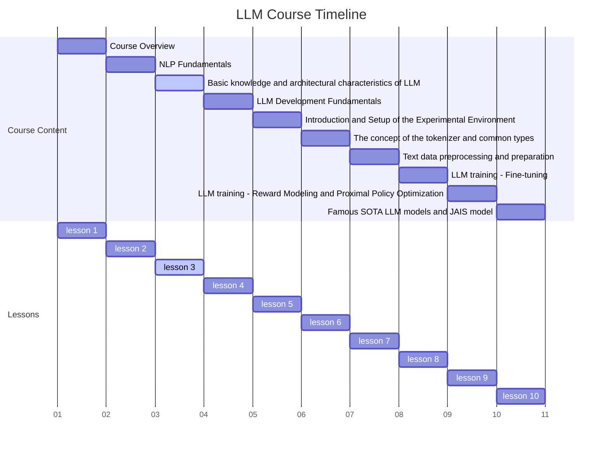

# LLM Course Timeline: Basic knowledge and architectural characteristics of LLM

```mermaid
gantt
    title LLM Course Timeline
    dateFormat X
    axisFormat %d
    section Course Content
    Course Overview                                    :a1, 0, 1d
    NLP Fundamentals                                   :a2, after a1, 1d
    Basic knowledge and architectural characteristics of LLM :active,a3, after a2, 1d
    LLM Development Fundamentals                       :a4, after a3, 1d
    Introduction and Setup of the Experimental Environment :a5, after a4, 1d
    The concept of the tokenizer and common types      :a6, after a5, 1d
    Text data preprocessing and preparation            :a7, after a6, 1d
    LLM training - Fine-tuning                         :a8, after a7, 1d
    LLM training - Reward Modeling and Proximal Policy Optimization :a9, after a8, 1d
    Famous SOTA LLM models and JAIS model              :a10, after a9, 1d
    section Lessons
    lesson 1  :l1, 0, 1d
    lesson 2  :l2, after l1, 1d
    lesson 3  :active,l3, after l2, 1d
    lesson 4  :l4, after l3, 1d
    lesson 5  :l5, after l4, 1d
    lesson 6  :l6, after l5, 1d
    lesson 7  :l7, after l6, 1d
    lesson 8  :l8, after l7, 1d
    lesson 9  :l9, after l8, 1d
    lesson 10 :l10, after l9, 1d
```
