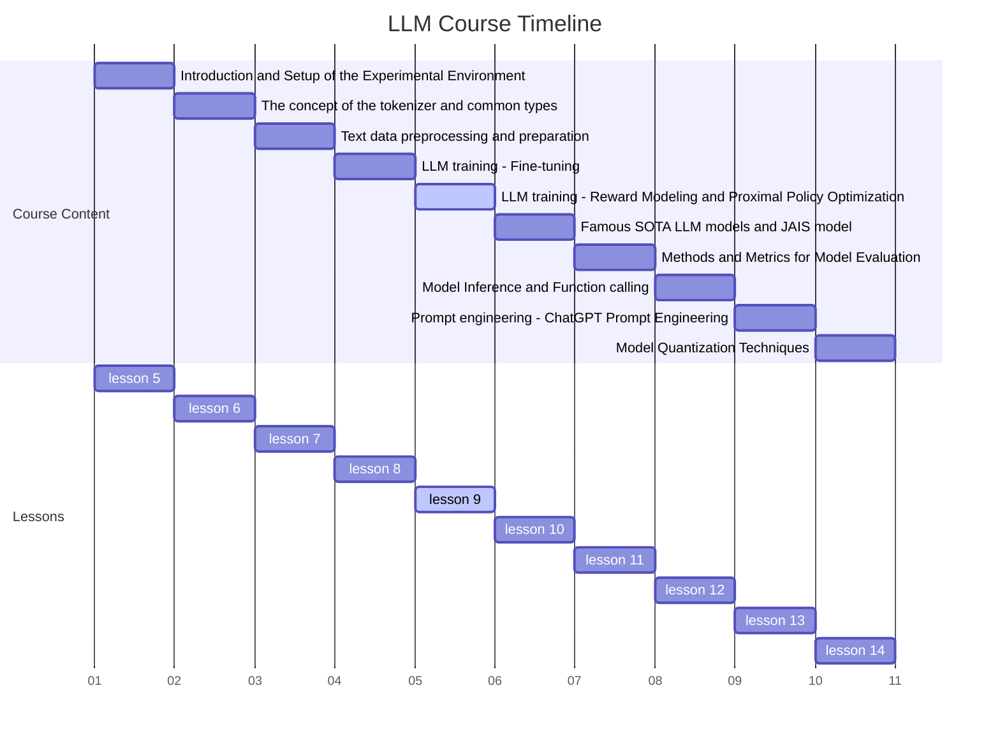

# LLM Course Timeline: LLM training - Reward Modeling and Proximal Policy Optimization

```mermaid
gantt
    title LLM Course Timeline
    dateFormat X
    axisFormat %d
    section Course Content
    Introduction and Setup of the Experimental Environment :a5, 0, 1d
    The concept of the tokenizer and common types      :a6, after a5, 1d
    Text data preprocessing and preparation            :a7, after a6, 1d
    LLM training - Fine-tuning                         :a8, after a7, 1d
    LLM training - Reward Modeling and Proximal Policy Optimization :active,a9, after a8, 1d
    Famous SOTA LLM models and JAIS model              :a10, after a9, 1d
    Methods and Metrics for Model Evaluation           :a11, after a10, 1d
    Model Inference and Function calling               :a12, after a11, 1d
    Prompt engineering - ChatGPT Prompt Engineering    :a13, after a12, 1d
    Model Quantization Techniques                      :a14, after a13, 1d
    section Lessons
    lesson 5  :l5, 0, 1d
    lesson 6  :l6, after l5, 1d
    lesson 7  :l7, after l6, 1d
    lesson 8  :l8, after l7, 1d
    lesson 9  :active,l9, after l8, 1d
    lesson 10 :l10, after l9, 1d
    lesson 11 :l11, after l10, 1d
    lesson 12 :l12, after l11, 1d
    lesson 13 :l13, after l12, 1d
    lesson 14 :l14, after l13, 1d
```
