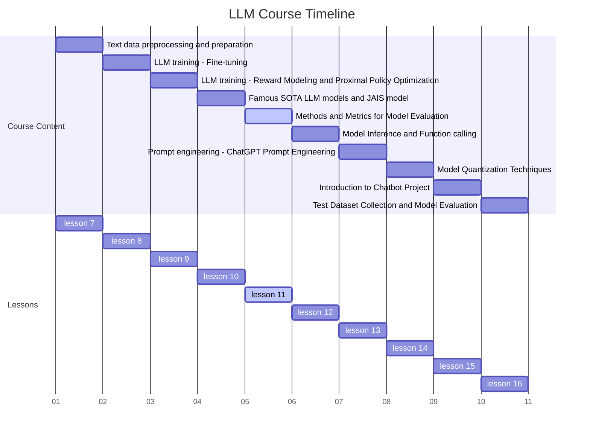

# LLM Course Timeline: Methods and Metrics for Model Evaluation

```mermaid
gantt
    title LLM Course Timeline
    dateFormat X
    axisFormat %d
    section Course Content
    Text data preprocessing and preparation            :a7, 0, 1d
    LLM training - Fine-tuning                         :a8, after a7, 1d
    LLM training - Reward Modeling and Proximal Policy Optimization :a9, after a8, 1d
    Famous SOTA LLM models and JAIS model              :a10, after a9, 1d
    Methods and Metrics for Model Evaluation           :active,a11, after a10, 1d
    Model Inference and Function calling               :a12, after a11, 1d
    Prompt engineering - ChatGPT Prompt Engineering    :a13, after a12, 1d
    Model Quantization Techniques                      :a14, after a13, 1d
    Introduction to Chatbot Project                    :a15, after a14, 1d
    Test Dataset Collection and Model Evaluation       :a16, after a15, 1d
    section Lessons
    lesson 7  :l7, 0, 1d
    lesson 8  :l8, after l7, 1d
    lesson 9  :l9, after l8, 1d
    lesson 10 :l10, after l9, 1d
    lesson 11 :active,l11, after l10, 1d
    lesson 12 :l12, after l11, 1d
    lesson 13 :l13, after l12, 1d
    lesson 14 :l14, after l13, 1d
    lesson 15 :l15, after l14, 1d
    lesson 16 :l16, after l15, 1d
```
