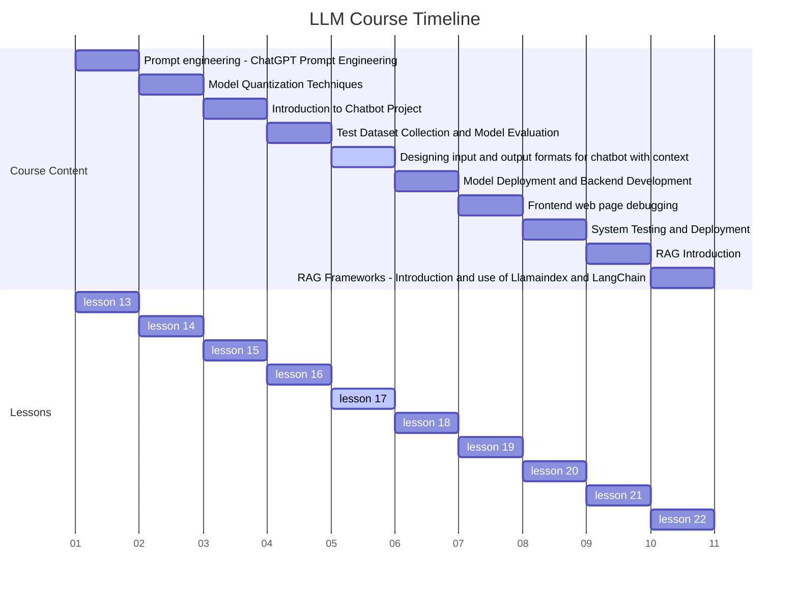

# LLM Course Timeline: Designing input and output formats for chatbot with context

```mermaid
gantt
    title LLM Course Timeline
    dateFormat X
    axisFormat %d
    section Course Content
    Prompt engineering - ChatGPT Prompt Engineering    :a13, 0, 1d
    Model Quantization Techniques                      :a14, after a13, 1d
    Introduction to Chatbot Project                    :a15, after a14, 1d
    Test Dataset Collection and Model Evaluation       :a16, after a15, 1d
    Designing input and output formats for chatbot with context :active,a17, after a16, 1d
    Model Deployment and Backend Development           :a18, after a17, 1d
    Frontend web page debugging                        :a19, after a18, 1d
    System Testing and Deployment                      :a20, after a19, 1d
    RAG Introduction                                   :a21, after a20, 1d
    RAG Frameworks - Introduction and use of Llamaindex and LangChain :a22, after a21, 1d
    section Lessons
    lesson 13 :l13, 0, 1d
    lesson 14 :l14, after l13, 1d
    lesson 15 :l15, after l14, 1d
    lesson 16 :l16, after l15, 1d
    lesson 17 :active,l17, after l16, 1d
    lesson 18 :l18, after l17, 1d
    lesson 19 :l19, after l18, 1d
    lesson 20 :l20, after l19, 1d
    lesson 21 :l21, after l20, 1d
    lesson 22 :l22, after l21, 1d
```
