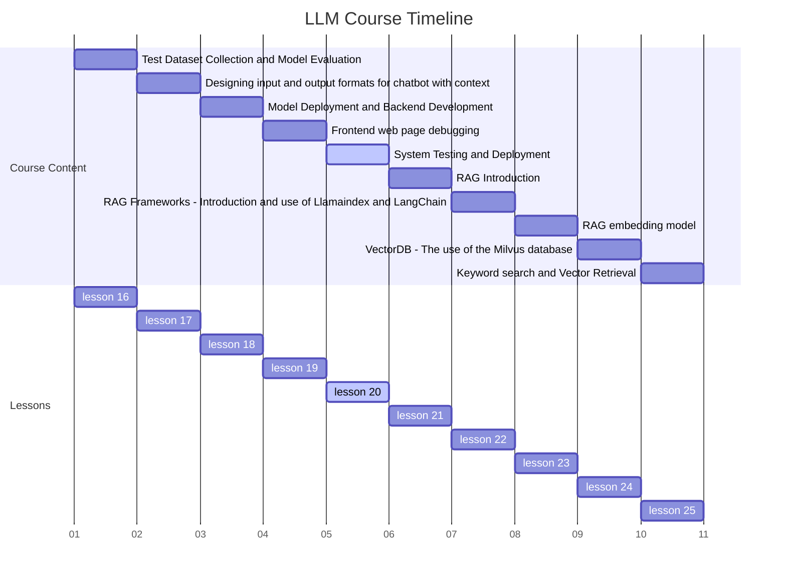

# LLM Course Timeline: System Testing and Deployment

```mermaid
gantt
    title LLM Course Timeline
    dateFormat X
    axisFormat %d
    section Course Content
    Test Dataset Collection and Model Evaluation       :a16, 0, 1d
    Designing input and output formats for chatbot with context :a17, after a16, 1d
    Model Deployment and Backend Development           :a18, after a17, 1d
    Frontend web page debugging                        :a19, after a18, 1d
    System Testing and Deployment                      :active,a20, after a19, 1d
    RAG Introduction                                   :a21, after a20, 1d
    RAG Frameworks - Introduction and use of Llamaindex and LangChain :a22, after a21, 1d
    RAG embedding model                                :a23, after a22, 1d
    VectorDB - The use of the Milvus database          :a24, after a23, 1d
    Keyword search and Vector Retrieval                :a25, after a24, 1d
    section Lessons
    lesson 16 :l16, 0, 1d
    lesson 17 :l17, after l16, 1d
    lesson 18 :l18, after l17, 1d
    lesson 19 :l19, after l18, 1d
    lesson 20 :active,l20, after l19, 1d
    lesson 21 :l21, after l20, 1d
    lesson 22 :l22, after l21, 1d
    lesson 23 :l23, after l22, 1d
    lesson 24 :l24, after l23, 1d
    lesson 25 :l25, after l24, 1d
```
