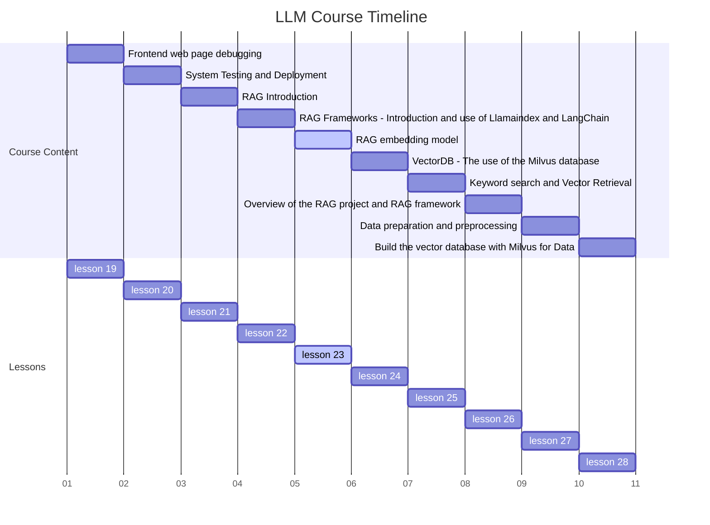

# LLM Course Timeline: RAG embedding model

```mermaid
gantt
    title LLM Course Timeline
    dateFormat X
    axisFormat %d
    section Course Content
    Frontend web page debugging                        :a19, 0, 1d
    System Testing and Deployment                      :a20, after a19, 1d
    RAG Introduction                                   :a21, after a20, 1d
    RAG Frameworks - Introduction and use of Llamaindex and LangChain :a22, after a21, 1d
    RAG embedding model                                :active,a23, after a22, 1d
    VectorDB - The use of the Milvus database          :a24, after a23, 1d
    Keyword search and Vector Retrieval                :a25, after a24, 1d
    Overview of the RAG project and RAG framework      :a26, after a25, 1d
    Data preparation and preprocessing                 :a27, after a26, 1d
    Build the vector database with Milvus for Data     :a28, after a27, 1d
    section Lessons
    lesson 19 :l19, 0, 1d
    lesson 20 :l20, after l19, 1d
    lesson 21 :l21, after l20, 1d
    lesson 22 :l22, after l21, 1d
    lesson 23 :active,l23, after l22, 1d
    lesson 24 :l24, after l23, 1d
    lesson 25 :l25, after l24, 1d
    lesson 26 :l26, after l25, 1d
    lesson 27 :l27, after l26, 1d
    lesson 28 :l28, after l27, 1d
```
