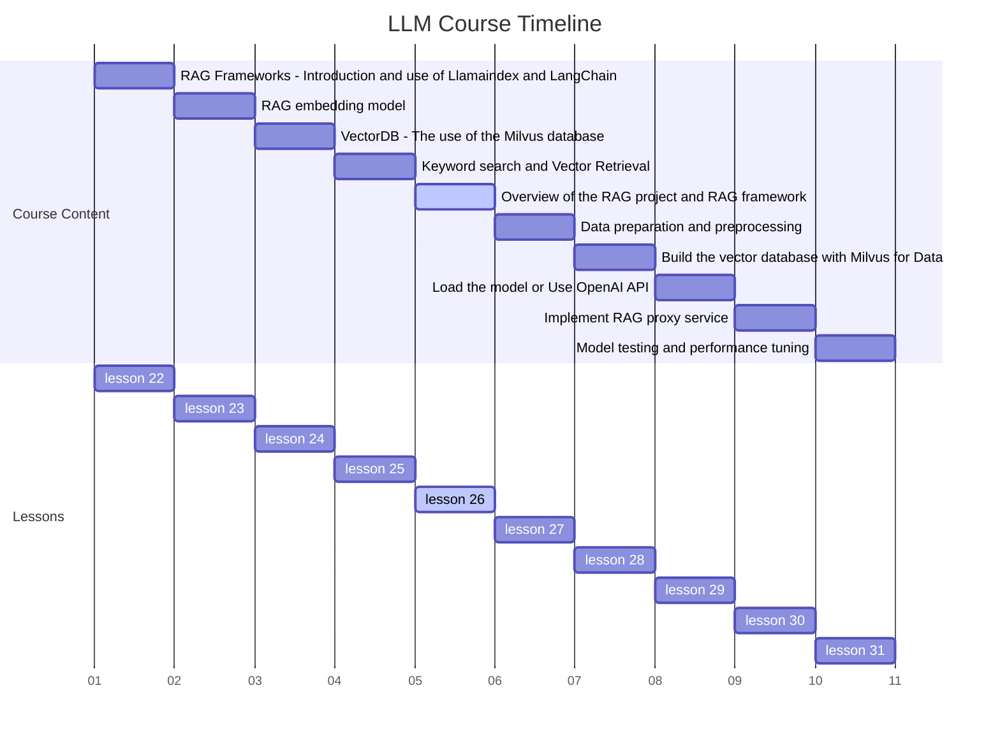

# LLM Course Timeline: Overview of the RAG project and RAG framework

```mermaid
gantt
    title LLM Course Timeline
    dateFormat X
    axisFormat %d
    section Course Content
    RAG Frameworks - Introduction and use of Llamaindex and LangChain :a22, 0, 1d
    RAG embedding model                                :a23, after a22, 1d
    VectorDB - The use of the Milvus database          :a24, after a23, 1d
    Keyword search and Vector Retrieval                :a25, after a24, 1d
    Overview of the RAG project and RAG framework      :active,a26, after a25, 1d
    Data preparation and preprocessing                 :a27, after a26, 1d
    Build the vector database with Milvus for Data     :a28, after a27, 1d
    Load the model or Use OpenAI API                   :a29, after a28, 1d
    Implement RAG proxy service                        :a30, after a29, 1d
    Model testing and performance tuning               :a31, after a30, 1d
    section Lessons
    lesson 22 :l22, 0, 1d
    lesson 23 :l23, after l22, 1d
    lesson 24 :l24, after l23, 1d
    lesson 25 :l25, after l24, 1d
    lesson 26 :active,l26, after l25, 1d
    lesson 27 :l27, after l26, 1d
    lesson 28 :l28, after l27, 1d
    lesson 29 :l29, after l28, 1d
    lesson 30 :l30, after l29, 1d
    lesson 31 :l31, after l30, 1d
```
