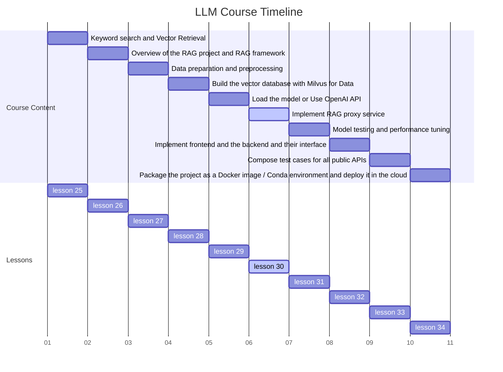

# LLM Course Timeline: Implement RAG proxy service

```mermaid
gantt
    title LLM Course Timeline
    dateFormat X
    axisFormat %d
    section Course Content
    Keyword search and Vector Retrieval                :a25, 0, 1d
    Overview of the RAG project and RAG framework      :a26, after a25, 1d
    Data preparation and preprocessing                 :a27, after a26, 1d
    Build the vector database with Milvus for Data     :a28, after a27, 1d
    Load the model or Use OpenAI API                   :a29, after a28, 1d
    Implement RAG proxy service                        :active,a30, after a29, 1d
    Model testing and performance tuning               :a31, after a30, 1d
    Implement frontend and the backend and their interface :a32, after a31, 1d
    Compose test cases for all public APIs             :a33, after a32, 1d
    Package the project as a Docker image / Conda environment and deploy it in the cloud :a34, after a33, 1d
    section Lessons
    lesson 25 :l25, 0, 1d
    lesson 26 :l26, after l25, 1d
    lesson 27 :l27, after l26, 1d
    lesson 28 :l28, after l27, 1d
    lesson 29 :l29, after l28, 1d
    lesson 30 :active,l30, after l29, 1d
    lesson 31 :l31, after l30, 1d
    lesson 32 :l32, after l31, 1d
    lesson 33 :l33, after l32, 1d
    lesson 34 :l34, after l33, 1d
```
