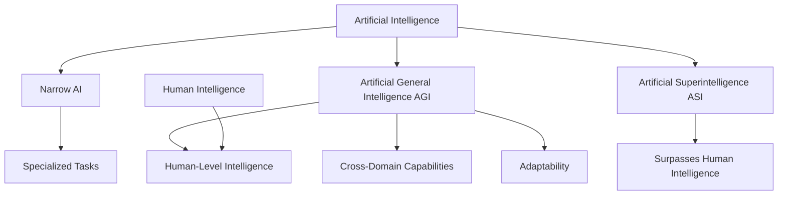
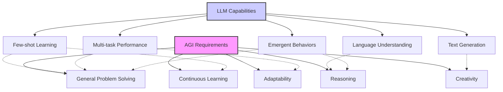
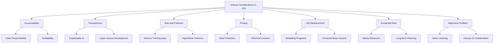

# 1.Course Title: Comprehensive Course Overview

```mermaid
gantt
    title LLM Course Timeline
    dateFormat X
    axisFormat %d
    section Course Timeline
    Course Overview                                    :active,a1, 0, 1d
    NLP Fundamentals                                   :a2, after a1, 1d
    Basic knowledge and architectural characteristics of LLM :a3, after a2, 1d
    LLM Development Fundamentals                       :a4, after a3, 1d
    Introduction and Setup of the Experimental Environment :a5, after a4, 1d
    The concept of the tokenizer and common types      :a6, after a5, 1d
    Text data preprocessing and preparation            :a7, after a6, 1d
    LLM training - Fine-tuning                         :a8, after a7, 1d
    LLM training - Reward Modeling and Proximal Policy Optimization :a9, after a8, 1d
    Famous SOTA LLM models and JAIS model              :a10, after a9, 1d
    section Lessons
    lesson 1  :active,l1, 0, 1d
    lesson 2  :l2, after l1, 1d
    lesson 3  :l3, after l2, 1d
    lesson 4  :l4, after l3, 1d
    lesson 5  :l5, after l4, 1d
    lesson 6  :l6, after l5, 1d
    lesson 7  :l7, after l6, 1d
    lesson 8  :l8, after l7, 1d
    lesson 9  :l9, after l8, 1d
    lesson 10 :l10, after l9, 1d
```



Advanced AI: From Large Language Models to Artificial General Intelligence

# 2. Learning Objectives

By the end of this comprehensive lesson, students will be able to:

- 2.1 Thoroughly understand and explain the concept of Artificial General Intelligence (AGI) and its relationship with narrow AI and human intelligence
- 2.2 Recognize and analyze the importance of Large Language Models (LLMs) in the path towards AGI
- 2.3 Identify and evaluate key skills needed for various roles in the AGI era
- 2.4 Comprehend the structure and goals of this course, including the relationship between theoretical foundations and practical applications
- 2.5 Demonstrate basic proficiency in using LLMs through code examples
- 2.6 Critically evaluate the potential impacts and ethical considerations of AGI development

# 3. Overview

This in-depth lesson introduces five key concepts, explores three main roles in the AGI era, and outlines the course structure with two phases and four modules. We will use various visual aids to enhance understanding and provide multiple code examples to demonstrate LLM usage and related concepts.

- 3.1 Introduction to AGI: Concept, Characteristics, and Comparisons
- 3.2 Skills for the AGI Era: A Comprehensive Analysis
- 3.3 LLMs as a Path to AGI: Capabilities, Limitations, and Future Directions
- 3.4 Ethical Considerations in AGI Development
- 3.5 Course Structure, Goals, and Learning Path

# 4. Detailed Content

## 4.1 Concept 1: Artificial General Intelligence (AGI)

## 4.1.1 Explanation
Artificial General Intelligence (AGI) represents a hypothetical form of AI that possesses the ability to understand, learn, and apply knowledge across a wide range of domains, similar to human intelligence. Unlike narrow AI, which is designed for specific tasks, AGI aims to exhibit general problem-solving skills and adaptability [1].

Key characteristics of AGI include:
1. Generalization across domains
2. Continuous learning and adaptation
3. Abstract reasoning and problem-solving
4. Creativity and innovation
5. Self-awareness and consciousness (debated)

The concept of AGI is crucial as it represents the ultimate goal of AI research and development, potentially leading to transformative changes in society, economy, and human-machine interaction.

## 4.1.2 Case Study: AlphaGo vs. AGI
Let's compare AlphaGo, a narrow AI system, with the concept of AGI:

AlphaGo:
- Specialized in playing the game Go
- Outperforms humans in its specific domain
- Cannot transfer skills to other games or tasks

AGI (hypothetical):
- Could learn and master Go along with any other game
- Would understand the concept of games in general
- Could apply strategic thinking to non-game situations
- Might innovate new games or strategies

This comparison highlights the vast difference between current AI capabilities and the aspirations of AGI.


## 4.1.3 Visualization: AGI in Context



This diagram illustrates the relationship between different levels of AI, highlighting AGI's position as a bridge between narrow AI and hypothetical superintelligence.

## 4.1.4 Reflection

Understanding AGI is fundamental to grasping the potential and limitations of current AI systems. It helps in setting realistic expectations and guides research and development efforts in the field of AI. However, it's important to note that AGI remains a theoretical concept, and there are significant challenges to overcome before it can be realized. These challenges include:

1. Developing truly generalizable learning algorithms
2. Creating systems that can transfer knowledge between domains
3. Implementing effective common-sense reasoning
4. Addressing ethical and safety concerns of highly capable AI systems

As we progress through this course, we'll explore how current technologies, particularly Large Language Models, are pushing the boundaries of AI capabilities and potentially bringing us closer to AGI.

## 4.2 Concept 2: Skills for the AGI Era

## 4.2.1 Explanation

As we move towards an AGI era, different roles will require specific skills to thrive in this new landscape. These skills span across technical, strategic, and ethical domains, emphasizing the interdisciplinary nature of AGI development and application. We'll focus on three key roles: AI Users, Product Managers, and Engineers.

## 4.2.2 Case Study: Skills in Action

Let's examine how these skills might be applied in a real-world scenario:

Scenario: Developing an AGI-powered personal assistant for healthcare

1. AI Users (e.g., Healthcare Professionals):
   - AI Literacy: Understanding the capabilities and limitations of the AGI system
   - Critical Thinking: Evaluating the assistant's recommendations in the context of medical knowledge
   - Ethical Considerations: Ensuring patient privacy and making ethical decisions based on AI insights
   - Adaptability: Integrating the AI assistant into existing healthcare workflows

2. Product Managers:
   - AI Strategy: Defining the roadmap for integrating AGI into healthcare products
   - User-Centric Design: Ensuring the AI assistant meets the needs of both healthcare providers and patients
   - Ethical Leadership: Guiding the development team to create responsible AI solutions
   - Cross-Functional Collaboration: Bridging the gap between technical teams, medical experts, and stakeholders

3. Engineers:
   - Advanced ML/DL: Developing and fine-tuning the AGI models for healthcare applications
   - System Integration: Integrating the AGI system with existing healthcare IT infrastructure
   - Ethical AI Development: Implementing fairness, transparency, and privacy in the AI system
   - Continuous Learning: Staying updated with the latest advancements in AGI and healthcare AI

## 4.2.3 Visualization: Key Skills for Different Roles in the AGI Era

```python
import matplotlib.pyplot as plt
import numpy as np

roles = ['AI User', 'Product Manager', 'Engineer']
skills = {
    'AI User': ['AI Literacy', 'Critical Thinking', 'Ethical Considerations', 'Adaptability'],
    'Product Manager': ['AI Strategy', 'User-Centric Design', 'Ethical Leadership', 'Cross-Functional Collaboration'],
    'Engineer': ['Advanced ML/DL', 'System Integration', 'Ethical AI Development', 'Continuous Learning']
}

fig, ax = plt.subplots(figsize=(12, 6))

y_pos = np.arange(len(roles))
bar_width = 0.2
opacity = 0.8

for i, role in enumerate(roles):
    skill_scores = np.random.rand(4) * 10  # Random scores for illustration
    ax.barh(y_pos + i*bar_width, skill_scores, bar_width, alpha=opacity, label=role)

ax.set_yticks(y_pos + bar_width)
ax.set_yticklabels(roles)
ax.invert_yaxis()
ax.set_xlabel('Skill Level')
ax.set_title('Key Skills for Different Roles in the AGI Era')
ax.legend()

plt.tight_layout()
plt.show()
```

This visualization provides a comparative view of the key skills required for different roles in the AGI era, emphasizing the diverse skill sets needed across these roles.

## 4.2.5 Reflection

The diverse skill sets required for different roles in the AGI era highlight the need for continuous learning and adaptability. It also underscores the importance of interdisciplinary knowledge and collaboration in the development and application of AGI technologies. As the field of AI continues to evolve rapidly, professionals in all roles must be prepared to update their skills regularly and think critically about the ethical implications of their work.

## 4.3 Concept 3: LLMs as a Path to AGI

## 4.3.1 Explanation

Large Language Models (LLMs) have emerged as a promising approach towards achieving AGI. These models, trained on vast amounts of text data, demonstrate remarkable capabilities in natural language understanding and generation, exhibiting characteristics that align with AGI goals [3].

Key aspects of LLMs that contribute to AGI development include:

1. Few-shot learning: Ability to perform tasks with minimal examples
2. Multi-task capabilities: Handling various language tasks without specific training
3. Emergent behaviors: Displaying capabilities not explicitly trained for
4. Scalability: Improved performance with increased model size and data

However, it's important to note that current LLMs also have limitations, including:

1. Lack of true understanding: Often relying on statistical patterns rather than comprehension
2. Inconsistency in responses: May provide different answers to the same question
3. Hallucination: Generating plausible but incorrect information
4. Ethical concerns: Potential biases and misuse of generated content

## 4.3.2 Case Study: GPT-3 Demonstrating AGI-like Capabilities

OpenAI's GPT-3 has shown remarkable abilities that hint at AGI-like capabilities:

1. Code Generation: GPT-3 can generate functional code from natural language descriptions.
2. Creative Writing: It can produce human-like poetry, stories, and even music lyrics.
3. Language Translation: GPT-3 can translate between multiple languages with high accuracy.
4. Reasoning: It can solve simple math problems and logical puzzles.

Example: GPT-3 generating Python code

Prompt: "Write a Python function that calculates the factorial of a number."

GPT-3 Response:

```python
def factorial(n):
    if n == 0 or n == 1:
        return 1
    else:
        return n * factorial(n-1)

# Example usage
number = 5
result = factorial(number)
print(f"The factorial of {number} is {result}")
```

This example demonstrates GPT-3's ability to understand the concept of factorial and generate correct, functional code.

## 4.3.3 Code: Interacting with an LLM (Using OpenAI's GPT-3)

Let's create a Python script that interacts with GPT-3 to demonstrate some of its capabilities:

```python
import openai
import os

# Set up OpenAI API key
openai.api_key = os.getenv("OPENAI_API_KEY")

def query_gpt3(prompt, max_tokens=100):
    response = openai.Completion.create(
        engine="text-davinci-002",
        prompt=prompt,
        max_tokens=max_tokens,
        n=1,
        stop=None,
        temperature=0.7,
    )
    return response.choices[0].text.strip()

# Example 1: Few# Example 1: Few-shot learning
prompt = """
Translate the following English phrases to French:

English: Hello
French: Bonjour

English: Goodbye
French: Au revoir

English: How are you?
French:"""

print("Few-shot learning example:")
print(query_gpt3(prompt))

# Example 2: Multi-task capabilities
prompt = """
1. Translate the following to Spanish: "The quick brown fox jumps over the lazy dog."
2. Summarize the following text in one sentence: "Artificial General Intelligence (AGI) is the hypothetical ability of an intelligent agent to understand, learn, and apply its intelligence across a wide range of tasks. Unlike narrow AI, which is designed for specific tasks, AGI aims to possess the same type of general intelligence that humans have."
3. Write a haiku about artificial intelligence.

Responses:
1."""

print("\nMulti-task capabilities example:")
print(query_gpt3(prompt, max_tokens=200))

# Example 3: Emergent behavior (simple reasoning)
prompt = """
Solve the following riddle:
I speak without a mouth and hear without ears. I have no body, but I come alive with the wind. What am I?

Think through this step-by-step:
1. Identify the key characteristics mentioned in the riddle.
2. Consider things that match these characteristics.
3. Arrive at the most logical conclusion.

Solution:"""

print("\nEmergent behavior example (reasoning):")
print(query_gpt3(prompt, max_tokens=150))
```

This script demonstrates some of the key capabilities of LLMs that make them potential stepping stones towards AGI, including few-shot learning, multi-task capabilities, and emergent behaviors like reasoning.

## 4.3.4 Visualization: LLM Capabilities vs AGI Requirements



This diagram illustrates the relationship between LLM capabilities and AGI requirements, showing how current LLM abilities align with some aspects of AGI while highlighting areas for further development.

## 4.3.5 Reflection

LLMs represent a significant step towards AGI, showcasing abilities like few-shot learning, multi-task capabilities, and emergent behaviors. However, challenges remain in areas such as reasoning, common sense understanding, and ethical decision-making. As we progress in this course, we'll explore how these models can be leveraged and extended to address more complex AI challenges, while also considering their limitations and potential risks.

## 4.4 Concept 4: Ethical Considerations in AGI Development

## 4.4.1 Explanation

As we move closer to AGI, it's crucial to consider the ethical implications of developing such powerful AI systems. Key ethical considerations include:

1. Accountability and Transparency: Ensuring AGI systems are explainable and their decision-making processes are transparent.
2. Bias and Fairness: Addressing biases in training data and algorithms to ensure fair treatment across different groups.
3. Privacy and Data Protection: Safeguarding individual privacy in the age of AI that can process vast amounts of personal data.
4. Job Displacement: Preparing for potential large-scale job displacement due to AGI capabilities.
5. Existential Risk: Considering the potential long-term impacts of AGI on humanity's future.
6. Alignment Problem: Ensuring AGI systems are aligned with human values and goals.

## 4.4.2 Case Study: Ethical Challenges in Healthcare AGI

Imagine an AGI system developed for healthcare diagnosis and treatment recommendation:

Ethical Challenges:

1. Privacy: Handling sensitive patient data while maintaining confidentiality.
2. Bias: Ensuring the system doesn't discriminate based on race, gender, or socioeconomic status.
3. Accountability: Determining responsibility if the AGI makes a incorrect diagnosis or recommendation.
4. Human Oversight: Balancing AGI capabilities with the need for human medical expertise.
5. Informed Consent: Ensuring patients understand and consent to AGI involvement in their care.

## 4.4.3 Code: Ethical AI Decision-Making Simulation

Let's create a simple simulation of ethical decision-making in an AI system:

```python
import random

class EthicalAGI:
    def __init__(self):
        self.ethical_priorities = {
            'fairness': 0.8,
            'transparency': 0.7,
            'privacy': 0.9,
            'beneficence': 0.85
        }
    
    def make_decision(self, options, context):
        scored_options = []
        for option in options:
            score = self.evaluate_option(option, context)
            scored_options.append((option, score))
        
        best_option = max(scored_options, key=lambda x: x[1])
        return best_option[0], best_option[1]
    
    def evaluate_option(self, option, context):
        fairness_score = random.uniform(0, 1) * self.ethical_priorities['fairness']
        transparency_score = random.uniform(0, 1) * self.ethical_priorities['transparency']
        privacy_score = random.uniform(0, 1) * self.ethical_priorities['privacy']
        beneficence_score = random.uniform(0, 1) * self.ethical_priorities['beneficence']
        
        return fairness_score + transparency_score + privacy_score + beneficence_score
    
    def explain_decision(self, decision, score):
        print(f"Decision: {decision}")
        print(f"Ethical score: {score:.2f}")
        print("Ethical considerations:")
        for priority, weight in self.ethical_priorities.items():
            print(f"- {priority.capitalize()}: weight = {weight}")

# Example usage
agi = EthicalAGI()

context = "Medical treatment recommendation"
options = [
    "Recommend experimental treatment",
    "Recommend standard treatment",
    "Recommend lifestyle changes only"
]

decision, score = agi.make_decision(options, context)
agi.explain_decision(decision, score)
```

This simulation demonstrates how an AGI system might incorporate ethical considerations into its decision-making process, weighing factors like fairness, transparency, privacy, and beneficence.

## 4.4.4 Visualization: Ethical Considerations in AGI Development



This diagram illustrates the various ethical considerations in AGI development and their interconnections.

## 4.4.5 Reflection

Addressing ethical considerations in AGI development is crucial for ensuring that these powerful systems benefit humanity while minimizing potential risks. As we progress through this course, we'll need to constantly consider the ethical implications of the technologies we're studying and developing. This includes not only the direct impacts of AGI systems but also the broader societal changes they may bring about.

## 4.5 Concept 5: Course Structure, Goals, and Learning Path

## 4.5.1 Explanation

This course is structured into two main phases: Fundamentals of LLM and Core Knowledge and Practice of RAG (Retrieval-Augmented Generation). Each phase consists of theoretical foundations followed by practical project work.

Course Structure:

1. Phase One: LLM
   - Module 1: Fundamentals of LLM (6 lessons)
   - Module 2: LLM Project (4 lessons)
2. Phase Two: RAG
   - Module 3: Fundamentals of RAG (5 lessons)
   - Module 4: RAG Project (5 lessons)

The course goals are to:

1. Provide a deep understanding of LLMs and their role in AGI development
2. Develop practical skills in implementing and working with LLMs
3. Explore advanced techniques like RAG for enhancing LLM capabilities
4. Foster critical thinking about the ethical implications of AGI
5. Prepare students for careers in AI research and development

## 4.5.2 Course Analysis: LLM and RAG Modules

### 4.5.2.1.Theory vs. Practical Hours per Module

The chart below compares the theory and practical hours allocated to each module.

```python
import matplotlib.pyplot as plt
import numpy as np

# Data for theory vs practical hours
module_details = {
    'LLM Fundamentals': {'Theory': 1.2, 'Practical': 0.5},
    'LLM Project': {'Theory': 1.0, 'Practical': 1.0},
    'RAG Fundamentals': {'Theory': 2.5, 'Practical': 2.0},
    'RAG Project': {'Theory': 2.0, 'Practical': 2.0}
}

modules = list(module_details.keys())
theory_hours = [module_details[module]['Theory'] for module in modules]
practical_hours = [module_details[module]['Practical'] for module in modules]

fig, ax = plt.subplots(figsize=(12, 6))
bar_width = 0.35
index = np.arange(len(modules))

bar1 = ax.bar(index, theory_hours, bar_width, color='#3498db', label='Theory')
bar2 = ax.bar(index + bar_width, practical_hours, bar_width, color='#e74c3c', label='Practical')

ax.set_xlabel('Modules', fontsize=12)
ax.set_ylabel('Total Hours', fontsize=12)
ax.set_title('Theory vs Practical Hours per Module', fontsize=14, fontweight='bold')
ax.set_xticks(index + bar_width / 2)
ax.set_xticklabels(modules)

ax.grid(True, which='both', linestyle='--', linewidth=0.5)
ax.legend()

for bar in bar1:
    yval = bar.get_height()
    ax.text(bar.get_x() + bar.get_width()/2, yval + 0.1, f'{yval:.1f}', ha='center', fontsize=11)
for bar in bar2:
    yval = bar.get_height()
    ax.text(bar.get_x() + bar.get_width()/2, yval + 0.1, f'{yval:.1f}', ha='center', fontsize=11)

plt.tight_layout()
plt.show()
```

### 4.5.2.2. Cumulative Learning Path

This chart illustrates the cumulative learning hours as students progress through the course.

```python
import numpy as np
import matplotlib.pyplot as plt

lesson_names = [
    'Course Overview', 'NLP Fundamentals', 'Basic knowledge and architectural characteristics', 
    'LLM Development Fundamentals', 'Introduction and Setup of the Experimental Environment',
    'The concept of the tokenizer and common types', 'Text data preprocessing and preparation',
    'Model Inference and Function calling', 'Prompt engineering - ChatGPT Prompt Engineering',
    'Model Quantization Techniques', 'Designing input and output formats for chatbot with context',
    'Model Deployment and Backend Development', 'Frontend web page debugging', 'System Testing and Deployment'
]
lesson_hours = [0.2, 0.5, 1.0, 0.5, 0.5, 0.5, 0.5, 0.5, 1.0, 1.0, 1.0, 1.0, 1.0, 1.0]

cumulative_hours = np.cumsum(lesson_hours)

fig, ax = plt.subplots(figsize=(14, 8))
ax.plot(lesson_names, cumulative_hours, marker='o', color='#2E86C1', linestyle='-', linewidth=2, markersize=6)

ax.set_xlabel('Lessons', fontsize=12)
ax.set_ylabel('Cumulative Learning Hours', fontsize=12)
ax.set_title('Cumulative Learning Path Throughout the Course', fontsize=14, fontweight='bold')
ax.set_xticklabels(lesson_names, rotation=45, ha='right')

ax.grid(True, which='both', linestyle='--', linewidth=0.5)

plt.tight_layout()
plt.show()
```

### 4.5.2.3. Lesson Distribution Across Modules

The pie chart below shows how lessons are distributed across the different modules.

```python
fig, ax = plt.subplots(figsize=(10, 6))
ax.pie(module_lesson_count.values(), labels=module_lesson_count.keys(), autopct='%1.1f%%', startangle=90, colors=['#4CAF50', '#2196F3', '#FFC107', '#F44336'])
ax.set_title('Lesson Distribution Across Modules', fontsize=14, fontweight='bold')

plt.tight_layout()
plt.show()
```

### 4.5.2.4. Time Allocation Across Lessons and Modules

This heatmap visualizes the time allocation for each lesson within each module.

```python
import seaborn as sns

time_allocation_data = {
    'Course Overview': {'LLM Fundamentals': 0.2},
    'NLP Fundamentals': {'LLM Fundamentals': 0.5},
    'Basic knowledge and architectural characteristics': {'LLM Fundamentals': 1.0},
    'LLM Development Fundamentals': {'LLM Project': 0.5},
    'Introduction and Setup of the Experimental Environment': {'LLM Project': 0.5},
    'The concept of the tokenizer and common types': {'LLM Project': 0.5},
    'Text data preprocessing and preparation': {'LLM Project': 0.5},
    'Model Inference and Function calling': {'RAG Fundamentals': 0.5},
    'Prompt engineering - ChatGPT Prompt Engineering': {'RAG Fundamentals': 1.0},
    'Model Quantization Techniques': {'RAG Fundamentals': 1.0},
    'Designing input and output formats for chatbot with context': {'RAG Project': 1.0},
    'Model Deployment and Backend Development': {'RAG Project': 1.0},
    'Frontend web page debugging': {'RAG Project': 1.0},
    'System Testing and Deployment': {'RAG Project': 1.0},
}

modules = ['LLM Fundamentals', 'LLM Project', 'RAG Fundamentals', 'RAG Project']
lessons = list(time_allocation_data.keys())
heatmap_data = np.zeros((len(lessons), len(modules)))

for i, lesson in enumerate(lessons):
    for j, module in enumerate(modules):
        if module in time_allocation_data[lesson]:
            heatmap_data[i, j] = time_allocation_data[lesson][module]

fig, ax = plt.subplots(figsize=(12, 8))
sns.heatmap(heatmap_data, annot=True, fmt=".1f", cmap="Blues", xticklabels=modules, yticklabels=lessons, cbar_kws={'label': 'Hours'})
ax.set_title('Time Allocation Across Lessons and Modules', fontsize=14, fontweight='bold')
ax.set_xlabel('Modules', fontsize=12)
ax.set_ylabel('Lessons', fontsize=12)

plt.tight_layout()
plt.show()
```

## 4.5.3 Reflection

The course structure provides a comprehensive journey from theoretical foundations to practical applications, enabling students to build a solid understanding of LLMs and RAG while developing hands-on skills through project work. By combining theory with practice and covering both LLM fundamentals and advanced techniques like RAG, the course prepares students for the cutting-edge of AI development.

As we progress through the course, it's important to:

1. Engage deeply with theoretical concepts while also focusing on practical applications
2. Continuously reflect on the ethical implications of the technologies we're studying
3. Seek connections between different modules and concepts
4. Apply learned skills to real-world problems through projects
5. Stay updated with the rapidly evolving field of AI and LLMs

# 5. Summary

## 5.1 Conclusion

In this comprehensive overview, we've explored the fundamental concepts that will guide our journey into the world of Large Language Models and their role in the development of Artificial General Intelligence. We've examined the nature of AGI, the essential skills for thriving in the AGI era, the capabilities and limitations of LLMs as a path to AGI, crucial ethical considerations, and the structure of our learning path.

Key takeaways include:

1. AGI represents a significant leap beyond narrow AI, aiming for human-like generalization and adaptability across domains.
2. The AGI era demands a diverse set of skills across technical, strategic, and ethical domains for various roles.
3. LLMs showcase promising capabilities towards AGI, including few-shot learning and multi-task performance, but also face limitations and ethical challenges.
4. Ethical considerations are paramount in AGI development, encompassing issues of transparency, fairness, privacy, and long-term impacts on society.
5. Our course provides a structured path through LLM fundamentals and advanced techniques like RAG, combining theoretical knowledge with practical projects.

As we embark on this learning journey, we'll need to maintain a balance between enthusiasm for the potential of these technologies and a critical, ethical perspective on their development and application. The field of AI is rapidly evolving, and our course will equip you with the knowledge and skills to not only understand current developments but also contribute to shaping the future of AI.

## 5.2 Mind Maps

```mermaid
graph TD
    A[Course Overview] --> B[AGI Concept]
    A --> C[Skills for AGI Era]
    A --> D[LLMs as Path to AGI]
    A --> E[Ethical Considerations]
    A --> F[Course Structure]
    
    B --> G[Generalization]
    B --> H[Adaptability]
    B --> I[Reasoning]
    
    C --> J[AI Users]
    C --> K[Product Managers]
    C --> L[Engineers]
    
    D --> M[Few-shot Learning]
    D --> N[Multi-task Capabilities]
    D --> O[Limitations]
    
    E --> P[Transparency]
    E --> Q[Fairness]
    E --> R[Privacy]
    E --> S[Long-term Impact]
    
    F --> T[LLM Fundamentals]
    F --> U[LLM Project]
    F --> V[RAG Fundamentals]
    F --> W[RAG Project]
    
    J --> X[AI Literacy]
    J --> Y[Critical Thinking]
    
    K --> Z[AI Strategy]
    K --> AA[Ethical Leadership]
    
    L --> AB[Advanced ML/DL]
    L --> AC[Ethical AI Development]
    
    M --> AD[Improved Efficiency]
    N --> AE[Versatility]
    O --> AF[Ethical Challenges]
    
    P --> AG[Explainable AI]
    Q --> AH[Bias Mitigation]
    R --> AI[Data Protection]
    S --> AJ[Existential Risk]
    
    T --> AK[Theory]
    U --> AL[Practical Skills]
    V --> AM[Advanced Techniques]
    W --> AN[Real-world Application]
```



This comprehensive mind map provides a visual overview of the key concepts covered in this lessonThis comprehensive mind map provides a visual overview of the key concepts covered in this lesson, illustrating the interconnections between AGI, skills for the AGI era, LLMs, ethical considerations, and our course structure.

## 5.3 Preview

In our next lesson, we will delve into the fundamentals of Natural Language Processing (NLP), laying the groundwork for our exploration of Large Language Models. We'll cover key concepts such as tokenization, word embeddings, and basic neural network architectures for NLP tasks. This foundation will be crucial for understanding the more advanced topics we'll encounter in subsequent lessons.

# 6. Homework

1. Research and write a 1000-word essay on a recent advancement in LLMs (e.g., GPT-3, BERT, T5) and its potential impact on AGI development. Include a discussion of both technical achievements and ethical considerations.

2. Conduct a self-assessment of your current skills based on the AGI era skill sets discussed in this lesson. Create a personal development plan outlining areas for improvement and specific actions you can take to enhance your skills.

3. Implement the `SimulatedAGI` class from the code example in section 4.1.3. Extend it with at least two new methods that demonstrate additional AGI-like capabilities (e.g., learning from mistakes, combining knowledge from multiple domains). Provide examples of how these new capabilities work.

4. Using the OpenAI API (or a similar service if you have access), create a Python script that demonstrates the few-shot learning capabilities of a large language model. Choose a task (e.g., sentiment analysis, named entity recognition) and show how the model performs with varying numbers of examples (0, 1, and 3 shots).

5. Design a simple ethical framework for AGI development, considering the points discussed in section 4.4. Create a flowchart or decision tree that an AI development team could use to evaluate the ethical implications of their work at different stages of the development process.

6. Explore the concept of "AI alignment" by reading Nick Bostrom's paper "The Superintelligent Will: Motivation and Instrumental Rationality in Advanced Artificial Agents" (or a similar introductory text on AI alignment). Write a 500-word summary of the key challenges in aligning AGI systems with human values and potential approaches to addressing these challenges.

# 7. Reference and Citation

[1] Russell, S., & Norvig, P. (2020). Artificial Intelligence: A Modern Approach (4th ed.). Pearson.

[2] Goodfellow, I., Bengio, Y., & Courville, A. (2016). Deep Learning. MIT Press.

[3] Brown, T. B., Mann, B., Ryder, N., Subbiah, M., Kaplan, J., Dhariwal, P., ... & Amodei, D. (2020). Language models are few-shot learners. arXiv preprint arXiv:2005.14165.

[4] Devlin, J., Chang, M. W., Lee, K., & Toutanova, K. (2018). BERT: Pre-training of deep bidirectional transformers for language understanding. arXiv preprint arXiv:1810.04805.

[5] Touvron, H., Lavril, T., Izacard, G., Martinet, X., Lachaux, M. A., Lacroix, T., ... & Lample, G. (2023). LLaMA: Open and Efficient Foundation Language Models. arXiv preprint arXiv:2302.13971.

[6] Bostrom, N. (2014). Superintelligence: Paths, dangers, strategies. Oxford University Press.

[7] Dario Amodei, Chris Olah, Jacob Steinhardt, Paul Christiano, John Schulman, Dan Mané. (2016). Concrete Problems in AI Safety. arXiv preprint arXiv:1606.06565.

[8] Karpathy, A. (2015). The Unreasonable Effectiveness of Recurrent Neural Networks. Retrieved from <http://karpathy.github.io/2015/05/21/rnn-effectiveness/>

[9] LeCun, Y., Bengio, Y., & Hinton, G. (2015). Deep learning. Nature, 521(7553), 436-444.

[10] Silver, D., Hubert, T., Schrittwieser, J., Antonoglou, I., Lai, M., Guez, A., ... & Hassabis, D. (2018). A general reinforcement learning algorithm that masters chess, shogi, and Go through self-play. Science, 362(6419), 1140-1144.

[11] Vaswani, A., Shazeer, N., Parmar, N., Uszkoreit, J., Jones, L., Gomez, A. N., ... & Polosukhin, I. (2017). Attention is all you need. In Advances in neural information processing systems (pp. 5998-6008).

[12] Sutton, R. S., & Barto, A. G. (2018). Reinforcement learning: An introduction. MIT press.

[13] Bengio, Y., Lecun, Y., & Hinton, G. (2021). Deep learning for AI. Communications of the ACM, 64(7), 58-65.

[14] Shanahan, M. (2015). The Technological Singularity. MIT Press.

[15] Yampolskiy, R. V. (2020). Unpredictability of AI: On the impossibility of accurately predicting all actions of a smarter agent. Journal of Artificial Intelligence and Consciousness, 7(01), 109-118.
