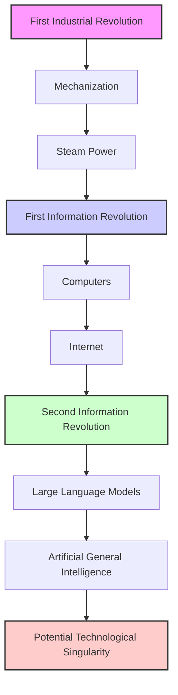
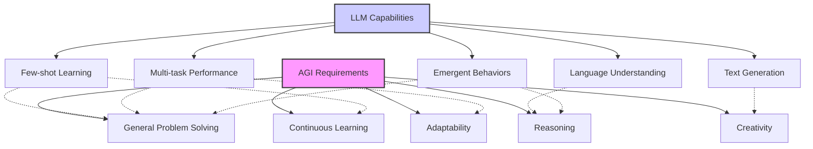
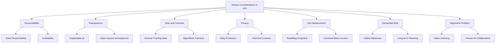

# 1. Course Title:Course_Overview LLM and AGI: Navigating the Second Information Revolution

```mermaid
gantt
    title LLM and AGI Course Timeline
    dateFormat X
    axisFormat %d
    section Course Timeline
    Course Overview                                     :active,a1, 0, 1d
    NLP Fundamentals                                    :a2, after a1, 1d
    Basic knowledge and architectural characteristics   :a3, after a2, 1d
    LLM Development Fundamentals                        :a4, after a3, 1d
    Experimental Environment Setup                      :a5, after a4, 1d
    Gap                                                 :a6, after a5, 1d
    Model Inference and Function calling                :a12, after a6, 1d
    Prompt engineering - ChatGPT Prompt Engineering     :a13, after a12, 1d
    Model Quantization Techniques                       :a14, after a13, 1d
    section Lessons
    lesson 01 :active,l1, 0, 1d
    lesson 02 :l2, after l1, 1d
    lesson 03 :l3, after l2, 1d
    lesson 04 :l4, after l3, 1d
    lesson 05 :l5, after l4, 1d
    Gap       :l6, after l5, 1d
    lesson 12 :l12, after l6, 1d
    lesson 13 :l13, after l12, 1d
    lesson 14 :l14, after l13, 1d
```



Embracing the Dawn of Artificial General Intelligence in the Second Information Revolution

# 2. Learning Objectives

By the end of this comprehensive lesson, students will be able to:

2.1 Comprehend the historical context and significance of the AGI revolution, drawing parallels with previous industrial and information revolutions
2.2 Analyze the potential impact of AGI and LLMs on global economic structures, social hierarchies, and production relations
2.3 Evaluate the role of LLMs as a bridge to AGI and their potential to reshape human civilization
2.4 Identify key skills and strategies for thriving in the AGI era across different societal roles (AI users, product managers, engineers)
2.5 Understand the basic principles and capabilities of Large Language Models (LLMs) and their applications
2.6 Critically assess the ethical implications and potential societal transformations brought about by AGI development

# 3. Overview

This in-depth lesson introduces five key concepts, exploring the transformative potential of AGI and LLMs, and outlining strategies for navigating this new era:

3.1 The Second Information Revolution: AGI and LLMs as Catalysts for Change
3.2 Reshaping Global Economic and Social Structures in the AGI Era
3.3 LLMs as the Bridge to AGI: Capabilities, Limitations, and Future Trajectories
3.4 Strategies for Thriving in the AGI-Driven World
3.5 Ethical Considerations and Societal Implications of AGI Development

# 4. Detailed Content

## 4.1 Concept 1: The Second Information Revolution: AGI and LLMs as Catalysts for Change

## 4.1.1 Explanation

The advent of Artificial General Intelligence (AGI) and Large Language Models (LLMs) marks the beginning of the Second Information Revolution, a transformative era comparable to the Industrial Revolution of the 18th century. This revolution is reshaping the foundations of human society, economy, and knowledge acquisition.

Key aspects include:

1. LLMs as the cornerstone of AGI development
2. The potential of AGI to surpass human intelligence in various domains
3. The rapid evolution of AI technologies and their widespread integration into daily life
4. The shift from narrow AI to more generalized artificial intelligence

The Second Information Revolution is characterized by:

- Unprecedented processing of human knowledge through LLMs
- The potential for AGI to understand and manipulate complex systems beyond human capability
- A fundamental shift in the relationship between humans and machines

## 4.1.2 Case Study: GPT-3 and the Dawn of Advanced Language Models

Examine the impact of GPT-3's release in 2020:

- Capabilities that surprised even AI researchers
- Wide-ranging applications from coding to creative writing
- Implications for future AI development and societal change

## 4.1.3 Visualization: The Evolution of AI and Information Revolutions



This diagram illustrates the progression from the First Industrial Revolution to the potential Technological Singularity, highlighting the pivotal role of LLMs and AGI in the Second Information Revolution.

## 4.1.4 Reflection

The Second Information Revolution, driven by AGI and LLMs, presents both unprecedented opportunities and challenges. As we stand on the brink of this new era, it's crucial to consider:

1. How will the development of AGI change the fundamental nature of work and human productivity?
2. What new forms of human-machine collaboration might emerge?
3. How can we ensure that the benefits of this revolution are distributed equitably across society?
4. What safeguards need to be in place to prevent potential misuse or unintended consequences of AGI?

As we progress through this course, we'll explore how current LLM technologies are pushing the boundaries of AI capabilities and potentially bringing us closer to AGI, while also considering the broader implications for society, economy, and human civilization.

## 4.2 Concept 2: Reshaping Global Economic and Social Structures in the AGI Era

## 4.2.1 Explanation

The advent of AGI is poised to dramatically reshape global economic and social structures, echoing the transformative impact of previous industrial revolutions but on an unprecedented scale. This shift will likely lead to:

1. Redefinition of labor and productivity
2. Restructuring of global wealth distribution
3. Emergence of new social classes based on AI literacy and control
4. Potential exacerbation of existing inequalities

Key aspects of this transformation include:

- Shift in the nature of work and employment
- Changes in the distribution of economic power between nations
- Potential for rapid technological progress and economic growth
- Risk of increased wealth concentration and social stratification

## 4.2.2 Case Study: The Transformation of the Labor Market

Examine the potential impact of AGI on various sectors:

1. Manufacturing: Advanced robotics and AI leading to highly automated production lines
2. Services: AI-driven customer service, financial advising, and healthcare diagnostics
3. Knowledge work: AI assistants augmenting human capabilities in fields like law, research, and software development

Analyze the implications for:

- Job displacement and creation
- Skill requirements for the future workforce
- The changing nature of human-machine collaboration

## 4.2.3 Visualization: Projected Changes in Wealth Distribution

```python
import matplotlib.pyplot as plt
import numpy as np

# Data (hypothetical)
categories = ['Lower Class', 'Middle Class', 'Upper Class', 'AI-Augmented Elite']
current_distribution = [20, 60, 19, 1]
future_distribution = [40, 30, 20, 10]

x = np.arange(len(categories))
width = 0.35

fig, ax = plt.subplots(figsize=(12,6))
rects1 = ax.bar(x - width/2, current_distribution, width, label='Current Distribution')
rects2 = ax.bar(x + width/2, future_distribution, width, label='Projected Distribution (AGI Era)')

ax.set_ylabel('Percentage of Population')
ax.set_title('Hypothetical Wealth Distribution: Current vs AGI Era')
ax.set_xticks(x)
ax.set_xticklabels(categories)
ax.legend()

def autolabel(rects):
    for rect in rects:
        height = rect.get_height()
        ax.annotate(f'{height}%',
                    xy=(rect.get_x() + rect.get_width() / 2, height),
                    xytext=(0, 3),
                    textcoords="offset points",
                    ha='center', va='bottom')

autolabel(rects1)
autolabel(rects2)

fig.tight_layout()

plt.show()
```

This visualization illustrates a hypothetical shift in wealth distribution as society transitions into the AGI era, highlighting the potential for increased stratification and the emergence of an AI-augmented elite class.

## 4.2.4 Reflection

The reshaping of global economic and social structures in the AGI era presents both opportunities and challenges:

1. How can we ensure that the benefits of AGI are distributed equitably across society?
2. What policies might be necessary to address potential job displacement and economic disruption?
3. How might the role of education and skill development need to evolve to prepare individuals for this new era?
4. What new forms of social organization or economic systems might emerge in response to these changes?

As we delve deeper into LLMs and AGI technologies, it's crucial to consider these broader societal implications and begin formulating strategies to address them.

## 4.3 Concept 3: LLMs as the Bridge to AGI: Capabilities, Limitations, and Future Trajectories

## 4.3.1 Explanation

Large Language Models (LLMs) represent a significant step towards Artificial General Intelligence (AGI), showcasing capabilities that blur the lines between narrow AI and more generalized intelligence. Key aspects include:

1. Few-shot learning: Ability to perform tasks with minimal examples
2. Multi-task capabilities: Handling various language tasks without specific training
3. Emergent behaviors: Displaying capabilities not explicitly trained for
4. Scalability: Improved performance with increased model size and data

However, current LLMs also have limitations:

1. Lack of true understanding: Often relying on statistical patterns rather than comprehension
2. Inconsistency in responses: May provide different answers to the same question
3. Hallucination: Generating plausible but incorrect information
4. Ethical concerns: Potential biases and misuse of generated content

## 4.3.2 Case Study: GPT-3 and Its Implications for AGI Development

Examine GPT-3's capabilities and limitations:

1. Natural language understanding and generation
2. Code generation and problem-solving
3. Creative tasks like story writing and poetry composition
4. Limitations in reasoning and factual consistency

Analyze how these capabilities and limitations inform our understanding of the path to AGI.

## 4.3.3 Code Example: Interacting with an LLM (Using OpenAI's GPT-3)

```python
import openai
import os

# Set up OpenAI API key
openai.api_key = os.getenv("OPENAI_API_KEY")

def query_gpt3(prompt, max_tokens=100):
    response = openai.Completion.create(
        engine="text-davinci-002",
        prompt=prompt,
        max_tokens=max_tokens,
        n=1,
        stop=None,
        temperature=0.7,
    )
    return response.choices[0].text.strip()

# Example 1: Few-shot learning
prompt = """
Translate the following English phrases to French:

English: Hello
French: Bonjour

English: Goodbye
French: Au revoir

English: How are you?
French:"""

print("Few-shot learning example:")
print(query_gpt3(prompt))

# Example 2: Multi-task capabilities
prompt = """
1. Translate the following to Spanish: "The quick brown fox jumps over the lazy dog."
2. Summarize the following text in one sentence: "Artificial General Intelligence (AGI) is the hypothetical ability of an intelligent agent to understand, learn, and apply its intelligence across a wide range of tasks. Unlike narrow AI, which is designed for specific tasks, AGI aims to possess the same type of general intelligence that humans have."
3. Write a haiku about artificial intelligence.

Responses:
1."""

print("\nMulti-task capabilities example:")
print(query_gpt3(prompt, max_tokens=200))

# Example 3: Emergent behavior (simple reasoning)
prompt = """
Solve the following riddle:
I speak without a mouth and hear without ears. I have no body, but I come alive with the wind. What am I?

Think through this step-by-step:
1. Identify the key characteristics mentioned in the riddle.
2. Consider things that match these characteristics.
3. Arrive at the most logical conclusion.

Solution:"""

print("\nEmergent behavior example (reasoning):")
print(query_gpt3(prompt, max_tokens=150))
```

This script demonstrates some of the key capabilities of LLMs that make them potential stepping stones towards AGI, including few-shot learning, multi-task capabilities, and emergent behaviors like reasoning.

## 4.3.4 Visualization: LLM Capabilities vs AGI Requirements



This diagram illustrates the relationship between LLM capabilities and AGI requirements, showing how current LLM abilities align with some aspects of AGI while highlighting areas for further development.

## 4.3.5 Reflection

LLMs represent a significant step towards AGI, showcasing abilities that push the boundaries of what we previously thought possible with AI. However, challenges remain in areas such as true understanding, consistent reasoning, and ethical decision-making. As we progress in this course, we'll explore how these models can be leveraged and extended to address more complex AI challenges, while also considering their limitations and potential risks.

Key questions to consider:

1. How can we bridge the gap between LLMs' pattern recognition abilities and true understanding?
2. What advancements are needed to move from the current capabilities of LLMs to full AGI?
3. How can we address the ethical concerns and potential misuse of increasingly powerful language models?
4. What role might LLMs play in the development of other AI technologies on the path to AGI?

## 4.4 Concept 4: Strategies for Thriving in the AGI-Driven World

## 4.4.1 Explanation

As we transition into an AGI-driven world, individuals and organizations must adapt to remain relevant and competitive. Strategies for thriving in this new era can be categorized into three main areas:

1. Technical Proficiency: Leveraging AI technologies effectively
2. Adaptive Skillsets: Developing skills that complement rather than compete with AI
3. Ethical Leadership: Guiding the responsible development and use of AI technologies

Key aspects to consider:

- Continuous learning and skill development
- Emphasis on uniquely human qualities such as creativity, empathy, and complex problem-solving
- Understanding of AI capabilities and limitations
- Ability to work effectively in human-AI collaborative environments

## 4.4.2 Case Study: Evolving Roles in an AI-Augmented Workplace

Examine how different professional roles are adapting to AI integration:

1. AI Users (e.g., Healthcare Professionals):
   - AI Literacy: Understanding AI capabilities and limitations in medical diagnosis and treatment planning
   - Critical Thinking: Evaluating AI-generated recommendations in the context of patient care
   - Ethical Considerations: Ensuring patient privacy and making ethical decisions based on AI insights

2. Product Managers:
   - AI Strategy: Defining roadmaps for AI integration in product development
   - User-Centric Design: Ensuring AI-enhanced products meet user needs and expectations
   - Ethical Leadership: Guiding development teams in creating responsible AI solutions

3. Engineers:
   - Advanced ML/DL: Developing and fine-tuning AI models for specific applications
   - System Integration: Integrating AI systems with existing infrastructure
   - Ethical AI Development: Implementing fairness, transparency, and privacy in AI systems

## 4.4.3 Visualization: Key Skills for the AGI Era

```python
import matplotlib.pyplot as plt
import numpy as np

roles = ['AI User', 'Product Manager', 'Engineer']
skills = {
    'AI User': ['AI Literacy', 'Critical Thinking', 'Ethical Considerations', 'Adaptability'],
    'Product Manager': ['AI Strategy', 'User-Centric Design', 'Ethical Leadership', 'Cross-Functional Collaboration'],
    'Engineer': ['Advanced ML/DL', 'System Integration', 'Ethical AI Development', 'Continuous Learning']
}

fig, ax = plt.subplots(figsize=(12, 6))

y_pos = np.arange(len(roles))
bar_width = 0.2
opacity = 0.8

for i, role in enumerate(roles):
    skill_scores = np.random.rand(4) * 10  # Random scores for illustration
    ax.barh(y_pos + i*bar_width, skill_scores, bar_width, alpha=opacity, label=role)

ax.set_yticks(y_pos + bar_width)
ax.set_yticklabels(roles)
ax.invert_yaxis()
ax.set_xlabel('Skill Level')
ax.set_title('Key Skills for Different Roles in the AGI Era')
ax.legend()

plt.tight_layout()
plt.show()
```

This visualization provides a comparative view of the key skills required for different roles in the AGI era, emphasizing the diverse skill sets needed across these roles.

## 4.4.4 Reflection

Thriving in an AGI-driven world requires a combination of technical proficiency, adaptability, and ethical awareness. Consider the following questions:

1. How can individuals best prepare themselves for a rapidly evolving job market influenced by AGI?
2. What uniquely human skills will become more valuable as AI capabilities expand?
3. How might education systems need to evolve to prepare future generations for an AGI-driven world?
4. What role does lifelong learning play in maintaining relevance in an AI-augmented workplace?

As we progress through this course, we'll explore how understanding and leveraging LLM technologies can provide a competitive advantage in various professional contexts.

## 4.5 Concept 5: Ethical Considerations and Societal Implications of AGI Development

## 4.5.1 Explanation

The development of AGI raises profound ethical questions and has far-reaching societal implications. Key considerations include:

1. Accountability and Transparency: Ensuring AGI systems are explainable and their decision-making processes are transparent
2. Bias and Fairness: Addressing biases in training data and algorithms to ensure fair treatment across different groups
3. Privacy and Data Protection: Safeguarding individual privacy in the age of AI that can process vast amounts of personal data
4. Job Displacement: Preparing for potential large-scale job displacement due to AGI capabilities
5. Existential Risk: Considering the potential long-term impacts of AGI on humanity's future
6. Alignment Problem: Ensuring AGI systems are aligned with human values and goals

## 4.5.2 Case Study: Ethical Challenges in Healthcare AGI

Imagine an AGI system developed for healthcare diagnosis and treatment recommendation:

Ethical Challenges:

1. Privacy: Handling sensitive patient data while maintaining confidentiality
2. Bias: Ensuring the system doesn't discriminate based on race, gender, or socioeconomic status
3. Accountability: Determining responsibility if the AGI makes an incorrect diagnosis or recommendation
4. Human Oversight: Balancing AGI capabilities with the need for human medical expertise
5. Informed Consent: Ensuring patients understand and consent to AGI involvement in their care

## 4.5.3 Code Example: Ethical AI Decision-Making Simulation

```python
import random

class EthicalAGI:
    def __init__(self):
        self.ethical_priorities = {
            'fairness': 0.8,
            'transparency': 0.7,
            'privacy': 0.9,
            'beneficence': 0.85
        }
    
    def make_decision(self, options, context):
        scored_options = []
        for option in options:
            score = self.evaluate_option(option, context)
            scored_options.append((option, score))
        
        best_option = max(scored_options, key=lambda x: x[1])
        return best_option[0], best_option[1]
    
    def evaluate_option(self, option, context):
        fairness_score = random.uniform(0, 1) * self.ethical_priorities['fairness']
        transparency_score = random.uniform(0, 1) * self.ethical_priorities['transparency']
        privacy_score = random.uniform(0, 1) * self.ethical_priorities['privacy']
        beneficence_score = random.uniform(0, 1) * self.ethical_priorities['beneficence']
        
        return fairness_score + transparency_score + privacy_score + beneficence_score
    
    def explain_decision(self, decision, score):
        print(f"Decision: {decision}")
        print(f"Ethical score: {score:.2f}")
        print("Ethical considerations:")
        for priority, weight in self.ethical_priorities.items():
            print(f"- {priority.capitalize()}: weight = {weight}")

# Example usage
agi = EthicalAGI()

context = "Medical treatment recommendation"
options = [
    "Recommend experimental treatment",
    "Recommend standard treatment",
    "Recommend lifestyle changes only"
]

decision, score = agi.make_decision(options, context)
agi.explain_decision(decision, score)
```

This simulation demonstrates how an AGI system might incorporate ethical considerations into its decision-making process, weighing factors like fairness, transparency, privacy, and beneficence.

## 4.5.4 Visualization: Ethical Considerations in AGI Development



This diagram illustrates the various ethical considerations in AGI development and their interconnections.

## 4.5.5 Reflection

Addressing ethical considerations in AGI development is crucial for ensuring that these powerful systems benefit humanity while minimizing potential risks. As we progress through this course, we'll need to constantly consider the ethical implications of the technologies we're studying and developing. This includes not only the direct impacts of AGI systems but also the broader societal changes they may bring about.

Key questions to consider:

1. How can we ensure that AGI development aligns with human values and ethical principles?
2. What governance structures or regulatory frameworks might be necessary to guide responsible AGI development?
3. How can we balance the potential benefits of AGI with the risks it poses to privacy, job security, and potentially human autonomy?
4. What role should different stakeholders (government, industry, academia, public) play in shaping the ethical development of AGI?

# 5. Summary

## 5.1 Conclusion

In this comprehensive overview, we've explored the fundamental concepts that will guide our journey into the world of Large Language Models and their role in the development of Artificial General Intelligence. We've examined the nature of the Second Information Revolution, the potential reshaping of global economic and social structures, the capabilities and limitations of LLMs as a path to AGI, strategies for thriving in the AGI era, and the crucial ethical considerations surrounding AGI development.

Key takeaways include:

1. The Second Information Revolution, driven by AGI and LLMs, presents unprecedented opportunities and challenges for society.
2. LLMs represent a significant step towards AGI, showcasing remarkable capabilities while also facing important limitations.
3. The advent of AGI is likely to dramatically reshape global economic and social structures, potentially leading to new forms of inequality and social stratification.
4. Thriving in the AGI era will require a combination of technical proficiency, adaptability, and ethical awareness across various professional roles.
5. Addressing ethical considerations is paramount in AGI development, encompassing issues of transparency, fairness, privacy, and long-term impacts on humanity.

As we embark on this learning journey, we'll need to maintain a balance between enthusiasm for the potential of these technologies and a critical, ethical perspective on their development and application. The field of AI is rapidly evolving, and our course will equip you with the knowledge and skills to not only understand current developments but also contribute to shaping the future of AI in a responsible and beneficial manner.

## 5.2 Mind Map

```mermaid
graph TD
    A[LLM and AGI: Navigating the Second Information Revolution] --> B[Second Information Revolution]
    A --> C[Global Economic and Social Restructuring]
    A --> D[LLMs as Path to AGI]
    A --> E[Strategies for Thriving]
    A --> F[Ethical Considerations]

    B --> G[Transformative Impact]
    B --> H[LLMs and AGI as Catalysts]

    C --> I[Wealth Distribution Changes]
    C --> J[New Social Classes]
    C --> K[Labor Market Transformation]

    D --> L[LLM Capabilities]
    D --> M[LLM Limitations]
    D --> N[Future Trajectories]
    
    E --> O[Technical Proficiency]
    E --> P[Adaptive Skillsets]
    E --> Q[Ethical Leadership]
    
    F --> R[Accountability and Transparency]
    F --> S[Bias and Fairness]
    F --> T[Privacy and Data Protection]
    F --> U[Existential Risk]
    
    L --> V[Few-shot Learning]
    L --> W[Multi-task Capabilities]
    
    M --> X[Lack of True Understanding]
    M --> Y[Inconsistency]
    
    O --> Z[AI Literacy]
    O --> AA[Advanced ML/DL Skills]
    
    P --> AB[Creativity]
    P --> AC[Critical Thinking]
    
    Q --> AD[Responsible AI Development]
    Q --> AE[Ethical Decision Making]
    
    R --> AF[Explainable AI]
    R --> AG[Audit Mechanisms]
    
    S --> AH[Diverse Training Data]
    S --> AI[Algorithmic Fairness]
    
    T --> AJ[Data Protection Measures]
    T --> AK[Informed Consent Practices]
    
    U --> AL[Safety Measures]
    U --> AM[Long-term Planning]
```



This comprehensive mind map provides a visual overview of the key concepts covered in this lesson, illustrating the interconnections between the Second Information Revolution, global restructuring, LLMs as a path to AGI, strategies for thriving, and ethical considerations.

# 6. Homework

1. Research and write a 1500-word essay on the potential impact of AGI on global economic structures. Include a discussion of how wealth distribution might change and what new social classes might emerge. Use current AI trends and expert predictions to support your arguments.

2. Develop a personal skill development plan for thriving in the AGI era. Identify your current role (or desired future role) and outline the key skills you need to develop over the next 5 years. Explain why each skill is important in the context of increasing AI capabilities.

3. Implement an expanded version of the `EthicalAGI` class from the code example in section 4.5.3. Add at least three new ethical considerations and implement a more sophisticated decision-making algorithm. Provide examples of how this system might handle real-world ethical dilemmas in AI applications.

4. Using an LLM API of your choice (e.g., OpenAI's GPT-3), create a Python script that demonstrates the model's few-shot learning capabilities across three different tasks: sentiment analysis, language translation, and code generation. Analyze the results and discuss the implications for AGI development.

5. Design a framework for governing the development and deployment of AGI systems. Consider aspects such as safety measures, transparency requirements, fairness audits, and mechanisms for aligning AGI with human values. Present your framework in a format suitable for policy makers.

6. Conduct a comparative analysis of three different LLM architectures (e.g., GPT, BERT, T5). Discuss their strengths, limitations, and potential contributions to AGI development. Include code examples or pseudocode to illustrate key differences in how these models process and generate language.

# 7. References and Further Reading

[1] Bostrom, N. (2014). Superintelligence: Paths, Dangers, Strategies. Oxford University Press.

[2] Russell, S. (2019). Human Compatible: Artificial Intelligence and the Problem of Control. Viking.

[3] Brown, T. B., et al. (2020). Language Models are Few-Shot Learners. arXiv preprint arXiv:2005.14165.

[4] Kaplan, J., et al. (2020). Scaling Laws for Neural Language Models. arXiv preprint arXiv:2001.08361.

[5] Dario Amodei, et al. (2016). Concrete Problems in AI Safety. arXiv preprint arXiv:1606.06565.

[6] Grace, K., et al. (2018). When Will AI Exceed Human Performance? Evidence from AI Experts. Journal of Artificial Intelligence Research, 62, 729-754.

[7] Tegmark, M. (2017). Life 3.0: Being Human in the Age of Artificial Intelligence. Knopf.

[8] LeCun, Y., Bengio, Y., & Hinton, G. (2015). Deep learning. Nature, 521(7553), 436-444.

[9] Floridi, L., & Cowls, J. (2019). A Unified Framework of Five Principles for AI in Society. Harvard Data Science Review, 1(1).

[10] Marcus, G., & Davis, E. (2019). Rebooting AI: Building Artificial Intelligence We Can Trust. Pantheon.

[11] Sutton, R. S., & Barto, A. G. (2018). Reinforcement learning: An introduction. MIT press.

[12] Yudkowsky, E. (2008). Artificial Intelligence as a Positive and Negative Factor in Global Risk. In Global Catastrophic Risks, Oxford University Press.

[13] Brynjolfsson, E., & McAfee, A. (2014). The Second Machine Age: Work, Progress, and Prosperity in a Time of Brilliant Technologies. W. W. Norton & Company.

[14] Agrawal, A., Gans, J., & Goldfarb, A. (2018). Prediction Machines: The Simple Economics of Artificial Intelligence. Harvard Business Review Press.

[15] Russell, S., & Norvig, P. (2020). Artificial Intelligence: A Modern Approach (4th ed.). Pearson.
