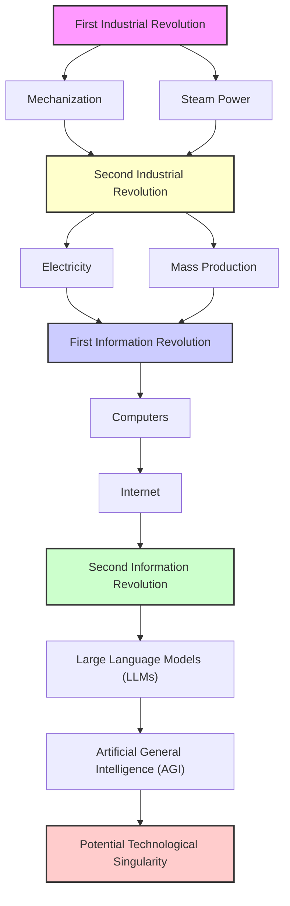
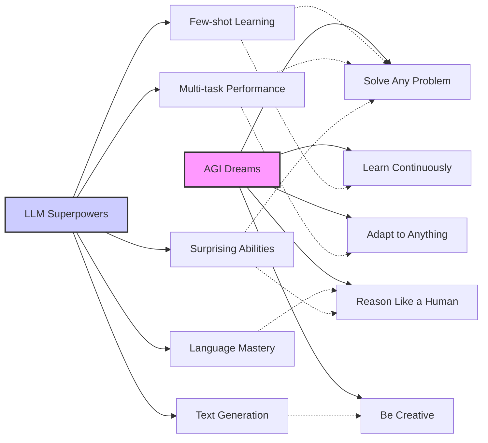
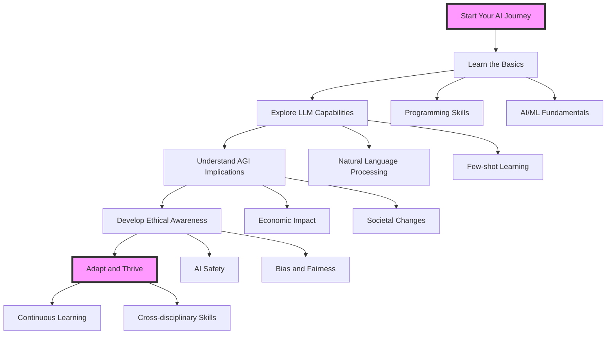

# Navigating the AI Revolution: LLMs and AGI in the Second Information Age

```mermaid
gantt
    title LLM Course Timeline
    dateFormat X
    axisFormat %d
    section Course Content
    Course Overview                                    :active,a1, 0, 1d
    NLP Fundamentals                                   :a2, after a1, 1d
    Basic knowledge and architectural characteristics of LLM :a3, after a2, 1d
    LLM Development Fundamentals                       :a4, after a3, 1d
    Introduction and Setup of the Experimental Environment :a5, after a4, 1d
    The concept of the tokenizer and common types      :a6, after a5, 1d
    Text data preprocessing and preparation            :a7, after a6, 1d
    LLM training - Fine-tuning                         :a8, after a7, 1d
    LLM training - Reward Modeling and Proximal Policy Optimization :a9, after a8, 1d
    Famous SOTA LLM models and JAIS model              :a10, after a9, 1d
    section Lessons
    lesson 1  :active,l1, 0, 1d
    lesson 2  :l2, after l1, 1d
    lesson 3  :l3, after l2, 1d
    lesson 4  :l4, after l3, 1d
    lesson 5  :l5, after l4, 1d
    lesson 6  :l6, after l5, 1d
    lesson 7  :l7, after l6, 1d
    lesson 8  :l8, after l7, 1d
    lesson 9  :l9, after l8, 1d
    lesson 10 :l10, after l9, 1d
```



Welcome to the cutting edge of AI innovation! In this course, we're diving deep into the world of Large Language Models (LLMs) and Artificial General Intelligence (AGI). These technologies are at the forefront of what we're calling the "Second Information Revolution" - a era that's set to reshape our world in ways we're only beginning to imagine.

## Your Roadmap to AI Mastery

Ready to become a pioneer in the AI revolution? Here's what you can expect from this comprehensive journey:

1. A Progressive Learning Adventure:
   - We'll start with the foundations of LLMs (Large Language Models) - think of these as the Swiss Army knives of the AI world.
   - Then, we'll explore RAG (Retrieval-Augmented Generation) techniques - a fancy way of saying "making AI even smarter".
   - You'll get hands-on experience with key LLM development technologies.
   - Throughout the course, we'll focus on real-world applications - because theory is great, but practical skills are gold!

2. Balancing Theory and Practice:
   - 12 hours of mind-expanding theoretical concepts
   - 14 hours of roll-up-your-sleeves practical sessions
   - We'll cover the evolution of NLP (Natural Language Processing) algorithms and models - the building blocks of modern AI.
   - You'll dive into extensive LLM project engineering - because the best way to learn is by doing!

3. Project-Based Learning:
   - The star of the show? Building your very own chatbot!
   - You'll learn about project design, database management, and how to make all the pieces work together.
   - We'll use cutting-edge tools like OpenAI API, Hugging Face model library, and Milvus vector database.

4. Skills That'll Make You Stand Out:
   - Master the critical skills needed for LLM development
   - Focus on practical applications that you can add to your portfolio
   - Build a solid foundation for real-world AI projects
   - Boost your overall project development skills - useful far beyond just AI!

By the end of this course, you'll have both the theoretical knowledge and hands-on skills to navigate the rapidly evolving field of AI. You'll understand the potential of LLMs in the development of AGI, and be prepared to contribute to this exciting field.

So, are you ready to be part of the AI revolution? Let's dive in!

# Your AI Adventure Checklist: What You'll Learn

By the time we wrap up this exciting journey, you'll be able to:

1. Grasp the historical significance of the AGI (Artificial General Intelligence) revolution and how it stacks up against previous industrial and information revolutions.

2. Break down how AGI and LLMs (Large Language Models) might reshape global economies and societies. Trust us, it's mind-blowing stuff!

3. Evaluate how LLMs are paving the way for AGI and their potential to turn our world upside down (in a good way, mostly).

4. Identify the key skills you'll need to thrive in the AGI era, whether you're an AI user, product manager, or aspiring AI engineer.

5. Get to grips with the basic principles and superpowers of Large Language Models and how you can put them to work.

6. Put on your philosopher's hat and critically assess the ethical implications and societal changes that AGI development might bring about. Heavy stuff, but someone's got to think about it!

# Your AI Adventure Map: What We'll Cover

Buckle up! We're about to explore five key ideas that'll help you understand the game-changing potential of AGI and LLMs:

1. The Second Information Revolution: How AGI and LLMs are Flipping the Script
   Ever wondered what it'd be like to live through a revolution? Well, you are! We'll explore how these AI technologies are changing the game.

2. The World, Remixed: AGI's Impact on Global Economics and Society
   Get ready for some crystal ball gazing as we imagine how AGI might reshape our world.

3. LLMs: The Building Blocks of AGI
   Think of LLMs as the LEGO bricks of AGI. We'll look at what they can do, where they fall short, and where they might take us.

4. Thriving in an AGI-Driven World: Your Success Playbook
   Don't just survive the AI revolution - learn how to thrive in it!

5. The Big Questions: Navigating the Ethical Maze of AGI Development
   With great power comes great responsibility. We'll tackle the thorny ethical issues head-on.

- # Diving Deep: The Nitty-Gritty of AI's Next Big Leap

## The Second Information Revolution: AGI and LLMs as Game Changers

### What's the Big Deal?

  Imagine waking up one day to find that machines can think, learn, and create just like us - or even better. Welcome to the world of Artificial General Intelligence (AGI) and Large Language Models (LLMs)! This isn't just another tech trend; we're talking about a revolution as big as the Industrial Revolution of the 18th century.

  So, what's the fuss about?

  1. LLMs: The Swiss Army Knives of AI
     These are the powerhouses behind AGI development. Think of them as super-smart language processors that can do everything from writing essays to coding software.

  2. AGI: The Holy Grail of AI
     This is AI that can match (or exceed) human intelligence across a wide range of tasks. Scary? Maybe. Exciting? Definitely!

  3. AI Everywhere
     We're not just talking about fancy robots. AI is seeping into every aspect of our lives, from our smartphones to our healthcare systems.

  4. From Narrow to General
     We're moving from AI that's good at one specific task to AI that can handle pretty much anything we throw at it.

  What does this revolution look like?

- LLMs are processing and understanding human knowledge in ways we've never seen before.

- AGI has the potential to solve complex problems that even the brightest human minds struggle with.

- The line between human and machine intelligence is getting blurrier by the day.

### The GPT-3 Mic Drop: When AI Surprised Even the Experts

  Let's talk about a real-world example that shows just how mind-blowing these technologies can be. Enter GPT-3, or "Generative Pre-trained Transformer 3" (don't worry about the tech jargon - we'll just call it GPT-3).

  When OpenAI released GPT-3 in 2020, it was like dropping a bomb on the tech world. Even AI researchers were blown away. Here's why it was such a big deal:

  1. Jack of All Trades: GPT-3 could handle all sorts of tasks without being specifically trained for each one. Writing articles? Check. Coding websites? No problem. Answering questions? Easy peasy.

  2. Human-like Text: It could generate text that was so human-like, it was sometimes hard to tell if a person or AI wrote it. Creepy or cool? You decide!

  3. Few-shot Learning: GPT-3 could learn to do new tasks with just a few examples, kind of like how humans can quickly pick up new skills.

  4. Creative Spark: It showed an unexpected knack for creative tasks, like writing poetry or coming up with marketing slogans. Who said AI can't be artsy?

  5. Coding Assistant: Developers found that GPT-3 could help write code, sometimes even generating entire functions from a simple description. Coders, meet your new best friend!

  The release of GPT-3 wasn't just another product launch. It was a wake-up call, showing us a glimpse of what AGI might look like and how it could change everything from how we work to how we create and process information.

### From Steam Engines to Thinking Machines: A Visual Journey



Let's take a journey through time with this nifty diagram. It's like a family tree of technological revolutions!

- We kick off with the First Industrial Revolution - think steam engines and the birth of factories.
- Then comes the Second Industrial Revolution, bringing electricity and assembly lines.
- The First Information Revolution introduces computers and the internet - hello, digital age!
- Now, we're entering the Second Information Revolution, powered by LLMs and the promise of AGI.
- The final stop? The Technological Singularity - a hypothetical future point where AI becomes so advanced it leads to unimaginable changes in human civilization. Buckle up!

### Food for Thought: The Big Questions

As we stand on the brink of this new era, there's a lot to wrap our heads around. Here are some brain-teasers to get you thinking:

1. Work 2.0: How might AGI change the way we work and create things? Will we all be out of jobs, or will we find new ways to team up with AI?

2. Human-AI Collaboration: What new ways of humans and machines working together might we see? Imagine brainstorming with an AI that has the knowledge of the entire internet!

3. Sharing the Wealth: How can we make sure the benefits of this revolution are shared fairly? We don't want a world of AI haves and have-nots!

4. Safety First: What safeguards might we need to prevent misuse of these powerful technologies? Remember, with great power comes great responsibility!

As we dive deeper into LLMs and their role in the journey towards AGI, keep these questions in mind. We're not just learning about cool tech - we're thinking about how it could reshape our world. Ready to be part of this revolution? Let's keep exploring!

## The World, Remixed: How AGI Might Shake Up Global Economics and Society

### AGI: The Great Reshape

  Imagine a world where AI can do pretty much anything a human can do - and maybe even more. That's the world AGI could create, and it's going to shake things up big time. Here's what we might see:

  1. Work 2.0: The job market could get a major overhaul. Some jobs might disappear, new ones will pop up, and many will transform in ways we can't even imagine yet.

  2. Wealth Distribution Remix: The way money moves around the world could shift dramatically. We might need to rethink our entire economic system!

  3. New Social Classes: We could see new social groups emerge based on who knows how to work with AI and who controls it. Imagine "AI whisperers" becoming the new elite!

  4. Inequality Alert: There's a risk that existing gaps between rich and poor could get even wider if we're not careful. It's not all doom and gloom, but it's something we need to watch out for.

  Here are some key ways AGI could flip our world upside down:

- Job Market Shakeup: The skills you need to land a job could change faster than you can say "AI revolution".
- Global Power Shift: Countries that lead in AGI development might become the new superpowers. Silicon Valley vs. China, anyone?
- Economic Growth on Steroids: AGI could supercharge technological progress and economic growth. We might solve problems we thought were impossible!
- Wealth Concentration Risk: There's a chance that wealth could become even more concentrated in the hands of a few tech giants or AI developers. Think billionaires, but trillionaires.

### The Great Job Shuffle: How AGI Might Rewrite Your Career Path

  Let's take a peek into the crystal ball and see how AGI could change different parts of the job market:

  1. Manufacturing: Picture factories where advanced robots and AI run the show. Human workers might become more like supervisors or focus on tasks that still need that human touch.

  2. Services: Imagine AI handling customer service, giving financial advice, or even helping diagnose diseases. Humans in these fields might focus more on complex cases or providing that empathy and personal connection that (hopefully) AI can't match.

  3. Knowledge Work: Think of AI assistants helping lawyers research cases, scientists analyze data, or software developers write code. Humans might focus more on creative problem-solving and strategic thinking - the stuff that requires real out-of-the-box thinking.

  This shift could mean:

- Some jobs disappearing as AI takes over routine tasks. Sorry, but if your job involves doing the same thing over and over, AI might have you in its sights.
- New jobs being created to develop, manage, and work alongside AI systems. Ever thought about being an "AI Ethicist" or "Human-AI Cooperation Specialist"?
- A need for workers to constantly update their skills to stay relevant. Lifelong learning isn't just a buzzword anymore - it's a survival strategy!
- New ways of humans and AI working together to achieve better results than either could alone. Think Iron Man and JARVIS, but in real life!

### Show Me the Money: A Glimpse into the AGI Economy

Let's visualize how AGI might shuffle the deck of global wealth:

```python

import matplotlib.pyplot as plt
import numpy as np

# Data (hypothetical)
categories = ['Lower Class', 'Middle Class', 'Upper Class', 'AI-Augmented Elite']
current_distribution = [20, 60, 19, 1]
future_distribution = [40, 30, 20, 10]

x = np.arange(len(categories))
width = 0.35

fig, ax = plt.subplots(figsize=(12,6))
rects1 = ax.bar(x - width/2, current_distribution, width, label='Current Distribution')
rects2 = ax.bar(x + width/2, future_distribution, width, label='Projected Distribution (AGI Era)')

ax.set_ylabel('Percentage of Population')
ax.set_title('Wealth Distribution: Today vs. AGI Tomorrow')
ax.set_xticks(x)
ax.set_xticklabels(categories)
ax.legend()

def autolabel(rects):
    for rect in rects:
        height = rect.get_height()
        ax.annotate(f'{height}%',
                    xy=(rect.get_x() + rect.get_width() / 2, height),
                    xytext=(0, 3),
                    textcoords="offset points",
                    ha='center', va='bottom')

autolabel(rects1)
autolabel(rects2)

fig.tight_layout()

plt.show()
```

This graph gives us a hypothetical peek into how wealth distribution might change as we dive into the AGI era. It's not a crystal ball prediction, but it helps us visualize potential changes:

- The 'Lower Class' segment grows. Yikes! This could be due to job displacement as AI takes over certain roles.
- The 'Middle Class' shrinks. This might happen if traditional middle-class jobs get automated away.
- The 'Upper Class' stays relatively stable. The rich stay rich, eh?
- A new 'AI-Augmented Elite' emerges. These are the folks who best leverage AGI technologies – the new tech aristocracy, if you will.

Remember, this is just one possible scenario. The actual outcome will depend on how we manage the transition to an AGI-driven economy. It's a reminder that we need to be proactive in shaping our AI future!

### Food for Thought: Navigating the AGI Economy

As we imagine how AGI might remix our world, here are some brain-teasers to chew on:

1. Spreading the Wealth: How can we make sure the benefits of AGI are shared across society? We don't want a world where only a few benefit from this incredible technology.

2. Cushioning the Impact: What kinds of policies might we need to help people whose jobs are displaced by AGI? Universal Basic Income, anyone?

3. Education Revolution: How might our education system need to change to prepare people for an AGI-driven world? Coding for kindergarteners?

4. New Economic Models: Could we see entirely new forms of social organization or economic systems emerge in response to these changes? Maybe something we haven't even thought of yet!

As we dive deeper into LLMs and AGI technologies in this course, keep these bigger picture questions in mind. The technical stuff is exciting, but understanding its impact on society is just as crucial. After all, you're not just learning about AI – you're preparing to shape the future!

## LLMs: The Building Blocks of AGI

### LLMs: The Swiss Army Knives of AI

Large Language Models (LLMs) are like the Swiss Army knives of the AI world - incredibly versatile and capable of tackling all sorts of tasks. They're also a big step towards creating Artificial General Intelligence (AGI), the kind of AI that can think and learn across a wide range of tasks, just like us humans.

Here's what makes LLMs so special:

1. Few-shot Learning: LLMs can learn to do new tasks with just a few examples. It's like they can pick up new skills almost instantly! Imagine learning a new language by just reading a few sentences - that's the kind of superpower we're talking about.

2. Jack of All Trades: They can handle all sorts of language tasks without needing specific training for each one. Writing, translating, summarizing - you name it, they can do it.

3. Unexpected Talents: LLMs sometimes show abilities that they weren't explicitly trained for. It's like they develop new skills on their own! Talk about AI surprises.

4. Size Matters: Generally, the bigger the LLM (in terms of parameters), the better it performs. It's like the more they know, the smarter they get.

But let's not get carried away - LLMs aren't perfect. They have some limitations:

1. Surface-level Understanding: They often rely on patterns in language rather than true comprehension. It's like they're really good at playing word association games, but might miss the deeper meaning.

2. Inconsistency: They might give different answers to the same question. It's like talking to someone with a constantly changing mood!

3. Hallucination: Sometimes they generate plausible-sounding but incorrect information. It's like they have a really vivid imagination, but not always grounded in facts.

4. Ethical Concerns: There are worries about biases in their outputs and potential misuse. With great power comes great responsibility, right?

### The GPT-3 Phenomenon: When AI Surprised Even the Experts

Let's zoom in on a real-world example that shows just how game-changing these technologies can be. Enter GPT-3, or "Generative Pre-trained Transformer 3" (don't worry about the techie name - we'll just call it GPT-3).

When OpenAI released GPT-3 in 2020, it was like throwing a surprise party for the entire tech world. Even AI researchers were blown away. Here's why it was such a big deal:

1. Chameleon of Tasks: GPT-3 could handle all sorts of tasks - writing articles, coding websites, answering questions - without being specifically trained for each one. It's like having an intern who can do everything!

2. Human-like Text: It could generate text that was so human-like, it was sometimes hard to tell if a person or AI wrote it. Turing test, anyone?

3. Quick Learner: GPT-3 could learn to do new tasks with just a few examples, kind of like how humans can quickly pick up new skills. It's like having a super-fast learning curve.

4. Creative Spark: It showed an unexpected knack for creative tasks, like writing poetry or coming up with marketing slogans. Who said AI can't be artsy?

5. Coding Buddy: Developers found that GPT-3 could help write code, sometimes even generating entire functions from a simple description. It's like having a coding genie!

The release of GPT-3 wasn't just another product launch. It was a wake-up call, showing us a glimpse of what AGI might look like and how it could change everything from how we work to how we create and process information. It's like getting a postcard from the future of AI!

### Let's Play with AI: A Hands-on GPT-3 Experience

Want to see the magic of LLMs in action? Let's dive into some code and play with GPT-3! Don't worry if you're not a coding wizard - we'll walk through this together.

```python
import openai
import os

# First, let's set up our AI playground
openai.api_key = os.getenv("OPENAI_API_KEY")

def ask_gpt3(prompt, max_tokens=100):
    response = openai.Completion.create(
        engine="text-davinci-002",
        prompt=prompt,
        max_tokens=max_tokens,
        n=1,
        stop=None,
        temperature=0.7,
    )
    return response.choices[0].text.strip()

# Example 1: Let's see how GPT-3 handles language translation
prompt = """
Translate the following English phrases to French:

English: Hello
French: Bonjour

English: Goodbye
French: Au revoir

English: How are you?
French:"""

print("GPT-3 as a Language Tutor:")
print(ask_gpt3(prompt))

# Example 2: Now, let's challenge GPT-3 with multiple tasks
prompt = """
1. Translate this to Spanish: "The quick brown fox jumps over the lazy dog."
2. Summarize this in one sentence: "Artificial General Intelligence (AGI) is the hypothetical ability of an intelligent agent to understand, learn, and apply its intelligence across a wide range of tasks. Unlike narrow AI, which is designed for specific tasks, AGI aims to possess the same type of general intelligence that humans have."
3. Write a haiku about artificial intelligence.

Answers:
1."""

print("\nGPT-3 as a Multi-tasking Marvel:")
print(ask_gpt3(prompt, max_tokens=200))

# Example 3: Let's see if GPT-3 can solve a riddle
prompt = """
Solve this riddle:
I speak without a mouth and hear without ears. I have no body, but I come alive with the wind. What am I?

Think through this step-by-step:
1. Identify the key characteristics mentioned in the riddle.
2. Consider things that match these characteristics.
3. Arrive at the most logical conclusion.

Solution:"""

print("\nGPT-3 as a Riddle Master:")
print(ask_gpt3(prompt, max_tokens=150))
```

This script showcases some of the superpowers of LLMs that make them potential stepping stones towards AGI. We've got language translation, multi-tasking, and even a bit of problem-solving. It's like having a Swiss Army knife of AI capabilities at your fingertips!

### LLMs vs. AGI: How Close Are We?

Now that we've seen what LLMs can do, let's visualize how they stack up against the dream of AGI:



This diagram shows us how the current superpowers of LLMs (on the right) line up with what we're dreaming of for AGI (on the left). Those dotted lines? They show us where LLMs are making strides towards AGI capabilities, but also remind us that there's still a gap to bridge.

It's like LLMs are the talented rookies showing flashes of greatness, while AGI is the all-star player we're hoping they'll become. We're not there yet, but every day we're getting closer!

### Food for Thought: The LLM Puzzle

As we've seen, LLMs are pretty amazing, but they're not quite at AGI level yet. Here are some brain-teasers to get you thinking about the future of AI:

1. Mind the Gap: How can we bridge the gap between LLMs' pattern recognition abilities and true understanding? It's like teaching a parrot to not just repeat words, but understand what they mean.

2. The AGI Checklist: What advancements do we need to move from the current capabilities of LLMs to full AGI? What's still missing from our AI toolkit?

3. AI Ethics 101: How can we address the ethical concerns and potential misuse of increasingly powerful language models? Remember, with great power comes great responsibility!

4. The AI Ecosystem: What role might LLMs play in the development of other AI technologies on the path to AGI? Could they be the secret sauce in other AI recipes?

As we dive deeper into LLMs and their capabilities, keep these questions in mind. You're not just learning about cool tech - you're thinking about the future of intelligence itself!

## Your Success Playbook: Thriving in an AGI-Driven World

### Welcome to the Future: It's AI Time

Imagine waking up in a world where AI is as common as smartphones are today. Exciting? Scary? A bit of both? Well, buckle up, because that's the world we're heading towards! But don't worry, we've got your back. Here's your guide to not just surviving, but thriving in the AGI era:

1. Tech Savviness: Get comfortable with AI technologies. It's like learning to drive - soon, it'll be a basic life skill.

2. Adaptable Skillset: Develop skills that complement AI rather than compete with it. Think creativity, emotional intelligence, and complex problem-solving - the stuff that makes us uniquely human.

3. Ethical Leadership: As AI becomes more powerful, we need people who can guide its development and use responsibly. Could that be you?

Key things to keep in mind:

- Never Stop Learning: The only constant in an AI world is change. Embrace lifelong learning!
- Human Touch: Focus on skills that showcase our humanity - empathy, creativity, and out-of-the-box thinking.
- AI Literacy: Understand what AI can and can't do. It's like having a superpower and knowing its limits.
- Teamwork Makes the Dream Work: Get ready to collaborate with AI. It's not about human vs. machine, but human and machine working together.

### AI at Work: New Jobs, New Skills

Let's peek into the crystal ball and see how different jobs might evolve in our AI-powered future:

1. Healthcare Heroes 2.0:
   - AI Literacy: Understand how AI can help diagnose diseases and plan treatments. It's like having a super-smart assistant!
   - Critical Thinking: Don't just trust the AI - know when to trust your gut. Sometimes, human intuition beats algorithms.
   - Empathy Master: AI can crunch numbers, but can it hold a patient's hand? That's where you come in.

2. Product Managers of Tomorrow:
   - AI Strategy Guru: Figure out how to weave AI into products to make them awesome.
   - User-Centric Design: Make sure AI-enhanced products actually help people, not just look cool.
   - Ethical Compass: Guide your team in creating AI solutions that are good for society, not just good for business.

3. The New-Age Engineer:
   - AI Architect: Build and fine-tune AI models for specific jobs. It's like being a brain trainer for robots!
   - System Integration Wizard: Make AI play nice with existing tech. It's all about teamwork, even in the digital world.
   - Ethics Engineer: Bake fairness, transparency, and privacy right into your AI systems. Be the superhero we need!

### Skill Up to Stay Up: Your AGI Era Toolkit

Let's visualize the key skills you'll need to rock the AGI world:

```markdown
import matplotlib.pyplot as plt
import numpy as np

roles = ['AI User', 'Product Manager', 'Engineer']
skills = {
    'AI User': ['AI Literacy', 'Critical Thinking', 'Ethical Awareness', 'Adaptability'],
    'Product Manager': ['AI Strategy', 'User-Centric Design', 'Ethical Leadership', 'Cross-Functional Collaboration'],
    'Engineer': ['Advanced ML/DL', 'System Integration', 'Ethical AI Development', 'Continuous Learning']
}

fig, ax = plt.subplots(figsize=(12, 6))

y_pos = np.arange(len(roles))
bar_width = 0.2
opacity = 0.8

for i, role in enumerate(roles):
    skill_scores = np.random.rand(4) * 10  # Random scores for illustration
    ax.barh(y_pos + i*bar_width, skill_scores, bar_width, alpha=opacity, label=role)

ax.set_yticks(y_pos + bar_width)
ax.set_yticklabels(roles)
ax.invert_yaxis()
ax.set_xlabel('Skill Level')
ax.set_title('Your AGI Era Survival Kit: Key Skills for Different Roles')
ax.legend()

plt.tight_layout()
plt.show()
```

This chart is like your personal roadmap to success in the AGI era. Whether you're an AI user, a product manager, or an engineer, you've got a unique set of skills to master.
Remember, it's not about being good at everything. It's about finding your superpower and cranking it up to 11!

### Future You: Ready for Anything

As we gear up for this AI-powered future, here are some big questions to ponder:

1. Your AI Gameplan: How can you best prepare for a job market that's evolving faster than a chameleon changes colors?

2. Human 2.0: What uniquely human skills do you think will become more valuable as AI capabilities expand? Think about what makes us... well, us!

3. School's Never Out: How might our education system need to change to prepare the next generation for an AGI-driven world? Coding classes for kindergarteners, anyone?

4. Learn, Unlearn, Relearn: What role does lifelong learning play in staying relevant in an AI-augmented workplace? Hint: It's huge!

As we dive deeper into LLM technologies, keep thinking about how you can use this knowledge to your advantage. Remember, in the world of AI, being adaptable is your superpower!

## The Big Questions: Navigating the Ethical Maze of AGI Development

### With Great Power Comes... Ethical Dilemmas

Imagine having a genie that can grant any wish. Sounds great, right? But what if that genie could think for itself and had access to all the world's information? Welcome to the world of AGI, where amazing possibilities come hand in hand with mind-bending ethical questions.

Here's what keeps AI ethicists up at night:

1. The Black Box Problem: How do we make sure AGI systems are explainable? It's like having a super-smart friend who can't tell you how they solved a problem - frustrating and a bit scary.

2. Fairness for All: How do we make sure our AI doesn't discriminate? We need to address biases in training data and algorithms to ensure everyone gets a fair shake.

3. Privacy in the Age of AI: With AI that can process vast amounts of personal data, how do we protect individual privacy? It's like having a nosy neighbor with a photographic memory - yikes!

4. The Job Shuffle: As AGI takes over more tasks, how do we handle potential large-scale job displacement? We don't want a future where humans are obsolete.

5. Existential Risk: Could AGI become so advanced that it poses a threat to humanity? It sounds like sci-fi, but it's a real concern for some experts.

6. AI Alignment: How do we ensure AGI systems are aligned with human values and goals? We don't want to create a super-intelligent entity with goals that conflict with our own.

### AI in the Hospital: A Real-World Ethical Dilemma

Let's zoom in on a real-world scenario to see these ethical challenges in action. Imagine we've developed an AGI system for healthcare diagnosis and treatment recommendations. Sounds great, right? But hold on, it's not all smooth sailing:

1. The Privacy Pickle: This AI needs to handle tons of sensitive patient data. How do we keep that info safe and sound? It's like being a digital doctor with the world's biggest confidentiality agreement.

2. The Fairness Test: What if the AI starts showing bias, recommending different treatments based on race, gender, or how much money you have? That's a big no-no in healthcare (and, well, everywhere).

3. Who's the Boss?: If the AI makes a wrong call and a patient gets hurt, who's responsible? The AI? The doctor who trusted it? The company that made it? It's like a high-stakes game of "not it!"

4. Human Touch vs. AI Precision: How do we balance the cold, hard logic of AI with the intuition and empathy of human doctors? Sometimes, a hug is as important as a prescription.

5. Informed Consent 2.0: How do we make sure patients understand and agree to AI involvement in their care? It's not just "the doctor will see you now," it's "the doctor and their AI buddy will see you now."

### Code for Good: Building Ethics into AI

Enough theory - let's see how we might bake ethics right into our AI systems. Check out this code snippet that simulates an ethically-minded AGI:

```python
import random

class EthicalAGI:
    def __init__(self):
        self.ethical_priorities = {
            'fairness': 0.8,
            'transparency': 0.7,
            'privacy': 0.9,
            'beneficence': 0.85
        }

    def make_decision(self, options, context):
        scored_options = []
        for option in options:
            score = self.evaluate_option(option, context)
            scored_options.append((option, score))

        best_option = max(scored_options, key=lambda x: x[1])
        return best_option[0], best_option[1]

    def evaluate_option(self, option, context):
        fairness_score = random.uniform(0, 1) * self.ethical_priorities['fairness']
        transparency_score = random.uniform(0, 1) * self.ethical_priorities['transparency']
        privacy_score = random.uniform(0, 1) * self.ethical_priorities['privacy']
        beneficence_score = random.uniform(0, 1) * self.ethical_priorities['beneficence']

        return fairness_score + transparency_score + privacy_score + beneficence_score

    def explain_decision(self, decision, score):
        print(f"Decision: {decision}")
        print(f"Ethical score: {score:.2f}")
        print("Ethical considerations:")
        for priority, weight in self.ethical_priorities.items():
            print(f"- {priority.capitalize()}: weight = {weight}")

# Let's take it for a spin!
ai_doc = EthicalAGI()

scenario = "Medical treatment recommendation"
options = [
    "Recommend experimental treatment",
    "Recommend standard treatment",
    "Recommend lifestyle changes only"
]

decision, score = ai_doc.make_decision(options, scenario)
ai_doc.explain_decision(decision, score)
```

This code is like giving our AI a moral compass. It doesn't just make decisions; it weighs them against ethical principles like fairness, transparency, privacy, and doing good (that's what 'beneficence' means, fancy word fans!).

Run this a few times and see what happens. You might notice the AI doesn't always make the same choice - just like humans, it's grappling with complex ethical trade-offs.

Remember, this is a super simplified version. Real-world ethical AI is way more complex. But it gives you a taste of how we might start building ethics right into the core of our AI systems.

### The Ethical AI Roadmap: A Visual Guide

Let's map out the ethical landscape of AGI development. It's like a treasure map, but instead of X marking the spot, we're looking for the sweet spot of responsible AI:

```mermaid

graph LR
    A(("Ethical Considerations in AGI"))

    B["Accountability"]
    C["Transparency"]
    D["Bias and Fairness"]
    E["Privacy"]
    F["Job Displacement"]
    G["Existential Risk"]
    H["Alignment Problem"]

    A --> B & C & D & E & F & G & H

    B --> I["Clear Responsibility"]
    B --> J["Auditability"]

    C --> K["Explainable AI"]
    C --> L["Open Source Development"]

    D --> M["Diverse Training Data"]
    D --> N["Algorithmic Fairness"]

    E --> O["Data Protection"]
    E --> P["Informed Consent"]

    F --> Q["Reskilling Programs"]
    F --> R["Universal Basic Income"]

    G --> S["Safety Measures"]
    G --> T["Long-term Planning"]

    H --> U["Value Learning"]
    H --> V["Human-AI Collaboration"]

    style A fill:#f9f,stroke:#333,stroke-width:4px
    style B fill:#fcf,stroke:#333,stroke-width:2px
    style C fill:#fcf,stroke:#333,stroke-width:2px
    style D fill:#fcf,stroke:#333,stroke-width:2px
    style E fill:#fcf,stroke:#333,stroke-width:2px
    style F fill:#fcf,stroke:#333,stroke-width:2px
    style G fill:#fcf,stroke:#333,stroke-width:2px
<<<<<<< HEAD
<<<<<<< HEAD
    style H fill:#fcf,stroke:#333,stroke-width:2px
=======
     style H fill:#fcf,stroke:#333,stroke-width:2px
>>>>>>> new-main
=======
    style H fill:#fcf,stroke:#333,stroke-width:2px
>>>>>>> c1fde6f (feat(md): features maimerd)

    classDef subTopic fill:#eff,stroke:#333,stroke-width:1px
    class I,J,K,L,M,N,O,P,Q,R,S,T,U,V subTopic
```

This mind map is like the Marauder's Map of the ethical AI world. It shows us all the sneaky corners where ethical issues might be hiding, waiting to jump out and yell "Gotcha!" at unsuspecting AI developers.

### Your Turn: Ethical AI Mastermind

As we wrap up our whirlwind tour of AI ethics, here are some brain-teasers to keep you up at night (just kidding... sort of):

1. Values Alignment: How can we ensure that AGI development aligns with human values and ethical principles? And whose values are we talking about, anyway?

2. Rules of the Game: What kind of governance structures or regulatory frameworks might we need to guide responsible AGI development? Should we have an "AI Police"?

3. Risk vs. Reward: How can we balance the potential benefits of AGI with the risks it poses to privacy, job security, and potentially human autonomy? Is it worth it?

4. It Takes a Village: What role should different stakeholders (government, industry, academia, public) play in shaping the ethical development of AGI? How do we make sure everyone has a say?

As we continue our journey into the world of LLMs and AGI, keep these ethical considerations in your back pocket. Remember, as future AI innovators, you're not just building cool tech - you're shaping the future of humanity. No pressure, right?

In our next sessions, we'll dive deeper into the nuts and bolts of LLM technology. But always keep in mind the bigger picture - the ethical implications of what we're creating. After all, with great AI power comes great responsibility!

# Wrapping It Up: Your AI Adventure Begins Here

## The Big Picture: What We've Covered

Wow, what a ride! We've zoomed through the landscape of Large Language Models (LLMs) and Artificial General Intelligence (AGI), exploring how these technologies are reshaping our world. Let's recap the highlights of our journey:

1. The AI Revolution is Here: We've seen how LLMs and AGI are kickstarting the Second Information Revolution. It's like we're living through the invention of the printing press, but on steroids!

2. The World, Remixed: We've imagined how AGI might shake up global economics and society. New jobs, new social classes, new ways of thinking about wealth and work - it's a brave new world out there.

3. LLMs: The Swiss Army Knives of AI: We've discovered the amazing capabilities of LLMs, from language translation to creative writing. They're not quite AGI yet, but boy, are they impressive!

4. Your AI Survival Guide: We've explored strategies for thriving in an AGI-driven world. Remember, adaptability is your superpower!

5. The Ethical Maze: We've navigated the tricky ethical terrain of AGI development. It turns out, with great AI power comes great ethical responsibility.

Key takeaways:

- The AI revolution is not just coming - it's already here, and it's going to change everything.
- LLMs are a big step towards AGI, showcasing some mind-blowing capabilities while also facing important limitations.
- The advent of AGI could dramatically reshape our world, potentially leading to new forms of inequality and social structures.
- To thrive in the AGI era, we need a mix of technical know-how, adaptability, and ethical awareness.
- Addressing ethical considerations is crucial in AGI development, touching on issues from privacy to existential risk.

## Your AI Journey: A Road Map

As we wrap up this whirlwind tour of the AI landscape, here's a visual guide to help you navigate your ongoing AI adventure:



This map is your compass for the AI-driven future. Whether you're just starting out (that's the "A" node) or you're adapting to thrive in the AGI era (that's "F"), remember that learning never stops in the world of AI!

As we move forward in this course, we'll be diving deeper into the technical aspects of LLMs. But always keep in mind the bigger picture we've explored today. You're not just learning about cool tech - you're preparing to shape the future of human-AI interaction.

So, are you ready to continue this AI adventure? Strap in, keep your mind open, and let's explore the fascinating world of LLMs and AGI together. The future is AI, and you're going to help build it!

# Your AI Challenge: Homework Time

Ready to put your newfound AI knowledge to the test? Here are some brain-teasers to keep you busy:

1. The Economic Crystal Ball:
   Flex those research muscles! Write a 1500-word essay on how AGI might shake up global economics. Think about wealth distribution and potential new social classes. Use current AI trends and expert predictions to back up your arguments. It's like being an AI fortune teller!

2. Your AI Career Roadmap:
   Time to plan your AI-proof career! Create a personal skill development plan for thriving in the AGI era. Pick your dream job (or your current one) and map out the key skills you'll need to develop over the next 5 years. Explain why each skill matters as AI gets smarter. It's like creating your own "AGI Survival Guide"!

3. Ethical AI Coding Challenge:
   Remember our `EthicalAGI` class from earlier? It's upgrade time! Add at least three new ethical considerations and beef up that decision-making algorithm. Then, show us how your super-ethical AI would handle some real-world ethical dilemmas. It's like being an AI ethicist and a coder rolled into one!

4. LLM Magic Tricks:
   Time to play with some real AI! Use an LLM API (like OpenAI's GPT-3) to create a Python script that shows off the model's few-shot learning superpowers. Try it on three different tasks: figuring out if text is happy or sad (sentiment analysis), translating languages, and generating code. Then, put on your analyst hat and discuss what this means for AGI development. It's like being an AI talent scout!

5. AGI Governance Framework:
   Channel your inner policymaker! Design a framework for keeping AGI development in check. Think about safety measures, transparency rules, fairness audits, and ways to make sure AGI plays nice with human values. Present your ideas in a format that would make sense to policymakers. It's like writing the constitution for the AI world!

6. LLM Architecture Face-Off:
   Time for some AI model comparison! Pick three different LLM architectures (like GPT, BERT, T5) and do a deep dive into their strengths and weaknesses. How might each contribute to AGI development? Include some code examples or pseudocode to show how these models juggle language. It's like being a sports commentator, but for AI models!

Remember, there are no right or wrong answers here - we're exploring uncharted territory! The goal is to think critically, be creative, and start grappling with the complex realities of our AI-driven future. Happy exploring!

# AI Wisdom: Your Reading List

Want to dive deeper into the world of AI? Here's your curated reading list, featuring some of the brightest minds in the field:

1. Bostrom, N. (2014). "Superintelligence: Paths, Dangers, Strategies." Oxford University Press.
   - Think of this as your "Worst-Case Scenarios for AI" guidebook. Bostrom explores the potential risks of superintelligent AI.

2. Russell, S. (2019). "Human Compatible: Artificial Intelligence and the Problem of Control." Viking.
   - Russell asks the big question: How do we keep AI aligned with human interests? It's like "How to Train Your AI Dragon".

3. Brown, T. B., et al. (2020). "Language Models are Few-Shot Learners." arXiv preprint arXiv:2005.14165.
   - This is the paper that introduced GPT-3 to the world. It's a bit technical, but it's like reading the birth announcement of a revolutionary AI.

4. Kaplan, J., et al. (2020). "Scaling Laws for Neural Language Models." arXiv preprint arXiv:2001.08361.
   - Ever wondered why bigger is often better in AI? This paper explains why. It's like the "Supersize Me" of AI research.

5. Amodei, D., et al. (2016). "Concrete Problems in AI Safety." arXiv preprint arXiv:1606.06565.
   - This paper breaks down the key challenges in making AI safe and reliable. Think of it as your "AI Safety 101" textbook.

6. Grace, K., et al. (2018). "When Will AI Exceed Human Performance? Evidence from AI Experts." Journal of Artificial Intelligence Research, 62, 729-754.
   - Ever wanted to know when AI will take over the world? This paper asks the experts. It's like a crystal ball, but with more math.

7. Tegmark, M. (2017). "Life 3.0: Being Human in the Age of Artificial Intelligence." Knopf.
   - Tegmark explores what life might look like in an AGI world. It's part science, part philosophy, and all fascinating.

8. LeCun, Y., Bengio, Y., & Hinton, G. (2015). "Deep learning." Nature, 521(7553), 436-444.
   - This is your "Deep Learning 101" crash course, written by some of the biggest names in the field. It's like getting guitar lessons from The Beatles.

9. Floridi, L., & Cowls, J. (2019). "A Unified Framework of Five Principles for AI in Society." Harvard Data Science Review, 1(1).
   - How do we make AI that's good for society? This paper proposes a ethical framework. It's like a moral compass for the AI age.

10. Marcus, G., & Davis, E. (2019). "Rebooting AI: Building Artificial Intelligence We Can Trust." Pantheon.
    - A critical look at current AI and what we need to do to make it truly intelligent and trustworthy. It's like a reality check for AI hype.

Happy reading! Remember, in the world of AI, knowledge is power. The more you understand, the better equipped you'll be to shape our AI-driven future.
