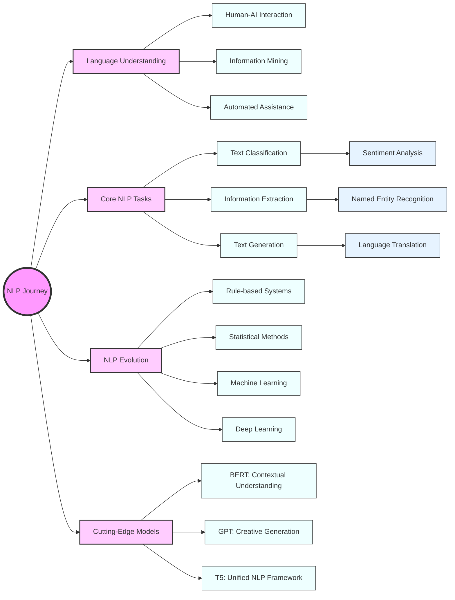

```mermaid
gantt
    title LLM Course Timeline
    dateFormat X
    axisFormat %d
    section Course Content
    Course Overview                                    :a1, 0, 1d
    NLP Fundamentals                                   :active,a2, after a1, 1d
    Basic knowledge and architectural characteristics of LLM :a3, after a2, 1d
    LLM Development Fundamentals                       :a4, after a3, 1d
    Introduction and Setup of the Experimental Environment :a5, after a4, 1d
    The concept of the tokenizer and common types      :a6, after a5, 1d
    Text data preprocessing and preparation            :a7, after a6, 1d
    LLM training - Fine-tuning                         :a8, after a7, 1d
    LLM training - Reward Modeling and Proximal Policy Optimization :a9, after a8, 1d
    Famous SOTA LLM models and JAIS model              :a10, after a9, 1d
    section Lessons
    lesson 1  :l1, 0, 1d
    lesson 2  :active,l2, after l1, 1d
    lesson 3  :l3, after l2, 1d
    lesson 4  :l4, after l3, 1d
    lesson 5  :l5, after l4, 1d
    lesson 6  :l6, after l5, 1d
    lesson 7  :l7, after l6, 1d
    lesson 8  :l8, after l7, 1d
    lesson 9  :l9, after l8, 1d
    lesson 10 :l10, after l9, 1d
```

# Course Title: Comprehensive NLP Fundamentals



# Cracking the Language Code: Your Journey from NLP Basics to Bleeding-Edge AI

Hey there, future NLP wizard! Ready to embark on an exciting adventure into the world of Natural Language Processing? Buckle up, because we're about to take a thrilling ride from the fundamental building blocks of NLP all the way to the cutting-edge AI that's reshaping our digital landscape.

In this course, we're not just going to talk about NLP – we're going to dive in headfirst and get our hands dirty with code. You'll learn how to make computers understand, interpret, and even generate human language. Sounds like magic, right? Well, by the end of this journey, you'll be the one wielding the wand!

Here's a sneak peek of what's in store for you:

- Uncover the secrets behind how chatbots like Siri and Alexa understand your commands
- Learn to build AI models that can read emotions in text (yes, even your teenager's cryptic tweets!)
- Discover how to create machines that can summarize long articles in seconds (goodbye, TL;DR!)
- Explore the neural networks that power state-of-the-art language models like GPT and BERT

Whether you're a curious beginner or a seasoned coder looking to add NLP to your toolkit, this course is designed to take you from "What's NLP?" to "Watch what I can do with NLP!" in no time.

So, are you ready to become fluent in the language of AI? Let's dive in and start decoding the magic of Natural Language Processing together!

## Your NLP Journey: What You'll Master

By the time you finish this whirlwind tour of NLP, you'll be equipped with some seriously cool skills. Here's what you're going to learn:

1. **Grasp the NLP Big Picture**: You'll understand why NLP is causing such a buzz in the tech world and how it's changing the game across industries. From chatbots to content analysis, you'll see the real-world impact of teaching machines to understand human language.

2. **Become an NLP Task Master**: We'll dive into the main types of NLP tasks, from classification to generation. You'll be able to look at a language problem and know exactly which NLP superpower to apply.

3. **Travel Through Time... NLP Style**: You'll trace the evolution of NLP from its humble rule-based beginnings to the mind-bending neural networks of today. It's like a time machine journey through the history of language AI!

4. **Meet the NLP Avengers**: Get up close and personal with state-of-the-art models that are pushing the boundaries of what's possible in language AI. You'll understand how models like BERT and GPT are revolutionizing the field.

5. **Get Your Hands Dirty with Code**: We're not just here to talk theory. You'll implement basic NLP tasks using popular libraries and frameworks. By the end, you'll have practical experience you can apply to real-world problems.

6. **Develop Your NLP Spidey Sense**: You'll learn to critically evaluate the strengths and limitations of different NLP approaches. This isn't just about knowing the tools, but understanding when and how to use them effectively.

By the end of this lesson, you won't just know about NLP – you'll be ready to start applying it. Whether you're looking to build smarter chatbots, analyze customer feedback, or even generate creative text, you'll have the foundational knowledge to get started.

So, are you ready to embark on this exciting journey into the world of Natural Language Processing? Strap in, because we're about to take off!

# Overview

Buckle up, NLP enthusiasts! We're about to embark on an exhilarating journey through four key concepts that form the bedrock of Natural Language Processing. Get ready to dive deep into:

1. **The Power and Reach of NLP**: We'll explore why NLP is causing such a buzz and how it's transforming industries left and right.

2. **NLP Tasks Demystified**: From classification to generation, we'll break down the main types of NLP tasks and see how they're applied in the real world.

3. **The NLP Time Machine**: We'll hop through time, tracing the evolution of NLP from simple rule-based systems to the mind-bending neural networks of today.

4. **Cutting-Edge NLP Models**: We'll get up close and personal with the state-of-the-art models that are pushing the boundaries of what's possible in language AI.

By the end of this whirlwind tour, you'll have a solid grasp of NLP fundamentals and be primed to dive deeper into this fascinating field. So, let's roll up our sleeves and jump right in!

# Diving Deep into NLP Tasks: From Classification to Generation

Welcome to our exciting journey through the world of Natural Language Processing (NLP)! In this lesson, we'll explore the diverse landscape of NLP tasks and get our hands dirty with some practical code examples. By the end of this session, you'll have a solid grasp of various NLP challenges and the tools to tackle them. Let's dive in!

## 4.1The NLP Task Spectrum: A Bird's-Eye View

Before we delve into specific tasks, let's take a moment to understand the big picture. NLP tasks can be broadly categorized into three main types:

1. **Classification Tasks**: These are all about putting text into predefined categories. Think of it as sorting your laundry – you're deciding which pile each item belongs to.

2. **Extraction Tasks**: Here, we're playing detective, hunting for specific pieces of information within text. It's like finding all the red jellybeans in a jar of mixed flavors.

3. **Generation Tasks**: This is where NLP gets really creative. We're teaching machines to produce human-like text. Imagine having a pen pal who's actually an AI!

Each of these task types plays a crucial role in processing and understanding natural language. Often, they work together in complex NLP systems, much like instruments in an orchestra creating a symphony of language understanding.


#### A Real-World Sentiment Analysis Example: Customer Feedback Classifier

Let's roll up our sleeves and build a simple sentiment analyzer using Python and the NLTK library. We'll create a system that can determine whether a piece of customer feedback is positive, negative, or neutral.

```python
import nltk
from nltk.sentiment import SentimentIntensityAnalyzer
import matplotlib.pyplot as plt

# Download the necessary NLTK data
nltk.download('vader_lexicon')

# Initialize the VADER sentiment analyzer
sia = SentimentIntensityAnalyzer()

# Sample customer feedback
feedback = [
    "I absolutely love this product! It's amazing.",
    "The quality is terrible. I'm very disappointed.",
    "It's okay, I guess. Nothing special.",
    "This exceeded all my expectations. Fantastic!",
    "Worst purchase ever. Don't waste your money."
]

# Analyze sentiment for each piece of feedback
sentiments = [sia.polarity_scores(text) for text in feedback]

# Categorize sentiments
categories = ['Negative' if s['compound'] <= -0.05 else 'Positive' if s['compound'] >= 0.05 else 'Neutral' for s in sentiments]

# Visualize results
plt.figure(figsize=(10, 6))
plt.bar(range(len(feedback)), [s['compound'] for s in sentiments], color=['r' if c == 'Negative' else 'g' if c == 'Positive' else 'gray' for c in categories])
plt.axhline(y=0, color='b', linestyle='-')
plt.title('Sentiment Analysis of Customer Feedback')
plt.xlabel('Feedback Index')
plt.ylabel('Sentiment Score')
plt.ylim(-1, 1)
for i, (text, category) in enumerate(zip(feedback, categories)):
    plt.text(i, -0.9, f"{category}\n{text[:20]}...", ha='center', va='center', rotation=90, fontsize=8)
plt.tight_layout()
plt.show()

# Print detailed results
for i, (text, sentiment, category) in enumerate(zip(feedback, sentiments, categories)):
    print(f"Feedback {i+1}: {text}")
    print(f"Sentiment Scores: {sentiment}")
    print(f"Category: {category}\n")
```

In this example, we're using the VADER (Valence Aware Dictionary and sEntiment Reasoner) sentiment analyzer from NLTK. VADER is particularly good at sentiment analysis for social media text, but it works well for our customer feedback too.

When you run this code, you'll see a visualization of the sentiment scores for each piece of feedback, along with a detailed breakdown of the scores and categories. This kind of analysis can be incredibly useful for businesses to quickly gauge customer satisfaction and identify areas for improvement.


#### Hands-on Topic Classification: News Article Categorizer

Let's create a simple topic classifier that can categorize news articles into different subjects. We'll use the Naive Bayes algorithm, which is surprisingly effective for text classification tasks.

```python
from sklearn.feature_extraction.text import CountVectorizer
from sklearn.naive_bayes import MultinomialNB
from sklearn.model_selection import train_test_split
from sklearn.metrics import classification_report

# Sample news articles (in a real scenario, you'd have many more)
articles = [
    "The stock market saw significant gains today as tech stocks rallied.",
    "Scientists discover a new species of deep-sea fish in the Mariana Trench.",
    "The latest smartphone from TechCo boasts an improved camera and longer battery life.",
    "A new study suggests that regular exercise can improve cognitive function in older adults.",
    "The defending champions secured their place in the finals with a stunning victory.",
    "Astronomers detect mysterious radio signals from a distant galaxy.",
    "New legislation aims to reduce carbon emissions and promote renewable energy.",
    "A revolutionary AI algorithm can now predict protein structures with high accuracy."
]

topics = ['Finance', 'Science', 'Technology', 'Health', 'Sports', 'Science', 'Politics', 'Technology']

# Split the data into training and testing sets
X_train, X_test, y_train, y_test = train_test_split(articles, topics, test_size=0.25, random_state=42)

# Create a bag-of-words representation of the articles
vectorizer = CountVectorizer()
X_train_vectorized = vectorizer.fit_transform(X_train)
X_test_vectorized = vectorizer.transform(X_test)

# Train a Naive Bayes classifier
classifier = MultinomialNB()
classifier.fit(X_train_vectorized, y_train)

# Make predictions on the test set
predictions = classifier.predict(X_test_vectorized)

# Print the classification report
print(classification_report(y_test, predictions))

# Try classifying a new article
new_article = ["A new study reveals the potential of quantum computing in drug discovery"]
new_article_vectorized = vectorizer.transform(new_article)
predicted_topic = classifier.predict(new_article_vectorized)[0]
print(f"\nPredicted topic for the new article: {predicted_topic}")
```

This example demonstrates how we can use machine learning to automatically categorize text into predefined topics. While our dataset is small for demonstration purposes, in a real-world scenario, you'd use a much larger dataset to train a more robust classifier.

The Naive Bayes algorithm we used here is based on Bayes' theorem and assumes that the features (words in our case) are independent of each other. Despite this "naive" assumption, it often performs surprisingly well for text classification tasks.

As you can see, classification tasks in NLP are powerful tools for organizing and understanding large amounts of text data. Whether it's gauging customer sentiment or categorizing news articles, these techniques can help us make sense of the vast sea of textual information we encounter every day.

In the next section, we'll explore extraction tasks, where we'll learn how to pull specific pieces of information out of text. Get ready to put on your detective hat!


## Extraction Tasks: Mining Gold from Text

Now that we've explored classification, let's dive into extraction tasks. These are like having a super-smart assistant who can quickly pull out specific information from a sea of text. It's an essential skill in the NLP toolkit, with applications ranging from summarizing documents to powering question-answering systems.

###  Named Entity Recognition (NER): Spotting the VIPs in Your Text
Named Entity Recognition is all about identifying and classifying key elements in text into predefined categories such as person names, organizations, locations, dates, and more. It's like having a spotlight that automatically highlights these important pieces of information.

#### Hands-on NER: Building a Smart News Analyzer

Let's create a simple NER system using spaCy, a powerful NLP library in Python. We'll analyze a news article and extract key entities.

```python
import spacy
from spacy import displacy

# Load the English language model
nlp = spacy.load("en_core_web_sm")

# Sample news article
text = """
Apple Inc. is planning to open a new campus in Austin, Texas, that could create up to 15,000 jobs, according to a statement released by the company on Thursday. 
The $1 billion facility, which will be located less than a mile from Apple's existing Austin operations, is expected to make Apple the largest private employer in the city.
CEO Tim Cook said the expansion was part of Apple's commitment to creating jobs in the United States.
"""

# Process the text
doc = nlp(text)

# Extract named entities
entities = [(ent.text, ent.label_) for ent in doc.ents]

print("Named Entities:")
for entity, label in entities:
    print(f"{entity} - {label}")

# Visualize the entities
displacy.render(doc, style="ent", jupyter=True)

# Let's also extract some key information
companies = [ent.text for ent in doc.ents if ent.label_ == "ORG"]
locations = [ent.text for ent in doc.ents if ent.label_ == "GPE"]
people = [ent.text for ent in doc.ents if ent.label_ == "PERSON"]
money = [ent.text for ent in doc.ents if ent.label_ == "MONEY"]

print(f"\nCompanies mentioned: {', '.join(set(companies))}")
print(f"Locations mentioned: {', '.join(set(locations))}")
print(f"People mentioned: {', '.join(set(people))}")
print(f"Monetary values mentioned: {', '.join(set(money))}")
```

This code uses spaCy to identify and categorize named entities in our news article. When you run it, you'll see a list of entities and their categories, as well as a visualization of the text with entities highlighted.

spaCy's NER model can recognize a wide range of entity types, including:

- PERSON: People's names
- ORG: Companies, agencies, institutions
- GPE: Countries, cities, states
- LOC: Non-GPE locations, mountain ranges, bodies of water
- PRODUCT: Objects, vehicles, foods, etc. (Not services)
- EVENT: Named hurricanes, battles, wars, sports events, etc.
- DATE: Absolute or relative dates or periods
- TIME: Times smaller than a day
- MONEY: Monetary values, including unit

This kind of extraction can be incredibly useful for automatically summarizing news articles, tracking mentions of specific entities across large datasets, or building more complex systems like question-answering bots.

While NER helps us identify important entities, relationship extraction takes it a step further by understanding how these entities are connected to each other. It's like drawing lines between the dots to reveal the bigger picture.

#### Practical Relationship Extraction: Unveiling Corporate Connections

Let's build a simple relationship extractor that can identify relationships between companies and people in our news article.

```python
import spacy
import networkx as nx
import matplotlib.pyplot as plt

nlp = spacy.load("en_core_web_sm")

# Expanded news article
text = """
Apple Inc., led by CEO Tim Cook, is planning to open a new campus in Austin, Texas. 
The expansion was announced by the company's spokesperson, Jane Smith. 
The project is supported by Texas Governor Greg Abbott.
Apple's main competitor, Microsoft, headed by CEO Satya Nadella, has not announced any similar plans.
"""

doc = nlp(text)

# Extract entities and their relationships
entities = []
relations = []

for ent in doc.ents:
    entities.append((ent.text, ent.label_))
    
for token in doc:
    if token.dep_ == "nsubj" and token.head.pos_ == "VERB":
        subject = token.text
        verb = token.head.text
        for child in token.head.children:
            if child.dep_ == "dobj" or child.dep_ == "pobj":
                obj = child.text
                relations.append((subject, verb, obj))

# Create a graph
G = nx.Graph()

# Add nodes and edges
for entity, label in entities:
    G.add_node(entity, label=label)

for subj, verb, obj in relations:
    G.add_edge(subj, obj, relation=verb)

# Visualize the graph
pos = nx.spring_layout(G)
plt.figure(figsize=(12, 8))
nx.draw(G, pos, with_labels=True, node_color='lightblue', node_size=3000, font_size=10, font_weight='bold')

# Add edge labels
edge_labels = nx.get_edge_attributes(G, 'relation')
nx.draw_networkx_edge_labels(G, pos, edge_labels=edge_labels)

# Add node labels
node_labels = nx.get_node_attributes(G, 'label')
for node, (x, y) in pos.items():
    plt.text(x, y+0.1, s=node_labels[node], bbox=dict(facecolor='white', edgecolor='none', alpha=0.7), horizontalalignment='center')

plt.title("Entity Relationships in News Article")
plt.axis('off')
plt.tight_layout()
plt.show()

# Print extracted relationships
print("Extracted Relationships:")
for subj, verb, obj in relations:
    print(f"{subj} {verb} {obj}")
```

This code goes beyond simple NER by attempting to extract relationships between entities. It uses spaCy's dependency parsing capabilities to identify subject-verb-object triples, which often represent relationships between entities.

When you run this code, you'll see a visualization of the entities and their relationships, as well as a list of the extracted relationships. This kind of analysis can be incredibly valuable for tasks like:

- Automatically generating knowledge graphs from text
- Identifying key players and their roles in complex situations
- Tracking relationships between entities across large corpora of text

While our simple approach here works for basic sentences, more advanced relationship extraction often involves machine learning models trained on large datasets of annotated text.

Extraction tasks like NER and relationship extraction are fundamental to many higher-level NLP applications. They allow us to transform unstructured text into structured data, opening up possibilities for more advanced analysis and insights.

In the next section, we'll explore the exciting world of text generation tasks, where we teach machines not just to understand language, but to produce it. Get ready to see some AI creativity in action!


##  Generation Tasks: Teaching Machines to Write

Welcome to the most creative part of our NLP journey! In generation tasks, we're not just analyzing existing text; we're teaching machines to produce new text. This is where NLP starts to feel a bit magical – like teaching a computer to be a writer, translator, or even a conversationalist. Machine translation is one of the most impactful applications of NLP. It's like having a universal translator from science fiction, allowing us to communicate across language barriers.

#### Hands-on Machine Translation: Building a Simple Translator

Let's create a basic machine translation system using the transformers library, which gives us access to state-of-the-art pre-trained models.

```python
from transformers import MarianMTModel, MarianTokenizer
import torch

# Load pre-trained model and tokenizer
model_name = 'Helsinki-NLP/opus-mt-en-fr'
tokenizer = MarianTokenizer.from_pretrained(model_name)
model = MarianMTModel.from_pretrained(model_name)

def translate(text, model, tokenizer):
    # Tokenize the text
    inputs = tokenizer(text, return_tensors="pt", padding=True)
    
    # Generate translation
    translation = model.generate(**inputs)
    
    # Decode the translation
    translated_text = tokenizer.batch_decode(translation, skip_special_tokens=True)[0]
    return translated_text

# Example sentences
english_sentences = [
    "Hello, how are you?",
    "Machine learning is fascinating.",
    "I love studying natural language processing."
]

print("English to French Translation:")
for sentence in english_sentences:
    translation = translate(sentence, model, tokenizer)
    print(f"EN: {sentence}")
    print(f"FR: {translation}\n")
```

This code uses a pre-trained model to translate English sentences to French. When you run it, you'll see the original English sentences along with their French translations.

The model we're using here is based on the Transformer architecture, which has revolutionized machine translation (and many other NLP tasks) in recent years. It's able to capture complex relationships between words and phrases, leading to more accurate and natural-sounding translations.

Text summarization is like having a super-efficient assistant who can read long documents and give you the key points in a fraction of the time. It's incredibly useful in our information-rich world where we often need to quickly grasp the main ideas of large amounts of text.

#### Practical Text Summarization: Creating a News Article Summarizer

Let's build a simple extractive summarizer using Python. This type of summarizer identifies the most important sentences in a text and uses them to create a summary.

```python
import nltk
from nltk.corpus import stopwords
from nltk.tokenize import sent_tokenize, word_tokenize
from nltk.probability import FreqDist
from heapq import nlargest

nltk.download('punkt')
nltk.download('stopwords')

def summarize(text, n_sentences=3):
    # Tokenize the text into sentences and words
    sentences = sent_tokenize(text)
    words = word_tokenize(text.lower())
    
    # Remove stopwords
    stop_words = set(stopwords.words('english'))
    words = [word for word in words if word not in stop_words and word.isalnum()]
    
    # Calculate word frequencies
    freq = FreqDist(words)
    
    # Score sentences based on word frequencies
    scores = {}
    for i, sentence in enumerate(sentences):
        for word in word_tokenize(sentence.lower()):
            if word in freq:
                if i not in scores:
                    scores[i] = freq[word]
                else:
                    scores[i] += freq[word]
    
    # Select the top n sentences
    best_sentences = nlargest(n_sentences, scores, key=scores.get)
    
    # Create the summary
    summary = ' '.join([sentences[i] for i in sorted(best_sentences)])
    
    return summary

# Example article
article = """
Artificial Intelligence (AI) is revolutionizing industries across the globe. From healthcare to finance, AI technologies are being deployed to improve efficiency, accuracy, and decision-making processes. In healthcare, AI is being used to analyze medical images, predict patient outcomes, and even assist in drug discovery. The financial sector is leveraging AI for fraud detection, algorithmic trading, and personalized banking experiences. Meanwhile, in the automotive industry, AI is driving the development of self-driving cars, promising to transform transportation as we know it. Despite these advancements, concerns about job displacement and ethical implications of AI persist. Experts argue that while AI will eliminate some jobs, it will also create new ones, particularly in fields related to AI development and maintenance. As for ethical concerns, there are ongoing debates about privacy, bias in AI algorithms, and the need for responsible AI development. As AI continues to evolve, it's clear that its impact on society will be profound and far-reaching, necessitating careful consideration of both its benefits and potential drawbacks.
"""

summary = summarize(article)
print("Original Article:")
print(article)
print("\nSummary:")
print(summary)
```

This code implements a simple extractive summarization algorithm. It works by:

1. Breaking the text into sentences and words
2. Removing common words (stopwords) that don't carry much meaning
3. Calculating the frequency of each word
4. Scoring sentences based on the frequency of their words
5. Selecting the top-scoring sentences to form the summary

When you run this code, you'll see the original article followed by a summary containing the three most important sentences (as determined by our algorithm).

While this method is relatively simple, it can be surprisingly effective for many types of documents. More advanced summarization techniques, particularly those based on deep learning, can generate even more concise and coherent summaries, and can even produce abstractive summaries (summaries that include phrases not found verbatim in the original text).


###  Text Generation: Unleashing AI Creativity
Now, let's venture into one of the most exciting areas of NLP: open-ended text generation. This is where we teach machines to write original text, from completing sentences to generating entire articles or stories.

#### Creative AI: Building a Poetry Generator

Let's create a simple poetry generator using a pre-trained GPT-2 model. GPT-2 (Generative Pre-trained Transformer 2) is a large language model trained by OpenAI that can generate coherent and often surprisingly creative text.

```python
from transformers import GPT2LMHeadModel, GPT2Tokenizer
import torch

# Load pre-trained model and tokenizer
model_name = "gpt2"
tokenizer = GPT2Tokenizer.from_pretrained(model_name)
model = GPT2LMHeadModel.from_pretrained(model_name)

def generate_poem(prompt, max_length=100):
    # Encode the prompt
    input_ids = tokenizer.encode(prompt, return_tensors="pt")
    
    # Generate text
    output = model.generate(
        input_ids,
        max_length=max_length,
        num_return_sequences=1,
        no_repeat_ngram_size=2,
        top_k=50,
        top_p=0.95,
        temperature=0.7
    )
    
    # Decode the generated text
    generated_text = tokenizer.decode(output[0], skip_special_tokens=True)
    
    return generated_text

# Generate some poetry
prompts = [
    "Roses are red,",
    "In the depths of the forest,",
    "The city lights flickered,"
]

print("AI-Generated Poetry:")
for prompt in prompts:
    poem = generate_poem(prompt)
    print(f"\nPrompt: {prompt}")
    print(poem)
    print("-" * 50)
```

This code uses the GPT-2 model to generate poetry based on given prompts. When you run it, you'll see several AI-generated poems, each starting with one of the provided prompts.

The parameters we're using in the `generate` function help control the creativity and coherence of the output:

- `no_repeat_ngram_size`: Prevents the model from repeating the same phrases too often
- `top_k` and `top_p`: Control the randomness of the word selection
- `temperature`: Adjusts the "creativity" of the output (higher values lead to more diverse but potentially less coherent text)

The results can be quite impressive, often capturing the style and rhythm of poetry, though they may not always make perfect sense. This demonstrates both the power and the limitations of current text generation models.

Text generation tasks like these are pushing the boundaries of what's possible with AI. They're being used to assist writers, generate product descriptions, create chatbots, and much more. However, they also raise important ethical questions about the potential misuse of such technology, such as generating fake news or impersonating real people online.

As we wrap up our exploration of NLP tasks, from classification to extraction to generation, I hope you're starting to see the incredible potential of this field. Each type of task we've covered plays a crucial role in enabling machines to understand and interact with human language in increasingly sophisticated ways.

In our next section, we'll take a step back and look at the evolution of NLP techniques that have made these tasks possible, tracing the journey from early rule-based systems to the cutting-edge deep learning models of today. Get ready for a fascinating trip through the history of NLP!


##  The Evolution of NLP: From Rule-Based Systems to Deep Learning

As we've seen, NLP can accomplish some pretty amazing feats. But how did we get here? Let's take a trip through time to understand the evolution of NLP techniques. This journey will help you appreciate the current state of the art and give you insights into where the field might be heading.

###  Rule-Based Systems: The Pioneers of NLP (1950s-1980s)
We're going to start our journey in the early days of computing. Imagine trying to teach a computer to understand language using nothing but a set of hand-crafted rules. That's exactly what the pioneers of NLP did!

#### The ELIZA Effect: When Rules Fooled Humans

One of the most famous early NLP systems was ELIZA, created by Joseph Weizenbaum at MIT in 1966. ELIZA simulated a Rogerian psychotherapist, using pattern matching and substitution techniques to formulate responses.

Let's create a simple ELIZA-like chatbot to get a feel for how rule-based systems work:

```python
import re

def eliza_response(user_input):
    # Define some patterns and responses
    patterns = {
        r'I am (.*)': ["Why do you say you are {0}?", "How long have you been {0}?"],
        r'I feel (.*)': ["Tell me more about feeling {0}.", "Why do you think you feel {0}?"],
        r'(.*) because (.*)': ["Is that the real reason?", "What other reasons might there be?"],
        r'Hello(.*)': ["Hello... I'm glad you could drop by today.", "Hi there... how are you today?"],
        r'I think (.*)': ["Do you really think so?", "But you're not sure {0}?"],
        r'(.*) friend (.*)': ["Tell me more about your friends.", "When you think of a friend, what comes to mind?"],
        r'Yes': ["You seem quite sure.", "OK, but can you elaborate a bit?"],
        r'No': ["Why not?", "You are being a bit negative."],
        r'(.*)\?': ["Why do you ask that?", "Please consider whether you can answer your own question."],
        r'quit': ["Thank you for talking with me.", "Good-bye."],
        r'(.*)': ["Please tell me more.", "Let's change focus a bit... Tell me about your family.", "Can you elaborate on that?"]
    }
    
    # Check for a match and return a response
    for pattern, responses in patterns.items():
        match = re.match(pattern, user_input.rstrip(".!"), re.I)
        if match:
            response = re.sub(r'{0}', match.group(1), responses[0])
            return response
    
    return "I'm not sure I understand. Can you rephrase that?"

print("ELIZA: Hello, I'm ELIZA. How are you feeling today?")
while True:
    user_input = input("You: ")
    if user_input.lower() == 'quit':
        print("ELIZA: Goodbye! It was nice talking to you.")
        break
    response = eliza_response(user_input)
    print("ELIZA:", response)
```

When you run this code, you can have a conversation with our simple ELIZA-like chatbot. Try it out and see how convincing (or not) you find it!

While ELIZA could sometimes create the illusion of understanding, it was really just following a set of pre-programmed rules. It didn't truly understand language or have any real knowledge about the world.

Rule-based systems like ELIZA were groundbreaking for their time, but they had significant limitations:

1. They required extensive manual effort to create and maintain rules.
2. They struggled with the ambiguity and complexity of natural language.
3. They couldn't easily adapt to new domains or languages.

Despite these limitations, rule-based systems laid the foundation for NLP and are still used in some applications today, particularly where the language domain is narrow and well-defined.

As computers became more powerful and larger text corpora became available, researchers began to explore statistical approaches to NLP. Instead of relying solely on hand-crafted rules, these methods use probability and statistics to learn patterns from data.

#### N-grams: Predicting the Next Word

One of the fundamental concepts in statistical NLP is the n-gram model. An n-gram is a contiguous sequence of n items from a given sample of text. N-gram models predict the probability of a word based on the n-1 words that come before it.

Let's implement a simple n-gram model for text generation:

```python
import random
from collections import defaultdict

def build_ngram_model(text, n):
    # Create a dictionary to store n-grams
    model = defaultdict(list)
    
    # Split the text into words
    words = text.split()
    
    # Build the model
    for i in range(len(words) - n + 1):
        gram = tuple(words[i:i+n-1])
        next_word = words[i+n-1]
        model[gram].append(next_word)
    
    return model

def generate_text(model, n, num_words=50):
    # Start with a random n-gram
    current_gram = random.choice(list(model.keys()))
    result = list(current_gram)
    
    # Generate text
    for _ in range(num_words - n + 1):
        if current_gram in model:
            next_word = random.choice(model[current_gram])
            result.append(next_word)
            current_gram = tuple(result[-n+1:])
        else:
            break
    
    return ' '.join(result)

# Sample text (you'd typically use a much larger corpus)
text = """
Natural language processing (NLP) is a subfield of linguistics, computer science, and artificial intelligence concerned with the interactions between computers and human language, in particular how to program computers to process and analyze large amounts of natural language data. The goal is a computer capable of understanding the contents of documents, including the contextual nuances of the language within them. The technology can then accurately extract information and insights contained in the documents as well as categorize and organize the documents themselves.
"""

# Build a trigram model
n = 3
model = build_ngram_model(text, n)

# Generate text
generated_text = generate_text(model, n)
print("Generated text:")
print(generated_text)
```

This code creates a simple trigram model (n=3) from our sample text and uses it to generate new text. The generated text often captures local patterns and phrases from the original text, but it may not make sense globally.

Statistical methods like n-gram models brought several advantages:

1. They could learn patterns automatically from data, reducing the need for manual rule creation.
2. They could capture some of the ambiguity and variability in language.
3. They could be easily adapted to new domains or languages by training on different corpora.

However, they also had limitations:

1. They relied heavily on the exact sequences of words seen in the training data.
2. They struggled with long-range dependencies in language.
3. They required large amounts of data to work well, especially for larger values of n.

Statistical methods dominated NLP for many years and are still used in various applications today. However, they've largely been superseded by machine learning approaches, especially deep learning, which we'll explore next.

As we moved into the 21st century, machine learning techniques started to gain prominence in NLP. These methods could automatically learn to make decisions based on features extracted from text, often outperforming both rule-based and purely statistical approaches.

#### Naive Bayes: A Simple but Effective Classifier

One of the simplest but surprisingly effective machine learning algorithms for text classification is Naive Bayes. Let's implement a Naive Bayes classifier for sentiment analysis:

```python
import numpy as np
from sklearn.feature_extraction.text import CountVectorizer
from sklearn.model_selection import train_test_split
from sklearn.naive_bayes import MultinomialNB
from sklearn.metrics import classification_report

# Sample dataset
texts = [
    "I love this movie, it's amazing!",
    "The acting was terrible, worst film ever.",
    "Great film, highly recommended!",
    "Absolute rubbish, waste of time.",
    "Thoroughly enjoyed it, superb acting.",
    "Complete disaster, awful script.",
    "Brilliant performance, captivating story.",
    "Dull and boring, fell asleep halfway through."
]
labels = [1, 0, 1, 0, 1, 0, 1, 0]  # 1 for positive, 0 for negative

# Split the data
X_train, X_test, y_train, y_test = train_test_split(texts, labels, test_size=0.2, random_state=42)

# Create a bag-of-words representation
vectorizer = CountVectorizer()
X_train_vectorized = vectorizer.fit_transform(X_train)
X_test_vectorized = vectorizer.transform(X_test)

# Train a Naive Bayes classifier
classifier = MultinomialNB()
classifier.fit(X_train_vectorized, y_train)

# Make predictions
predictions = classifier.predict(X_test_vectorized)

# Print the classification report
print(classification_report(y_test, predictions))

# Try classifying some new reviews
new_reviews = [
    "This movie was pretty good, I enjoyed it.",
    "Absolutely horrible, one of the worst I've seen.",
    "It was okay, nothing special."
]
new_reviews_vectorized = vectorizer.transform(new_reviews)
new_predictions = classifier.predict(new_reviews_vectorized)

for review, prediction in zip(new_reviews, new_predictions):
    sentiment = "Positive" if prediction == 1 else "Negative"
    print(f"Review: {review}")
    print(f"Predicted sentiment: {sentiment}\n")
```

This Naive Bayes classifier learns to categorize movie reviews as positive or negative based on the words they contain. Despite its "naive" assumption of independence between words, it often performs surprisingly well for many text classification tasks.

Machine learning approaches like Naive Bayes, Support Vector Machines (SVM), and Decision Trees brought several advantages to NLP:

1. They could automatically learn complex patterns from data.
2. They could handle high-dimensional feature spaces effectively.
3. They often generalized better to unseen data than previous approaches.

However, these methods still relied heavily on feature engineering - the process of manually designing and selecting the most relevant features from text. This would change with the advent of deep learning.

The most recent and perhaps most dramatic shift in NLP has been the rise of deep learning. Neural network models, especially those based on the Transformer architecture, have set new state-of-the-art benchmarks on virtually every NLP task.

#### Word Embeddings: Teaching Computers the Meaning of Words

One of the key innovations that paved the way for deep learning in NLP was the development of word embeddings. These are dense vector representations of words that capture semantic relationships. Let's explore word embeddings using a pre-trained model:

```python
import gensim.downloader as api
import numpy as np
from sklearn.metrics.pairwise import cosine_similarity

# Load pre-trained Word2Vec embeddings
model = api.load("word2vec-google-news-300")

def find_similar_words(word, n=5):
    try:
        similar_words = model.most_similar(word, topn=n)
        return similar_words
    except KeyError:
        return []

def word_analogy(word1, word2, word3):
    try:
        result = model.most_similar(positive=[word2, word3], negative=[word1], topn=1)
        return result[0]
    except KeyError:
        return None

# Find similar words
print("Words similar to 'computer':")
print(find_similar_words('computer'))
<<<<<<< HEAD
=======

print("\nWords similar to 'happy':")
print(find_similar_words('happy'))

# Perform word analogy
print("\nWord analogy: man is to king as woman is to...")
result = word_analogy('man', 'king', 'woman')
if result:
    print(f"{result[0]}: {result[1]}")

# Visualize word relationships
def plot_words(words):
    vectors = [model[word] for word in words if word in model]
    if len(vectors) != len(words):
        print("Some words are not in the vocabulary.")
        return
    
    vectors = np.array(vectors)
    similarities = cosine_similarity(vectors)
    
    import matplotlib.pyplot as plt
    
    fig, ax = plt.subplots(figsize=(10, 10))
    im = ax.imshow(similarities)
    
    ax.set_xticks(np.arange(len(words)))
    ax.set_yticks(np.arange(len(words)))
    ax.set_xticklabels(words)
    ax.set_yticklabels(words)
    
    plt.setp(ax.get_xticklabels(), rotation=45, ha="right", rotation_mode="anchor")
    
    for i in range(len(words)):
        for j in range(len(words)):
            text = ax.text(j, i, f"{similarities[i, j]:.2f}", ha="center", va="center", color="w")
    
    ax.set_title("Word Similarities")
    fig.tight_layout()
    plt.show()

# Visualize relationships between some words
words_to_plot = ['king', 'queen', 'man', 'woman', 'doctor', 'nurse']
plot_words(words_to_plot)
```

This code demonstrates some of the fascinating properties of word embeddings:

1. Finding similar words based on their vector representations
2. Performing word analogies (like the famous "king - man + woman = queen")
3. Visualizing the relationships between words in vector space

Word embeddings like Word2Vec, GloVe, and FastText laid the groundwork for deep learning in NLP by providing rich, learned representations of words that capture semantic meaning.

The field of NLP continues to evolve rapidly, with new models and techniques constantly pushing the boundaries of what's possible. The current state-of-the-art is dominated by large language models based on the Transformer architecture, such as BERT, GPT, and T5, which we'll explore in more depth in future lessons.

As we conclude our journey through the evolution of NLP, I hope you've gained an appreciation for how far we've come - from simple rule-based systems to sophisticated neural networks that can understand and generate human-like text. Each step in this evolution has brought us closer to the goal of truly natural language processing, and the journey is far from over.

In our next section, we'll dive deeper into some of the current state-of-the-art models and techniques, exploring how they're pushing the boundaries of what's possible in NLP. Get ready to peek into the cutting edge of language AI!

## 4.6 State-of-the-Art NLP Models: Pushing the Boundaries of Language AI

We've come a long way in our NLP journey, from simple rule-based systems to sophisticated neural networks. Now, let's explore the models that are currently defining the state-of-the-art in NLP. These models are not just incrementally better than their predecessors; they represent a quantum leap in our ability to process and generate human language.

### 4.6.1 The Transformer Revolution: Attention is All You Need

The landscape of NLP was dramatically altered in 2017 with the introduction of the Transformer architecture in the paper "Attention is All You Need" by Vaswani et al. This architecture introduced a novel approach to sequence-to-sequence tasks, replacing recurrent layers with multi-headed self-attention mechanisms.

#### Key Innovations of Transformers

1. **Self-Attention**: Allows the model to weigh the importance of different words in the input when processing each word.
2. **Parallelization**: Unlike RNNs, Transformers can process all input tokens simultaneously, greatly speeding up training.
3. **Positional Encoding**: Allows the model to understand the order of words without recurrence.

Let's implement a simple self-attention mechanism to get a feel for how Transformers work:

```python
import numpy as np
import torch
import torch.nn as nn
import torch.nn.functional as F

class SelfAttention(nn.Module):
    def __init__(self, embed_size, heads):
        super(SelfAttention, self).__init__()
        self.embed_size = embed_size
        self.heads = heads
        self.head_dim = embed_size // heads

        assert (self.head_dim * heads == embed_size), "Embed size needs to be divisible by heads"

        self.values = nn.Linear(self.head_dim, self.head_dim, bias=False)
        self.keys = nn.Linear(self.head_dim, self.head_dim, bias=False)
        self.queries = nn.Linear(self.head_dim, self.head_dim, bias=False)
        self.fc_out = nn.Linear(heads * self.head_dim, embed_size)

    def forward(self, values, keys, query, mask):
        N = query.shape[0]
        value_len, key_len, query_len = values.shape[1], keys.shape[1], query.shape[1]

        # Split the embedding into self.heads pieces
        values = values.reshape(N, value_len, self.heads, self.head_dim)
        keys = keys.reshape(N, key_len, self.heads, self.head_dim)
        query = query.reshape(N, query_len, self.heads, self.head_dim)

        values = self.values(values)
        keys = self.keys(keys)
        queries = self.queries(query)

        # Attention
        energy = torch.einsum("nqhd,nkhd->nhqk", [queries, keys])
        
        if mask is not None:
            energy = energy.masked_fill(mask == 0, float("-1e20"))

        attention = torch.softmax(energy / (self.embed_size ** (1/2)), dim=3)

        out = torch.einsum("nhql,nlhd->nqhd", [attention, values]).reshape(
            N, query_len, self.heads * self.head_dim
        )

        out = self.fc_out(out)
        return out

# Example usage
embed_size = 256
heads = 8
attention = SelfAttention(embed_size, heads)

# Create random input tensors
batch_size = 2
seq_length = 10
x = torch.randn(batch_size, seq_length, embed_size)

# Create a mask (usually used to mask padding tokens)
mask = torch.ones(batch_size, heads, seq_length, seq_length)

output = attention(x, x, x, mask)
print(f"Input shape: {x.shape}")
print(f"Output shape: {output.shape}")
```

This code implements a basic self-attention mechanism, which is at the heart of Transformer models. While this is a simplified version, it captures the essence of how Transformers process sequences of data.

### 4.6.2 BERT: Bidirectional Encoder Representations from Transformers

BERT, introduced by Google in 2018, revolutionized NLP by introducing a new pretraining objective: Masked Language Modeling (MLM). This allows BERT to create deep bidirectional representations, capturing context from both directions.

Let's use a pre-trained BERT model for a simple task: filling in masked words in a sentence.

```python
from transformers import BertTokenizer, BertForMaskedLM
import torch

# Load pre-trained model and tokenizer
tokenizer = BertTokenizer.from_pretrained('bert-base-uncased')
model = BertForMaskedLM.from_pretrained('bert-base-uncased')

def predict_masked_word(sentence):
    # Tokenize input
    input_ids = tokenizer.encode(sentence, return_tensors='pt')
    
    # Find the masked token
    mask_token_index = torch.where(input_ids == tokenizer.mask_token_id)[1]

    # Make prediction
    with torch.no_grad():
        outputs = model(input_ids)

    last_hidden_state = outputs.logits
    mask_token_logits = last_hidden_state[0, mask_token_index, :]
    
    # Get top 5 tokens
    top_5_tokens = torch.topk(mask_token_logits, 5, dim=1).indices[0].tolist()
    
    # Convert token ids to words
    for token in top_5_tokens:
        print(tokenizer.decode([token]))

# Example usage
sentence = "The capital of France is [MASK]."
print(f"Sentence: {sentence}")
print("Top 5 predictions for the masked word:")
predict_masked_word(sentence)

sentence = "I enjoy eating [MASK] for breakfast."
print(f"\nSentence: {sentence}")
print("Top 5 predictions for the masked word:")
predict_masked_word(sentence)
```

This code demonstrates BERT's ability to understand context and predict masked words. It's this capability that makes BERT so powerful for various NLP tasks.

### 4.6.3 GPT (Generative Pre-trained Transformer): The Power of Language Generation

While BERT excels at understanding language, the GPT series, developed by OpenAI, focuses on generating human-like text. GPT models are trained on a vast amount of text data and can generate coherent and contextually relevant text given a prompt.

Let's use a pre-trained GPT-2 model to generate text:

```python
from transformers import GPT2LMHeadModel, GPT2Tokenizer

# Load pre-trained model and tokenizer
model_name = "gpt2"
tokenizer = GPT2Tokenizer.from_pretrained(model_name)
model = GPT2LMHeadModel.from_pretrained(model_name)

def generate_text(prompt, max_length=100):
    # Encode the input and add the end of string token
    input_ids = tokenizer.encode(prompt, return_tensors="pt")
    
    # Generate text
    output = model.generate(
        input_ids,
        max_length=max_length,
        num_return_sequences=1,
        no_repeat_ngram_size=2,
        top_k=50,
        top_p=0.95,
        temperature=0.7
    )
    
    # Decode and return the output
    return tokenizer.decode(output[0], skip_special_tokens=True)

# Example usage
prompts = [
    "The future of artificial intelligence is",
    "In a world where robots are common,",
    "The key to solving climate change lies in"
]

for prompt in prompts:
    generated_text = generate_text(prompt)
    print(f"Prompt: {prompt}")
    print(f"Generated text: {generated_text}\n")
```

This code showcases GPT-2's ability to generate coherent and contextually relevant text based on a given prompt. The larger GPT-3 model (and its successors) can perform even more impressive feats of text generation and task completion.

### 4.6.4 T5: Text-to-Text Transfer Transformer

T5, introduced by Google in 2019, takes a unique approach by framing all NLP tasks as text-to-text problems. This allows for a unified model that can handle multiple tasks.

Let's use T5 for a couple of different tasks:

```python
from transformers import T5Tokenizer, T5ForConditionalGeneration

# Load pre-trained model and tokenizer
model_name = "t5-small"
tokenizer = T5Tokenizer.from_pretrained(model_name)
model = T5ForConditionalGeneration.from_pretrained(model_name)

def t5_generate(input_text, max_length=50):
    input_ids = tokenizer(input_text, return_tensors="pt").input_ids

    outputs = model.generate(input_ids, max_length=max_length)
    return tokenizer.decode(outputs[0], skip_special_tokens=True)

# Example 1: Translation
english_text = "translate English to German: The weather is nice today."
german_translation = t5_generate(english_text)
print(f"English: {english_text}")
print(f"German: {german_translation}\n")

# Example 2: Summarization
text_to_summarize = "summarize: The Eiffel Tower is a wrought-iron lattice tower on the Champ de Mars in Paris, France. It is named after the engineer Gustave Eiffel, whose company designed and built the tower. Constructed from 1887 to 1889 as the entrance arch to the 1889 World's Fair, it was initially criticized by some of France's leading artists and intellectuals for its design, but it has become a global cultural icon of France and one of the most recognizable structures in the world."
summary = t5_generate(text_to_summarize)
print("Original text:")
print(text_to_summarize)
print("\nSummary:")
print(summary)
```

This demonstrates T5's versatility in handling different NLP tasks within a single model.

### 4.6.5 The Future of NLP: Challenges and Opportunities

As impressive as these models are, they also present new challenges and opportunities:

1. **Ethical Considerations**: Large language models can perpetuate biases present in their training data and can be used to generate misleading information.

2. **Computational Resources**: Training and running these models requires significant computational power, raising questions about accessibility and environmental impact.

3. **Few-Shot and Zero-Shot Learning**: Models like GPT-3 have shown impressive capabilities in learning new tasks with few or no examples, opening up new possibilities for adaptable AI.

4. **Multimodal Models**: The future may lie in models that can process and generate multiple types of data, including text, images, and audio.

5. **Interpretability**: As these models become more complex, understanding how they arrive at their outputs becomes increasingly challenging and important.

As we conclude our exploration of state-of-the-art NLP models, I hope you're excited about the possibilities these technologies open up. We're living in a golden age of NLP, where machines are becoming increasingly adept at understanding and generating human language.

In our next and final section, we'll recap what we've learned and look ahead to what the future might hold for NLP. We'll also discuss some practical considerations for applying these advanced techniques in real-world scenarios. Stay tuned!

## 4.7 Recap and Future Directions: The Evolving Landscape of NLP

We've covered a lot of ground in this lesson, from the basics of NLP tasks to the cutting-edge models that are pushing the boundaries of what's possible with language AI. Let's take a moment to recap the key points and then look ahead to what the future might hold for NLP.

### 4.7.1 Key Takeaways

1. **NLP Tasks**: We explored a wide range of NLP tasks, including:
   - Classification (e.g., sentiment analysis, topic classification)
   - Extraction (e.g., named entity recognition, relationship extraction)
   - Generation (e.g., machine translation, text summarization, creative writing)

2. **Evolution of NLP Techniques**:
   - Rule-based systems: Early attempts at language processing using hand-crafted rules
   - Statistical methods: Leveraging probability and large corpora of text
   - Machine learning: Automatically learning patterns from data
   - Deep learning: Using neural networks to capture complex language patterns

3. **State-of-the-Art Models**:
   - Transformer architecture: Revolutionary approach using self-attention mechanisms
   - BERT: Bidirectional language understanding
   - GPT: Powerful language generation capabilities
   - T5: Unified approach to various NLP tasks

### 4.7.2 Practical Considerations for Applying Advanced NLP

As exciting as these advanced NLP techniques are, applying them in real-world scenarios comes with its own set of challenges. Here are some practical considerations to keep in mind:

1. **Data Quality and Quantity**: State-of-the-art models often require large amounts of high-quality data. Ensure your data is clean, diverse, and representative of your target domain.

2. **Computational Resources**: Training and running large language models can be computationally expensive. Consider using pre-trained models and fine-tuning them for your specific task to save resources.

3. **Model Selection**: Choose the right model for your task. While large models like GPT-3 are impressive, smaller, task-specific models might be more appropriate for certain applications.

4. **Ethical Considerations**: Be aware of potential biases in your models and data. Implement safeguards to prevent misuse of language generation capabilities.

5. **Interpretability**: For many applications, especially in regulated industries, it's crucial to understand how your model arrives at its decisions. Consider using more interpretable models or employing explainable AI techniques.

6. **Continuous Learning**: The field of NLP is evolving rapidly. Stay updated with the latest research and be prepared to adapt your approaches as new techniques emerge.

### 4.7.3 Future Directions in NLP

As we look to the future, several exciting trends are emerging in NLP:

1. **Multimodal Learning**: Future NLP models may not be limited to text alone. We're seeing increasing interest in models that can process and generate multiple types of data, including text, images, and audio.

2. **Few-Shot and Zero-Shot Learning**: Models that can learn new tasks with minimal examples are becoming increasingly powerful. This could lead to more adaptable and generalizable AI systems.

3. **Smaller, More Efficient Models**: While the trend has been towards larger models, there's also research into creating smaller, more efficient models that can run on edge devices.

4. **Multilingual and Cross-lingual Models**: As global communication increases, we're likely to see more powerful models that can work across multiple languages.

5. **Ethical and Responsible AI**: There will be an increased focus on developing NLP systems that are fair, transparent, and respect user privacy.

6. **Domain-Specific Applications**: We'll likely see more specialized NLP models tailored for specific industries like healthcare, finance, and legal.

### 4.7.4 Hands-on: Building a Multi-task NLP Pipeline

To tie everything together, let's create a simple multi-task NLP pipeline that combines several of the techniques we've learned. This pipeline will perform sentiment analysis, named entity recognition, and text summarization on a given piece of text.

```python
from transformers import pipeline, AutoTokenizer, AutoModelForSequenceClassification, AutoModelForTokenClassification, AutoModelForSeq2SeqLM

# Initialize the pipelines
sentiment_analyzer = pipeline("sentiment-analysis")
ner = pipeline("ner", grouped_entities=True)
summarizer = pipeline("summarization")

def analyze_text(text):
    print("Original Text:")
    print(text)
    print("\n1. Sentiment Analysis:")
    sentiment = sentiment_analyzer(text)[0]
    print(f"Sentiment: {sentiment['label']} (Score: {sentiment['score']:.4f})")
    
    print("\n2. Named Entity Recognition:")
    entities = ner(text)
    for entity in entities:
        print(f"{entity['entity_group']}: {entity['word']}")
    
    print("\n3. Text Summarization:")
    summary = summarizer(text, max_length=100, min_length=30, do_sample=False)[0]['summary_text']
    print(summary)

# Example usage
text = """
The Eiffel Tower, located in Paris, France, is one of the most famous landmarks in the world. 
Constructed in 1889, it was designed by the engineer Gustave Eiffel. Initially criticized for its design, 
it has become a global cultural icon of France and attracts millions of visitors each year. 
The tower stands 324 meters (1,063 ft) tall and offers breathtaking views of the city. 
Despite its age, the Eiffel Tower remains an engineering marvel and a symbol of architectural innovation.
"""

analyze_text(text)
```

This pipeline demonstrates how we can combine multiple NLP tasks to gain comprehensive insights from a piece of text. It uses pre-trained models for each task, showcasing the power and flexibility of modern NLP techniques.

### 4.7.5 Conclusion

As we conclude this lesson, I hope you're excited about the possibilities that NLP opens up. From understanding and generating human language to extracting insights from vast amounts of text data, NLP is transforming how we interact with information and with each other.

Remember, the field of NLP is rapidly evolving. What we've covered here is just the beginning. As you continue your journey in NLP, stay curious, keep experimenting, and don't be afraid to push the boundaries of what's possible with language AI.

Whether you're interested in building chatbots, analyzing social media trends, developing writing assistance tools, or tackling complex language understanding problems, the skills and knowledge you've gained in this lesson will serve as a strong foundation.

The future of NLP is bright, and you're now equipped to be a part of it. Happy coding, and may your NLP adventures be ever exciting and rewarding!

# 5. Summary: Your NLP Adventure Recap

Wow, what a journey we've been on! Let's take a moment to look back at the exciting terrain we've covered in our NLP adventure:

## 5.1 The Big Picture

We've seen how NLP is transforming the way we interact with technology and information. From virtual assistants that understand our voice commands to systems that can analyze thousands of customer reviews in seconds, NLP is everywhere!

## 5.2 The NLP Toolkit

We've explored a wide range of NLP tasks, each like a different superpower in our linguistic arsenal:

- **Classification**: Teaching machines to sort text into categories faster than you can say "spam folder"
- **Extraction**: Training AI to pull out key information from text like a pro detective
- **Generation**: Empowering computers to create human-like text, from poetry to news articles

## 5.3 The Evolution of NLP

We time-traveled through the history of NLP, watching it grow from simple rule-based systems to sophisticated neural networks. It's been like watching a child grow into a linguistic genius!

## 5.4 Cutting-Edge Models

We've met the current superstars of the NLP world - models like BERT, GPT, and T5. These AI marvels are pushing the boundaries of what's possible with language processing.

As we wrap up, remember: this is just the beginning of your NLP journey. The field is constantly evolving, and there's always more to learn and explore!
# Visualize word relationships

def plot_words(words):
    vectors = [model[word] for word in words if word in model]
    if len(vectors) != len(words):
        print("Some words are not in the vocabulary.")
        return
    
    vectors = np.array(vectors)
    similarities = cosine_similarity(vectors)
    
    import matplotlib.pyplot as plt
    
    fig, ax = plt.subplots(figsize=(10, 10))
    im = ax.imshow(similarities)
    
    ax.set_xticks(np.arange(len(words)))
    ax.set_yticks(np.arange(len(words)))
    ax.set_xticklabels(words)
    ax.set_yticklabels(words)
    
    plt.setp(ax.get_xticklabels(), rotation=45, ha="right", rotation_mode="anchor")
    
    for i in range(len(words)):
        for j in range(len(words)):
            text = ax.text(j, i, f"{similarities[i, j]:.2f}", ha="center", va="center", color="w")
    
    ax.set_title("Word Similarities")
    fig.tight_layout()
    plt.show()

# Visualize relationships between some words
words_to_plot = ['king', 'queen', 'man', 'woman', 'doctor', 'nurse']
plot_words(words_to_plot)
```

This code demonstrates some of the fascinating properties of word embeddings:

1. Finding similar words based on their vector representations
2. Performing word analogies (like the famous "king - man + woman = queen")
3. Visualizing the relationships between words in vector space

Word embeddings like Word2Vec, GloVe, and FastText laid the groundwork for deep learning in NLP by providing rich, learned representations of words that capture semantic meaning.

The field of NLP continues to evolve rapidly, with new models and techniques constantly pushing the boundaries of what's possible. The current state-of-the-art is dominated by large language models based on the Transformer architecture, such as BERT, GPT, and T5, which we'll explore in more depth in future lessons.

As we conclude our journey through the evolution of NLP, I hope you've gained an appreciation for how far we've come - from simple rule-based systems to sophisticated neural networks that can understand and generate human-like text. Each step in this evolution has brought us closer to the goal of truly natural language processing, and the journey is far from over.

In our next section, we'll dive deeper into some of the current state-of-the-art models and techniques, exploring how they're pushing the boundaries of what's possible in NLP. Get ready to peek into the cutting edge of language AI!

##  State-of-the-Art NLP Models: Pushing the Boundaries of Language AI

We've come a long way in our NLP journey, from simple rule-based systems to sophisticated neural networks. Now, let's explore the models that are currently defining the state-of-the-art in NLP. These models are not just incrementally better than their predecessors; they represent a quantum leap in our ability to process and generate human language.

###  The Transformer Revolution: Attention is All You Need

The landscape of NLP was dramatically altered in 2017 with the introduction of the Transformer architecture in the paper "Attention is All You Need" by Vaswani et al. This architecture introduced a novel approach to sequence-to-sequence tasks, replacing recurrent layers with multi-headed self-attention mechanisms.

#### Key Innovations of Transformers

1. **Self-Attention**: Allows the model to weigh the importance of different words in the input when processing each word.
2. **Parallelization**: Unlike RNNs, Transformers can process all input tokens simultaneously, greatly speeding up training.
3. **Positional Encoding**: Allows the model to understand the order of words without recurrence.

Let's implement a simple self-attention mechanism to get a feel for how Transformers work:

```python
import numpy as np
import torch
import torch.nn as nn
import torch.nn.functional as F

class SelfAttention(nn.Module):
    def __init__(self, embed_size, heads):
        super(SelfAttention, self).__init__()
        self.embed_size = embed_size
        self.heads = heads
        self.head_dim = embed_size // heads

        assert (self.head_dim * heads == embed_size), "Embed size needs to be divisible by heads"

        self.values = nn.Linear(self.head_dim, self.head_dim, bias=False)
        self.keys = nn.Linear(self.head_dim, self.head_dim, bias=False)
        self.queries = nn.Linear(self.head_dim, self.head_dim, bias=False)
        self.fc_out = nn.Linear(heads * self.head_dim, embed_size)

    def forward(self, values, keys, query, mask):
        N = query.shape[0]
        value_len, key_len, query_len = values.shape[1], keys.shape[1], query.shape[1]

        # Split the embedding into self.heads pieces
        values = values.reshape(N, value_len, self.heads, self.head_dim)
        keys = keys.reshape(N, key_len, self.heads, self.head_dim)
        query = query.reshape(N, query_len, self.heads, self.head_dim)

        values = self.values(values)
        keys = self.keys(keys)
        queries = self.queries(query)

        # Attention
        energy = torch.einsum("nqhd,nkhd->nhqk", [queries, keys])
        
        if mask is not None:
            energy = energy.masked_fill(mask == 0, float("-1e20"))

        attention = torch.softmax(energy / (self.embed_size ** (1/2)), dim=3)

        out = torch.einsum("nhql,nlhd->nqhd", [attention, values]).reshape(
            N, query_len, self.heads * self.head_dim
        )

        out = self.fc_out(out)
        return out

# Example usage
embed_size = 256
heads = 8
attention = SelfAttention(embed_size, heads)

# Create random input tensors
batch_size = 2
seq_length = 10
x = torch.randn(batch_size, seq_length, embed_size)

# Create a mask (usually used to mask padding tokens)
mask = torch.ones(batch_size, heads, seq_length, seq_length)

output = attention(x, x, x, mask)
print(f"Input shape: {x.shape}")
print(f"Output shape: {output.shape}")
```

This code implements a basic self-attention mechanism, which is at the heart of Transformer models. While this is a simplified version, it captures the essence of how Transformers process sequences of data.

###  BERT: Bidirectional Encoder Representations from Transformers

BERT, introduced by Google in 2018, revolutionized NLP by introducing a new pretraining objective: Masked Language Modeling (MLM). This allows BERT to create deep bidirectional representations, capturing context from both directions.

Let's use a pre-trained BERT model for a simple task: filling in masked words in a sentence.

```python
from transformers import BertTokenizer, BertForMaskedLM
import torch

# Load pre-trained model and tokenizer
tokenizer = BertTokenizer.from_pretrained('bert-base-uncased')
model = BertForMaskedLM.from_pretrained('bert-base-uncased')

def predict_masked_word(sentence):
    # Tokenize input
    input_ids = tokenizer.encode(sentence, return_tensors='pt')
    
    # Find the masked token
    mask_token_index = torch.where(input_ids == tokenizer.mask_token_id)[1]

    # Make prediction
    with torch.no_grad():
        outputs = model(input_ids)

    last_hidden_state = outputs.logits
    mask_token_logits = last_hidden_state[0, mask_token_index, :]
    
    # Get top 5 tokens
    top_5_tokens = torch.topk(mask_token_logits, 5, dim=1).indices[0].tolist()
    
    # Convert token ids to words
    for token in top_5_tokens:
        print(tokenizer.decode([token]))

# Example usage
sentence = "The capital of France is [MASK]."
print(f"Sentence: {sentence}")
print("Top 5 predictions for the masked word:")
predict_masked_word(sentence)

sentence = "I enjoy eating [MASK] for breakfast."
print(f"\nSentence: {sentence}")
print("Top 5 predictions for the masked word:")
predict_masked_word(sentence)
```

This code demonstrates BERT's ability to understand context and predict masked words. It's this capability that makes BERT so powerful for various NLP tasks.

###  GPT (Generative Pre-trained Transformer): The Power of Language Generation

While BERT excels at understanding language, the GPT series, developed by OpenAI, focuses on generating human-like text. GPT models are trained on a vast amount of text data and can generate coherent and contextually relevant text given a prompt.

Let's use a pre-trained GPT-2 model to generate text:

```python
from transformers import GPT2LMHeadModel, GPT2Tokenizer

# Load pre-trained model and tokenizer
model_name = "gpt2"
tokenizer = GPT2Tokenizer.from_pretrained(model_name)
model = GPT2LMHeadModel.from_pretrained(model_name)

def generate_text(prompt, max_length=100):
    # Encode the input and add the end of string token
    input_ids = tokenizer.encode(prompt, return_tensors="pt")
    
    # Generate text
    output = model.generate(
        input_ids,
        max_length=max_length,
        num_return_sequences=1,
        no_repeat_ngram_size=2,
        top_k=50,
        top_p=0.95,
        temperature=0.7
    )
    
    # Decode and return the output
    return tokenizer.decode(output[0], skip_special_tokens=True)

# Example usage
prompts = [
    "The future of artificial intelligence is",
    "In a world where robots are common,",
    "The key to solving climate change lies in"
]

for prompt in prompts:
    generated_text = generate_text(prompt)
    print(f"Prompt: {prompt}")
    print(f"Generated text: {generated_text}\n")
```

This code showcases GPT-2's ability to generate coherent and contextually relevant text based on a given prompt. The larger GPT-3 model (and its successors) can perform even more impressive feats of text generation and task completion.

###  T5: Text-to-Text Transfer Transformer

T5, introduced by Google in 2019, takes a unique approach by framing all NLP tasks as text-to-text problems. This allows for a unified model that can handle multiple tasks.

Let's use T5 for a couple of different tasks:

```python
from transformers import T5Tokenizer, T5ForConditionalGeneration

# Load pre-trained model and tokenizer
model_name = "t5-small"
tokenizer = T5Tokenizer.from_pretrained(model_name)
model = T5ForConditionalGeneration.from_pretrained(model_name)

def t5_generate(input_text, max_length=50):
    input_ids = tokenizer(input_text, return_tensors="pt").input_ids

    outputs = model.generate(input_ids, max_length=max_length)
    return tokenizer.decode(outputs[0], skip_special_tokens=True)

# Example 1: Translation
english_text = "translate English to German: The weather is nice today."
german_translation = t5_generate(english_text)
print(f"English: {english_text}")
print(f"German: {german_translation}\n")

# Example 2: Summarization
text_to_summarize = "summarize: The Eiffel Tower is a wrought-iron lattice tower on the Champ de Mars in Paris, France. It is named after the engineer Gustave Eiffel, whose company designed and built the tower. Constructed from 1887 to 1889 as the entrance arch to the 1889 World's Fair, it was initially criticized by some of France's leading artists and intellectuals for its design, but it has become a global cultural icon of France and one of the most recognizable structures in the world."
summary = t5_generate(text_to_summarize)
print("Original text:")
print(text_to_summarize)
print("\nSummary:")
print(summary)
```

This demonstrates T5's versatility in handling different NLP tasks within a single model.

###  The Future of NLP: Challenges and Opportunities

As impressive as these models are, they also present new challenges and opportunities:

1. **Ethical Considerations**: Large language models can perpetuate biases present in their training data and can be used to generate misleading information.

2. **Computational Resources**: Training and running these models requires significant computational power, raising questions about accessibility and environmental impact.

3. **Few-Shot and Zero-Shot Learning**: Models like GPT-3 have shown impressive capabilities in learning new tasks with few or no examples, opening up new possibilities for adaptable AI.

4. **Multimodal Models**: The future may lie in models that can process and generate multiple types of data, including text, images, and audio.

5. **Interpretability**: As these models become more complex, understanding how they arrive at their outputs becomes increasingly challenging and important.

As we conclude our exploration of state-of-the-art NLP models, I hope you're excited about the possibilities these technologies open up. We're living in a golden age of NLP, where machines are becoming increasingly adept at understanding and generating human language.

In our next and final section, we'll recap what we've learned and look ahead to what the future might hold for NLP. We'll also discuss some practical considerations for applying these advanced techniques in real-world scenarios. Stay tuned!

##  Recap and Future Directions: The Evolving Landscape of NLP

We've covered a lot of ground in this lesson, from the basics of NLP tasks to the cutting-edge models that are pushing the boundaries of what's possible with language AI. Let's take a moment to recap the key points and then look ahead to what the future might hold for NLP.

###  Key Takeaways

1. **NLP Tasks**: We explored a wide range of NLP tasks, including:
   - Classification (e.g., sentiment analysis, topic classification)
   - Extraction (e.g., named entity recognition, relationship extraction)
   - Generation (e.g., machine translation, text summarization, creative writing)

2. **Evolution of NLP Techniques**:
   - Rule-based systems: Early attempts at language processing using hand-crafted rules
   - Statistical methods: Leveraging probability and large corpora of text
   - Machine learning: Automatically learning patterns from data
   - Deep learning: Using neural networks to capture complex language patterns

3. **State-of-the-Art Models**:
   - Transformer architecture: Revolutionary approach using self-attention mechanisms
   - BERT: Bidirectional language understanding
   - GPT: Powerful language generation capabilities
   - T5: Unified approach to various NLP tasks

###  Practical Considerations for Applying Advanced NLP

As exciting as these advanced NLP techniques are, applying them in real-world scenarios comes with its own set of challenges. Here are some practical considerations to keep in mind:

1. **Data Quality and Quantity**: State-of-the-art models often require large amounts of high-quality data. Ensure your data is clean, diverse, and representative of your target domain.

2. **Computational Resources**: Training and running large language models can be computationally expensive. Consider using pre-trained models and fine-tuning them for your specific task to save resources.

3. **Model Selection**: Choose the right model for your task. While large models like GPT-3 are impressive, smaller, task-specific models might be more appropriate for certain applications.

4. **Ethical Considerations**: Be aware of potential biases in your models and data. Implement safeguards to prevent misuse of language generation capabilities.

5. **Interpretability**: For many applications, especially in regulated industries, it's crucial to understand how your model arrives at its decisions. Consider using more interpretable models or employing explainable AI techniques.

6. **Continuous Learning**: The field of NLP is evolving rapidly. Stay updated with the latest research and be prepared to adapt your approaches as new techniques emerge.

###  Future Directions in NLP

As we look to the future, several exciting trends are emerging in NLP:

1. **Multimodal Learning**: Future NLP models may not be limited to text alone. We're seeing increasing interest in models that can process and generate multiple types of data, including text, images, and audio.

2. **Few-Shot and Zero-Shot Learning**: Models that can learn new tasks with minimal examples are becoming increasingly powerful. This could lead to more adaptable and generalizable AI systems.

3. **Smaller, More Efficient Models**: While the trend has been towards larger models, there's also research into creating smaller, more efficient models that can run on edge devices.

4. **Multilingual and Cross-lingual Models**: As global communication increases, we're likely to see more powerful models that can work across multiple languages.

5. **Ethical and Responsible AI**: There will be an increased focus on developing NLP systems that are fair, transparent, and respect user privacy.

6. **Domain-Specific Applications**: We'll likely see more specialized NLP models tailored for specific industries like healthcare, finance, and legal.

###  Hands-on: Building a Multi-task NLP Pipeline

To tie everything together, let's create a simple multi-task NLP pipeline that combines several of the techniques we've learned. This pipeline will perform sentiment analysis, named entity recognition, and text summarization on a given piece of text.

```python
from transformers import pipeline, AutoTokenizer, AutoModelForSequenceClassification, AutoModelForTokenClassification, AutoModelForSeq2SeqLM

# Initialize the pipelines
sentiment_analyzer = pipeline("sentiment-analysis")
ner = pipeline("ner", grouped_entities=True)
summarizer = pipeline("summarization")

def analyze_text(text):
    print("Original Text:")
    print(text)
    print("\n1. Sentiment Analysis:")
    sentiment = sentiment_analyzer(text)[0]
    print(f"Sentiment: {sentiment['label']} (Score: {sentiment['score']:.4f})")
    
    print("\n2. Named Entity Recognition:")
    entities = ner(text)
    for entity in entities:
        print(f"{entity['entity_group']}: {entity['word']}")
    
    print("\n3. Text Summarization:")
    summary = summarizer(text, max_length=100, min_length=30, do_sample=False)[0]['summary_text']
    print(summary)

# Example usage
text = """
The Eiffel Tower, located in Paris, France, is one of the most famous landmarks in the world. 
Constructed in 1889, it was designed by the engineer Gustave Eiffel. Initially criticized for its design, 
it has become a global cultural icon of France and attracts millions of visitors each year. 
The tower stands 324 meters (1,063 ft) tall and offers breathtaking views of the city. 
Despite its age, the Eiffel Tower remains an engineering marvel and a symbol of architectural innovation.
"""

analyze_text(text)
```

This pipeline demonstrates how we can combine multiple NLP tasks to gain comprehensive insights from a piece of text. It uses pre-trained models for each task, showcasing the power and flexibility of modern NLP techniques.

###  Conclusion

As we conclude this lesson, I hope you're excited about the possibilities that NLP opens up. From understanding and generating human language to extracting insights from vast amounts of text data, NLP is transforming how we interact with information and with each other.

Remember, the field of NLP is rapidly evolving. What we've covered here is just the beginning. As you continue your journey in NLP, stay curious, keep experimenting, and don't be afraid to push the boundaries of what's possible with language AI.

Whether you're interested in building chatbots, analyzing social media trends, developing writing assistance tools, or tackling complex language understanding problems, the skills and knowledge you've gained in this lesson will serve as a strong foundation.

The future of NLP is bright, and you're now equipped to be a part of it. Happy coding, and may your NLP adventures be ever exciting and rewarding!

#  Summary: Your NLP Adventure Recap

Wow, what a journey we've been on! Let's take a moment to look back at the exciting terrain we've covered in our NLP adventure:

## The Big Picture

We've seen how NLP is transforming the way we interact with technology and information. From virtual assistants that understand our voice commands to systems that can analyze thousands of customer reviews in seconds, NLP is everywhere!

##  The NLP Toolkit

We've explored a wide range of NLP tasks, each like a different superpower in our linguistic arsenal:

- **Classification**: Teaching machines to sort text into categories faster than you can say "spam folder"
- **Extraction**: Training AI to pull out key information from text like a pro detective
- **Generation**: Empowering computers to create human-like text, from poetry to news articles

## The Evolution of NLP

We time-traveled through the history of NLP, watching it grow from simple rule-based systems to sophisticated neural networks. It's been like watching a child grow into a linguistic genius!

##  Cutting-Edge Models

We've met the current superstars of the NLP world - models like BERT, GPT, and T5. These AI marvels are pushing the boundaries of what's possible with language processing.

As we wrap up, remember: this is just the beginning of your NLP journey. The field is constantly evolving, and there's always more to learn and explore!

##  Mind Maps



This mind map provides a visual overview of the key concepts covered in this lesson, illustrating the relationships between different aspects of NLP fundamentals, tasks, evolution, and state-of-the-art models.

# Homework: Put Your NLP Skills to the Test

Ready to flex those NLP muscles? Here are some exciting challenges to keep you sharp:

1. **Text Classification Challenge**: Build a system that can automatically categorize news articles into topics (e.g., sports, politics, technology). Use a dataset of your choice - maybe articles from your favorite news websites?

2. **Named Entity Recognition Project**: Create a tool that can identify and extract people's names, locations, and organizations from a set of Wikipedia articles. Bonus points if you can visualize the results!

3. **Language Generation Fun**: Use a pre-trained GPT-2 model to generate short stories or poems. Try giving it different prompts and see what creative tales it spins!

4. **Chatbot Creation**: Develop a simple chatbot that can answer basic questions about a topic you're passionate about. Maybe a music bot that can discuss your favorite bands?

5. **Sentiment Analysis on Social Media**: Analyze the sentiment of tweets about a current event or trending topic. Can you spot any interesting patterns or shifts in public opinion?

6. **Translation Comparison**: Compare the performance of different machine translation services (e.g., Google Translate, DeepL) on a set of sentences. Which one do you think does the best job, and why?

Remember, the goal here isn't perfection - it's exploration and learning. Have fun with these projects and don't be afraid to get creative!

# 7. Further Reading: Fuel for Your NLP Journey

Hungry for more NLP knowledge? Here are some fantastic resources to continue your adventure:

1. "Speech and Language Processing" by Dan Jurafsky and James H. Martin - It's like the NLP bible, constantly updated with the latest developments.

2. "Natural Language Processing with Python" by Steven Bird, Ewan Klein, and Edward Loper - A great hands-on guide to NLP using the NLTK library.

3. "Attention Is All You Need" by Vaswani et al. - The groundbreaking paper that introduced the Transformer model. It's a bit technical, but worth the read!

4. The Hugging Face blog (<https://huggingface.co/blog>) - For staying up-to-date with the latest in NLP and trying out state-of-the-art models.

5. "Introduction to Natural Language Processing" course on Coursera - If you prefer video lectures, this is a great next step.

6. "Practical Natural Language Processing" by Sowmya Vajjala et al. - A book that bridges the gap between NLP theory and real-world applications.

7. The papers introducing BERT, GPT, and T5 - To really understand these game-changing models, go straight to the source!

Remember, the world of NLP is vast and ever-changing. These resources are just the beginning - keep exploring, keep learning, and most importantly, keep having fun with language and AI!
