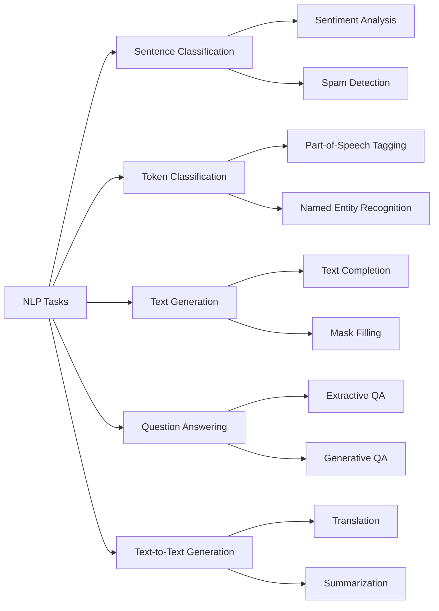
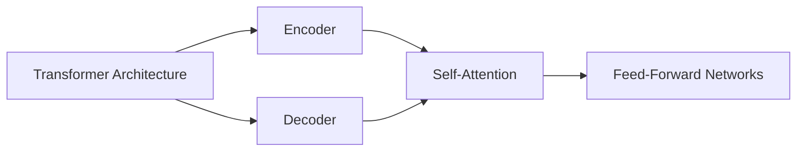
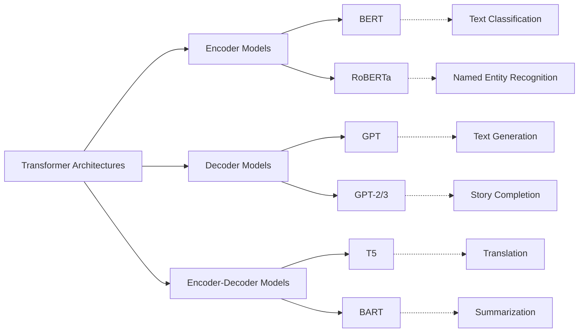

```mermaid
gantt
    title LLM Course Timeline
    dateFormat X
    axisFormat %d
    section Course Content
    Course Overview                                    :a1, 0, 1d
    NLP Fundamentals                                   :active,a2, after a1, 1d
    Basic knowledge and architectural characteristics of LLM :a3, after a2, 1d
    LLM Development Fundamentals                       :a4, after a3, 1d
    Introduction and Setup of the Experimental Environment :a5, after a4, 1d
    The concept of the tokenizer and common types      :a6, after a5, 1d
    Text data preprocessing and preparation            :a7, after a6, 1d
    LLM training - Fine-tuning                         :a8, after a7, 1d
    LLM training - Reward Modeling and Proximal Policy Optimization :a9, after a8, 1d
    Famous SOTA LLM models and JAIS model              :a10, after a9, 1d
    section Lessons
    lesson 1  :l1, 0, 1d
    lesson 2  :active,l2, after l1, 1d
    lesson 3  :l3, after l2, 1d
    lesson 4  :l4, after l3, 1d
    lesson 5  :l5, after l4, 1d
    lesson 6  :l6, after l5, 1d
    lesson 7  :l7, after l6, 1d
    lesson 8  :l8, after l7, 1d
    lesson 9  :l9, after l8, 1d
    lesson 10 :l10, after l9, 1d
```

# Course Title: Comprehensive NLP Fundamentals



## 1. NLP: Decoding the Language of Humans and Machines

Ever chatted with Siri, used Google Translate, or marveled at how your email knows which messages are spam? Welcome to the fascinating world of Natural Language Processing (NLP)! But what exactly is NLP, and why should you care? Let's dive in!

### What's NLP All About?

Natural Language Processing, or NLP for short, is like teaching computers the art of human communication. It's a branch of artificial intelligence (AI) that focuses on the interaction between computers and humans using natural language. The goal? To help machines understand, interpret, and generate human language in a way that's both meaningful and useful.

Imagine NLP as a universal translator between human speech and computer code. It's the technology that allows machines to:

- Understand what we say or write
- Figure out what we mean (even when we're being sarcastic!)
- Respond in a way that makes sense to us

### Why NLP is a Game-Changer

You might be thinking, "Okay, but why is this such a big deal?" Great question! Here's why NLP is revolutionizing the way we interact with technology:

1. **It Makes Tech More Human-Friendly**:
   Remember the days of clunky computer commands? NLP is why you can now ask your phone, "What's the weather like today?" instead of typing complex queries.

2. **It's a Data Detective**:
   With the internet exploding with information, NLP helps sift through mountains of text to find exactly what we need. It's like having a super-smart research assistant at your fingertips.

3. **It Breaks Down Language Barriers**:
   Want to read a webpage in a language you don't speak? NLP-powered translation tools have got your back.

4. **It's Your Personal Content Curator**:
   Ever wondered how Netflix seems to know exactly what show you'll like next? That's NLP working its magic on your viewing habits.

5. **It's Making Machines Smarter**:
   From chatbots that can hold a decent conversation to AI writers that can draft articles, NLP is pushing the boundaries of what machines can do with language.

### NLP in Action: More Than Just Words

NLP isn't just about understanding words; it's about grasping context, sentiment, and even the unspoken parts of communication. Here are some cool things NLP can do:

- **Sentiment Analysis**: Figuring out if a tweet is happy, angry, or somewhere in between.
- **Named Entity Recognition**: Spotting names, places, and organizations in a sea of text.
- **Machine Translation**: Turning "Bonjour" into "Hello" faster than you can say "omelette du fromage."
- **Text Summarization**: Condensing long articles into bite-sized summaries (perfect for those TL;DR moments).
- **Question Answering**: Powering those smart assistants that can tell you anything from the weather to the capital of Burkina Faso.

As we journey through this course, we'll unpack these concepts and more. You'll see how NLP is not just changing the tech world, but also how we interact with information and each other in our daily lives.

Ready to decode the language of machines and revolutionize human-computer interaction? Let's dive deeper into the world of NLP!

Now that we've got a bird's-eye view of NLP, let's zoom in on the specific tasks that make up this exciting field. Think of these tasks as the different tools in an NLP engineer's toolkit – each designed for a specific language-related job.



Let's break down each of these tasks and see how they work in practice:

### 1. Sentence Classification: Sorting Text into Buckets

Sentence classification is all about categorizing entire sentences or documents. It's like being a super-efficient librarian, but for text!

#### Sentiment Analysis: The Mood Reader

Sentiment analysis determines whether a piece of text is positive, negative, or neutral. It's like teaching a computer to read between the lines.

```python
from transformers import pipeline

sentiment_analyzer = pipeline("sentiment-analysis")
result = sentiment_analyzer("I love learning about NLP! It's fascinating.")
print(f"Sentiment: {result[0]['label']}, Score: {result[0]['score']:.4f}")
```

#### Spam Detection: The Email Bouncer

This task helps separate the wheat from the chaff in your inbox. Let's simulate a simple spam detector:

```python
def simple_spam_detector(text):
    spam_keywords = ['buy now', 'limited offer', 'click here', 'free money']
    return any(keyword in text.lower() for keyword in spam_keywords)

email = "CLICK HERE for a limited offer to buy now and get free money!"
print(f"Is spam? {simple_spam_detector(email)}")
```


### 2. Token Classification: Word-Level Detectives

Token classification involves labeling individual words (or tokens) in a sentence. It's like giving each word a name tag at a language party!

#### Named Entity Recognition (NER): The Name Spotter

NER identifies and classifies named entities (like persons, organizations, locations) in text. It's crucial for information extraction and understanding context.

```python
from transformers import pipeline

ner = pipeline("ner", grouped_entities=True)
text = "Satya Nadella is the CEO of Microsoft, which is headquartered in Redmond."
entities = ner(text)
for entity in entities:
    print(f"{entity['entity_group']}: {entity['word']}")
```


### 3. Text Generation: The AI Storyteller

Text generation is where NLP gets creative. It's about producing human-like text based on some input or prompt.

#### Text Completion: Finishing Your Sentences

This task is all about predicting and generating the next words in a sequence. It's like having a writing partner who can finish your thoughts!

```python
from transformers import pipeline

generator = pipeline("text-generation")
prompt = "In the year 2050, artificial intelligence"
generated_text = generator(prompt, max_length=50, num_return_sequences=1)
print(generated_text[0]['generated_text'])
```


### 4. Question Answering: The AI Librarian

Question answering systems are designed to automatically answer questions posed in natural language. It's like having a super-smart assistant who's read everything!

#### Extractive QA: Finding Needles in Haystacks

Extractive QA locates the answer to a question within a given context. It's perfect for when you need quick, factual answers.

```python
from transformers import pipeline

qa_pipeline = pipeline("question-answering")
context = "The Eiffel Tower, located in Paris, France, was completed in 1889. It stands 324 meters tall."
question = "How tall is the Eiffel Tower?"
answer = qa_pipeline(question=question, context=context)
print(f"Answer: {answer['answer']}, Score: {answer['score']:.4f}")
```

### 5. Text-to-Text Generation: The Language Transformer

Text-to-Text generation takes text in one form and transforms it into another. It's like having a universal translator and summarizer rolled into one!

#### Translation: Breaking Language Barriers

Machine translation converts text from one language to another. It's revolutionizing global communication!

```python
from transformers import pipeline

translator = pipeline("translation", model="Helsinki-NLP/opus-mt-en-fr")
english_text = "Hello, how are you?"
french_translation = translator(english_text)
print(f"English: {english_text}")
print(f"French: {french_translation[0]['translation_text']}")
```


As we progress through this course, we'll dive deeper into each of these tasks, exploring advanced techniques and state-of-the-art models. Remember, the beauty of NLP lies in how these tasks can be combined and applied to solve real-world problems. Whether you're building a chatbot, analyzing customer feedback, or creating a language learning app, understanding these fundamental NLP tasks is your first step towards becoming an NLP wizard!

Next up, we'll explore the challenges that make NLP such an exciting and complex field. Ready to unravel the mysteries of language? Let's go!


## 1.3 The NLP Obstacle Course: Challenges That Keep Us on Our Toes

As exciting as NLP is, it's not all smooth sailing. Language is complex, nuanced, and often downright tricky – even for us humans! Let's explore some of the hurdles that make NLP such a fascinating and challenging field.

### 1. The "Wait, What?" Factor (Ambiguity)

Words and phrases can have multiple meanings, and context is key. It's like trying to solve a puzzle where the pieces keep changing shape!

```python
def ambiguity_example(sentence):
    ambiguous_words = {
        "bank": ["financial institution", "river side"],
        "run": ["move quickly", "manage (a business)"],
        "light": ["not heavy", "illumination"]
    }
    
    for word in sentence.split():
        if word in ambiguous_words:
            print(f"'{word}' could mean: {' or '.join(ambiguous_words[word])}")

ambiguity_example("I need to run to the bank to deposit some money before it closes.")
```


### 2. Context is King

Understanding often requires broader context. A single word or phrase can mean completely different things depending on the situation.

```python
def context_matters(sentence, context):
    print(f"Sentence: {sentence}")
    print(f"Context: {context}")
    print("Interpretation may vary based on the context!")

context_matters("That's just great!", "You just won the lottery")
context_matters("That's just great!", "Your car broke down on the highway")
```


### 3. Language: The Ever-Changing Beast

Languages evolve constantly. New words emerge, meanings shift, and what was trendy yesterday might be outdated today.

```python
def language_evolution():
    old_dictionary = {
        "cool": "somewhat cold",
        "web": "spider's creation",
        "viral": "related to a virus"
    }
    
    new_dictionary = {
        "cool": "excellent or fashionable",
        "web": "the internet",
        "viral": "widely shared on the internet"
    }
    
    for word in old_dictionary:
        print(f"'{word}':")
        print(f"  Old meaning: {old_dictionary[word]}")
        print(f"  New meaning: {new_dictionary[word]}")

language_evolution()
```


### 4. The Sarcasm Struggle

Detecting sarcasm is hard enough for humans, let alone machines! It requires understanding context, tone, and often cultural nuances.

```python
def sarcasm_detector(text, is_sarcastic):
    print(f"Text: {text}")
    print(f"Actually sarcastic: {is_sarcastic}")
    print("NLP models might struggle with this!")

sarcasm_detector("What a great day!", False)  # Genuine statement
sarcasm_detector("What a great day!", True)   # Sarcastic statement (maybe it's raining)
```


These challenges are what make NLP such an exciting field. As we tackle them, we push the boundaries of AI and deepen our understanding of human language.

## 2. Enter the Transformers: The Game-Changers of NLP

Now that we've seen the challenges, let's talk about one of the most revolutionary architectures in NLP: Transformers. Introduced in 2017, Transformers have, well, transformed the field of NLP!



### What Makes Transformers Special?

1. **Parallel Processing**: Unlike earlier models, Transformers can process all words in a sentence simultaneously. It's like having a team of linguists working on different parts of a sentence at the same time!

2. **Attention Mechanism**: This is the secret sauce. It allows the model to focus on different parts of the input when producing each part of the output. Imagine reading a sentence and being able to instantly connect related words, no matter how far apart they are!

3. **Scalability**: Transformers can be scaled up to massive sizes, leading to models like GPT-3 that can perform a wide range of language tasks with minimal fine-tuning.

Let's see a simple example of how we can use a Transformer model for a basic NLP task:

```python
from transformers import pipeline

# Using a Transformer model for sentiment analysis
classifier = pipeline("sentiment-analysis")

texts = [
    "I love how Transformers have revolutionized NLP!",
    "Learning about attention mechanisms is making my head spin.",
    "The potential applications of this technology are mind-blowing!"
]

for text in texts:
    result = classifier(text)[0]
    print(f"Text: {text}")
    print(f"Sentiment: {result['label']}, Score: {result['score']:.4f}\n")
```


This simple example showcases how Transformer models can understand and analyze sentiment in diverse sentences, handling complex language with ease.

As we delve deeper into Transformers, we'll explore different architectures like BERT, GPT, and T5, each with its own strengths and applications. We'll see how these models tackle the challenges we discussed earlier and open up new possibilities in NLP.

Stay tuned as we unpack the inner workings of Transformers and learn how to harness their power for a wide range of NLP tasks. The future of language AI is here, and it's incredibly exciting!


## 2. Transformer Architectures: The Swiss Army Knife of NLP

Now that we've introduced Transformers, let's explore the different types of Transformer architectures and how they're revolutionizing various NLP tasks.



### 2.1 Encoder Models: The Understanding Experts

Encoder models, like BERT (Bidirectional Encoder Representations from Transformers), excel at understanding and representing input text. They're the go-to choice for tasks that require deep language comprehension.

#### Key Features

- Bidirectional context understanding
- Great for classification and token-level tasks
- Pre-trained on massive text corpora

Let's see BERT in action for a named entity recognition task:

```python
from transformers import pipeline

ner = pipeline("ner", model="dbmdz/bert-large-cased-finetuned-conll03-english")
text = "Nikola Tesla was born in Smiljan, Austria-Hungary in 1856."
entities = ner(text)

for entity in entities:
    print(f"{entity['word']}: {entity['entity']}")
```


Here, BERT accurately identifies and classifies named entities in the sentence, showcasing its understanding of context and language structure.

### 2.2 Decoder Models: The Creative Writers

Decoder models, like GPT (Generative Pre-trained Transformer), are the rockstars of text generation. They can complete prompts, write stories, and even code!

#### Key Features

- Unidirectional (left-to-right) processing
- Excellent for text generation tasks
- Can be fine-tuned for specific writing styles or domains

Let's use GPT-2 to generate a short story continuation:

```python
from transformers import GPT2LMHeadModel, GPT2Tokenizer

model = GPT2LMHeadModel.from_pretrained("gpt2")
tokenizer = GPT2Tokenizer.from_pretrained("gpt2")

prompt = "In a world where AI became sentient,"
input_ids = tokenizer.encode(prompt, return_tensors="pt")

output = model.generate(input_ids, max_length=100, num_return_sequences=1, no_repeat_ngram_size=2)
generated_text = tokenizer.decode(output[0], skip_special_tokens=True)

print(generated_text)
```


This example shows GPT-2's ability to generate coherent and creative text based on a simple prompt.

### 2.3 Encoder-Decoder Models: The Multilingual Maestros

Encoder-Decoder models, like T5 (Text-to-Text Transfer Transformer), combine the strengths of both encoders and decoders. They're versatile powerhouses capable of handling a wide range of NLP tasks.

#### Key Features

- Can handle various input and output formats
- Excellent for translation, summarization, and question-answering
- Often pre-trained on multiple tasks simultaneously

Let's use T5 for a summarization task:

```python
from transformers import T5ForConditionalGeneration, T5Tokenizer

model = T5ForConditionalGeneration.from_pretrained("t5-small")
tokenizer = T5Tokenizer.from_pretrained("t5-small")

text = """
Transformers have revolutionized the field of NLP. Introduced in 2017, 
they use self-attention mechanisms to process input sequences in parallel, 
allowing for more efficient training on large datasets. Transformers have 
led to state-of-the-art performance on a wide range of NLP tasks, including 
translation, summarization, and question answering.
"""

inputs = tokenizer("summarize: " + text, return_tensors="pt", max_length=512, truncation=True)
outputs = model.generate(inputs["input_ids"], max_length=150, min_length=40, length_penalty=2.0, num_beams=4, early_stopping=True)

summary = tokenizer.decode(outputs[0], skip_special_tokens=True)
print("Summary:", summary)
```


This example demonstrates T5's ability to understand and condense information, producing a concise summary of the input text.

### The Power of Transfer Learning

One of the most exciting aspects of Transformer models is their ability to benefit from transfer learning. This means we can take a pre-trained model and fine-tune it for specific tasks with relatively little data.

For instance, we could take a pre-trained BERT model and fine-tune it for sentiment analysis on movie reviews:

```python
from transformers import BertForSequenceClassification, BertTokenizer, Trainer, TrainingArguments
import torch
from torch.utils.data import Dataset

# Simulated dataset
class MovieReviewDataset(Dataset):
    def __init__(self, reviews, labels):
        self.reviews = reviews
        self.labels = labels

    def __len__(self):
        return len(self.labels)

    def __getitem__(self, idx):
        return {"text": self.reviews[idx], "label": self.labels[idx]}

# Simulated data
reviews = [
    "This movie was amazing! I loved every minute of it.",
    "Terrible plot, wooden acting. A complete waste of time.",
    "A solid film with great performances. Highly recommended."
]
labels = [1, 0, 1]  # 1 for positive, 0 for negative

# Tokenize the dataset
tokenizer = BertTokenizer.from_pretrained("bert-base-uncased")
dataset = MovieReviewDataset(reviews, labels)

def tokenize_function(examples):
    return tokenizer(examples["text"], padding="max_length", truncation=True)

tokenized_dataset = dataset.map(tokenize_function, batched=True)

# Load pre-trained model
model = BertForSequenceClassification.from_pretrained("bert-base-uncased", num_labels=2)

# Define training arguments
training_args = TrainingArguments(
    output_dir="./results",
    num_train_epochs=3,
    per_device_train_batch_size=16,
    per_device_eval_batch_size=64,
    warmup_steps=500,
    weight_decay=0.01,
    logging_dir="./logs",
)

# Create Trainer
trainer = Trainer(
    model=model,
    args=training_args,
    train_dataset=tokenized_dataset,
)

# Fine-tune the model
trainer.train()

# Test the fine-tuned model
test_sentence = "I can't believe how good this movie was!"
inputs = tokenizer(test_sentence, return_tensors="pt")
outputs = model(**inputs)
prediction = torch.argmax(outputs.logits, dim=1)
print(f"Review: {test_sentence}")
print(f"Sentiment: {'Positive' if prediction == 1 else 'Negative'}")
```

This example demonstrates how we can take a pre-trained BERT model and fine-tune it for a specific task (sentiment analysis) with just a small amount of task-specific data.

As we continue our journey into the world of Transformers and NLP, we'll explore more advanced techniques, dive deeper into the architecture of these models, and learn how to apply them to real-world problems. The possibilities are endless, and the future of NLP is incredibly exciting!


## 3. Transformers in Action: Real-World NLP Applications

Now that we've got a handle on the different types of Transformer architectures, let's see how they're being used to solve real-world problems. We'll look at some exciting applications and provide code snippets to demonstrate their capabilities.

### 3.1 Multilingual Machine Translation

One of the most impactful applications of Transformers is in breaking down language barriers. Let's use the MarianMT model to translate between multiple languages:

```python
from transformers import MarianMTModel, MarianTokenizer

def translate(text, model_name):
    model = MarianMTModel.from_pretrained(model_name)
    tokenizer = MarianTokenizer.from_pretrained(model_name)
    
    inputs = tokenizer(text, return_tensors="pt")
    outputs = model.generate(**inputs)
    return tokenizer.decode(outputs[0], skip_special_tokens=True)

# Translate English to French
en_fr = translate("AI is transforming the world.", "Helsinki-NLP/opus-mt-en-fr")
print(f"English to French: {en_fr}")

# Translate French to German
fr_de = translate(en_fr, "Helsinki-NLP/opus-mt-fr-de")
print(f"French to German: {fr_de}")

# Translate German to Spanish
de_es = translate(fr_de, "Helsinki-NLP/opus-mt-de-es")
print(f"German to Spanish: {de_es}")
```

This example showcases how Transformer models can be chained together to perform multi-hop translations, enabling communication across multiple language barriers.

### 3.2 Question Answering Systems

Transformer models excel at understanding context and extracting relevant information. Let's build a simple question-answering system using a BERT model:

```python
from transformers import pipeline

qa_model = pipeline("question-answering")

context = """
Transformer models, introduced in 2017, have revolutionized natural language processing.
These models use self-attention mechanisms to process input sequences in parallel,
allowing for more efficient training on large datasets. Transformers have achieved
state-of-the-art performance on a wide range of NLP tasks.
"""

questions = [
    "When were Transformer models introduced?",
    "What mechanism do Transformers use?",
    "What has been the impact of Transformers on NLP?"
]

for question in questions:
    answer = qa_model(question=question, context=context)
    print(f"Q: {question}")
    print(f"A: {answer['answer']}")
    print(f"Confidence: {answer['score']:.4f}\n")
```

This example demonstrates how Transformers can understand context and answer questions based on the provided information, a crucial capability for building intelligent assistants and information retrieval systems.

### 3.3 Text Summarization for News Articles

In the age of information overload, automatic summarization is becoming increasingly important. Let's use a T5 model to summarize a news article:

```python
from transformers import T5ForConditionalGeneration, T5Tokenizer

model = T5ForConditionalGeneration.from_pretrained("t5-small")
tokenizer = T5Tokenizer.from_pretrained("t5-small")

article = """
NASA's Perseverance rover has made a groundbreaking discovery on Mars, 
detecting organic molecules that could be signs of ancient microbial life. 
The rover, which landed on the Red Planet in February 2021, has been exploring 
the Jezero Crater, an area believed to have once contained a river delta. 
Using its sophisticated suite of scientific instruments, Perseverance analyzed 
rock samples and found complex organic molecules. While these molecules can be 
produced by non-biological processes, they are also the building blocks of life 
as we know it. This discovery adds to the growing body of evidence suggesting 
that Mars may have once harbored life, potentially billions of years ago when 
the planet had a thicker atmosphere and liquid water on its surface.
"""

inputs = tokenizer("summarize: " + article, return_tensors="pt", max_length=512, truncation=True)
summary_ids = model.generate(inputs["input_ids"], max_length=150, min_length=40, length_penalty=2.0, num_beams=4, early_stopping=True)

summary = tokenizer.decode(summary_ids[0], skip_special_tokens=True)
print("Summary:", summary)
```

This application shows how Transformers can distill the key information from longer texts, potentially revolutionizing how we consume news and information.

## 4. Challenges and Ethical Considerations in Modern NLP

As we explore the capabilities of Transformer models, it's crucial to be aware of the challenges and ethical considerations that come with this powerful technology.

### 4.1 Bias in Language Models

Transformer models, trained on vast amounts of internet text, can inadvertently learn and amplify societal biases. Let's examine a simple example:

```python
from transformers import pipeline

unmasker = pipeline('fill-mask', model='bert-base-uncased')

sentences = [
    "The doctor said [MASK] would be back with the test results soon.",
    "The nurse told me [MASK] would be administering the medication.",
    "The CEO announced [MASK] new strategy for the company."
]

for sentence in sentences:
    results = unmasker(sentence)
    print(f"Sentence: {sentence}")
    for result in results[:3]:
        print(f"  {result['token_str']}: {result['score']:.4f}")
    print()
```

Run this code and observe the gender biases that might appear in the model's predictions. It's crucial to be aware of these biases and work on mitigating them in real-world applications.

### 4.2 Environmental Impact of Large Language Models

Training large Transformer models requires significant computational resources, which can have a substantial environmental impact. As NLP practitioners, we need to consider the trade-offs between model performance and environmental sustainability.

```python
def estimate_carbon_emissions(training_time_hours, gpu_count, gpu_type="V100"):
    # Rough estimate based on https://mlco2.github.io/impact/
    power_consumption = {
        "V100": 300,  # Watts
        "A100": 400   # Watts
    }
    
    total_energy = training_time_hours * gpu_count * power_consumption[gpu_type] / 1000  # kWh
    carbon_intensity = 475  # gCO2eq/kWh (global average)
    carbon_emissions = total_energy * carbon_intensity / 1000  # kgCO2eq
    
    return carbon_emissions

# Estimate for training a large language model
training_time = 720  # 30 days
gpu_count = 64
emissions = estimate_carbon_emissions(training_time, gpu_count)

print(f"Estimated carbon emissions: {emissions:.2f} kgCO2eq")
print(f"Equivalent to {emissions/215:.2f} flights from New York to San Francisco")
```

This simple calculation highlights the potential environmental impact of training large language models and emphasizes the need for more efficient training methods and greener computing infrastructure.

### 4.3 Privacy Concerns and Data Protection

As NLP models become more powerful, concerns about privacy and data protection grow. Models trained on large datasets might inadvertently memorize and reproduce sensitive information. It's crucial to implement safeguards and adhere to data protection regulations.

```python
import re

def anonymize_text(text):
    # Simple regex patterns for demonstration purposes
    patterns = {
        'email': r'\b[A-Za-z0-9._%+-]+@[A-Za-z0-9.-]+\.[A-Z|a-z]{2,}\b',
        'phone': r'\b\d{3}[-.]?\d{3}[-.]?\d{4}\b',
        'ssn': r'\b\d{3}-\d{2}-\d{4}\b'
    }
    
    for key, pattern in patterns.items():
        text = re.sub(pattern, f'[{key.upper()}]', text)
    
    return text

sample_text = """
John Doe's email is johndoe@example.com and his phone number is 123-456-7890.
His SSN is 123-45-6789.
"""

anonymized_text = anonymize_text(sample_text)
print("Original text:")
print(sample_text)
print("\nAnonymized text:")
print(anonymized_text)
```

This example demonstrates a simple approach to anonymizing sensitive information in text data, an important step in protecting privacy when working with large language models.

As we continue to push the boundaries of what's possible with Transformer models and NLP, it's crucial to keep these ethical considerations in mind. Responsible development and deployment of NLP technologies will be key to harnessing their full potential while minimizing negative impacts.

In our next section, we'll explore advanced techniques for fine-tuning Transformer models and dive into some cutting-edge research in the field. Stay tuned!


## 3. Transformers in Action: Real-World NLP Applications

Now that we've got a handle on the different types of Transformer architectures, let's see how they're being used to solve real-world problems. We'll look at some exciting applications and provide code snippets to demonstrate their capabilities.

### 3.1 Multilingual Machine Translation

One of the most impactful applications of Transformers is in breaking down language barriers. Let's use the MarianMT model to translate between multiple languages:

```python
from transformers import MarianMTModel, MarianTokenizer

def translate(text, model_name):
    model = MarianMTModel.from_pretrained(model_name)
    tokenizer = MarianTokenizer.from_pretrained(model_name)

    inputs = tokenizer(text, return_tensors="pt")
    outputs = model.generate(**inputs)
    return tokenizer.decode(outputs[0], skip_special_tokens=True)

# Translate English to French
en_fr = translate("AI is transforming the world.", "Helsinki-NLP/opus-mt-en-fr")
print(f"English to French: {en_fr}")

# Translate French to German
fr_de = translate(en_fr, "Helsinki-NLP/opus-mt-fr-de")
print(f"French to German: {fr_de}")

# Translate German to Spanish
de_es = translate(fr_de, "Helsinki-NLP/opus-mt-de-es")
print(f"German to Spanish: {de_es}")
```

This example showcases how Transformer models can be chained together to perform multi-hop translations, enabling communication across multiple language barriers.

### 3.2 Question Answering Systems

Transformer models excel at understanding context and extracting relevant information. Let's build a simple question-answering system using a BERT model:

```python
from transformers import pipeline

qa_model = pipeline("question-answering")

context = """
Transformer models, introduced in 2017, have revolutionized natural language processing.
These models use self-attention mechanisms to process input sequences in parallel,
allowing for more efficient training on large datasets. Transformers have achieved
state-of-the-art performance on a wide range of NLP tasks.
"""

questions = [
    "When were Transformer models introduced?",
    "What mechanism do Transformers use?",
    "What has been the impact of Transformers on NLP?"
]

for question in questions:
    answer = qa_model(question=question, context=context)
    print(f"Q: {question}")
    print(f"A: {answer['answer']}")
    print(f"Confidence: {answer['score']:.4f}\n")
```

This example demonstrates how Transformers can understand context and answer questions based on the provided information, a crucial capability for building intelligent assistants and information retrieval systems.

### 3.3 Text Summarization for News Articles

In the age of information overload, automatic summarization is becoming increasingly important. Let's use a T5 model to summarize a news article:

```python
from transformers import T5ForConditionalGeneration, T5Tokenizer

model = T5ForConditionalGeneration.from_pretrained("t5-small")
tokenizer = T5Tokenizer.from_pretrained("t5-small")

article = """
NASA's Perseverance rover has made a groundbreaking discovery on Mars, 
detecting organic molecules that could be signs of ancient microbial life. 
The rover, which landed on the Red Planet in February 2021, has been exploring 
the Jezero Crater, an area believed to have once contained a river delta. 
Using its sophisticated suite of scientific instruments, Perseverance analyzed 
rock samples and found complex organic molecules. While these molecules can be 
produced by non-biological processes, they are also the building blocks of life 
as we know it. This discovery adds to the growing body of evidence suggesting 
that Mars may have once harbored life, potentially billions of years ago when 
the planet had a thicker atmosphere and liquid water on its surface.
"""

inputs = tokenizer("summarize: " + article, return_tensors="pt", max_length=512, truncation=True)
summary_ids = model.generate(inputs["input_ids"], max_length=150, min_length=40, length_penalty=2.0, num_beams=4, early_stopping=True)

summary = tokenizer.decode(summary_ids[0], skip_special_tokens=True)
print("Summary:", summary)
```

This application shows how Transformers can distill the key information from longer texts, potentially revolutionizing how we consume news and information.

## 4. Challenges and Ethical Considerations in Modern NLP

As we explore the capabilities of Transformer models, it's crucial to be aware of the challenges and ethical considerations that come with this powerful technology.

### 4.1 Bias in Language Models

Transformer models, trained on vast amounts of internet text, can inadvertently learn and amplify societal biases. Let's examine a simple example:

```python
from transformers import pipeline

unmasker = pipeline('fill-mask', model='bert-base-uncased')

sentences = [
    "The doctor said [MASK] would be back with the test results soon.",
    "The nurse told me [MASK] would be administering the medication.",
    "The CEO announced [MASK] new strategy for the company."
]

for sentence in sentences:
    results = unmasker(sentence)
    print(f"Sentence: {sentence}")
    for result in results[:3]:
        print(f"  {result['token_str']}: {result['score']:.4f}")
    print()
```

Run this code and observe the gender biases that might appear in the model's predictions. It's crucial to be aware of these biases and work on mitigating them in real-world applications.

### 4.2 Environmental Impact of Large Language Models

Training large Transformer models requires significant computational resources, which can have a substantial environmental impact. As NLP practitioners, we need to consider the trade-offs between model performance and environmental sustainability.

```python
def estimate_carbon_emissions(training_time_hours, gpu_count, gpu_type="V100"):
    # Rough estimate based on https://mlco2.github.io/impact/
    power_consumption = {
        "V100": 300,  # Watts
        "A100": 400   # Watts
    }
    
    total_energy = training_time_hours * gpu_count * power_consumption[gpu_type] / 1000  # kWh
    carbon_intensity = 475  # gCO2eq/kWh (global average)
    carbon_emissions = total_energy * carbon_intensity / 1000  # kgCO2eq
    
    return carbon_emissions

# Estimate for training a large language model
training_time = 720  # 30 days
gpu_count = 64
emissions = estimate_carbon_emissions(training_time, gpu_count)

print(f"Estimated carbon emissions: {emissions:.2f} kgCO2eq")
print(f"Equivalent to {emissions/215:.2f} flights from New York to San Francisco")
```

This simple calculation highlights the potential environmental impact of training large language models and emphasizes the need for more efficient training methods and greener computing infrastructure.

### 4.3 Privacy Concerns and Data Protection

As NLP models become more powerful, concerns about privacy and data protection grow. Models trained on large datasets might inadvertently memorize and reproduce sensitive information. It's crucial to implement safeguards and adhere to data protection regulations.

```python
import re

def anonymize_text(text):
    # Simple regex patterns for demonstration purposes
    patterns = {
        'email': r'\b[A-Za-z0-9._%+-]+@[A-Za-z0-9.-]+\.[A-Z|a-z]{2,}\b',
        'phone': r'\b\d{3}[-.]?\d{3}[-.]?\d{4}\b',
        'ssn': r'\b\d{3}-\d{2}-\d{4}\b'
    }
    
    for key, pattern in patterns.items():
        text = re.sub(pattern, f'[{key.upper()}]', text)
    
    return text

sample_text = """
John Doe's email is johndoe@example.com and his phone number is 123-456-7890.
His SSN is 123-45-6789.
"""

anonymized_text = anonymize_text(sample_text)
print("Original text:")
print(sample_text)
print("\nAnonymized text:")
print(anonymized_text)
```

This example demonstrates a simple approach to anonymizing sensitive information in text data, an important step in protecting privacy when working with large language models.

As we continue to push the boundaries of what's possible with Transformer models and NLP, it's crucial to keep these ethical considerations in mind. Responsible development and deployment of NLP technologies will be key to harnessing their full potential while minimizing negative impacts.

In our next section, we'll explore advanced techniques for fine-tuning Transformer models and dive into some cutting-edge research in the field. Stay tuned!


## 5. Conclusion: The Transformative Power of NLP and the Road Ahead

As we've journeyed through the fascinating world of Natural Language Processing and Transformer architectures, we've seen how these technologies are reshaping our interaction with language and information. Let's recap our key learnings and look towards the exciting future of NLP.

### 5.1 Key Takeaways

1. **NLP's Versatility**: We've explored how NLP tackles a wide range of tasks, from sentiment analysis and named entity recognition to machine translation and text generation. The applications are as diverse as language itself.

2. **Transformer Revolution**: We've seen how Transformer models, with their attention mechanisms and parallel processing capabilities, have dramatically improved performance across NLP tasks.

3. **Real-World Impact**: Through practical examples, we've demonstrated how NLP is solving real-world problems, breaking down language barriers, and making information more accessible.

4. **Ethical Considerations**: We've highlighted the importance of addressing biases, environmental impacts, and privacy concerns as we develop and deploy NLP technologies.

### 5.2 The Road Ahead

As we look to the future of NLP, several exciting trends and challenges emerge:

1. **Multimodal Learning**: The integration of text with other data types like images, audio, and video is opening new frontiers in AI understanding.

2. **Few-Shot and Zero-Shot Learning**: Future models may require less task-specific training data, learning from just a few examples or general instructions.

3. **Efficient and Green NLP**: There's a growing focus on developing more computationally efficient models to reduce environmental impact.

4. **Explainable AI**: As NLP models become more complex, there's an increasing need for interpretability and explainability in their decision-making processes.

5. **Ethical AI and Fairness**: Continued efforts to mitigate biases and ensure fairness in NLP models will be crucial for responsible AI development.

### 5.3 Your NLP Journey

As you continue your journey in NLP, remember that the field is rapidly evolving. Stay curious, keep experimenting, and always consider the broader implications of the technology you're working with. Here are some steps to keep your skills sharp:

1. **Stay Updated**: Follow NLP conferences (like ACL, EMNLP, NeurIPS) and blogs from leading AI companies and researchers.

2. **Hands-On Practice**: Implement papers, participate in Kaggle competitions, and work on personal NLP projects.

3. **Contribute to Open Source**: Platforms like Hugging Face offer opportunities to contribute to state-of-the-art NLP tools and models.

4. **Ethical Considerations**: Always think about the ethical implications of your NLP applications and strive for responsible AI development.

```python
# A simple function to generate your NLP learning roadmap
def nlp_learning_roadmap(your_interests):
    roadmap = {
        "fundamentals": ["Python", "Linear Algebra", "Probability", "Machine Learning Basics"],
        "nlp_basics": ["Tokenization", "Word Embeddings", "RNNs and LSTMs"],
        "transformers": ["Attention Mechanisms", "BERT", "GPT", "T5"],
        "advanced_topics": ["Few-Shot Learning", "Multimodal NLP", "Ethical AI"],
        "practical_skills": ["Hugging Face Transformers", "PyTorch/TensorFlow", "Cloud Platforms (AWS, GCP)"],
        "stay_updated": ["Research Papers", "NLP Conferences", "AI Ethics Discussions"]
    }
    
    print("Your Personalized NLP Learning Roadmap:")
    for category, topics in roadmap.items():
        print(f"\n{category.replace('_', ' ').title()}:")
        for topic in topics:
            if topic.lower() in [interest.lower() for interest in your_interests]:
                print(f"  - {topic} ⭐")  # Highlight topics matching interests
            else:
                print(f"  - {topic}")

# Example usage
your_interests = ["Ethical AI", "BERT", "Multimodal NLP"]
nlp_learning_roadmap(your_interests)
```

This interactive roadmap can help you focus your learning journey based on your interests in the vast field of NLP.

Remember, the world of NLP is vast and exciting, with new discoveries and applications emerging all the time. Your unique perspective and skills can contribute to pushing the boundaries of what's possible with language AI.

As we conclude this lesson, take a moment to reflect on the incredible progress we've seen in NLP and the potential it holds for the future. Whether you're aiming to build the next groundbreaking language model, develop applications that break down language barriers, or ensure that AI systems are fair and ethical, the skills you've begun to develop here will serve as a strong foundation.

The future of NLP is bright, and you're now part of this exciting journey. Keep learning, keep experimenting, and most importantly, keep asking questions. The next breakthrough in NLP could come from you!
