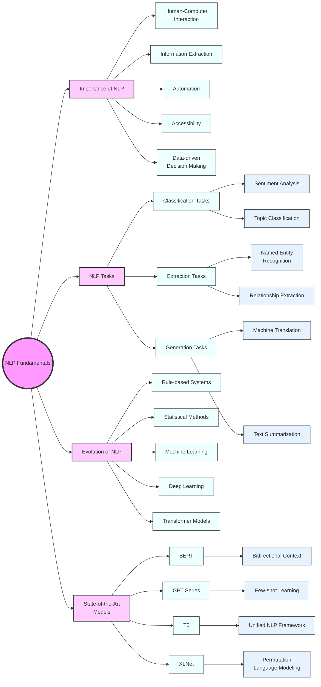

# 1.Course Title: Comprehensive NLP Fundamentals

```mermaid
gantt
    title LLM Course Timeline
    dateFormat X
    axisFormat %d
    section Course Content
    Course Overview                                    :a1, 0, 1d
    NLP Fundamentals                                   :active,a2, after a1, 1d
    Basic knowledge and architectural characteristics of LLM :a3, after a2, 1d
    LLM Development Fundamentals                       :a4, after a3, 1d
    Introduction and Setup of the Experimental Environment :a5, after a4, 1d
    The concept of the tokenizer and common types      :a6, after a5, 1d
    Text data preprocessing and preparation            :a7, after a6, 1d
    LLM training - Fine-tuning                         :a8, after a7, 1d
    LLM training - Reward Modeling and Proximal Policy Optimization :a9, after a8, 1d
    Famous SOTA LLM models and JAIS model              :a10, after a9, 1d
    section Lessons
    lesson 1  :l1, 0, 1d
    lesson 2  :active,l2, after l1, 1d
    lesson 3  :l3, after l2, 1d
    lesson 4  :l4, after l3, 1d
    lesson 5  :l5, after l4, 1d
    lesson 6  :l6, after l5, 1d
    lesson 7  :l7, after l6, 1d
    lesson 8  :l8, after l7, 1d
    lesson 9  :l9, after l8, 1d
    lesson 10 :l10, after l9, 1d
```



Advanced Natural Language Processing: From Fundamentals to State-of-the-Art

# 2. Learning Objectives

By the end of this comprehensive lesson, students will be able to:

1. Thoroughly understand and explain the importance of NLP in modern AI applications

2. Recognize and categorize the main types of NLP tasks, with the ability to provide relevant examples

3. Comprehend the evolution of NLP algorithms and models, from traditional approaches to neural networks

4. Gain deep insights into state-of-the-art NLP models and their applications

5. Implement basic NLP tasks using popular libraries and frameworks

6. Critically evaluate the strengths and limitations of different NLP approaches

   

# 3. Overview

This in-depth lesson covers four key concepts, providing a comprehensive exploration of Natural Language Processing (NLP) fundamentals:

1. The Importance and Wide-ranging Applications of NLP

2. Comprehensive Overview of NLP Tasks and Their Real-world Applications

3. The Evolution of NLP: From Rule-based Systems to Transformers

4. State-of-the-Art NLP Models and Their Groundbreaking Capabilities

   

# 4. Detailed Content

## 4.1 Concept 1: The Importance and Wide-ranging Applications of NLP

### 4.1.1 Explanation

Natural Language Processing (NLP) is a crucial subfield of artificial intelligence that focuses on the interaction between computers and humans using natural language. Its importance stems from several key factors:

1. Improving Human-Computer Interaction: NLP enables more natural and intuitive interfaces.
2. Information Extraction: It allows machines to extract meaningful information from unstructured text.
3. Automation of Language-related Tasks: NLP can automate translation, summarization, and other language tasks.
4. Enhancing Accessibility: It helps in creating tools for people with disabilities.
5. Data-driven Decision Making: NLP can analyze large volumes of text data to provide insights.

The applications of NLP are vast and growing, including:

- Virtual Assistants (e.g., Siri, Alexa)
- Machine Translation (e.g., Google Translate)
- Sentiment Analysis for Social Media Monitoring
- Chatbots for Customer Service
- Content Recommendation Systems
- Automatic Text Summarization
- Speech Recognition Systems

### 4.1.2 Case Study: NLP in Healthcare

Let's consider the application of NLP in healthcare. Electronic Health Records (EHRs) contain vast amounts of unstructured text data. NLP can help in:

1. Extracting relevant medical information from clinical notes
2. Identifying potential drug interactions
3. Assisting in clinical decision support systems
4. Automating medical coding for billing purposes

For example, a study by Liao et al. (2015) showed that NLP could identify patients with heart failure from clinical notes with high accuracy, potentially improving early diagnosis and treatment.

### 4.1.3 Code: Advanced Sentiment Analysis with VADER

Let's implement a more sophisticated sentiment analysis using VADER (Valence Aware Dictionary and sEntiment Reasoner), which is particularly attuned to sentiments expressed in social media:

```python
import nltk
from nltk.sentiment import SentimentIntensityAnalyzer
import matplotlib.pyplot as plt

nltk.download('vader_lexicon')
sia = SentimentIntensityAnalyzer()

def analyze_sentiment(text):
    return sia.polarity_scores(text)

texts = [
    "I absolutely love this NLP course! It's incredibly informative.",
    "The content is okay, but I find some parts confusing.",
    "This is the worst course I've ever taken. Total waste of time.",
    "While the course has some interesting points, it could be better organized.",
    "I'm amazed by how much I've learned about NLP in such a short time!"
]

sentiments = [analyze_sentiment(text) for text in texts]

# Plotting
fig, ax = plt.subplots(figsize=(10, 6))
x = range(len(texts))
ax.bar([i-0.2 for i in x], [s['pos'] for s in sentiments], width=0.2, align='center', label='Positive', color='green')
ax.bar([i for i in x], [s['neu'] for s in sentiments], width=0.2, align='center', label='Neutral', color='gray')
ax.bar([i+0.2 for i in x], [s['neg'] for s in sentiments], width=0.2, align='center', label='Negative', color='red')
ax.set_ylabel('Sentiment Score')
ax.set_title('Sentiment Analysis of Course Feedback')
ax.set_xticks(x)
ax.set_xticklabels([f'Text {i+1}' for i in x], rotation=45, ha='right')
ax.legend()
plt.tight_layout()
plt.show()

for i, (text, sentiment) in enumerate(zip(texts, sentiments)):
    print(f"Text {i+1}: {text}")
    print(f"Sentiment: {sentiment}")
    print(f"Overall: {'Positive' if sentiment['compound'] > 0 else 'Negative' if sentiment['compound'] < 0 else 'Neutral'}")
    print()
```

This code performs sentiment analysis on multiple pieces of text feedback about a course, visualizing the results and providing a more nuanced understanding of sentiment.

### 4.1.4 Reflection

The wide-ranging applications of NLP demonstrate its crucial role in modern AI. From improving user experiences to enabling data-driven decision making in complex fields like healthcare, NLP is transforming how we interact with and extract value from textual data. However, it's important to consider the ethical implications, such as privacy concerns in healthcare applications or potential biases in sentiment analysis systems.

## 4.2 Concept 2: Comprehensive Overview of NLP Tasks and Their Real-world Applications

### 4.2.1 Explanation

NLP encompasses a wide range of tasks, which can be broadly categorized into three main types:

1. Classification Tasks: Assigning predefined categories to text.
   - Examples: Sentiment Analysis, Topic Classification, Spam Detection

2. Extraction Tasks: Identifying and extracting specific information from text.
   - Examples: Named Entity Recognition (NER), Keyword Extraction, Relationship Extraction

3. Generation Tasks: Creating human-like text based on input.
   - Examples: Machine Translation, Text Summarization, Question Answering

Each of these task types serves different purposes in processing and understanding natural language, often working together in complex NLP systems.

### 4.2.2 Case Study: Multilingual Customer Support System

Imagine developing a multilingual customer support system for a global e-commerce platform. This system would incorporate multiple NLP tasks:

1. Language Detection (Classification): Identify the language of incoming customer queries.
2. Intent Classification (Classification): Determine the purpose of the customer's message (e.g., return request, product inquiry).
3. Named Entity Recognition (Extraction): Identify product names, order numbers, or customer names in the query.
4. Sentiment Analysis (Classification): Gauge the customer's mood from their message.
5. Machine Translation (Generation): Translate the customer's message if it's not in the support agent's language.
6. Response Generation (Generation): Automatically generate appropriate responses based on the query's intent and extracted information.

This case study demonstrates how different NLP tasks can be combined to create a sophisticated, real-world application.

### 4.2.3 Code: Multi-task NLP Pipeline

Let's implement a simplified version of the multilingual customer support system described above:

```python
from langdetect import detect
from nltk import word_tokenize, pos_tag, ne_chunk
from nltk.sentiment import SentimentIntensityAnalyzer
from transformers import pipeline

# Ensure necessary NLTK data is downloaded
import nltk
nltk.download('punkt')
nltk.download('averaged_perceptron_tagger')
nltk.download('maxent_ne_chunker')
nltk.download('words')
nltk.download('vader_lexicon')

# Initialize models
sentiment_analyzer = SentimentIntensityAnalyzer()
translator = pipeline("translation", model="Helsinki-NLP/opus-mt-en-ROMANCE")

def process_query(query):
    # Language Detection
    lang = detect(query)
    
    # Translate to English if not already in English
    if lang != 'en':
        translation = translator(query, max_length=512)[0]['translation_text']
        print(f"Translated query: {translation}")
        query = translation
    
    # Tokenization and NER
    tokens = word_tokenize(query)
    pos_tags = pos_tag(tokens)
    named_entities = ne_chunk(pos_tags)
    
    # Extract product names (simplified)
    products = [word for word, pos in pos_tags if pos == 'NN']
    
    # Sentiment Analysis
    sentiment = sentiment_analyzer.polarity_scores(query)
    
    # Intent Classification (simplified)
    intent = "product_inquiry" if "how" in query.lower() or "what" in query.lower() else "general_query"
    
    return {
        "original_language": lang,
        "named_entities": named_entities,
        "products": products,
        "sentiment": sentiment,
        "intent": intent
    }

# Example usage
queries = [
    "How do I return the faulty smartphone I bought last week?",
    "J'adore votre nouveau produit! Quand sera-t-il disponible en France ?",
    "This laptop is terrible. I want a refund immediately!"
]

for query in queries:
    print(f"\nProcessing query: {query}")
    result = process_query(query)
    print(f"Original Language: {result['original_language']}")
    print(f"Named Entities: {result['named_entities']}")
    print(f"Products mentioned: {result['products']}")
    print(f"Sentiment: {result['sentiment']}")
    print(f"Detected Intent: {result['intent']}")
```

This code demonstrates a multi-task NLP pipeline that processes customer queries, handling language detection, translation, named entity recognition, sentiment analysis, and a simplified form of intent classification.

### 4.2.4 Reflection

The diversity of NLP tasks allows for the creation of sophisticated systems that can understand and generate human language in nuanced ways. However, each task comes with its own challenges:

1. Classification tasks may struggle with context and nuance.
2. Extraction tasks can be sensitive to variations in text structure and vocabulary.
3. Generation tasks might produce fluent but inaccurate or biased text.

Understanding these challenges is crucial for developing robust NLP systems and choosing the right approaches for specific applications.

## 4.3 Concept 3: The Evolution of NLP: From Rule-based Systems to Transformers

### 4.3.1 Explanation

The field of NLP has seen significant advancements over the years, evolving from simple rule-based systems to sophisticated neural network-based approaches. This evolution can be broadly categorized into several stages:

1. Rule-based Systems (1950s-1980s): Hand-crafted rules for language processing.
2. Statistical Methods (1980s-2000s): Probabilistic models like n-grams and Hidden Markov Models.
3. Machine Learning Approaches (2000s-2010s): Including Naive Bayes, SVMs, and Decision Trees.
4. Deep Learning Revolution (2010s-present): Neural networks, particularly sequence models like RNNs and LSTMs.
5. Transformer Era (2017-present): Attention-based models revolutionizing NLP tasks.

Each stage brought significant improvements in NLP capabilities, with the most recent advancements enabling human-like language understanding and generation.

### 4.3.2 Case Study: Evolution of Machine Translation

Let's trace the evolution of machine translation as an example:

1. Rule-based MT (e.g., Systran, 1970s): Used hand-crafted linguistic rules.
   - Pros: Worked well for closely related languages.
   - Cons: Struggled with exceptions and idioms.

2. Statistical MT (e.g., Google Translate, 2000s): Used statistical models trained on parallel corpora.
   - Pros: Better handling of language variations.
   - Cons: Required large parallel corpora, struggled with long-range dependencies.

3. Neural MT (e.g., Google's GNMT, 2016): Used sequence-to-sequence models with attention.
   - Pros: Significant improvement in fluency and accuracy.
   - Cons: Computationally intensive, potential for hallucination.

4. Transformer-based MT (e.g., DeepL, 2017): Used the transformer architecture.
   - Pros: State-of-the-art performance, better handling of context.
   - Cons: Requires large amounts of data and computational resources.

### 4.3.3 Code: Comparing Different Text Classification Approaches

Let's implement and compare different text classification approaches to see the evolution in practice:

```python
import numpy as np
from sklearn.feature_extraction.text import CountVectorizer
from sklearn.model_selection import train_test_split
from sklearn.naive_bayes import MultinomialNB
from sklearn.svm import SVC
from sklearn.metrics import accuracy_score
from tensorflow.keras.models import Sequential
from tensorflow.keras.layers import Dense, Embedding, LSTM
from tensorflow.keras.preprocessing.text import Tokenizer
from tensorflow.keras.preprocessing.sequence import pad_sequences
import matplotlib.pyplot as plt

# Sample data
texts = [
    "I love this movie",
    "Great film, highly recommended",
    "Terrible movie, waste of time",
    "I hated every minute of it",
    "Awesome acting and plot",
    "Boring and predictable",
    "Excellent cinematography",
    "Poor direction and script"
]
labels = [1, 1, 0, 0, 1, 0, 1, 0]  # 1 for positive, 0 for negative

# Split data
X_train, X_test, y_train, y_test = train_test_split(texts, labels, test_size=0.2, random_state=42)

# 1. Naive Bayes with Bag of Words
vectorizer = CountVectorizer()
X_train_bow = vectorizer.fit_transform(X_train)
X_test_bow = vectorizer.transform(X_test)

nb_classifier = MultinomialNB()
nb_classifier.fit(X_train_bow, y_train)
nb_predictions = nb_classifier.predict(X_test_bow)
nb_accuracy = accuracy_score(y_test, nb_predictions)

# 2. SVM with Bag of Words
svm_classifier = SVC(kernel='linear')
svm_classifier.fit(X_train_bow, y_train)
svm_predictions = svm_classifier.predict(X_test_bow)
svm_accuracy = accuracy_score(y_test, svm_predictions)

# 3. LSTM Neural Network
tokenizer = Tokenizer(num_words=1000)
tokenizer.fit_on_texts(texts)
X_train_seq = tokenizer.texts_to_sequences(X_train)
X_test_seq = tokenizer.texts_to_sequences(X_test)

max_length = max([len(x) for x in X_train_seq + X_test_seq])
X_train_pad = pad_sequences(X_train_seq, maxlen=max_length)
X_test_pad = pad_sequences(X_test_seq, maxlen=max_length)

model = Sequential([
    Embedding(1000, 16Embedding(1000, 16, input_length=max_length),
    LSTM(32),
    Dense(1, activation='sigmoid')
])
model.compile(optimizer='adam', loss='binary_crossentropy', metrics=['accuracy'])
history = model.fit(X_train_pad, np.array(y_train), epochs=10, validation_split=0.2, verbose=0)

lstm_predictions = (model.predict(X_test_pad) > 0.5).astype(int).flatten()
lstm_accuracy = accuracy_score(y_test, lstm_predictions)

# Plotting results
models = ['Naive Bayes', 'SVM', 'LSTM']
accuracies = [nb_accuracy, svm_accuracy, lstm_accuracy]

plt.figure(figsize=(10, 6))
plt.bar(models, accuracies)
plt.title('Accuracy Comparison of Different Text Classification Models')
plt.xlabel('Models')
plt.ylabel('Accuracy')
plt.ylim(0, 1)
for i, v in enumerate(accuracies):
    plt.text(i, v + 0.01, f'{v:.2f}', ha='center')
plt.show()

print(f"Naive Bayes Accuracy: {nb_accuracy:.2f}")
print(f"SVM Accuracy: {svm_accuracy:.2f}")
print(f"LSTM Accuracy: {lstm_accuracy:.2f}")

# Plot LSTM training history
plt.figure(figsize=(10, 6))
plt.plot(history.history['accuracy'], label='Training Accuracy')
plt.plot(history.history['val_accuracy'], label='Validation Accuracy')
plt.title('LSTM Model Accuracy')
plt.xlabel('Epoch')
plt.ylabel('Accuracy')
plt.legend()
plt.show()
```

This code demonstrates the evolution of text classification methods, from traditional machine learning approaches (Naive Bayes and SVM) to deep learning (LSTM). It visualizes the performance comparison and the training process of the LSTM model.

### 4.3.4 Reflection

The evolution of NLP techniques has led to significant improvements in performance and capabilities:

1. Rule-based systems were limited by the complexity of language rules and exceptions.
2. Statistical methods improved handling of language variations but required large datasets.
3. Machine learning approaches enhanced adaptability to different domains and tasks.
4. Deep learning, especially transformers, revolutionized NLP with context-aware processing and transfer learning capabilities.

However, this evolution also brings challenges:

- Increased computational requirements
- Need for larger datasets
- Reduced interpretability in more complex models
- Potential for amplifying biases present in training data

Understanding this evolution helps in choosing the right approach for specific NLP tasks and understanding the trade-offs involved.

## 4.4 Concept 4: State-of-the-Art NLP Models and Their Groundbreaking Capabilities

### 4.4.1 Explanation

Modern NLP is dominated by large pre-trained models based on the Transformer architecture. These models have set new benchmarks in various NLP tasks and can be fine-tuned for specific applications. Key models include:

1. BERT (Bidirectional Encoder Representations from Transformers)
   - Introduced by Google in 2018
   - Bidirectional context understanding
   - Excels in tasks like question answering and sentiment analysis

2. GPT (Generative Pre-trained Transformer) series
   - Developed by OpenAI
   - Powerful text generation capabilities
   - GPT-3 (2020) showed impressive few-shot learning abilities

3. T5 (Text-to-Text Transfer Transformer)
   - Introduced by Google in 2019
   - Unified framework for multiple NLP tasks
   - Strong performance across various benchmarks

4. XLNet
   - Combines strengths of autoregressive and autoencoding models
   - Overcomes limitations of BERT in certain tasks

These models have dramatically expanded the possibilities of what can be achieved with NLP, from more accurate language understanding to human-like text generation.

### 4.4.2 Case Study: GPT-3 in Creative Writing

GPT-3 has shown remarkable capabilities in creative writing tasks. For example, it has been used to:

- Generate poetry that captures specific styles and themes
- Write short stories with coherent plots
- Create dialogues for characters with distinct personalities

Gwern Branwen's experiments with GPT-3 for poetry and creative writing showcase its ability to understand and emulate various literary styles and forms.

### 4.4.3 Code: Fine-tuning BERT for Sentiment Analysis

Let's implement a more advanced sentiment analysis by fine-tuning a pre-trained BERT model:

```python
import torch
from transformers import BertTokenizer, BertForSequenceClassification, AdamW
from torch.utils.data import DataLoader, TensorDataset
from sklearn.model_selection import train_test_split
import numpy as np
import matplotlib.pyplot as plt

# Sample data (in a real scenario, you'd use a larger dataset)
texts = [
    "I love this product! It's amazing.",
    "Terrible experience, never buying again.",
    "Neutral opinion, neither good nor bad.",
    "Absolutely fantastic, exceeded my expectations!",
    "Disappointing quality, not worth the price.",
    "Okay product, does the job.",
    "Mind-blowing performance, highly recommended!",
    "Waste of money, don't buy it."
]
labels = [1, 0, 2, 1, 0, 2, 1, 0]  # 0: Negative, 1: Positive, 2: Neutral

# Split data
train_texts, val_texts, train_labels, val_labels = train_test_split(texts, labels, test_size=0.2, random_state=42)

# Load pre-trained BERT tokenizer and model
tokenizer = BertTokenizer.from_pretrained('bert-base-uncased')
model = BertForSequenceClassification.from_pretrained('bert-base-uncased', num_labels=3)

# Tokenize and encode sequences
train_encodings = tokenizer(train_texts, truncation=True, padding=True, max_length=64)
val_encodings = tokenizer(val_texts, truncation=True, padding=True, max_length=64)

# Convert to PyTorch datasets
train_dataset = TensorDataset(
    torch.tensor(train_encodings['input_ids']),
    torch.tensor(train_encodings['attention_mask']),
    torch.tensor(train_labels)
)
val_dataset = TensorDataset(
    torch.tensor(val_encodings['input_ids']),
    torch.tensor(val_encodings['attention_mask']),
    torch.tensor(val_labels)
)

# Create data loaders
train_loader = DataLoader(train_dataset, batch_size=2, shuffle=True)
val_loader = DataLoader(val_dataset, batch_size=2)

# Set up optimizer
optimizer = AdamW(model.parameters(), lr=5e-5)

# Training loop
device = torch.device('cuda' if torch.cuda.is_available() else 'cpu')
model.to(device)

num_epochs = 5
train_losses, val_losses = [], []

for epoch in range(num_epochs):
    model.train()
    total_train_loss = 0
    for batch in train_loader:
        input_ids, attention_mask, labels = [b.to(device) for b in batch]
        outputs = model(input_ids, attention_mask=attention_mask, labels=labels)
        loss = outputs.loss
        total_train_loss += loss.item()
        
        loss.backward()
        optimizer.step()
        optimizer.zero_grad()
    
    avg_train_loss = total_train_loss / len(train_loader)
    train_losses.append(avg_train_loss)
    
    model.eval()
    total_val_loss = 0
    with torch.no_grad():
        for batch in val_loader:
            input_ids, attention_mask, labels = [b.to(device) for b in batch]
            outputs = model(input_ids, attention_mask=attention_mask, labels=labels)
            total_val_loss += outputs.loss.item()
    
    avg_val_loss = total_val_loss / len(val_loader)
    val_losses.append(avg_val_loss)
    
    print(f"Epoch {epoch+1}/{num_epochs}, Train Loss: {avg_train_loss:.4f}, Val Loss: {avg_val_loss:.4f}")

# Plot training and validation loss
plt.figure(figsize=(10, 6))
plt.plot(range(1, num_epochs+1), train_losses, label='Train Loss')
plt.plot(range(1, num_epochs+1), val_losses, label='Validation Loss')
plt.xlabel('Epoch')
plt.ylabel('Loss')
plt.title('Training and Validation Loss')
plt.legend()
plt.show()

# Function to predict sentiment
def predict_sentiment(text):
    encoding = tokenizer(text, truncation=True, padding=True, max_length=64, return_tensors='pt')
    input_ids = encoding['input_ids'].to(device)
    attention_mask = encoding['attention_mask'].to(device)
    
    with torch.no_grad():
        outputs = model(input_ids, attention_mask=attention_mask)
        prediction = torch.argmax(outputs.logits, dim=1).item()
    
    return ['Negative', 'Positive', 'Neutral'][prediction]

# Test the model
test_texts = [
    "This product is fantastic!",
    "I'm very disappointed with the quality.",
    "It's an average product, nothing special."
]

for text in test_texts:
    sentiment = predict_sentiment(text)
    print(f"Text: {text}")
    print(f"Predicted sentiment: {sentiment}\n")
```

This code demonstrates how to fine-tune a pre-trained BERT model for sentiment analysis, showcasing the power of transfer learning in modern NLP.

### 4.4.4 Reflection

State-of-the-art NLP models have dramatically expanded the possibilities of what can be achieved with natural language processing:

1. They can understand context and nuance in language much better than previous models.
2. Their transfer learning capabilities allow for impressive performance on various tasks with minimal fine-tuning.
3. They can generate human-like text, opening up new applications in creative writing, content generation, and more.

However, these models also raise important ethical considerations:

- Potential for generating convincing misinformation
- Privacy concerns related to the vast amount of data used in training
- Environmental impact of training large models
- Potential for amplifying biases present in training data

As NLP practitioners, it's crucial to consider these ethical implications alongside the technical capabilities of these models.

# 5. Summary

## 5.1 Conclusion

In this comprehensive lesson on NLP fundamentals, we've explored the importance and wide-ranging applications of NLP, delved into various NLP tasks, traced the evolution of NLP techniques, and examined state-of-the-art models that are pushing the boundaries of what's possible in language processing and generation.

Key takeaways include:

1. The pervasive importance of NLP in modern AI applications, from virtual assistants to healthcare.
2. The diversity of NLP tasks, including classification, extraction, and generation, each with its own challenges and applications.
3. The rapid evolution of NLP techniques, from rule-based systems to transformer-based models, dramatically improving performance across various tasks.
4. The groundbreaking capabilities of state-of-the-art models like BERT and GPT, which have opened up new possibilities in NLP.
5. The ethical considerations that come with these powerful new technologies, including privacy concerns and the potential for bias.

As NLP continues to advance, understanding these fundamentals will be crucial for developing and applying NLP solutions effectively and responsibly.

## 5.2 Mind Maps



This mind map provides a visual overview of the key concepts covered in this lesson, illustrating the relationships between different aspects of NLP fundamentals, tasks, evolution, and state-of-the-art models.

# 6. Homework

1. Implement a text classification system using three different approaches: a traditional machine learning method (e.g., Naive Bayes or SVM), a recurrent neural network (LSTM or GRU), and a fine-tuned BERT model. Compare their performance on a dataset of your choice (e.g., movie reviews, news articles).

2. Develop a named entity recognition (NER) system using spaCy. Train it on a custom dataset related to a specific domain (e.g., medical texts, legal documents) and evaluate its performance.

3. Experiment with the GPT-2 model (or GPT-3 if you have access) to generate text in different styles (e.g., news articles, poetry, technical documentation). Analyze the strengths and weaknesses of the generated text and discuss potential applications and ethical considerations.

4. Implement a simple chatbot using a combination of rule-based and machine learning techniques. The chatbot should be able to handle basic queries in a specific domain (e.g., customer support for an e-commerce platform).

5. Conduct a literature review on recent advancements in multilingual NLP models. Write a report (1500-2000 words) discussing the challenges in multilingual NLP and how recent models address these challenges.

6. Develop a simple machine translation system using sequence-to-sequence learning with attention. Train it on a small parallel corpus (e.g., English-French) and compare its performance with popular online translation services.

# 7. Reference and Citation

[1] Jurafsky, D., & Martin, J. H. (2020). Speech and Language Processing (3rd ed. draft). Retrieved from <https://web.stanford.edu/~jurafsky/slp3/>

[2] Goldberg, Y. (2017). Neural Network Methods for Natural Language Processing. Synthesis Lectures on Human Language Technologies, 10(1), 1-309.

[3] Vaswani, A., Shazeer, N., Parmar, N., Uszkoreit, J., Jones, L., Gomez, A. N., ... & Polosukhin, I. (2017). Attention is all you need. Advances in neural information processing systems, 30.

[4] Devlin, J., Chang, M. W., Lee, K., & Toutanova, K. (2018). BERT: Pre-training of Deep Bidirectional Transformers for Language Understanding. arXiv preprint arXiv:1810.04805.

[5] Brown, T. B., Mann, B., Ryder,[5] Brown, T. B., Mann, B., Ryder, N., Subbiah, M., Kaplan, J., Dhariwal, P., ... & Amodei, D. (2020). Language Models are Few-Shot Learners. arXiv preprint arXiv:2005.14165.

[6] Radford, A., Wu, J., Child, R., Luan, D., Amodei, D., & Sutskever, I. (2019). Language models are unsupervised multitask learners. OpenAI Blog, 1(8), 9.

[7] Raffel, C., Shazeer, N., Roberts, A., Lee, K., Narang, S., Matena, M., ... & Liu, P. J. (2020). Exploring the Limits of Transfer Learning with a Unified Text-to-Text Transformer. Journal of Machine Learning Research, 21, 1-67.

[8] Yang, Z., Dai, Z., Yang, Y., Carbonell, J., Salakhutdinov, R., & Le, Q. V. (2019). XLNet: Generalized Autoregressive Pretraining for Language Understanding. arXiv preprint arXiv:1906.08237.

[9] Liao, K. P., Cai, T., Savova, G. K., Murphy, S. N., Karlson, E. W., Ananthakrishnan, A. N., ... & Kohane, I. S. (2015). Development of phenotype algorithms using electronic medical records and incorporating natural language processing. bmj, 350.

[10] Hutto, C. J., & Gilbert, E. (2014). Vader: A parsimonious rule-based model for sentiment analysis of social media text. In Eighth international AAAI conference on weblogs and social media.

[11] Honnibal, M., & Montani, I. (2017). spaCy 2: Natural language understanding with Bloom embeddings, convolutional neural networks and incremental parsing.

[12] Wolf, T., Debut, L., Sanh, V., Chaumond, J., Delangue, C., Moi, A., ... & Rush, A. M. (2020). Transformers: State-of-the-art Natural Language Processing. In Proceedings of the 2020 Conference on Empirical Methods in Natural Language Processing: System Demonstrations (pp. 38-45).

[13] Bahdanau, D., Cho, K., & Bengio, Y. (2014). Neural machine translation by jointly learning to align and translate. arXiv preprint arXiv:1409.0473.

[14] Peters, M. E., Neumann, M., Iyyer, M., Gardner, M., Clark, C., Lee, K., & Zettlemoyer, L. (2018). Deep contextualized word representations. arXiv preprint arXiv:1802.05365.

[15] Conneau, A., Khandelwal, K., Goyal, N., Chaudhary, V., Wenzek, G., Guzmán, F., ... & Stoyanov, V. (2020). Unsupervised Cross-lingual Representation Learning at Scale. arXiv preprint arXiv:1911.02116.
