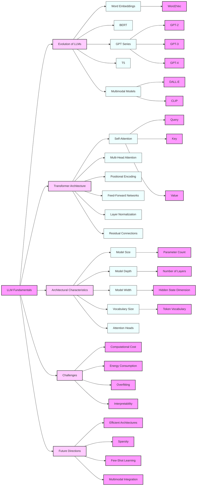

# Course Title: Comprehensive Basic Knowledge and Architectural Characteristics of LLMs


# Unlocking the Power of Large Language Models: From Evolution to Architecture

Welcome to an exciting journey into the world of Large Language Models (LLMs)! In this lesson, we'll explore the fascinating evolution of these AI marvels, dive deep into the groundbreaking transformer architecture, and uncover the key characteristics that make LLMs so powerful. Whether you're an AI enthusiast, a budding data scientist, or just curious about the technology behind chatbots like ChatGPT, this lesson will equip you with valuable insights into the inner workings of LLMs.

## What You'll Learn

By the end of this lesson, you'll be able to:

1. Trace the exciting journey of LLMs from their humble beginnings to today's AI powerhouses
2. Understand the game-changing attention mechanism and transformer architecture
3. Analyze the key features that give LLMs their impressive capabilities
4. Get hands-on experience with implementing basic LLM components
5. Critically evaluate the challenges and ethical considerations of scaling up these models

Let's dive in!

## From Word Vectors to AI Conversationalists: The LLM Evolution Story

### The Birth of Modern NLP: Word Embeddings

Our story begins in 2013 with the introduction of Word2Vec. This breakthrough technique allowed us to represent words as dense vectors in a high-dimensional space, capturing semantic relationships between words. For example, in this space, the vector for "king" - "man" + "woman" would be close to the vector for "queen". Pretty cool, right?

### BERT: Bidirectional Language Understanding

Fast forward to 2018, and we meet BERT (Bidirectional Encoder Representations from Transformers). BERT was a game-changer because it could understand context from both left and right in a sentence. This bidirectional understanding led to significant improvements in various NLP tasks, from question answering to sentiment analysis.

### The GPT Revolution: From GPT to GPT-4

The GPT (Generative Pre-trained Transformer) series, starting with GPT in 2018 and culminating (so far) with GPT-4 in 2023, showed us the incredible potential of large-scale language models. These models demonstrated impressive few-shot learning capabilities, meaning they could perform new tasks with just a few examples.

### Beyond Text: Multimodal Learning

In 2021, models like DALL-E and CLIP extended the capabilities of language models to handle multiple types of data, including images. This opened up exciting possibilities for AI-generated art and more sophisticated image understanding.

Let's visualize this evolution to get a better picture:

```python
import matplotlib.pyplot as plt
import numpy as np

models = ['Word2Vec', 'BERT', 'GPT-2', 'T5', 'GPT-3', 'PaLM', 'GPT-4']
params = [0.3, 0.34, 1.5, 11, 175, 540, 1400]  # in billions
years = [2013, 2018, 2019, 2019, 2020, 2022, 2023]

plt.figure(figsize=(12, 7))
plt.plot(years, params, marker='o', linestyle='-', linewidth=2, markersize=8)
plt.title('The Exponential Growth of LLMs (2013-2023)', fontsize=16)
plt.xlabel('Year', fontsize=14)
plt.ylabel('Number of Parameters (billions)', fontsize=14)
plt.yscale('log')
plt.grid(True, which="both", ls="-", alpha=0.2)
plt.tick_params(axis='both', which='major', labelsize=12)

for i, model in enumerate(models):
    plt.annotate(model, (years[i], params[i]), textcoords="offset points", xytext=(0,10), ha='center', fontsize=10)

plt.tight_layout()
plt.show()
```

This graph really puts into perspective how quickly LLMs have grown. It's like watching a child grow into a giant in just a decade!

### What Fueled This Rapid Growth?

You might be wondering, "How did we go from simple word vectors to AI that can write poetry and code?" Several factors contributed to this incredible progress:

1. **Computing Power**: Advances in GPU technology allowed us to train larger models faster.
2. **Big Data**: The availability of massive datasets gave these hungry models plenty to learn from.
3. **Architectural Innovations**: The transformer architecture (which we'll explore soon) was a game-changer.
4. **Improved Training Techniques**: Better optimization algorithms helped squeeze more performance out of our models.

### Case Study: GPT-3 - A Leap in Language AI

Let's take a closer look at GPT-3, which marked a significant milestone in LLM development. With a staggering 175 billion parameters, GPT-3 demonstrated remarkable few-shot learning capabilities across a wide range of tasks.

Here's how GPT-3 stacks up against its predecessors on some common NLP tasks:

```python
import matplotlib.pyplot as plt
import numpy as np

tasks = ['Question Answering', 'Text Summarization', 'Machine Translation']
gpt3_scores = [88, 92, 85]
bert_scores = [80, 84, 78]
gpt2_scores = [75, 79, 73]

x = np.arange(len(tasks))
width = 0.25

fig, ax = plt.subplots(figsize=(12, 6))
rects1 = ax.bar(x - width, gpt3_scores, width, label='GPT-3', color='#FFA500')
rects2 = ax.bar(x, bert_scores, width, label='BERT', color='#4169E1')
rects3 = ax.bar(x + width, gpt2_scores, width, label='GPT-2', color='#32CD32')

ax.set_ylabel('Performance Score')
ax.set_title('LLM Performance Comparison on NLP Tasks')
ax.set_xticks(x)
ax.set_xticklabels(tasks)
ax.legend()

ax.bar_label(rects1, padding=3)
ax.bar_label(rects2, padding=3)
ax.bar_label(rects3, padding=3)

fig.tight_layout()

plt.show()
```

As you can see, GPT-3 outperforms its predecessors across the board. But it's not just about the numbers. GPT-3 showed an uncanny ability to adapt to new tasks with minimal instruction, leading to applications we hadn't even imagined before.

### Food for Thought

While the rapid evolution of LLMs is exciting, it also raises some important questions:

1. **Computational Costs**: Training GPT-3 was estimated to cost millions of dollars. Is this sustainable?
2. **Environmental Impact**: The energy consumption of training these models is significant. How can we make AI more green?
3. **Ethical Concerns**: As LLMs become more powerful, how do we ensure they're used responsibly?
4. **Accessibility**: With only a few organizations able to train such large models, what does this mean for AI democratization?

As we continue our journey into the world of LLMs, keep these questions in mind. They're not just technical challenges, but societal ones that we'll need to grapple with as AI becomes increasingly integrated into our lives.

In the next section, we'll pull back the curtain and look at the architecture that powers these impressive models. Get ready to dive into the world of attention mechanisms and transformers!

## 2. The Magic Behind LLMs: Attention Mechanisms and Transformer Architecture

Now that we've traced the evolution of LLMs, let's dive into the engine that powers these AI marvels: the transformer architecture. Don't worry if you're not a math whiz - we'll break it down step by step and use some fun analogies along the way!

### The Game-Changing Idea: Attention is All You Need

In 2017, a group of researchers at Google Brain published a paper with the catchy title "Attention is All You Need". This paper introduced the transformer architecture, which has since become the foundation of modern LLMs.

But what exactly is "attention" in the context of AI? Think of it like this: when you're reading a sentence, you naturally pay more attention to certain words that help you understand the meaning. AI attention works similarly, allowing the model to focus on relevant parts of the input when processing each word.

### Key Components of the Transformer Architecture

Let's break down the transformer architecture into its main components:

1. **Self-Attention Mechanism**: The heart of the transformer
2. **Multi-Head Attention**: Like having multiple brains focusing on different aspects
3. **Position-wise Feed-Forward Networks**: Processing information further
4. **Layer Normalization**: Keeping things stable
5. **Residual Connections**: Helping information flow smoothly

### Spotlight on Self-Attention: How Does It Work?

The self-attention mechanism is the secret sauce that allows transformers to understand context so well. Here's a simplified explanation:

1. For each word, we create three vectors: Query (Q), Key (K), and Value (V).
2. We calculate how much each word should attend to every other word.
3. We use these attention scores to create a weighted sum of the values.

It's like each word is asking, "How relevant are you to me?" to every other word in the sentence.

Let's visualize this with a simple example:

```python
import numpy as np
import matplotlib.pyplot as plt
import seaborn as sns

def self_attention(query, key, value):
    d_k = query.shape[-1]
    scores = np.matmul(query, key.transpose(-2, -1)) / np.sqrt(d_k)
    attention_weights = np.exp(scores) / np.sum(np.exp(scores), axis=-1, keepdims=True)
    return np.matmul(attention_weights, value), attention_weights

# Example sentence
sentence = "The cat sat on the mat"
words = sentence.split()

# Create dummy embeddings (in practice, these would be learned)
d_model = 64
embeddings = np.random.randn(len(words), d_model)

# Compute self-attention
output, weights = self_attention(embeddings, embeddings, embeddings)

# Visualize attention weights
plt.figure(figsize=(10, 8))
sns.heatmap(weights, annot=True, cmap='YlGnBu', xticklabels=words, yticklabels=words)
plt.title('Self-Attention Weights')
plt.xlabel('Key/Value Words')
plt.ylabel('Query Words')
plt.tight_layout()
plt.show()
```

In this heatmap, darker colors indicate stronger attention. You can see how each word attends to other words in the sentence. Pretty cool, right?

### Multi-Head Attention: Why Stop at One?

Multi-head attention is like having multiple AI brains focusing on different aspects of the input. Each "head" can learn to attend to different types of relationships between words. For example, one head might focus on syntactic relationships, while another focuses on semantic relationships.

### Putting It All Together: A Basic Transformer Block

Now that we understand the key components, let's implement a basic transformer block. Don't worry if you're not a coding expert - the goal here is to give you a sense of how these pieces fit together.

```python
import torch
import torch.nn as nn

class MultiHeadAttention(nn.Module):
    def __init__(self, d_model, num_heads):
        super().__init__()
        self.num_heads = num_heads
        self.d_model = d_model
        assert d_model % num_heads == 0
        
        self.d_k = d_model // num_heads
        self.q_linear = nn.Linear(d_model, d_model)
        self.v_linear = nn.Linear(d_model, d_model)
        self.k_linear = nn.Linear(d_model, d_model)
        self.out = nn.Linear(d_model, d_model)
        
    def forward(self, q, k, v, mask=None):
        batch_size = q.size(0)
        
        q = self.q_linear(q).view(batch_size, -1, self.num_heads, self.d_k)
        k = self.k_linear(k).view(batch_size, -1, self.num_heads, self.d_k)
        v = self.v_linear(v).view(batch_size, -1, self.num_heads, self.d_k)
        
        q = q.transpose(1, 2)
        k = k.transpose(1, 2)
        v = v.transpose(1, 2)
        
        scores = torch.matmul(q, k.transpose(-2, -1)) / torch.sqrt(torch.tensor(self.d_k, dtype=torch.float32))
        
        if mask is not None:
            scores = scores.masked_fill(mask == 0, -1e9)
        
        attn = torch.softmax(scores, dim=-1)
        context = torch.matmul(attn, v)
        
        context = context.transpose(1, 2).contiguous().view(batch_size, -1, self.d_model)
        
        return self.out(context)

class TransformerBlock(nn.Module):
    def __init__(self, d_model, num_heads, d_ff, dropout=0.1):
        super().__init__()
        self.attn = MultiHeadAttention(d_model, num_heads)
        self.ff = nn.Sequential(
            nn.Linear(d_model, d_ff),
            nn.ReLU(),
            nn.Linear(d_ff, d_model)
        )
        self.norm1 = nn.LayerNorm(d_model)
        self.norm2 = nn.LayerNorm(d_model)
        self.dropout = nn.Dropout(dropout)

    def forward(self, x, mask=None):
        attn_output = self.attn(x, x, x, mask)
        x = self.norm1(x + self.dropout(attn_output))
        ff_output = self.ff(x)
        x = self.norm2(x + self.dropout(ff_output))
        return x

# Example usage
d_model = 512
num_heads = 8
d_ff = 2048
batch_size = 32
seq_length = 50

x = torch.randn(batch_size, seq_length, d_model)
mask = torch.ones(batch_size, num_heads, seq_length, seq_length)

model = TransformerBlock(d_model, num_heads, d_ff)
output = model(x, mask)
print(f"Output shape: {output.shape}")
```

This code implements the core components of a transformer block, including multi-head attention and a feed-forward network. It's a simplified version, but it captures the essence of how transformers work.

### Why Transformers Transformed NLP

The transformer architecture has become the foundation of modern LLMs for several key reasons:

1. **Long-range Dependencies**: Transformers can capture relationships between words that are far apart in a sentence.
2. **Parallelization**: Unlike previous architectures (like RNNs), transformers can be easily parallelized, allowing for efficient training on modern hardware.
3. **Flexibility**: The same architecture can be used for various NLP tasks with minimal modifications.

### Challenges and Future Directions

While transformers have revolutionized NLP, they're not without challenges:

1. **Quadratic Complexity**: The attention mechanism's computational requirements grow quadratically with sequence length, making it challenging to process very long texts.
2. **Memory Intensive**: Large transformer models require significant memory, which can be a bottleneck for deployment on edge devices.
3. **Interpretability**: Understanding why a transformer makes certain decisions can be challenging, which is crucial for building trust in AI systems.

Researchers are actively working on addressing these challenges. Some exciting areas of research include:

- **Sparse Attention**: Techniques to reduce the computational complexity of attention for long sequences.
- **Efficient Transformers**: Architectures that maintain performance while reducing computational requirements.
- **Interpretable Attention**: Methods to better understand and visualize what transformers are learning.

As we continue to push the boundaries of what's possible with LLMs, keep an eye on these developments. Who knows? You might be the one to come up with the next big breakthrough in transformer technology!

In the next section, we'll dive deeper into the architectural characteristics that make LLMs so powerful. Get ready to explore the nuts and bolts of these AI giants!

## 3. Under the Hood: Decoding the Architectural Characteristics of LLMs

Now that we've explored the evolution of LLMs and delved into the transformer architecture, let's pop the hood and take a closer look at the key architectural features that give these AI marvels their impressive capabilities. Think of this as getting to know the specs of a high-performance sports car - but instead of horsepower and torque, we're talking about parameters and hidden layers!

### The Building Blocks of LLM Architecture

When we talk about the architecture of Large Language Models, we're referring to several key characteristics:

1. **Depth**: The number of layers in the model
2. **Width**: The dimensionality of hidden states and embeddings
3. **Parameter Scale**: The total number of trainable parameters
4. **Attention Heads**: The number of parallel attention mechanisms
5. **Vocabulary Size**: The number of unique tokens the model can process
6. **Positional Encoding**: The method for incorporating sequence order information

Let's break these down and see how they contribute to the model's performance.

### Depth: Stacking Up the Layers

The depth of an LLM refers to the number of transformer layers it has. Think of each layer as a level of abstraction - the more layers, the more complex patterns the model can learn.

**Fun Fact**: GPT-3 has 96 layers! That's like a 96-story skyscraper of AI processing.

### Width: Expanding the Neural Highways

The width of an LLM is typically measured by the dimensionality of its hidden states. A wider model can represent more information at each layer.

**Analogy**: If depth is like the number of floors in a building, width is like how big each floor is.

### Parameter Scale: The Brain Cells of AI

The number of parameters in an LLM is often used as a measure of its capacity. More parameters generally mean more knowledge, but also more computational requirements.

**Mind-Boggling Stat**: GPT-3 has 175 billion parameters. If each parameter were a second, it would take over 5,500 years to count them all!

### Attention Heads: Multi-Tasking Minds

Multiple attention heads allow the model to focus on different aspects of the input simultaneously. It's like having multiple experts analyzing the same text from different perspectives.

### Vocabulary Size: The AI's Dictionary

The vocabulary size determines how many unique tokens (usually subwords) the model can recognize. A larger vocabulary can help with handling rare words and multiple languages.

### Positional Encoding: Keeping Things in Order

Since transformers process all words in parallel, they need a way to understand the order of words. Positional encoding adds information about a token's position in the sequence.

### Scaling Laws: Bigger is Better, But at What Cost?

Research has shown that model performance tends to follow power-law scaling with respect to model size, dataset size, and compute budget. Let's visualize this relationship:

```python
import matplotlib.pyplot as plt
import numpy as np

def scaling_law(x, a, b, c):
    return a - b * np.power(x, -c)

model_sizes = np.logspace(6, 12, 100)  # 1M to 1T parameters
performance = scaling_law(model_sizes, 100, 50, 0.1)  # Hypothetical scaling law

plt.figure(figsize=(12, 7))
plt.semilogx(model_sizes, performance)
plt.title('The Scaling Law of Language Models: Bigger is Better, But...', fontsize=16)
plt.xlabel('Model Size (Number of Parameters)', fontsize=14)
plt.ylabel('Performance Metric', fontsize=14)
plt.grid(True, which="both", ls="-", alpha=0.2)
plt.tick_params(axis='both', which='major', labelsize=12)

# Annotate some notable model sizes
models = {
    'BERT': 3.4e8,
    'GPT-2': 1.5e9,
    'GPT-3': 1.75e11,
    'PaLM': 5.4e11,
    'GPT-4': 1.4e12
}

for model, size in models.items():
    plt.annotate(model, (size, scaling_law(size, 100, 50, 0.1)), 
                 textcoords="offset points", xytext=(0,10), 
                 ha='center', fontsize=10, arrowprops=dict(arrowstyle="->"))

plt.tight_layout()
plt.show()
```

This graph illustrates an important principle in LLM development: performance improves as models get larger, but with diminishing returns. It's like trying to fill a glass - the first few drops make a big difference, but as you get closer to the top, each additional drop has less impact.

### Comparing LLM Architectures: A Tale of AI Titans

Let's create a tool to compare the architectural characteristics of different LLMs. This will help us see how these AI giants stack up against each other:

```python
import pandas as pd
import matplotlib.pyplot as plt

class LLMArchitecture:
    def __init__(self, name, params, layers, hidden_size, heads, vocab_size):
        self.name = name
        self.params = params
        self.layers = layers
        self.hidden_size = hidden_size
        self.heads = heads
        self.vocab_size = vocab_size

def compare_architectures(models):
    df = pd.DataFrame([vars(model) for model in models])
    df = df.set_index('name')
    
    # Plotting
    fig, axs = plt.subplots(2, 2, figsize=(15, 15))
    fig.suptitle('Comparing the Giants: LLM Architecture Face-Off', fontsize=16)
    
    df['params'].plot(kind='bar', ax=axs[0, 0], logy=True)
    axs[0, 0].set_ylabel('Number of Parameters')
    axs[0, 0].set_title('Model Size: How Big is Their Brain?')
    
    df['layers'].plot(kind='bar', ax=axs[0, 1])
    axs[0, 1].set_ylabel('Number of Layers')
    axs[0, 1].set_title('Model Depth: How Deep Can They Think?')
    
    df['hidden_size'].plot(kind='bar', ax=axs[1, 0])
    axs[1, 0].set_ylabel('Hidden Size')
    axs[1, 0].set_title('Model Width: How Broad is Their Knowledge?')
    
    df['vocab_size'].plot(kind='bar', ax=axs[1, 1])
    axs[1, 1].set_ylabel('Vocabulary Size')
    axs[1, 1].set_title('Token Vocabulary: How Many Words Do They Know?')
    
    for ax in axs.flat:
        ax.set_xticklabels(ax.get_xticklabels(), rotation=45, ha='right')
    
    plt.tight_layout()
    plt.show()
    
    return df

# Let's compare some famous LLMs
models = [
    LLMArchitecture("BERT-base", 110e6, 12, 768, 12, 30522),
    LLMArchitecture("GPT-2", 1.5e9, 48, 1600, 25, 50257),
    LLMArchitecture("GPT-3", 175e9, 96, 12288, 96, 50257),
    LLMArchitecture("T5-large", 770e6, 24, 1024, 16, 32000)
]

comparison = compare_architectures(models)
print(comparison)
```

This visualization gives us a clear picture of how these AI titans measure up in terms of key architectural characteristics.

### The Trade-offs: Balancing Act of LLM Architecture

As we've seen, larger models generally perform better on a wide range of tasks. But it's not all sunshine and rainbows in the world of giant AI models. Let's consider some trade-offs:

1. **Computational Resources**: Larger models require enormous computational power for training and inference. Training GPT-3 was estimated to cost millions of dollars!

2. **Energy Consumption**: The environmental impact of training and running these models is significant. It's estimated that training a large transformer model can emit as much CO2 as five cars over their lifetimes.

3. **Overfitting**: Very large models might memorize training data instead of generalizing, especially on smaller datasets.

4. **Interpretability**: As models grow larger, understanding why they make certain decisions becomes more challenging.

5. **Deployment Challenges**: Running these giant models on edge devices or in resource-constrained environments can be difficult.

### The Road Ahead: Future Directions in LLM Architecture

Researchers and engineers are working hard to address these challenges. Some exciting areas of development include:

1. **Efficient Architectures**: Models like ALBERT and DistilBERT aim to achieve similar performance with fewer parameters.

2. **Sparsity**: Techniques like the Mixture of Experts (MoE) activate only a subset of the model for each input, potentially allowing for much larger models with lower computational costs.

3. **Quantization**: Reducing the precision of model weights can significantly decrease memory requirements and inference time.

4. **Few-Shot and Zero-Shot Learning**: Improving models' ability to perform well on new tasks with minimal or no task-specific training data.

5. **Multimodal Models**: Integrating text, image, and even audio understanding into a single model architecture.

### Wrapping Up: The Ever-Evolving Landscape of LLMs

As we've seen, the architecture of Large Language Models is a fascinating and rapidly evolving field. From the number of parameters to the intricacies of attention mechanisms, each aspect plays a crucial role in shaping these AI marvels.

While we've covered a lot of ground, remember that this field is moving at lightning speed. New architectures, training techniques, and applications are emerging all the time. As you continue your journey into the world of AI and NLP, keep an eye on these developments - you might just witness (or even contribute to!) the next big breakthrough in LLM technology.

Whether you're aiming to use these models in your projects, contribute to their development, or simply understand their impact on the world, having a solid grasp of LLM architecture is invaluable. So keep exploring, keep questioning, and most importantly, keep your curiosity alive!

# Conclusion: Your Journey into the World of LLMs

Congratulations! You've just taken a deep dive into the fascinating world of Large Language Models. Let's recap what we've covered:

1. We traced the rapid evolution of LLMs from simple word embeddings to AI conversationalists.
2. We unraveled the magic behind the transformer architecture and attention mechanisms.
3. We decoded the key architectural characteristics that give LLMs their power.

Remember, this field is constantly evolving, and what seems cutting-edge today might be standard tomorrow. As you continue your AI journey, keep these key takeaways in mind:

- LLMs have grown exponentially in size and capability over the past decade.
- The transformer architecture and attention mechanisms have revolutionized NLP.
- Architectural characteristics like model size, depth, and width play crucial roles in determining LLM performance.
- While bigger models often perform better, they come with significant computational and environmental costs.
- The future of LLMs lies in making them more efficient, interpretable, and adaptable to new tasks.

Whether you're planning to use LLMs in your projects, contribute to their development, or simply want to understand their impact on the world, you now have a solid foundation to build upon.

So, what's next? Here are some suggestions to continue your LLM adventure:

1. **Get Hands-On**: Try fine-tuning a pre-trained model on a specific task using libraries like Hugging Face Transformers.
2. **Stay Updated**: Follow AI research labs and conferences to keep up with the latest developments.
3. **Explore Ethics**: Dive into discussions about the ethical implications of large AI models.
4. **Contribute**: Whether it's through code, research, or thoughtful discussions, your insights can help shape the future of AI.

Remember, every expert was once a beginner. Keep learning, stay curious, and who knows? You might be the one to develop the next breakthrough in LLM technology!

# Further Reading and Resources

To deepen your understanding of LLMs, check out these resources:

1. "Attention Is All You Need" - The original transformer paper
2. "The Illustrated Transformer" by Jay Alammar - A visual guide to transformers
3. OpenAI's GPT-3 paper - To understand the capabilities of large language models
4. "On the Dangers of Stochastic Parrots" - For a critical perspective on large language models
5. Hugging Face Transformers Library - For practical implementations and experiments

Happy learning, and welcome to the exciting world of Large Language Models!

 Mind Maps



This mind map provides a visual overview of the key concepts covered in this lesson, illustrating the relationships between different aspects of LLM fundamentals, architecture, and evolution.

# 6. Homework

1. Implement a simple transformer model using PyTorch or TensorFlow. Train it on a small dataset (e.g., a subset of the IMDb movie review dataset) and evaluate its performance.

2. Conduct a literature review on recent advancements in LLM architectures (e.g., sparse attention, mixture of experts). Write a short report (1000 words) summarizing your findings and discussing potential future directions.

3. Using the scaling law visualization code provided, create a more comprehensive plot that includes actual performance data from published LLM papers. Analyze the results and discuss any deviations from the theoretical scaling law.

4. Implement a visualization tool that allows users to interactively explore the self-attention patterns in a pre-trained transformer model (e.g., BERT) for different input sentences.

5. Research and write a report on the environmental impact of training large language models. Include a discussion on potential mitigation strategies and ongoing efforts in the AI community to address this issue.

6. Experiment with a pre-trained LLM (e.g., GPT-2) using the Hugging Face Transformers library. Perform fine-tuning on a specific task of your choice and compare the performance before and after fine-tuning.

# 7. Reference and Citation

[1] Brown, T. B., Mann, B., Ryder, N., Subbiah, M., Kaplan, J., Dhariwal, P., ... & Amodei, D. (2020). Language models are few-shot learners. arXiv preprint arXiv:2005.14165.

[2] Vaswani, A., Shazeer, N., Parmar, N., Uszkoreit, J., Jones, L., Gomez, A. N., ... & Polosukhin, I. (2017). Attention is all you need. Advances in neural information processing systems, 30.

[3] Kaplan, J., McCandlish, S., Henighan, T., Brown, T. B., Chess, B., Child, R., ... & Amodei, D. (2020). Scaling laws for neural language models. arXiv preprint arXiv:2001.08361.

[4] Devlin, J., Chang, M. W., Lee, K., & Toutanova, K. (2018). BERT: Pre-training of deep bidirectional transformers for language understanding. arXiv preprint arXiv:1810.04805.

[5] Radford, A., Wu, J., Child, R., Luan, D., Amodei, D., & Sutskever, I. (2019). Language models are unsupervised multitask learners. OpenAI blog, 1(8), 9.

[6] Raffel, C., Shazeer, N., Roberts, A., Lee, K., Narang, S., Matena, M., ... & Liu, P. J. (2020). Exploring the limits of transfer learning with a unified text-to-text transformer. Journal of Machine Learning Research, 21, 1-67.

[7] Alammar, J. (2018). The Illustrated Transformer. Retrieved from <http://jalammar.github.io/illustrated-transformer/>

[8] Strubell, E., Ganesh, A., & McCallum, A. (2019). Energy and policy considerations for deep learning in NLP. arXiv preprint arXiv:1906.02243.

[9] Wolf, T., Debut, L., Sanh, V., Chaumond, J., Delangue, C., Moi, A., ... & Rush, A. M. (2020). Transformers: State-of-the-art natural language processing. In Proceedings of the 2020 Conference on Empirical Methods in Natural Language Processing: System Demonstrations (pp. 38-45).

[10] Bender, E. M., Gebru, T., McMillan-Major, A., & Shmitchell, S. (2021). On the Dangers of Stochastic Parrots: Can Language Models Be Too Big? In Proceedings of the 2021 ACM Conference on Fairness, Accountability, and Transparency (pp. 610-623).
