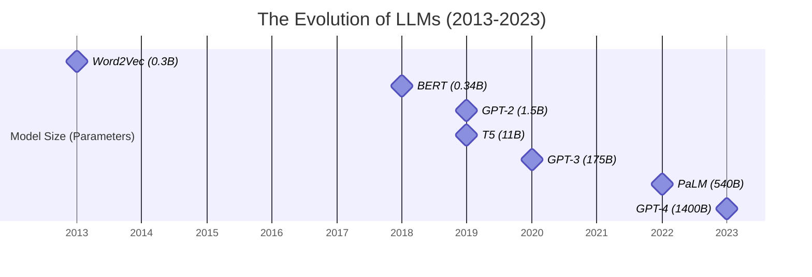
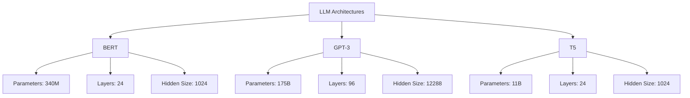

# Course Title: Comprehensive Basic Knowledge and Architectural Characteristics of LLMs


Welcome, future AI innovators! Today, we're diving deep into the fascinating world of Large Language Models (LLMs). We'll trace their exciting evolution, explore the revolutionary Transformer architecture, and uncover the key features that make these AI marvels tick. This journey will reveal how each breakthrough laid the foundation for the next, culminating in the powerful models we have today.

## Learning Objectives

By the end of this comprehensive lesson, you'll be able to:

1. Trace the evolution of LLMs, understanding how each development led to the next
2. Comprehend the Transformer architecture and why it was a game-changer
3. Analyze the critical architectural features that contribute to LLM performance
4. Gain hands-on experience with implementing basic LLM components
5. Critically evaluate the challenges and ethical considerations of scaling up these models

Let's embark on this exciting journey into the heart of modern AI!

## The Evolution of Large Language Models: A Technological Odyssey

Our story begins in the early days of Natural Language Processing (NLP) and charts the rapid, almost explosive development of LLMs over the past decade. Each step in this evolution solved problems from the previous stage, while also opening new possibilities and challenges.

### 2013: Word Embeddings - The Foundation of Modern NLP

Our journey starts in 2013 with the introduction of Word2Vec by Tomas Mikolov and his team at Google. This breakthrough was a response to a fundamental problem in NLP: how to represent words in a way that captures their meaning and relationships to other words.

Before Word2Vec, words were often represented using one-hot encoding, where each word was a long vector of zeros with a single one. This method couldn't capture any semantic relationships between words. Word2Vec solved this by representing words as dense vectors in a high-dimensional space.

Key innovations of Word2Vec:

1. Continuous vector representations of words
2. Capture of semantic relationships between words
3. Ability to perform "word algebra" (e.g., king - man + woman ≈ queen)

The impact: Word2Vec laid the groundwork for more sophisticated language understanding tasks. It allowed models to start grasping the meaning behind words, not just their surface-level appearance. This breakthrough was crucial for all future developments in NLP.

### 2018: BERT - Bidirectional Language Understanding

Fast forward to 2018, and we meet BERT (Bidirectional Encoder Representations from Transformers), developed by researchers at Google. BERT was a response to a limitation in previous models: they could only understand context in one direction (usually left-to-right).

BERT's key innovation was its ability to understand context from both left and right in a sentence simultaneously. This was achieved through a novel training approach called "masked language modeling," where the model had to predict masked words in a sentence using both left and right context.

Why BERT was a game-changer:

1. Bidirectional understanding led to more nuanced language comprehension
2. Pre-training on a large corpus of text allowed for better transfer learning
3. Achieved state-of-the-art results on a wide range of NLP tasks with minimal task-specific fine-tuning

The impact: BERT's success sparked a revolution in NLP. It showed that pre-training on large amounts of text could create models with a deep understanding of language, which could then be fine-tuned for specific tasks with remarkable results. This paved the way for even larger, more capable models.

### 2018-2023: The GPT Revolution

The GPT (Generative Pre-trained Transformer) series, starting with GPT in 2018 and culminating (so far) with GPT-4 in 2023, built upon the successes of BERT while focusing on generative tasks. Developed by OpenAI, each GPT model aimed to push the boundaries of what was possible with large-scale language models.

GPT (2018):

- Innovation: Large-scale unsupervised pre-training for language tasks
- Impact: Showed that a single model could be fine-tuned for various downstream tasks

GPT-2 (2019):

- Innovation: Scaled up the model size significantly (1.5 billion parameters)
- Impact: Demonstrated impressive text generation capabilities, raising both excitement and ethical concerns

GPT-3 (2020):

- Innovation: Massive scale-up to 175 billion parameters
- Impact: Showcased remarkable few-shot learning abilities across a wide range of tasks, reducing the need for task-specific fine-tuning

GPT-4 (2023):

- Innovation: Multimodal capabilities and even more advanced language understanding
- Impact: Demonstrated human-level performance on various benchmarks, blurring the lines between AI and human capabilities

The GPT series showed that scaling up model size and training data could lead to emergent abilities - capabilities that weren't explicitly programmed but arose from the model's vast knowledge and processing power.

### 2021: Beyond Text - Multimodal Learning

In 2021, models like DALL-E (OpenAI) and CLIP (OpenAI) extended the capabilities of language models to handle multiple types of data, including images. This was a response to the limitation of text-only models in a world where information is often conveyed through multiple modalities.

DALL-E:

- Innovation: Generating images from text descriptions
- Impact: Opened up new possibilities in AI-assisted creativity and design

CLIP:

- Innovation: Learning transferable visual concepts from natural language supervision
- Impact: Improved zero-shot learning in computer vision tasks

These multimodal models showed that the principles behind large language models could be extended to other domains, paving the way for more general artificial intelligence.

Now, let's visualize this incredible journey:



This timeline showcases the exponential growth in model size over just a decade. Each leap in size brought new capabilities and challenges, driving the field forward at a breakneck pace.

### What Fueled This Rapid Growth?

The rapid evolution of LLMs was driven by a convergence of several factors:

1. **Computing Power**: Advances in GPU technology allowed for training of larger models. This was crucial because larger models required computational resources that were simply not available earlier.

2. **Big Data**: The increasing digitization of information provided vast amounts of text data for training. This was necessary because larger models needed more data to reach their full potential.

3. **Architectural Innovations**: The Transformer architecture, introduced in 2017, was a game-changer. It allowed for more efficient processing of sequential data, making it possible to train much larger models.

4. **Improved Training Techniques**: Developments in optimization algorithms and training strategies helped in effectively training these massive models.

5. **Investment**: Growing interest from both academia and industry led to increased funding and resources for NLP research.

Each of these factors built upon the others. More computing power and data made it possible to train larger models, which drove architectural innovations, which in turn demanded even more computing power and data. This virtuous cycle propelled the field forward at an unprecedented rate.

In the next part of our lesson, we'll dive deep into the Transformer architecture that underpins these modern LLMs. We'll explore why it was such a revolutionary development and how it enables the impressive capabilities of today's language models.


Certainly! I'll continue with the next part of the lesson, focusing on the Transformer architecture and its impact on LLMs. I'll maintain the same approach of explaining the cause-and-effect relationships and the progression of ideas.

Part 2: The Transformer Architecture - A Revolution in NLP

## The Transformer Architecture: Breaking Down the Game-Changer

In 2017, a groundbreaking paper titled "Attention is All You Need" introduced the Transformer architecture. This innovation addressed several limitations of previous models and set the stage for the explosive growth in LLM capabilities. Let's break down why the Transformer was such a revolutionary development and how it works.

### The Problem: Limitations of Previous Architectures

Before the Transformer, the dominant architectures for sequence processing tasks were Recurrent Neural Networks (RNNs) and their variants like Long Short-Term Memory (LSTM) networks. While effective, these models had several drawbacks:

1. **Sequential Processing**: RNNs processed input sequences one element at a time, making them slow to train on large datasets.
2. **Difficulty with Long-Range Dependencies**: Despite innovations like LSTMs, these models still struggled to capture relationships between distant parts of a sequence.
3. **Limited Parallelization**: The sequential nature of RNNs made it difficult to leverage modern GPU hardware for parallel processing.

These limitations became increasingly problematic as researchers sought to train larger models on bigger datasets. The field was ripe for innovation.

### The Solution: Attention Mechanisms and Parallel Processing

The Transformer architecture introduced several key innovations that addressed these issues:

1. **Self-Attention Mechanism**: This allows the model to weigh the importance of different words in the input when processing each word, regardless of their distance in the sequence.
2. **Parallelization**: By replacing recurrence with attention, Transformers can process all input tokens simultaneously, greatly speeding up training and inference.
3. **Positional Encoding**: This clever technique allows the model to understand the order of words without relying on sequential processing.

Let's dive deeper into these components.

### Self-Attention: The Heart of the Transformer

The self-attention mechanism is the core innovation of the Transformer. Here's how it works:

1. For each word in the input, we create three vectors: Query (Q), Key (K), and Value (V).
2. We calculate attention scores between each word and every other word in the sequence.
3. These scores are used to create a weighted sum of the values, producing the output for each word.

This process allows each word to "pay attention" to other words in the sequence, capturing complex relationships and dependencies.

Let's visualize this with a simple example:

```python
import numpy as np
import matplotlib.pyplot as plt
import seaborn as sns

def self_attention(query, key, value):
    d_k = query.shape[-1]
    scores = np.matmul(query, key.transpose(-2, -1)) / np.sqrt(d_k)
    attention_weights = np.exp(scores) / np.sum(np.exp(scores), axis=-1, keepdims=True)
    return np.matmul(attention_weights, value), attention_weights

# Example sentence
sentence = "The cat sat on the mat"
words = sentence.split()

# Create dummy embeddings (in practice, these would be learned)
d_model = 64
embeddings = np.random.randn(len(words), d_model)

# Compute self-attention
output, weights = self_attention(embeddings, embeddings, embeddings)

# Visualize attention weights
plt.figure(figsize=(10, 8))
sns.heatmap(weights, annot=True, cmap='YlGnBu', xticklabels=words, yticklabels=words)
plt.title('Self-Attention Weights')
plt.xlabel('Key/Value Words')
plt.ylabel('Query Words')
plt.tight_layout()
plt.show()
```

This visualization demonstrates how each word attends to other words in the sentence. Darker colors indicate stronger attention.

### Multi-Head Attention: Capturing Different Aspects of Relationships

Building on the self-attention mechanism, the Transformer uses multi-head attention. This allows the model to focus on different aspects of the input simultaneously. It's like having multiple "experts" analyzing the same text from different perspectives.

The benefits of multi-head attention include:

1. Ability to capture various types of relationships (e.g., syntactic, semantic)
2. Improved model capacity without a proportional increase in computational cost
3. Enhanced stability and performance of the model

### Positional Encoding: Preserving Sequence Order

One challenge with the parallel processing of Transformers is the loss of sequential information. To address this, the authors introduced positional encodings. These are vectors added to the input embeddings that provide information about the position of each word in the sequence.

The clever design of these encodings allows the model to easily learn to attend to relative positions, enabling it to understand concepts like word order and proximity.

### Feed-Forward Networks and Layer Normalization

After the attention mechanism, each token goes through a feed-forward neural network. This allows the model to process the attended information further, introducing non-linearity and increasing the model's capacity to learn complex patterns.

Layer normalization is used throughout the model to stabilize the learning process, allowing for faster training of deep networks.

### Putting It All Together: The Transformer Block

Here's a simplified implementation of a Transformer block, incorporating these key components:

```python
import torch
import torch.nn as nn

class TransformerBlock(nn.Module):
    def __init__(self, d_model, num_heads, d_ff, dropout=0.1):
        super().__init__()
        self.attention = nn.MultiheadAttention(d_model, num_heads)
        self.norm1 = nn.LayerNorm(d_model)
        self.norm2 = nn.LayerNorm(d_model)
        self.feed_forward = nn.Sequential(
            nn.Linear(d_model, d_ff),
            nn.ReLU(),
            nn.Linear(d_ff, d_model)
        )
        self.dropout = nn.Dropout(dropout)

    def forward(self, x):
        # Self-attention
        attn_output, _ = self.attention(x, x, x)
        x = self.norm1(x + self.dropout(attn_output))
        
        # Feed-forward network
        ff_output = self.feed_forward(x)
        x = self.norm2(x + self.dropout(ff_output))
        
        return x

# Example usage
d_model = 512
num_heads = 8
d_ff = 2048
seq_length = 50
batch_size = 32

model = TransformerBlock(d_model, num_heads, d_ff)
x = torch.randn(seq_length, batch_size, d_model)
output = model(x)
print(f"Output shape: {output.shape}")
```

This implementation showcases the key components of a Transformer block: multi-head attention, feed-forward networks, and layer normalization.

### The Impact of Transformers

The introduction of the Transformer architecture had far-reaching consequences:

1. **Improved Performance**: Transformers achieved state-of-the-art results on various NLP tasks, outperforming previous architectures.
2. **Scalability**: The parallel nature of Transformers allowed for training much larger models on bigger datasets.
3. **Transfer Learning**: Pre-trained Transformer models could be fine-tuned for various downstream tasks, reducing the need for task-specific architectures.
4. **Cross-Modal Applications**: The attention mechanism proved useful beyond text, leading to applications in computer vision, speech recognition, and more.

The Transformer architecture laid the foundation for models like BERT, GPT, and T5, which have pushed the boundaries of what's possible in NLP. In the next part, we'll explore how these models built upon the Transformer to achieve their impressive capabilities.

Certainly, I'll continue with the next part of the lesson, focusing on how the Transformer architecture led to the development of modern LLMs. I'll include formulas where necessary but keep them to a minimum.

Part 3: From Transformers to Modern LLMs

## The Rise of Pre-trained Language Models

The Transformer architecture paved the way for a new paradigm in NLP: large-scale pre-training followed by task-specific fine-tuning. This approach led to the development of models that could understand and generate human-like text with unprecedented accuracy. Let's explore the key models that defined this era.

### BERT: Bidirectional Encoders for Deep Language Understanding

BERT (Bidirectional Encoder Representations from Transformers), introduced by Google in 2018, was a significant milestone in NLP. It addressed a crucial limitation of previous models: the inability to consider both left and right context simultaneously.

Key Innovations:

1. **Masked Language Model (MLM) Pre-training**: BERT is trained to predict randomly masked words in a sentence, allowing it to capture bidirectional context.
2. **Next Sentence Prediction (NSP)**: BERT is also trained to predict whether two sentences naturally follow each other, helping it understand relationships between sentences.

The MLM task can be formulated as:

P(w_i | w_1, ..., w_{i-1}, w_{i+1}, ..., w_n)

where w_i is the masked word, and the model predicts it based on all surrounding words.

Impact:

- BERT achieved state-of-the-art results on a wide range of NLP tasks with minimal task-specific modifications.
- It demonstrated the power of bidirectional context in language understanding.
- BERT's success sparked a wave of research into pre-trained language models.

### GPT: Generative Pre-trained Transformers

While BERT focused on language understanding, the GPT series, developed by OpenAI, emphasized generative capabilities. Each iteration of GPT pushed the boundaries of what was possible with large language models.

GPT (2018):

- Introduced the concept of large-scale unsupervised pre-training for language generation tasks.
- Used a unidirectional (left-to-right) Transformer decoder for pre-training.

GPT-2 (2019):

- Scaled up significantly (1.5 billion parameters).
- Demonstrated impressive zero-shot task performance.

GPT-3 (2020):

- Massive scale-up to 175 billion parameters.
- Showed remarkable few-shot learning abilities across various tasks.

The core idea behind GPT models is to predict the next word given the previous words:

P(w_t | w_1, ..., w_{t-1})

This autoregressive approach allows GPT models to generate coherent text by iteratively predicting the next word.

Impact:

- GPT models showcased the potential of scale in language modeling.
- They demonstrated emergent abilities: capabilities that weren't explicitly trained for but arose from the model's vast knowledge.
- GPT-3's few-shot learning capabilities opened up new possibilities for AI applications.

### T5: Text-to-Text Transfer Transformer

T5 (Text-to-Text Transfer Transformer), introduced by Google in 2019, took a unique approach by framing all NLP tasks as text-to-text problems. This unified framework allowed for a single model to be used for multiple tasks.

Key Innovation:

- All tasks are formulated as converting input text to output text, including classification tasks.

For example, a sentiment analysis task might be framed as:
Input: "classify sentiment: I love this movie!"
Output: "positive"

Impact:

- T5 achieved state-of-the-art results on many NLP benchmarks.
- It demonstrated the versatility of the text-to-text framework.
- The unified approach simplified the process of applying the model to new tasks.

### Architectural Characteristics of Modern LLMs

As these models evolved, certain architectural characteristics emerged as crucial for their performance:

1. **Model Size**: The number of parameters in the model, often in billions.
2. **Depth**: The number of layers in the model.
3. **Width**: The dimensionality of hidden states and embeddings.
4. **Attention Heads**: The number of parallel attention mechanisms.
5. **Vocabulary Size**: The number of unique tokens the model can process.

Let's compare some popular LLMs:



This comparison illustrates the dramatic increase in model size and complexity from BERT to GPT-3.

### Scaling Laws and Emergent Abilities

Research has shown that model performance tends to follow power-law scaling with respect to model size, dataset size, and compute budget. This relationship can be approximately described as:

Loss ≈ (C / C_0)^(-α)

where C is the compute used for training, C_0 is a constant, and α is the scaling exponent.

This scaling law has led to the observation of emergent abilities in very large models - capabilities that smaller models don't exhibit and that weren't explicitly trained for. Examples include few-shot learning and task-agnostic performance improvements.

In the next part, we'll explore the challenges and future directions of LLMs, including ethical considerations and potential future developments.

The future of LLMs is marked by several exciting developments:
Certainly. Let's continue with the final part of our lesson, focusing on the challenges, ethical considerations, and future directions of Large Language Models.

Part 4: Challenges, Ethics, and Future Directions of LLMs

## The Double-Edged Sword: Challenges and Ethical Considerations

As LLMs have grown in capability and prominence, they've also brought to light significant challenges and ethical concerns. Understanding these issues is crucial for responsible development and deployment of AI technologies.

### Computational Resources and Environmental Impact

The training of large language models requires enormous computational resources. This raises several issues:

1. **Energy Consumption**: Training a model like GPT-3 can consume as much energy as 126 homes use in a year.

2. **Carbon Footprint**: The carbon emissions associated with training large models can be substantial. For example:

```python
def estimate_carbon_emissions(training_time_hours, gpu_count, gpu_type="V100"):
    power_consumption = {"V100": 300, "A100": 400}  # Watts
    total_energy = training_time_hours * gpu_count * power_consumption[gpu_type] / 1000  # kWh
    carbon_intensity = 475  # gCO2eq/kWh (global average)
    carbon_emissions = total_energy * carbon_intensity / 1000  # kgCO2eq
    return carbon_emissions

# Estimate for training a large language model
training_time = 720  # 30 days
gpu_count = 64
emissions = estimate_carbon_emissions(training_time, gpu_count)
print(f"Estimated carbon emissions: {emissions:.2f} kgCO2eq")
```

3. **Accessibility**: The resources required to train and run these models limit their development to well-funded organizations, potentially exacerbating AI inequality.

### Bias and Fairness

LLMs trained on internet data can inherit and amplify societal biases present in their training data. This can lead to unfair or discriminatory outcomes when these models are deployed in real-world applications.

Example of potential bias:

```python
from transformers import pipeline

unmasker = pipeline('fill-mask', model='bert-base-uncased')

sentences = [
    "The doctor said [MASK] would be back with the test results soon.",
    "The nurse told me [MASK] would be administering the medication."
]

for sentence in sentences:
    results = unmasker(sentence)
    print(f"Sentence: {sentence}")
    for result in results[:3]:
        print(f"  {result['token_str']}: {result['score']:.4f}")
    print()
```

This example might reveal gender biases in the model's predictions, highlighting the need for careful evaluation and mitigation strategies.

### Privacy and Data Rights

LLMs trained on vast amounts of internet data raise concerns about privacy and data rights:

1. **Data Scraping**: The practice of scraping web data for training raises questions about consent and copyright.
2. **Memorization**: Large models might memorize and reproduce sensitive information from their training data.
3. **Generated Content**: As models become better at generating human-like text, there are concerns about misuse for creating fake news or impersonating individuals.

### Interpretability and Explainability

As LLMs grow more complex, understanding why they make certain decisions becomes increasingly challenging. This "black box" nature can be problematic in critical applications where explainability is crucial.

## Future Directions: The Road Ahead for LLMs

Despite these challenges, the field of LLMs continues to evolve rapidly. Here are some exciting directions for future research and development:

### Efficient Architectures

Researchers are exploring ways to create more efficient models that maintain performance while reducing computational requirements. Examples include:

1. **Sparse Transformers**: Using sparse attention mechanisms to reduce computational complexity.
2. **Distillation**: Creating smaller, faster models that retain much of the knowledge of larger models.
3. **Mixture of Experts**: Activating only a subset of the model for each input, allowing for much larger models with lower computational costs.

### Multimodal Models

Future LLMs may not be limited to text alone. We're seeing increasing interest in models that can process and generate multiple types of data:

1. **Text and Images**: Models like DALL-E that can generate images from text descriptions.
2. **Text and Audio**: Models that can understand and generate both text and speech.
3. **Text, Image, and Video**: Models that can comprehend and create multimedia content.

### Few-Shot and Zero-Shot Learning

Improving models' ability to perform well on new tasks with minimal or no task-specific training data:

1. **In-Context Learning**: Enhancing models' ability to adapt to new tasks based on a few examples provided in the input.
2. **Task-Agnostic Models**: Developing models that can generalize across a wide range of tasks without specific fine-tuning.

### Ethical AI and Responsible Development

As the impact of LLMs grows, so does the focus on developing these technologies responsibly:

1. **Bias Mitigation**: Developing techniques to detect and mitigate biases in models and training data.
2. **Green AI**: Exploring more energy-efficient training methods and architectures.
3. **Privacy-Preserving Machine Learning**: Techniques like federated learning to train models while preserving data privacy.
4. **Interpretable AI**: Developing methods to make model decisions more transparent and explainable.

## Conclusion: The Ongoing LLM Revolution

As we conclude our journey through the world of Large Language Models, it's clear that we're in the midst of an ongoing revolution in AI and NLP. From the foundational innovations of word embeddings to the current state-of-the-art models capable of human-like text generation, the field has progressed at an astonishing pace.

The development of LLMs has opened up new possibilities in areas like:

- Automated content creation
- Advanced language translation
- Personalized education
- AI-assisted scientific research

However, with great power comes great responsibility. As we continue to push the boundaries of what's possible with LLMs, it's crucial that we also grapple with the ethical implications and potential societal impacts of these technologies.

As future AI innovators, you have the opportunity to shape the direction of this field. Whether you're interested in advancing the technical capabilities of LLMs, exploring their applications in various domains, or working on making AI more ethical and accessible, there's no shortage of exciting challenges ahead.

Remember, the field of LLMs is interdisciplinary, drawing from computer science, linguistics, neuroscience, ethics, and more. As you continue your journey in this field, don't hesitate to draw connections to other areas of study and consider the broader implications of your work.

The future of AI and NLP is bright, and with your knowledge and creativity, you can be part of shaping that future. Keep learning, stay curious, and always strive to develop AI technologies that benefit humanity as a whole.
