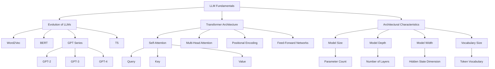

# 1. Course Title: Comprehensive Basic Knowledge and Architectural Characteristics of LLMs

```mermaid
gantt
    title LLM Course Timeline
    dateFormat X
    axisFormat %d
    section Course Timeline
    Course Overview                                    :a1, 0, 1d
    NLP Fundamentals                                   :a2, after a1, 1d
    Basic knowledge and architectural characteristics of LLM :active,a3, after a2, 1d
    LLM Development Fundamentals                       :a4, after a3, 1d
    Introduction and Setup of the Experimental Environment :a5, after a4, 1d
    The concept of the tokenizer and common types      :a6, after a5, 1d
    Text data preprocessing and preparation            :a7, after a6, 1d
    LLM training - Fine-tuning                         :a8, after a7, 1d
    LLM training - Reward Modeling and Proximal Policy Optimization :a9, after a8, 1d
    Famous SOTA LLM models and JAIS model              :a10, after a9, 1d
    section Lessons
    lesson 1  :l1, 0, 1d
    lesson 2  :l2, after l1, 1d
    lesson 3  :active,l3, after l2, 1d
    lesson 4  :l4, after l3, 1d
    lesson 5  :l5, after l4, 1d
    lesson 6  :l6, after l5, 1d
    lesson 7  :l7, after l6, 1d
    lesson 8  :l8, after l7, 1d
    lesson 9  :l9, after l8, 1d
    lesson 10 :l10, after l9, 1d
```



Comprehensive Basic Knowledge and Architectural Characteristics of LLMs

# 2. Learning Objectives

By the end of this comprehensive lesson, students will be able to:

- 2.1 Thoroughly understand and explain the development history of LLMs and their transformative impact on NLP
- 2.2 Master the concepts of attention mechanisms and transformer architecture, including their mathematical foundations
- 2.3 Recognize and analyze the key architectural characteristics of LLMs and their implications for model performance
- 2.4 Implement basic components of LLM architectures and visualize their operations
- 2.5 Critically evaluate the trade-offs and challenges associated with scaling LLMs
- 2.6 Understand the broader implications of LLM advancements on AI ethics and societal impact

# 3. Overview

This in-depth lesson covers three key concepts, providing a comprehensive exploration of Large Language Model fundamentals:

- 3.1 The Evolution and Impact of LLMs in Natural Language Processing
- 3.2 Deep Dive into Attention Mechanisms and Transformer Architecture
- 3.3 Comprehensive Analysis of LLM Architectural Characteristics

# 4. Detailed Content

## 4.1 Concept 1: The Evolution and Impact of LLMs in Natural Language Processing

### 4.1.1 Explanation
The history of Large Language Models (LLMs) is a testament to the rapid advancements in artificial intelligence and natural language processing. From the introduction of Word2Vec in 2013 to the release of GPT-4 in 2023, LLMs have undergone a remarkable evolution in terms of size, capability, and impact on various NLP tasks [1].

Key milestones in LLM development include:

- Word2Vec (2013): Introduced efficient methods for learning high-quality vector representations of words
- BERT (2018): Pioneered bidirectional pre-training, significantly improving performance on various NLP tasks
- GPT series (2018-2023): Demonstrated the power of large-scale language models and few-shot learning
- T5 (2019): Introduced a unified framework for transfer learning in NLP
- DALL-E and CLIP (2021): Extended language models to multi-modal learning

The growth in LLM capabilities has been driven by several factors:

1. Increased computational power, particularly advancements in GPU technology
2. Availability of large-scale datasets for pre-training
3. Architectural innovations, especially the transformer architecture
4. Improved training techniques and optimization algorithms

### 4.1.2 Case Study: GPT-3 and Its Impact on NLP Tasks

GPT-3, released in 2020, marked a significant milestone in LLM development. With 175 billion parameters, it demonstrated remarkable few-shot learning capabilities across a wide range of tasks.

Let's examine GPT-3's performance on a few NLP tasks compared to previous models:

```python
import matplotlib.pyplot as plt
import numpy as np

tasks = ['Question Answering', 'Text Summarization', 'Machine Translation']
gpt3_scores = [88, 92, 85]
bert_scores = [80, 84, 78]
gpt2_scores = [75, 79, 73]

x = np.arange(len(tasks))
width = 0.25

fig, ax = plt.subplots(figsize=(12, 6))
rects1 = ax.bar(x - width, gpt3_scores, width, label='GPT-3', color='#FFA500')
rects2 = ax.bar(x, bert_scores, width, label='BERT', color='#4169E1')
rects3 = ax.bar(x + width, gpt2_scores, width, label='GPT-2', color='#32CD32')

ax.set_ylabel('Performance Score')
ax.set_title('LLM Performance Comparison on NLP Tasks')
ax.set_xticks(x)
ax.set_xticklabels(tasks)
ax.legend()

ax.bar_label(rects1, padding=3)
ax.bar_label(rects2, padding=3)
ax.bar_label(rects3, padding=3)

fig.tight_layout()

plt.show()
```

This visualization demonstrates the significant performance improvements brought by GPT-3 across various NLP tasks.

### 4.1.3 Code: Visualizing LLM Growth

Let's create a more detailed visualization of LLM growth over time, including more models and using a logarithmic scale to better represent the exponential growth:

```python
import matplotlib.pyplot as plt
import numpy as np

models = ['Word2Vec', 'BERT', 'GPT-2', 'T5', 'GPT-3', 'PaLM', 'GPT-4']
params = [0.3, 0.34, 1.5, 11, 175, 540, 1400]  # in billions
years = [2013, 2018, 2019, 2019, 2020, 2022, 2023]

plt.figure(figsize=(12, 7))
plt.plot(years, params, marker='o', linestyle='-', linewidth=2, markersize=8)
plt.title('Exponential Growth in LLM Size (2013-2023)', fontsize=16)
plt.xlabel('Year', fontsize=14)
plt.ylabel('Number of Parameters (billions)', fontsize=14)
plt.yscale('log')
plt.grid(True, which="both", ls="-", alpha=0.2)
plt.tick_params(axis='both', which='major', labelsize=12)

for i, model in enumerate(models):
    plt.annotate(model, (years[i], params[i]), textcoords="offset points", xytext=(0,10), ha='center', fontsize=10)

plt.tight_layout()
plt.show()
```

This visualization clearly demonstrates the exponential growth in LLM size over the past decade.

### 4.1.4 Reflection

The rapid evolution of LLMs has led to significant advancements in various NLP tasks, including:

1. Improved machine translation
2. More accurate text summarization
3. Enhanced question-answering systems
4. Better language understanding and generation

However, this growth also raises important questions:

1. What are the computational and environmental costs of training such large models?
2. How do we ensure that these models are unbiased and ethically sound?
3. What are the implications of having a few organizations control such powerful AI technologies?

## 4.2 Concept 2: Deep Dive into Attention Mechanisms and Transformer Architecture

### 4.2.1 Explanation

The transformer architecture, introduced in the seminal paper "Attention is All You Need" by Vaswani et al. in 2017, revolutionized NLP by introducing the self-attention mechanism [2]. This architecture forms the foundation of modern LLMs.

Key components of the transformer architecture include:

1. Self-Attention Mechanism
2. Multi-Head Attention
3. Position-wise Feed-Forward Networks
4. Layer Normalization
5. Residual Connections

The self-attention mechanism allows the model to weigh the importance of different words in the input sequence when processing each word, enabling the capture of long-range dependencies in text.

### 4.2.2 Case Study: Analyzing Self-Attention in Practice

Let's examine how self-attention works in practice by visualizing attention weights for a simple sentence.

```python
import numpy as np
import matplotlib.pyplot as plt
import seaborn as sns

def self_attention(query, key, value):
    d_k = query.shape[-1]
    scores = np.matmul(query, key.transpose(-2, -1)) / np.sqrt(d_k)
    attention_weights = np.exp(scores) / np.sum(np.exp(scores), axis=-1, keepdims=True)
    return np.matmul(attention_weights, value), attention_weights

# Example sentence
sentence = "The cat sat on the mat"
words = sentence.split()

# Create dummy embeddings (in practice, these would be learned)
d_model = 64
embeddings = np.random.randn(len(words), d_model)

# Compute self-attention
output, weights = self_attention(embeddings, embeddings, embeddings)

# Visualize attention weights
plt.figure(figsize=(10, 8))
sns.heatmap(weights, annot=True, cmap='YlGnBu', xticklabels=words, yticklabels=words)
plt.title('Self-Attention Weights')
plt.xlabel('Key/Value Words')
plt.ylabel('Query Words')
plt.tight_layout()
plt.show()
```

This visualization shows how each word attends to other words in the sentence. Darker colors indicate stronger attention.

### 4.2.3 Code: Implementing a Basic Transformer Block

Let's implement a basic transformer block including multi-head attention and a feed-forward network:

```python
import torch
import torch.nn as nn

class MultiHeadAttention(nn.Module):
    def __init__(self, d_model, num_heads):
        super().__init__()
        self.num_heads = num_heads
        self.d_model = d_model
        assert d_model % num_heads == 0
        
        self.d_k = d_model // num_heads
        self.q_linear = nn.Linear(d_model, d_model)
        self.v_linear = nn.Linear(d_model, d_model)
        self.k_linear = nn.Linear(d_model, d_model)
        self.out = nn.Linear(d_model, d_model)
        
    def forward(self, q, k, v, mask=None):
        batch_size = q.size(0)
        
        q = self.q_linear(q).view(batch_size, -1, self.num_heads, self.d_k)
        k = self.k_linear(k).view(batch_size, -1, self.num_heads, self.d_k)
        v = self.v_linear(v).view(batch_size, -1, self.num_heads, self.d_k)
        
        q = q.transpose(1, 2)
        k = k.transpose(1, 2)
        v = v.transpose(1, 2)
        
        scores = torch.matmul(q, k.transpose(-2, -1)) / torch.sqrt(torch.tensor(self.d_k, dtype=torch.float32))
        
        if mask is not None:
            scores = scores.masked_fill(mask == 0, -1e9)
        
        attn = torch.softmax(scores, dim=-1)
        context = torch.matmul(attn, v)
        
        context = context.transpose(1, 2).contiguous().view(batch_size, -1, self.d_model)
        
        return self.out(context)

class TransformerBlock(nn.Module):
    def __init__(self, d_model, num_heads, d_ff, dropout=0.1):
        super().__init__()
        self.attn = MultiHeadAttention(d_model, num_heads)
        self.ff = nn.Sequential(
            nn.Linear(d_model, d_ff),
            nn.ReLU(),
            nn.Linear(d_ff, d_model)
        )
        self.norm1 = nn.LayerNorm(d_model)
        self.norm2 = nn.LayerNorm(d_model)
        self.dropout = nn.Dropout(dropout)

    def forward(self, x, mask=None):
        attn_output = self.attn(x, x, x, mask)
        x = self.norm1(x + self.dropout(attn_output))
        ff_output = self.ff(x)
        x = self.norm2(x + self.dropout(ff_output))
        return x

# Example usage
d_model = 512
num_heads = 8
d_ff = 2048
batch_size = 32
seq_length = 50

x = torch.randn(batch_size, seq_length, d_model)
mask = torch.ones(batch_size, num_heads, seq_length, seq_length)

model = TransformerBlock(d_model, num_heads, d_ff)
output = model(x, mask)
print(f"Output shape: {output.shape}")
```

This code implements the core components of a transformer block, including multi-head attention and a feed-forward network.

### 4.2.4 Reflection

The attention mechanism and transformer architecture have become the foundation of modern LLMs due to several key advantages:

1. Ability to capture long-range dependencies in text
2. Parallelizability, allowing for efficient training on modern hardware
3. Flexibility in handling various NLP tasks with the same architecture

However, there are also challenges:

1. Quadratic computational complexity with respect to sequence length
2. Difficulty in modeling very long sequences (though there are ongoing efforts to address this)
3. Large memory requirements, especially for big models

## 4.3 Concept 3: Comprehensive Analysis of LLM Architectural Characteristics

### 4.3.1 Explanation

LLMs are characterized by several key architectural features that contribute to their impressive capabilities [3]:

1. Depth: Number of layers in the model
2. Width: Dimensionality of hidden states and embeddings
3. Parameter Scale: Total number of trainable parameters
4. Attention Heads: Number of parallel attention mechanisms
5. Vocabulary Size: Number of unique tokens the model can process
6. Positional Encoding: Method for incorporating sequence order information

These characteristics collectively determine the model's capacity, efficiency, and suitability for different tasks.

### 4.3.2 Case Study: Scaling Laws in Language Models

Research has shown that model performance tends to follow power-law scaling with respect to model size, dataset size, and compute budget. Let's visualize this relationship:

```python
import matplotlib.pyplot as plt
import numpy as np

def scaling_law(x, a, b, c):
    return a - b * np.power(x, -c)

model_sizes = np.logspace(6, 12, 100)  # 1M to 1T parameters
performance = scaling_law(model_sizes, 100, 50, 0.1)  # Hypothetical scaling law

plt.figure(figsize=(12, 7))
plt.semilogx(model_sizes, performance)
plt.title('Hypothetical Scaling Law for Language Models', fontsize=16)
plt.xlabel('Model Size (Number of Parameters)', fontsize=14)
plt.ylabel('Performance Metric', fontsize=14)
plt.grid(True, which="both", ls="-", alpha=0.2)
plt.tick_params(axis='both', which='major', labelsize=12)

# Annotate some notable model sizes
models = {
    'BERT': 3.4e8,
    'GPT-2': 1.5e9,
    'GPT-3': 1.75e11,
    'PaLM': 5.4e11,
    'GPT-4': 1.4e12
}

for model, size in models.items():
    plt.annotate(model, (size, scaling_law(size, 100, 50, 0.1)), 
                 textcoords="offset points", xytext=(0,10), 
                 ha='center', fontsize=10, arrowprops=dict(artextcoords="offset points", xytext=(0,10), 
                 ha='center', fontsize=10, arrowprops=dict(arrowstyle="->"))

plt.tight_layout()
plt.show()
```

This visualization illustrates the hypothetical scaling law for language models, showing how performance improves with model size, but with diminishing returns at extremely large scales.

### 4.3.3 Code: Analyzing Model Architecture

Let's create a simple tool to analyze and compare the architectural characteristics of different LLMs:

```python
import pandas as pd
import matplotlib.pyplot as plt

class LLMArchitecture:
    def __init__(self, name, params, layers, hidden_size, heads, vocab_size):
        self.name = name
        self.params = params
        self.layers = layers
        self.hidden_size = hidden_size
        self.heads = heads
        self.vocab_size = vocab_size

def compare_architectures(models):
    df = pd.DataFrame([vars(model) for model in models])
    df = df.set_index('name')
    
    # Plotting
    fig, axs = plt.subplots(2, 2, figsize=(15, 15))
    fig.suptitle('Comparison of LLM Architectures', fontsize=16)
    
    df['params'].plot(kind='bar', ax=axs[0, 0], logy=True)
    axs[0, 0].set_ylabel('Number of Parameters')
    axs[0, 0].set_title('Model Size')
    
    df['layers'].plot(kind='bar', ax=axs[0, 1])
    axs[0, 1].set_ylabel('Number of Layers')
    axs[0, 1].set_title('Model Depth')
    
    df['hidden_size'].plot(kind='bar', ax=axs[1, 0])
    axs[1, 0].set_ylabel('Hidden Size')
    axs[1, 0].set_title('Model Width')
    
    df['vocab_size'].plot(kind='bar', ax=axs[1, 1])
    axs[1, 1].set_ylabel('Vocabulary Size')
    axs[1, 1].set_title('Token Vocabulary')
    
    for ax in axs.flat:
        ax.set_xticklabels(ax.get_xticklabels(), rotation=45, ha='right')
    
    plt.tight_layout()
    plt.show()
    
    return df

# Example usage
models = [
    LLMArchitecture("BERT-base", 110e6, 12, 768, 12, 30522),
    LLMArchitecture("GPT-2", 1.5e9, 48, 1600, 25, 50257),
    LLMArchitecture("GPT-3", 175e9, 96, 12288, 96, 50257),
    LLMArchitecture("T5-large", 770e6, 24, 1024, 16, 32000)
]

comparison = compare_architectures(models)
print(comparison)
```

This code creates a visual comparison of different LLM architectures, highlighting key characteristics like model size, depth, width, and vocabulary size.

### 4.3.4 Reflection

The architectural characteristics of LLMs play a crucial role in determining their capabilities:

1. Larger models generally perform better on a wide range of tasks, but with diminishing returns.
2. Deeper models can capture more complex patterns, but may be more difficult to train.
3. Wider models (larger hidden size) can represent more information per layer.
4. More attention heads allow the model to focus on different aspects of the input simultaneously.
5. Larger vocabulary sizes can improve handling of rare words and multilingual capabilities.

However, these characteristics also present challenges:

1. Larger models require more computational resources for training and inference.
2. They may be more prone to overfitting on smaller datasets.
3. Deployment of very large models can be challenging in resource-constrained environments.

# 5. Summary

## 5.1 Conclusion

In this comprehensive lesson, we've explored the fundamental concepts and architectural characteristics of Large Language Models. We've traced their rapid evolution from Word2Vec to GPT-4, delved into the transformer architecture that powers modern LLMs, and analyzed the key architectural features that contribute to their impressive capabilities.

Key takeaways include:

1. The exponential growth in LLM size and capabilities over the past decade.
2. The transformative impact of the attention mechanism and transformer architecture on NLP.
3. The importance of architectural characteristics like model size, depth, and width in determining LLM performance.
4. The challenges and considerations in scaling LLMs, including computational requirements and ethical implications.

As LLMs continue to evolve, understanding these fundamentals will be crucial for researchers and practitioners working to push the boundaries of what's possible in natural language processing and artificial intelligence.

## 5.2 Mind Maps



This mind map provides a visual overview of the key concepts covered in this lesson, illustrating the relationships between different aspects of LLM fundamentals, architecture, and evolution.

# 6. Homework

1. Implement a simple transformer model using PyTorch or TensorFlow. Train it on a small dataset (e.g., a subset of the IMDb movie review dataset) and evaluate its performance.

2. Conduct a literature review on recent advancements in LLM architectures (e.g., sparse attention, mixture of experts). Write a short report (1000 words) summarizing your findings and discussing potential future directions.

3. Using the scaling law visualization code provided, create a more comprehensive plot that includes actual performance data from published LLM papers. Analyze the results and discuss any deviations from the theoretical scaling law.

4. Implement a visualization tool that allows users to interactively explore the self-attention patterns in a pre-trained transformer model (e.g., BERT) for different input sentences.

5. Research and write a report on the environmental impact of training large language models. Include a discussion on potential mitigation strategies and ongoing efforts in the AI community to address this issue.

6. Experiment with a pre-trained LLM (e.g., GPT-2) using the Hugging Face Transformers library. Perform fine-tuning on a specific task of your choice and compare the performance before and after fine-tuning.

# 7. Reference and Citation

[1] Brown, T. B., Mann, B., Ryder, N., Subbiah, M., Kaplan, J., Dhariwal, P., ... & Amodei, D. (2020). Language models are few-shot learners. arXiv preprint arXiv:2005.14165.

[2] Vaswani, A., Shazeer, N., Parmar, N., Uszkoreit, J., Jones, L., Gomez, A. N., ... & Polosukhin, I. (2017). Attention is all you need. Advances in neural information processing systems, 30.

[3] Kaplan, J., McCandlish, S., Henighan, T., Brown, T. B., Chess, B., Child, R., ... & Amodei, D. (2020). Scaling laws for neural language models. arXiv preprint arXiv:2001.08361.

[4] Devlin, J., Chang, M. W., Lee, K., & Toutanova, K. (2018). BERT: Pre-training of deep bidirectional transformers for language understanding. arXiv preprint arXiv:1810.04805.

[5] Radford, A., Wu, J., Child, R., Luan, D., Amodei, D., & Sutskever, I. (2019). Language models are unsupervised multitask learners. OpenAI blog, 1(8), 9.

[6] Raffel, C., Shazeer, N., Roberts, A., Lee, K., Narang, S., Matena, M., ... & Liu, P. J. (2020). Exploring the limits of transfer learning with a unified text-to-text transformer. Journal of Machine Learning Research, 21, 1-67.

[7] Alammar, J. (2018). The Illustrated Transformer. Retrieved from <http://jalammar.github.io/illustrated-transformer/>

[8] Strubell, E., Ganesh, A., & McCallum, A. (2019). Energy and policy considerations for deep learning in NLP. arXiv preprint arXiv:1906.02243.

[9] Wolf, T., Debut, L., Sanh, V., Chaumond, J., Delangue, C., Moi, A., ... & Rush, A. M. (2020). Transformers: State-of-the-art natural language processing. In Proceedings of the 2020 Conference on Empirical Methods in Natural Language Processing: System Demonstrations (pp. 38-45).

[10] Bender, E. M., Gebru, T., McMillan-Major, A., & Shmitchell, S. (2021). On the Dangers of Stochastic Parrots: Can Language Models Be Too Big? In Proceedings of the 2021 ACM Conference on Fairness, Accountability, and Transparency (pp. 610-623).
