# 1.Course Title: Comprehensive LLM Development Fundamentals

```mermaid
gantt
    title LLM Course Timeline
    dateFormat X
    axisFormat %d
    section Course Timeline
    Course Overview                                    :a1, 0, 1d
    NLP Fundamentals                                   :a2, after a1, 1d
    Basic knowledge and architectural characteristics of LLM :a3, after a2, 1d
    LLM Development Fundamentals                       :active,a4, after a3, 1d
    Introduction and Setup of the Experimental Environment :a5, after a4, 1d
    The concept of the tokenizer and common types      :a6, after a5, 1d
    Text data preprocessing and preparation            :a7, after a6, 1d
    LLM training - Fine-tuning                         :a8, after a7, 1d
    LLM training - Reward Modeling and Proximal Policy Optimization :a9, after a8, 1d
    Famous SOTA LLM models and JAIS model              :a10, after a9, 1d
    section Lessons
    lesson 1  :l1, 0, 1d
    lesson 2  :l2, after l1, 1d
    lesson 3  :l3, after l2, 1d
    lesson 4  :active,l4, after l3, 1d
    lesson 5  :l5, after l4, 1d
    lesson 6  :l6, after l5, 1d
    lesson 7  :l7, after l6, 1d
    lesson 8  :l8, after l7, 1d
    lesson 9  :l9, after l8, 1d
    lesson 10 :l10, after l9, 1d
```



Advanced Fundamentals of Large Language Model Development

# 2. Learning Objectives

By the end of this comprehensive lesson, students will be able to:

2.1 Thoroughly understand and explain the LLM development pipeline
2.2 Master key concepts including tokenization, prompting, and fine-tuning
2.3 Implement and apply advanced techniques such as reward modeling and model quantization
2.4 Critically evaluate different approaches in LLM development and their trade-offs
2.5 Design and execute experiments to test LLM performance and behavior
2.6 Understand the ethical implications and challenges in LLM development

# 3. Overview

This in-depth lesson covers eight key concepts, providing a comprehensive exploration of LLM development fundamentals:

3.1 Advanced Tokenization Techniques
3.2 Sophisticated Prompting Strategies
3.3 Comprehensive Data Preparation and Preprocessing
3.4 In-depth Pre-training Methodologies
3.5 Advanced Fine-tuning Techniques
3.6 Reward Modeling and Reinforcement Learning in LLMs
3.7 Efficient Model Quantization Strategies
3.8 Accurate Model Performance Estimation and Evaluation

# 4. Detailed Content

## 4.1 Concept 1: Advanced Tokenization Techniques

### 4.1.1 Explanation

Tokenization is the foundational process of converting raw text into a sequence of tokens that the model can process. It's a crucial step that significantly influences the model's ability to understand and generate text. Advanced tokenization techniques go beyond simple word or character splitting, employing sophisticated algorithms to capture semantic and syntactic information [1].

Key aspects of advanced tokenization include:

- Subword tokenization algorithms (BPE, WordPiece, SentencePiece)
- Handling of out-of-vocabulary words
- Multilingual tokenization
- Special token management (e.g., [CLS], [SEP], [MASK])
- Impact of tokenization on model performance and training efficiency

### 4.1.2 Case Study: Multilingual Tokenization for Global Language Models

Imagine you're developing a language model that needs to handle multiple languages, including those with non-Latin scripts. Your tokenization strategy needs to effectively handle a diverse range of linguistic structures and writing systems.

### 4.1.3 Code: Advanced Tokenization Examples

```python
from transformers import AutoTokenizer
import torch
from typing import List, Dict
import matplotlib.pyplot as plt

class AdvancedTokenizationDemo:
    def __init__(self, model_names: List[str]):
        self.tokenizers = {name: AutoTokenizer.from_pretrained(name) for name in model_names}
    
    def compare_tokenization(self, text: str):
        results = {}
        for name, tokenizer in self.tokenizers.items():
            tokens = tokenizer.tokenize(text)
            token_ids = tokenizer.encode(text)
            results[name] = {
                'tokens': tokens,
                'token_ids': token_ids,
                'vocab_size': tokenizer.vocab_size,
                'unk_token': tokenizer.unk_token,
            }
        return results
    
    def analyze_tokenization(self, text: str):
        results = self.compare_tokenization(text)
        for name, result in results.items():
            print(f"\nTokenization with {name}:")
            print(f"Tokens: {result['tokens']}")
            print(f"Token IDs: {result['token_ids']}")
            print(f"Vocabulary Size: {result['vocab_size']}")
            print(f"Unknown Token: {result['unk_token']}")
    
    def visualize_token_lengths(self, text: str):
        results = self.compare_tokenization(text)
        plt.figure(figsize=(10, 6))
        for name, result in results.items():
            plt.hist([len(token) for token in result['tokens']], bins=range(1, 20), alpha=0.5, label=name)
        plt.xlabel('Token Length')
        plt.ylabel('Frequency')
        plt.title('Distribution of Token Lengths')
        plt.legend()
        plt.show()
    
    def handle_out_of_vocabulary(self, text: str):
        results = {}
        for name, tokenizer in self.tokenizers.items():
            tokens = tokenizer.tokenize(text)
            unk_token = tokenizer.unk_token
            oov_tokens = [token for token in tokens if token == unk_token]
            results[name] = {
                'oov_count': len(oov_tokens),
                'oov_ratio': len(oov_tokens) / len(tokens)
            }
        return results

# Usage example
demo = AdvancedTokenizationDemo(['bert-base-uncased', 'gpt2', 'xlm-roberta-base'])

# Compare tokenization across models
text = "The quick brown fox jumps over the lazy dog. 这是一个多语言的例子。"
demo.analyze_tokenization(text)

# Visualize token length distribution
demo.visualize_token_lengths(text)

# Handle out-of-vocabulary words
rare_text = "The supercalifragilisticexpialidocious AI model achieved state-of-the-art results."
oov_results = demo.handle_out_of_vocabulary(rare_text)
for name, result in oov_results.items():
    print(f"\n{name}:")
    print(f"OOV tokens: {result['oov_count']}")
    print(f"OOV ratio: {result['oov_ratio']:.2%}")
```

This code demonstrates advanced tokenization techniques, including comparison of different tokenizers, visualization of token length distributions, and handling of out-of-vocabulary words.

### 4.1.4 Reflection

Advanced tokenization techniques play a crucial role in the performance and capabilities of LLMs. The choice of tokenization strategy can significantly impact a model's ability to handle different languages, rare words, and complex linguistic structures.

Consider the following questions:

1. How does the choice of tokenization algorithm affect a model's performance on different languages or domains?
2. What are the trade-offs between using a large vocabulary with simple tokenization versus a smaller vocabulary with subword tokenization?
3. How might tokenization strategies need to evolve to better handle code, mathematical expressions, or other specialized text formats in LLMs?

## 4.2 Concept 2: Sophisticated Prompting Strategies

### 4.2.1 Explanation

Prompting is a powerful technique that allows LLMs to perform a wide range of tasks without additional training. Sophisticated prompting strategies go beyond simple text completion, enabling complex reasoning, task decomposition, and even self-improvement [2].

Key aspects of advanced prompting include:

- Zero-shot and few-shot learning
- Chain-of-thought prompting
- Self-consistency and multiple path reasoning
- Prompt engineering and optimization
- Task decomposition through prompting
- Ethical considerations in prompt design

### 4.2.2 Case Study: Developing a Complex Reasoning System

Imagine you're building a system that needs to perform complex logical reasoning tasks, such as solving multi-step math problems or analyzing legal documents. You need to design prompting strategies that can guide the model through the reasoning process step-by-step.

### 4.2.3 Code: Advanced Prompting Techniques

```python
import openai
from typing import List, Dict
import re

class AdvancedPromptingSystem:
    def __init__(self, api_key: str):
        openai.api_key = api_key
    
    def generate_response(self, prompt: str, model: str = "text-davinci-002", max_tokens: int = 150):
        response = openai.Completion.create(
            engine=model,
            prompt=prompt,
            max_tokens=max_tokens
        )
        return response.choices[0].text.strip()
    
    def chain_of_thought_prompt(self, question: str) -> str:
        prompt = f"""Question: {question}
Let's approach this step-by-step:
1)"""
        return self.generate_response(prompt, max_tokens=300)
    
    def self_consistency_prompt(self, question: str, n_attempts: int = 3) -> List[str]:
        responses = []
        for _ in range(n_attempts):
            prompt = f"Question: {question}\nLet's think about this carefully and solve it step-by-step:"
            responses.append(self.generate_response(prompt, max_tokens=200))
        return responses
    
    def task_decomposition_prompt(self, task: str) -> Dict[str, str]:
        decomposition_prompt = f"""Task: {task}
To accomplish this task, let's break it down into smaller subtasks:
1)"""
        decomposition = self.generate_response(decomposition_prompt, max_tokens=200)
        subtasks = re.findall(r'\d+\)(.*?)(?=\d+\)|$)', decomposition, re.DOTALL)
        return {f"Subtask {i+1}": subtask.strip() for i, subtask in enumerate(subtasks)}
    
    def ethical_consideration_prompt(self, scenario: str) -> str:
        prompt = f"""Scenario: {scenario}
Let's carefully consider the ethical implications of this scenario:
1) Potential benefits:
2) Potential risks or harms:
3) Ethical principles involved:
4) Possible alternatives or mitigations:
5) Conclusion and recommendations:
"""
        return self.generate_response(prompt, max_tokens=300)

# Usage example
prompt_system = AdvancedPromptingSystem("your-api-key-here")

# Chain-of-thought prompting
math_question = "If a train travels 120 km in 2 hours, what is its average speed in meters per second?"
cot_response = prompt_system.chain_of_thought_prompt(math_question)
print("Chain of Thought Response:")
print(cot_response)

# Self-consistency prompting
consistency_responses = prompt_system.self_consistency_prompt(math_question)
print("\nSelf-Consistency Responses:")
for i, response in enumerate(consistency_responses, 1):
    print(f"\nAttempt {i}:")
    print(response)

# Task decomposition
complex_task = "Develop a marketing strategy for a new eco-friendly product launch"
subtasks = prompt_system.task_decomposition_prompt(complex_task)
print("\nTask Decomposition:")
for subtask, description in subtasks.items():
    print(f"\n{subtask}:")
    print(description)

# Ethical consideration
ethical_scenario = "A company is developing an AI system that can predict criminal behavior based on social media activity"
ethical_analysis = prompt_system.ethical_consideration_prompt(ethical_scenario)
print("\nEthical Analysis:")
print(ethical_analysis)
```

This code demonstrates advanced prompting techniques including chain-of-thought reasoning, self-consistency through multiple attempts, task decomposition, and ethical consideration prompts.

###4.2.4 Reflection

Sophisticated prompting strategies can dramatically enhance the capabilities of LLMs, allowing them to perform complex reasoning tasks and handle a wide range of applications. However, they also raise important questions about the true understanding and capabilities of these models.

Consider the following questions:

1. How do different prompting strategies affect the reliability and consistency of LLM outputs?
2. What are the limitations of current prompting techniques, and how might they be overcome?
3. How can we ensure that prompting strategies are ethically sound and don't inadvertently introduce biases or misinformation?

## 4.3 Concept 3: Comprehensive Data Preparation and Preprocessing

### 4.3.1 Explanation

Data preparation and preprocessing are critical steps in LLM development that can significantly impact model performance. Comprehensive approaches go beyond basic cleaning to include advanced techniques for data augmentation, bias mitigation, and quality assurance [3].

Key aspects of advanced data preparation include:

- Data collection and curation strategies
- Advanced text cleaning and normalization techniques
- Data augmentation methods for LLMs
- Handling of multilingual and code-mixed data
- Bias detection and mitigation in training data
- Privacy-preserving data preprocessing
- Quality assurance and validation techniques

### 4.3.2 Case Study: Preparing a Diverse and Unbiased Dataset for a Multilingual LLM

Imagine you're tasked with preparing a dataset for training a large multilingual language model that will be used in various applications across different cultures and domains. You need to ensure the dataset is diverse, representative, and free from harmful biases.

### 4.3.3 Code: Advanced Data Preparation and Preprocessing

```python
import pandas as pd
import numpy as np
from sklearn.model_selection import train_test_split
from typing import List, Dict
import re
import nltk
from nltk.corpus import wordnet
from transformers import MarianMTModel, MarianTokenizer

class AdvancedDataPreparation:
    def __init__(self):
        nltk.download('wordnet')
        self.translation_model = MarianMTModel.from_pretrained("Helsinki-NLP/opus-mt-en-ROMANCE")
        self.translation_tokenizer = MarianTokenizer.from_pretrained("Helsinki-NLP/opus-mt-en-ROMANCE")
    
    def load_and_split_data(self, file_path: str, test_size: float = 0.2):
        df = pd.read_csv(file_path)
        train_df, test_df = train_test_split(df, test_size=test_size, random_state=42)
        return train_df, test_df
    
    def clean_text(self, text: str) -> str:
        # Remove URLs
        text = re.sub(r'http\S+', '', text)
        # Remove special characters and digits
        text = re.sub(r'[^a-zA-Z\s]', '', text)
        # Convert to lowercase
        text = text.lower()
        # Remove extra whitespace
        text = re.sub(r'\s+', ' ', text).strip()
        return text
    
    def augment_data(self, text: str, n_augmentations: int = 1) -> List[str]:
        augmented_texts = [text]
        words = text.split()
        for _ in range(n_augmentations):
            new_text = []
            for word in words:
                synonyms = wordnet.synsets(word)
                if synonyms:
                    new_word = synonyms[0].lemmas()[0].name()
                    new_text.append(new_word)
                else:
                    new_text.append(word)
            augmented_texts.append(" ".join(new_text))
        return augmented_texts
    
    def translate_text(self, text: str, target_lang: str) -> str:
        inputs = self.translation_tokenizer(text, return_tensors="pt")
        translated = self.translation_model.generate(**inputs)
        return self.translation_tokenizer.decode(translated[0], skip_special_tokens=True)
    
    def detect_bias(self, texts: List[str], sensitive_terms: Dict[str, List[str]]) -> Dict[str, float]:
        bias_scores = {category: 0 for category in sensitive_terms}
        for text in texts:
            for category, terms in sensitive_terms.items():
                for term in terms:
                    if term in text.lower():
                        bias_scores[category] += 1
        for category in bias_scores:
            bias_scores[category] /= len(texts)for category in bias_scores:
            bias_scores[category] /= len(texts)
        return bias_scores
    
    def prepare_data(self, file_path: str, augment: bool = True, translate: bool = True):
        train_df, test_df = self.load_and_split_data(file_path)
        
        # Clean and preprocess
        train_df['cleaned_text'] = train_df['text'].apply(self.clean_text)
        test_df['cleaned_text'] = test_df['text'].apply(self.clean_text)
        
        # Augment data
        if augment:
            train_df['augmented_text'] = train_df['cleaned_text'].apply(lambda x: self.augment_data(x, n_augmentations=2))
            train_df = train_df.explode('augmented_text').reset_index(drop=True)
        
        # Translate data
        if translate:
            train_df['translated_text'] = train_df['cleaned_text'].apply(lambda x: self.translate_text(x, target_lang='fr'))
        
        # Detect bias
        sensitive_terms = {
            'gender': ['he', 'she', 'man', 'woman'],
            'race': ['black', 'white', 'asian', 'hispanic'],
            'religion': ['christian', 'muslim', 'jewish', 'hindu']
        }
        bias_scores = self.detect_bias(train_df['cleaned_text'].tolist(), sensitive_terms)
        
        return train_df, test_df, bias_scores

# Usage example
data_prep = AdvancedDataPreparation()
train_data, test_data, bias_scores = data_prep.prepare_data('path_to_your_data.csv')

print("Training Data Shape:", train_data.shape)
print("Test Data Shape:", test_data.shape)
print("\nBias Scores:")
for category, score in bias_scores.items():
    print(f"{category}: {score:.2%}")

# Display sample of prepared data
print("\nSample of Prepared Data:")
print(train_data[['cleaned_text', 'augmented_text', 'translated_text']].head())
```

This code demonstrates advanced data preparation techniques including text cleaning, data augmentation, translation for multilingual support, and bias detection.

### 4.3.4 Reflection

Comprehensive data preparation and preprocessing are crucial for developing high-quality LLMs. These techniques can significantly impact the model's performance, fairness, and generalization capabilities.

Consider the following questions:

1. How do different data preparation techniques affect the final performance and behavior of LLMs?
2. What are the challenges in creating truly representative and unbiased datasets for large-scale language models?
3. How can we balance the need for data quantity with the importance of data quality in LLM training?

## 4.4 Concept 4: In-depth Pre-training Methodologies

### 4.4.1 Explanation

Pre-training is a fundamental step in LLM development where the model learns general language understanding from a large corpus of text. Advanced pre-training methodologies go beyond simple language modeling to incorporate structured knowledge, multi-task learning, and efficient training techniques [4].

Key aspects of advanced pre-training include:

- Masked language modeling and its variants
- Contrastive learning in pre-training
- Incorporating structured knowledge (e.g., knowledge graphs)
- Curriculum learning for efficient pre-training
- Multi-task and multi-modal pre-training
- Efficient pre-training techniques (e.g., sparse attention, gradient checkpointing)
- Continual pre-training and domain adaptation

### 4.4.2 Case Study: Pre-training a Domain-Specific LLM for Scientific Literature

Imagine you're developing an LLM specifically for understanding and generating scientific literature across multiple disciplines. You need to design a pre-training methodology that effectively captures scientific knowledge and writing styles.

### 4.4.3 Code: Advanced Pre-training Techniques

```python
import torch
from torch.utils.data import Dataset, DataLoader
from transformers import AutoTokenizer, AutoModelForMaskedLM, DataCollatorForLanguageModeling
from transformers import Trainer, TrainingArguments
import pandas as pd
from typing import List, Dict
import random

class ScientificTextDataset(Dataset):
    def __init__(self, texts: List[str], tokenizer: AutoTokenizer, max_length: int = 512):
        self.texts = texts
        self.tokenizer = tokenizer
        self.max_length = max_length
    
    def __len__(self):
        return len(self.texts)
    
    def __getitem__(self, idx):
        text = self.texts[idx]
        encoding = self.tokenizer(text, truncation=True, max_length=self.max_length, padding='max_length')
        return {key: torch.tensor(val) for key, val in encoding.items()}

class AdvancedPreTraining:
    def __init__(self, model_name: str = "bert-base-uncased"):
        self.tokenizer = AutoTokenizer.from_pretrained(model_name)
        self.model = AutoModelForMaskedLM.from_pretrained(model_name)
        self.data_collator = DataCollatorForLanguageModeling(tokenizer=self.tokenizer, mlm=True, mlm_probability=0.15)
    
    def prepare_dataset(self, texts: List[str]) -> ScientificTextDataset:
        return ScientificTextDataset(texts, self.tokenizer)
    
    def train(self, train_dataset: ScientificTextDataset, output_dir: str, num_train_epochs: int = 3):
        training_args = TrainingArguments(
            output_dir=output_dir,
            overwrite_output_dir=True,
            num_train_epochs=num_train_epochs,
            per_device_train_batch_size=8,
            save_steps=10_000,
            save_total_limit=2,
        )
        
        trainer = Trainer(
            model=self.model,
            args=training_args,
            data_collator=self.data_collator,
            train_dataset=train_dataset,
        )
        
        trainer.train()
        trainer.save_model()
    
    def curriculum_learning(self, texts: List[str], difficulty_fn, num_epochs: int = 3):
        # Sort texts by difficulty
        texts_with_difficulty = [(text, difficulty_fn(text)) for text in texts]
        texts_with_difficulty.sort(key=lambda x: x[1])
        
        for epoch in range(num_epochs):
            # Calculate curriculum cutoff
            cutoff = int(len(texts_with_difficulty) * (epoch + 1) / num_epochs)
            epoch_texts = [text for text, _ in texts_with_difficulty[:cutoff]]
            
            # Prepare dataset and train for one epoch
            dataset = self.prepare_dataset(epoch_texts)
            self.train(dataset, f"output_dir_epoch_{epoch}", num_train_epochs=1)
    
    def contrastive_pretraining(self, texts: List[str], num_epochs: int = 3):
        def create_positive_pair(text):
            words = text.split()
            if len(words) > 10:
                split = random.randint(5, len(words) - 5)
                return " ".join(words[:split]), " ".join(words[split:])
            return text, text
        
        contrastive_texts = []
        for text in texts:
            pos1, pos2 = create_positive_pair(text)
            contrastive_texts.extend([pos1, pos2])
        
        dataset = self.prepare_dataset(contrastive_texts)
        self.train(dataset, "output_dir_contrastive", num_train_epochs=num_epochs)

# Usage example
pre_trainer = AdvancedPreTraining()

# Load your scientific texts
df = pd.read_csv('path_to_your_scientific_texts.csv')
texts = df['text'].tolist()

# Basic pre-training
basic_dataset = pre_trainer.prepare_dataset(texts)
pre_trainer.train(basic_dataset, "output_basic_pretrain")

# Curriculum learning
def text_difficulty(text):
    # This is a simple example; you might use more sophisticated metrics
    return len(text.split())

pre_trainer.curriculum_learning(texts, text_difficulty)

# Contrastive pre-training
pre_trainer.contrastive_pretraining(texts)
```

This code demonstrates advanced pre-training techniques including curriculum learning and contrastive pre-training, which can be particularly effective for domain-specific language models.

### 4.4.4 Reflection

Advanced pre-training methodologies can significantly enhance the capabilities and efficiency of LLMs. These techniques allow models to capture more nuanced language understanding and domain-specific knowledge.

Consider the following questions:

1. How do different pre-training objectives affect the downstream performance of LLMs on various tasks?
2. What are the trade-offs between general language understanding and domain-specific knowledge in pre-training?
3. How can we incorporate structured knowledge (e.g., scientific concepts and relationships) into the pre-training process?

## 4.5 Concept 5: Advanced Fine-tuning Techniques

### 4.5.1 Explanation

Fine-tuning adapts a pre-trained model to specific tasks or domains. Advanced fine-tuning techniques go beyond simple supervised learning to include methods that efficiently adapt large models with limited data and computational resources [5].

Key aspects of advanced fine-tuning include:

- Parameter-efficient fine-tuning (e.g., adapters, LoRA)
- Few-shot and zero-shot fine-tuning
- Multi-task fine-tuning
- Continual fine-tuning and catastrophic forgetting prevention
- Domain adaptation techniques
- Fine-tuning with noisy labels and weak supervision
- Ethical considerations in fine-tuning

### 4.5.2 Case Study: Adapting a Large Language Model for Specialized Medical Tasks

Imagine you're working on adapting a large, general-purpose language model for a series of specialized medical tasks, including diagnosis assistance and medical literature summarization. You have limited labeled data and computational resources.

### 4.5.3 Code: Advanced Fine-tuning Techniques

```python
import torch
from torch.utils.data import Dataset, DataLoader
from transformers import AutoModelForSequenceClassification, AutoTokenizer, AdamW
from transformers import get_linear_schedule_with_warmup
from sklearn.model_selection import train_test_split
import pandas as pd
from typing import List, Dict
import numpy as np

class MedicalDataset(Dataset):
    def __init__(self, texts: List[str], labels: List[int], tokenizer: AutoTokenizer, max_length: int = 512):
        self.encodings = tokenizer(texts, truncation=True, padding=True, max_length=max_length)
        self.labels = labels

    def __getitem__(self, idx):
        item = {key: torch.tensor(val[idx]) for key, val in self.encodings.items()}
        item['labels'] = torch.tensor(self.labels[idx])
        return item

    def __len__(self):
        return len(self.labels)

class AdvancedFineTuning:
    def __init__(self, model_name: str = "bert-base-uncased", num_labels: int = 2):
        self.model = AutoModelForSequenceClassification.from_pretrained(model_name, num_labels=num_labels)
        self.tokenizer = AutoTokenizer.from_pretrained(model_name)
    
    def prepare_data(self, texts: List[str], labels: List[int]):
        train_texts, val_texts, train_labels, val_labels = train_test_split(texts, labels, test_size=0.2)
        train_dataset = MedicalDataset(train_texts, train_labels, self.tokenizer)
        val_dataset = MedicalDataset(val_texts, val_labels, self.tokenizer)
        return train_dataset, val_dataset
    
    def train(self, train_dataset, val_dataset, num_epochs: int = 3, batch_size: int = 8):
        train_loader = DataLoader(train_dataset, batch_size=batch_size, shuffle=True)
        val_loader = DataLoader(val_dataset, batch_size=batch_size)
        
        device = torch.device('cuda') if torch.cuda.is_available() else torch.device('cpu')
        self.model.to(device)
        
        optimizer = AdamW(self.model.parameters(), lr=2e-5)
        total_steps = len(train_loader) * num_epochs
        scheduler = get_linear_schedule_with_warmup(optimizer, num_warmup_steps=0, num_training_steps=total_steps)
        
        for epoch in range(num_epochs):
            self.model.train()
            for batch in train_loader:
                optimizer.zero_grad()
                input_ids = batch['input_ids'].to(device)
                attention_mask = batch['attention_mask'].to(device)
                labels = batch['labels'].to(device)
                outputs = self.model(input_ids, attention_mask=attention_mask, labels=labels)
                loss = outputs.loss
                loss.backward()
                optimizer.step()
                scheduler.step()
            
            # Validation
            self.model.eval()
            val_loss = 0
            correct_predictions = 0
            with torch.no_grad():
                for batch in val_loader:
                    input_ids = batch['input_ids'].to(device)
                    attention_mask = batch['attention_mask'].to(device)
                    labels = batch['labels'].to(device)
                    outputs = self.model(input_ids, attention_mask=attention_mask, labels=labels)
                    val_loss += outputs.loss.item()
                    preds = torch.argmax(outputs.logits, dim=1)
                    correct_predictions += torch.sum(preds == labels)
            
            val_accuracy = correct_predictions.double() / len(val_dataset)
            print(f"Epoch {epoch+1}/{num_epochs}, Validation Loss: {val_loss/len(val_loader):.4f}, Accuracy: {val_accuracy:.4f}")
    
    def few_shot_fine_tune(self, texts: List[str], labels: List[int], n_shots: int = 5):
        # Select n examples per class
        df = pd.DataFrame({'text': texts, 'label': labels})
        few_shot_data = df.groupby('label').apply(lambda x: x.sample(n=n_shots)).reset_index(drop=True)
        
        train_dataset, val_dataset = self.prepare_data(few_shot_data['text'].tolist(), few_shot_data['label'].tolist())
        self.train(train_dataset, val_dataset, num_epochs=10)  # More epochs for few-shot learning
    
    def continual_fine_tune(self, datasets: List[Dict[str, List]], ewc_lambda: float = 0.1):
        # Elastic Weight Consolidation (EWC) for continual learning
        device = torch.device('cuda') if torch.cuda.is_available() else torch.device('cpu')
        fisher_dict = {}
        optpar_dict = {}
        
        for task_id, dataset in enumerate(datasets):
            train_dataset, val_dataset = self.prepare_data(dataset['texts'], dataset['labels'])
            
            # Regular fine-tuning
            self.train(train_dataset, val_dataset)
            
            # Compute Fisher Information
            self.model.eval()
            for batch in DataLoader(train_dataset, batch_size=1, shuffle=True):
                self.model.zero_grad()
                input_ids = batch['input_ids'].to(device)
                attention_mask = batch['attention_mask'].to(device)
                labels = batch['labels'].to(device)
                outputs = self.model(input_outputs = self.model(input_ids, attention_mask=attention_mask, labels=labels)
                loss = outputs.loss
                loss.backward()
                
                for name, param in self.model.named_parameters():
                    if param.grad is not None:
                        if task_id == 0:
                            fisher_dict[name] = param.grad.data.clone().pow(2)
                        else:
                            fisher_dict[name] += param.grad.data.clone().pow(2)
                
                if len(fisher_dict) == len(list(self.model.parameters())):
                    break
            
            # Store optimal parameters
            optpar_dict = {}
            for name, param in self.model.named_parameters():
                optpar_dict[name] = param.data.clone()
            
            # Apply EWC penalty
            for name, param in self.model.named_parameters():
                fisher_dict[name] /= len(train_dataset)
                param.data.add_(ewc_lambda * fisher_dict[name] * (optpar_dict[name] - param.data))

# Usage example
fine_tuner = AdvancedFineTuning(model_name="microsoft/BiomedNLP-PubMedBERT-base-uncased-abstract-fulltext", num_labels=3)

# Prepare your medical datasets
diagnosis_data = pd.read_csv('path_to_diagnosis_data.csv')
summarization_data = pd.read_csv('path_to_summarization_data.csv')
drug_interaction_data = pd.read_csv('path_to_drug_interaction_data.csv')

# Few-shot fine-tuning for diagnosis
fine_tuner.few_shot_fine_tune(diagnosis_data['text'].tolist(), diagnosis_data['label'].tolist(), n_shots=10)

# Continual fine-tuning for multiple tasks
datasets = [
    {'texts': summarization_data['text'].tolist(), 'labels': summarization_data['label'].tolist()},
    {'texts': drug_interaction_data['text'].tolist(), 'labels': drug_interaction_data['label'].tolist()}
]
fine_tuner.continual_fine_tune(datasets)
```

This code demonstrates advanced fine-tuning techniques including few-shot learning and continual fine-tuning with Elastic Weight Consolidation (EWC) to prevent catastrophic forgetting.

### 4.5.4 Reflection

Advanced fine-tuning techniques enable more efficient and effective adaptation of large language models to specific tasks and domains. These methods are particularly crucial when working with limited data or computational resources.

Consider the following questions:

1. How do parameter-efficient fine-tuning methods compare to full fine-tuning in terms of performance and computational efficiency?
2. What are the challenges in adapting a large language model to multiple specialized tasks while maintaining its general language understanding?
3. How can we evaluate the effectiveness of fine-tuning when working with limited labeled data in specialized domains?

## 4.6 Concept 6: Reward Modeling and Reinforcement Learning in LLMs

### 4.6.1 Explanation

Reward modeling and reinforcement learning (RL) techniques allow LLMs to learn from human feedback and optimize for specific objectives beyond simple language modeling. These approaches can lead to models that better align with human preferences and values [6].

Key aspects include:

- Human preference learning
- Inverse reinforcement learning for language models
- Policy optimization techniques (e.g., PPO) for language generation
- Multi-objective reward modeling
- Safe exploration in language model RL
- Ethical considerations in reward design

### 4.6.2 Case Study: Developing an AI Writing Assistant with Human Feedback

Imagine you're creating an AI writing assistant that needs to generate high-quality, engaging content while adhering to specific style guidelines and factual accuracy. You want to incorporate human feedback to continuously improve the model's outputs.

### 4.6.3 Code: Reward Modeling and RL for LLMs

```python
import torch
from torch.utils.data import Dataset, DataLoader
from transformers import GPT2LMHeadModel, GPT2Tokenizer, AdamW
import numpy as np
from typing import List, Dict
from tqdm import tqdm

class FeedbackDataset(Dataset):
    def __init__(self, texts: List[str], scores: List[float], tokenizer: GPT2Tokenizer, max_length: int = 512):
        self.encodings = tokenizer(texts, truncation=True, padding=True, max_length=max_length, return_tensors='pt')
        self.scores = torch.tensor(scores, dtype=torch.float)

    def __getitem__(self, idx):
        item = {key: val[idx] for key, val in self.encodings.items()}
        item['scores'] = self.scores[idx]
        return item

    def __len__(self):
        return len(self.scores)

class RewardModel(torch.nn.Module):
    def __init__(self, model_name: str = "gpt2"):
        super().__init__()
        self.gpt2 = GPT2LMHeadModel.from_pretrained(model_name)
        self.score = torch.nn.Linear(self.gpt2.config.n_embd, 1)

    def forward(self, input_ids, attention_mask):
        gpt2_output = self.gpt2(input_ids, attention_mask=attention_mask, output_hidden_states=True)
        last_hidden_state = gpt2_output.hidden_states[-1]
        return self.score(last_hidden_state[:, -1, :]).squeeze(-1)

class LLMWithRL:
    def __init__(self, model_name: str = "gpt2"):
        self.device = torch.device('cuda' if torch.cuda.is_available() else 'cpu')
        self.model = GPT2LMHeadModel.from_pretrained(model_name).to(self.device)
        self.tokenizer = GPT2Tokenizer.from_pretrained(model_name)
        self.reward_model = RewardModel(model_name).to(self.device)

    def train_reward_model(self, texts: List[str], scores: List[float], num_epochs: int = 3, batch_size: int = 8):
        dataset = FeedbackDataset(texts, scores, self.tokenizer)
        dataloader = DataLoader(dataset, batch_size=batch_size, shuffle=True)
        optimizer = AdamW(self.reward_model.parameters(), lr=5e-5)
        
        for epoch in range(num_epochs):
            self.reward_model.train()
            total_loss = 0
            for batch in tqdm(dataloader, desc=f"Epoch {epoch+1}/{num_epochs}"):
                optimizer.zero_grad()
                input_ids = batch['input_ids'].to(self.device)
                attention_mask = batch['attention_mask'].to(self.device)
                scores = batch['scores'].to(self.device)
                
                predicted_scores = self.reward_model(input_ids, attention_mask)
                loss = torch.nn.functional.mse_loss(predicted_scores, scores)
                loss.backward()
                optimizer.step()
                
                total_loss += loss.item()
            
            print(f"Epoch {epoch+1}/{num_epochs}, Average Loss: {total_loss/len(dataloader):.4f}")

    def generate_with_rl(self, prompt: str, max_length: int = 50, num_iterations: int = 100):
        self.model.eval()
        self.reward_model.eval()
        
        input_ids = self.tokenizer.encode(prompt, return_tensors='pt').to(self.device)
        
        for _ in range(num_iterations):
            with torch.no_grad():
                outputs = self.model.generate(input_ids, max_length=max_length, num_return_sequences=2, 
                                              do_sample=True, top_k=50, top_p=0.95)
                
                rewards = []
                for output in outputs:
                    reward = self.reward_model(output.unsqueeze(0), attention_mask=torch.ones_like(output.unsqueeze(0)))
                    rewards.append(reward.item())
                
                best_output = outputs[np.argmax(rewards)]
                
            # Fine-tune the model on the best output
            optimizer = AdamW(self.model.parameters(), lr=1e-5)
            optimizer.zero_grad()
            
            loss = self.model(best_output.unsqueeze(0), labels=best_output.unsqueeze(0)).loss
            loss.backward()
            optimizer.step()
        
        return self.tokenizer.decode(best_output, skip_special_tokens=True)

# Usage example
llm_rl = LLMWithRL()

# Train reward model
feedback_texts = ["This is a great article.", "This article needs improvement.", "Excellent writing!"]
feedback_scores = [0.9, 0.3, 1.0]
llm_rl.train_reward_model(feedback_texts, feedback_scores)

# Generate text with RL
prompt = "Write an engaging introduction about artificial intelligence:"
generated_text = llm_rl.generate_with_rl(prompt)
print(generated_text)
```

This code demonstrates the implementation of a reward model and its integration with a language model using reinforcement learning techniques. The reward model is trained on human feedback, and the language model is then optimized to maximize the predicted reward.

### 4.6.4 Reflection

Reward modeling and reinforcement learning offer powerful tools for aligning language models with human preferences and specific objectives. However, they also introduce new challenges and ethical considerations.

Consider the following questions:

1. How can we ensure that reward models accurately capture the nuances of human preferences, especially for subjective tasks like writing?
2. What are the potential risks of using reinforcement learning to optimize language models, and how can we mitigate these risks?
3. How might reward modeling and RL techniques be combined with other approaches (e.g., few-shot learning, fine-tuning) for more effective LLM development?

## 4.7 Concept 7: Efficient Model Quantization Strategies

### 4.7.1 Explanation

Model quantization is a technique used to reduce the size and computational requirements of large language models while maintaining their performance. Advanced quantization strategies go beyond simple precision reduction to include methods like mixed-precision quantization and quantization-aware training [7].

Key aspects include:

- Post-training quantization techniques
- Quantization-aware training
- Mixed-precision quantization
- Vector quantization for language models
- Hardware-aware quantization
- Impact of quantization on model performance and behavior

### 4.7.2 Case Study: Deploying a Large Language Model on Edge Devices

Imagine you need to deploy a large language model for real-time translation on mobile devices with limited computational resources. You need to significantly reduce the model size and inference time without substantially degrading performance.

### 4.7.3 Code: Advanced Model Quantization

```python
import torch
from transformers import AutoModelForSequenceClassification, AutoTokenizer
from torch.quantization import quantize_dynamic, quantize_static, prepare, convert
import numpy as np

class AdvancedModelQuantization:
    def __init__(self, model_name: str):
        self.model = AutoModelForSequenceClassification.from_pretrained(model_name)
        self.tokenizer = AutoTokenizer.from_pretrained(model_name)

    def dynamic_quantization(self):
        quantized_model = quantize_dynamic(
            self.model,
            {torch.nn.Linear},
            dtype=torch.qint8
        )
        return quantized_model

    def static_quantization(self, calibration_data):
        model = self.model.eval()

        # Define quantization configuration
        model.qconfig = torch.quantization.get_default_qconfig('fbgemm')

        # Prepare model for static quantization
        model_prepared = prepare(model)

        # Calibrate with sample data
        with torch.no_grad():
            for data in calibration_data:
                model_prepared(data)

        # Convert to quantized model
        quantized_model = convert(model_prepared)

        return quantized_model

    def mixed_precision_quantization(self):
        # This is a simplified example. In practice, you'd use more sophisticated methods.
        def quantize_layer(layer):
            if isinstance(layer, torch.nn.Linear):
                layer.weight.data = layer.weight.data.to(torch.float16)
            return layer

        mixed_precision_model = self.model.apply(quantize_layer)
        return mixed_precision_model

    def evaluate_model(self, model, test_data):
        model.eval()
        correct = 0
        total = 0
        with torch.no_grad():
            for inputs, labels in test_data:
                outputs = model(**inputs)
                _, predicted = torch.max(outputs.logits, 1)
                total += labels.size(0)
                correct += (predicted == labels).sum().item()
        return correct / total

    def compare_models(self, test_data):
        original_accuracy = self.evaluate_model(self.model, test_data)
        
        dynamic_quantized = self.dynamic_quantization()
        dynamic_accuracy = self.evaluate_model(dynamic_quantized, test_data)
        
        static_quantized = self.static_quantization(test_data[:100])  # Use first 100 samples for calibration
        static_accuracy = self.evaluate_model(static_quantized, test_data)
        
        mixed_precision = self.mixed_precision_quantization()
        mixed_precision_accuracy = self.evaluate_model(mixed_precision, test_data)
        
        print(f"Original Model Accuracy: {original_accuracy:.4f}")
        print(f"Dynamic Quantized Model Accuracy: {dynamic_accuracy:.4f}")
        print(f"Static Quantized Model Accuracy: {static_accuracy:.4f}")
        print(f"Mixed Precision Model Accuracy: {mixed_precision_accuracy:.4f}")
        
        original_size = sum(p.numel() for p in self.model.parameters()) * 4 / 1e6  # Size in MB
        quantized_size = sum(p.numel() for p in dynamic_quantized.parameters()) / 1e6  # Size in MB
        
        print(f"Original Model Size: {original_size:.2f} MB")
        print(f"Quantized Model Size: {quantized_size:.2f} MB")
        print(f"Size Reduction: {(1 - quantized_size/original_size)*100:.2f}%")

# Usage example
quantizer = AdvancedModelQuantization("distilbert-base-uncased-finetuned-sst-2-english")

# Prepare some test data
test_texts = ["This movie is great!", "I didn't like the book.", "The restaurant was okay."]
test_labels = torch.tensor([1, 0, 1])  # 1 for positive, 0 for negative
inputs = quantizer.tokenizer(test_texts, return_tensors="pt", padding=True, truncation=True)
test_data = [(inputs, test_labels)]

quantizer.compare_models(test_data)
```

This code demonstrates various quantization techniques including dynamic quantization, static quantization, and a simplified mixed-precision quantization. It also compares the performance and size of the quantized models with the original model.

### 4.7.4 Reflection

Efficient model quantization is crucial for deploying large language models in resource-constrained environments. However, it requires careful consideration of the trade-offs between model size, inference speed, and performance.

Consider the following questions:

1. How do different quantization strategies affect the performance of language models on various tasks?
2. What are the challenges in quantizing large language models while maintaining their complex language understanding capabilities?
3. How might hardware-specific quantization techniques be developed to optimize LLM performance on different devices?

## 4.8 Concept 8: Accurate Model Performance Estimation and Evaluation

### 4.8.1 Explanation

Accurate performance estimation and evaluation are crucial for understanding the capabilities and limitations of large language models. This involves not only traditional metrics but also more sophisticated evaluation techniques that can capture the nuanced performance of LLMs across various tasks and domains [8].

Key aspects include:

- Comprehensive evaluation frameworks for LLMs
- Task-specific and general-purpose evaluation metrics
- Robustness and fairness evaluation
- Evaluation of model calibration and uncertainty
- Human evaluation and alignment assessment
- Evaluation of safety and ethical considerations

### 4.8.2 Case Study: Evaluating a Multilingual, Multi-task Language Model

Imagine you've developed a large language model capable of performing various tasks (e.g., translation, summarization, question-answering) across multiple languages. You need to design a comprehensive evaluation strategy that accurately assesses its performance across these diverse capabilities.

### 4.8.3 Code: Advanced Model Evaluation Framework

```python
import torch
from transformers import AutoModelForSequenceClassification, AutoTokenizer, pipeline
from datasets import load_dataset
from sklearn.metrics import accuracy_score, f1_score, confusion_matrix
import numpy as np
from typing import List, Dict
import matplotlib.pyplot as plt
import seaborn as sns

class AdvancedModelEvaluation:
    def __init__(self, model_name: str):
        self.model = AutoModelForSequenceClassification.from_pretrained(model_name)
        self.tokenizer = AutoTokenizer.from_pretrained(model_name)
        self.device = torch.device('cuda' if torch.cuda.is_available() else 'cpu')
        self.model.to(self.device)

    def evaluate_classification(self, dataset_name: str, text_column: str, label_column: str):
        dataset = load_dataset(dataset_name, split='test')
        texts = dataset[text_column]
        labels = dataset[label_column]
        
        predictions = []
        for text in texts:
            inputs = self.tokenizer(text, return_tensors='pt', truncation=True, padding=True).to(self.device)
            with torch.no_grad():
                outputs = self.model(**inputs)
                pred = torch.argmax(outputs.logits, dim=1).item()
                predictions.append(pred)
        
        accuracy = accuracy_score(labels, predictions)
        f1 = f1_score(labels, predictions, average='weighted')
        conf_matrix = confusion_matrix(labels, predictions)
        
        return {
            'accuracy': accuracy,
            'f1_score': f1,
            'confusion_matrix': conf_matrix
        }

    def evaluate_generation(self, prompts: List[str], reference_outputs: List[str]):
        generator = pipeline('text-generation', model=self.model, tokenizer=self.tokenizer, device=0)
        generated_outputs = generator(prompts, max_length=100, num_return_sequences=1)
        generated_texts = [output[0]['generated_text'] for output in generated_outputs]
        
        # Here you might use more sophisticated metrics like BLEU, ROUGE, or BERTScore
        # For simplicity, we'll use a basic string matching
        matches = sum(gen.strip() == ref.strip() for gen, ref in zip(generated_texts, reference_outputs))
        accuracy = matches / len(prompts)
        
        return {
            'accuracy': accuracy,
            'generated_texts': generated_texts
        }

    def evaluate_robustness(self, texts: List[str], labels: List[int], perturbation_func):
        original_acc = self.evaluate_texts(texts, labels)['accuracy']
        perturbed_texts = [perturbation_func(text) for text in texts]
        perturbed_acc = self.evaluate_texts(perturbed_texts, labels)['accuracy']
        
        return {
            'original_accuracy': original_acc,
            'perturbed_accuracy': perturbed_acc,
            'robustness_score': perturbed_acc / original_acc
        }

    def evaluate_fairness(self, texts: List[str], labels: List[int], sensitive_attribute: List[str]):
        results = {}
        for attr in set(sensitive_attribute):
            attr_texts = [t for t, a in zip(texts, sensitive_attribute) if a == attr]
            attr_labels = [l for l, a in zip(labels, sensitive_attribute) if a == attr]
            results[attr] = self.evaluate_texts(attr_texts, attr_labels)['accuracy']
        
        return results

    def evaluate_calibration(self, texts: List[str], labels: List[int], n_bins: int = 10):
        confidences = []
        predictions = []
        for text in texts:
            inputs = self.tokenizer(text, return_tensors='pt', truncation=True, padding=True).to(self.device)
            with torch.no_grad():
                outputs = self.model(**inputs)
                probs = torch.nn.functional.softmax(outputs.logits, dim=1)
                conf, pred = torch.max(probs, dim=1)
                confidences.append(conf.item())
                predictions.append(pred.item())
        
        accuracies = []
        bin_confidences = []
        for i in range(n_bins):
            bin_mask = (i/n_bins <= np.array(confidences)) & (np.array(confidences) < (i+1)/n_bins)
            if np.sum(bin_mask) > 0:
                accuracies.append(accuracy_score(np.array(labels)[bin_mask], np.array(predictions)[bin_mask]))
                bin_confidences.append(np.mean(np.array(confidences)[bin_mask]))
        
        return {
            'accuracies': accuracies,
            'confidences': bin_confidences
        }

    def plot_calibration_curve(self, calibration_results: Dict):
        plt.figure(figsize=(10, 6))
        plt.plot(calibration_results['confidences'], calibration_results['accuracies'], marker='o')
        plt.plot([0, 1], [0, 1], linestyle='--')
        plt.xlabel('Confidence')
        plt.ylabel('Accuracy')
        plt.title('Calibration Curve')
        plt.savefig('calibration_curve.png')
        plt.close()

    def plot_confusion_matrix(self, conf_matrix: np.ndarray):
        plt.figure(figsize=(10, 8))
        sns.heatmap(conf_matrix, annot=True, fmt='d', cmap='Blues')
        plt.xlabel('Predicted')
        plt.ylabel('Actual')
        plt.title('Confusion Matrix')
        plt.savefig('confusion_matrix.png')
        plt.close()

# Usage example
evaluator = AdvancedModelEvaluation("distilbert-base-uncased-finetuned-sst-2-english")

# Classification evaluation
classification_results = evaluator.evaluate_classification('glue', 'sst2', 'sentence', 'label')
print("Classification Results:", classification_results)
evaluator.plot_confusion_matrix(classification_results['confusion_matrix'])

# Generation evaluation
prompts = ["Translate to French: Hello, how are you?", "Summarize: The quick brown fox jumps over the lazy dog."]
references = ["Bonjour, comment allez-vous?", "A fox quickly jumps over a dog."]
generation_results = evaluator.evaluate_generation(prompts, references)
print("Generation Results:", generation_results)

# Robustness evaluation
def typo_perturbation(text):
    # Simple perturbation: replace a random character with 'x'
    chars = list(text)
    i = np.random.randint(0, len(chars))
    chars[i] = 'x'
    return ''.join(chars)

robustness_results = evaluator.evaluate_robustness(["This is great!", "This is terrible."], [1, 0], typo_perturbation)
print("Robustness Results:", robustness_results)

# Fairness evaluation
texts = ["The movie was great!", "I didn't like the book.", "The restaurant was okay."] * 2
labels = [1, 0, 1] * 2
sensitive_attr = ["male", "female", "male", "female", "male", "female"]
fairness_results = evaluator.evaluate_fairness(texts, labels, sensitive_attr)
print("Fairness Results:", fairness_results)

# Calibration evaluation
calibration_results = evaluator.evaluate_calibration(texts, labels)
evaluator.plot_calibration_curve(calibration_results)
print("Calibration Results:", calibration_results)
```

This code demonstrates a comprehensive evaluation framework for large language models, including classification performance, generation quality, robustness to perturbations, fairness across sensitive attributes, and model calibration.

### 4.8.4 Reflection

Accurate performance estimation and evaluation are essential for understanding the true capabilities and limitations of large language models. These techniques help in identifying areas for improvement and potential risks associated with model deployment.

Consider the following questions:

1. How can we design evaluation metrics that capture the nuanced performance of LLMs across various tasks and domains?
2. What are the challenges in evaluating the safety and ethical implications of large language models?
3. How might we incorporate human evaluation effectively in the assessment of LLM performance, especially for subjective tasks?

# 5. Summary

## 5.1 Conclusion

In this comprehensive lesson on LLM development fundamentals, we've explored a wide range of advanced concepts and techniques crucial for developing and deploying state-of-the-art language models. From sophisticated tokenization and prompting strategies to advanced fine-tuning techniques, reward modeling, and efficient quantization, we've covered the key aspects of the LLM development pipeline.

Key takeaways include:

- The importance of advanced tokenization techniques in capturing linguistic nuances
- The power of sophisticated prompting strategies in enhancing model performance
- The critical role of comprehensive data preparation and preprocessing
- The nuances of pre-training and fine-tuning methodologies for optimal model performance
- The potential of reward modeling and reinforcement learning in aligning models with human preferences
- The necessity of efficient quantization for deploying models in resource-constrained environments
- The crucial importance of accurate and comprehensive model evaluation

As the field of LLM development continues to evolve rapidly, mastering these fundamental concepts and techniques will be essential for researchers and practitioners aiming to push the boundaries of what's possible with large language models.

## 5.2 Mind Maps

```mermaid
graph TD
    A[LLM Development Fundamentals] --> B[Advanced Tokenization]
    A --> C[Sophisticated Prompting]
    A --> D[Data Preparation]
    A --> E[Pre-training Methodologies]
    A --> F[Fine-tuning Techniques]
    A --> G[Reward Modeling & RL]
    A --> H[Model Quantization]
    A --> I[Performance Evaluation]

    B --> B1[Subword Tokenization]
    B --> B2[Multilingual Tokenization]
    B --> B3[Out-of-Vocabulary Handling]

    C --> C1[Zero-shot Learning]
    C --> C2[Few-shot Learning]
    C --> C3[Chain-of-Thought Prompting]

    D --> D1[Data Cleaning]
    D --> D2[Augmentation Techniques]
    D --> D3[Bias Mitigation]

    E --> E1[Masked Language Modeling]
    E --> E2[Contrastive Learning]
    E --> E3[Curriculum Learning]

    F --> F1[Parameter-Efficient Fine-tuning]
    F --> F2[Multi-task Fine-tuning]
    F --> F3[Continual Learning]

    G --> G1[Human Preference Learning]
    G --> G2[Policy Optimization]
    G --> G3[Safe Exploration]

    H --> H1[Post-training Quantization]
    H --> H2[Quantization-aware Training]
    H --> H3[Mixed-precision Quantization]

    I --> I1[Task-specific Metrics]
    I --> I2[Robustness Evaluation]
    I --> I3[Fairness Assessment]
```



## 5.3 Preview

In our next lesson, we'll delve deeper into advanced LLM architectures and scaling techniques. We'll explore how recent innovations in model design, such as mixture of experts and sparse attention mechanisms, are pushing the boundaries of what's possible with large language models. Get ready to uncover the cutting-edge developments shaping the future of AI!

# 6. Homework

1. Implement a custom tokenizer that can handle multiple languages and compare its performance with standard tokenizers from popular libraries.

2. Design and implement an advanced prompting strategy for a complex reasoning task (e.g., multi-step mathematical problem-solving). Compare its performance with standard prompting techniques.

3. Develop a data preparation pipeline that includes advanced cleaning, augmentation, and bias mitigation techniques. Apply this pipeline to a real-world dataset and analyze its impact on model performance.

4. Implement a pre-training methodology that incorporates curriculum learning. Evaluate its effectiveness compared to standard pre-training approaches.

5. Design and implement a parameter-efficient fine-tuning method (e.g., adapters or LoRA). Compare its performance and computational efficiency with full fine-tuning.

6. Develop a reward modeling system for a specific task (e.g., text summarization) and use it to fine-tune a language model using reinforcement learning techniques.

7. Implement and compare different quantization strategies for a pre-trained language model. Analyze the trade-offs between model size, inference speed, and performance.

8. Design a comprehensive evaluation framework for a multi-task language model. Include metrics for performance, robustness, fairness, and safety. Apply this framework to evaluate a real model and present your findings.

# 7. Reference and Citation

[1] Wu, Y., et al. (2016). Google's Neural Machine Translation System: Bridging the Gap between Human and Machine Translation. arXiv preprint arXiv:1609.08144.

[2] Brown, T., et al. (2020). Language Models are Few-Shot Learners. Advances in Neural Information Processing Systems, 33, 1877-1901.

[3] Zhao, J., et al. (2017). Men Also Like Shopping: Reducing Gender Bias Amplification using Corpus-level Constraints. arXiv preprint arXiv:1707.09457.

[4] Devlin, J., et al. (2018). BERT: Pre-training of Deep Bidirectional Transformers for Language Understanding. arXiv preprint arXiv:1810.04805.

[5] Houlsby, N., et al. (2019). Parameter-Efficient Transfer Learning for NLP. arXiv preprint arXiv:1902.00751.

[6] Ouyang, L., et al. (2022). Training language models to follow instructions with human feedback. arXiv preprint arXiv:2203.02155.

[7] Jacob, B., et al. (2018). Quantization and Training of Neural Networks for Efficient Integer-Arithmetic-Only Inference. In Proceedings of the IEEE Conference on Computer Vision and Pattern Recognition (pp. 2704-2713).

[8] Ribeiro, M.T., et al. (2020). Beyond Accuracy: Behavioral Testing of NLP Models with CheckList. In Proceedings of the 58th Annual Meeting of the Association for Computational Linguistics (pp. 4902-4912).

[9] Raffel, C., et al. (2019). Exploring the Limits of Transfer Learning with a Unified Text-to-Text Transformer. arXiv preprint arXiv:1910.10683.

[10] Radford, A., et al. (2019). Language Models are Unsupervised Multitask Learners. OpenAI Blog, 1(8), 9.
