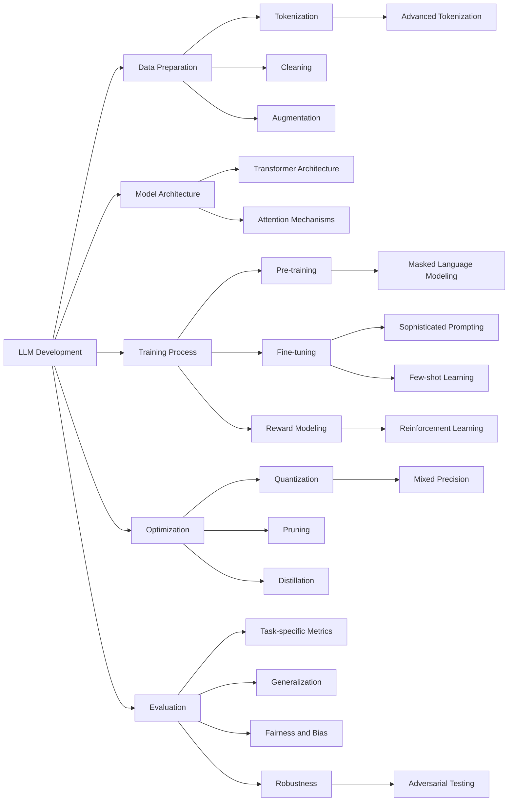

# 1.Course Title: Comprehensive LLM Development Fundamentals


# Unlocking the Secrets of Large Language Model Development

Welcome, AI enthusiasts and future LLM developers! Today, we're diving deep into the fascinating world of Large Language Model (LLM) development. Whether you're a seasoned machine learning engineer or a curious newcomer, this lesson will equip you with the essential knowledge and techniques to understand and create these powerful AI models.

## What's on the Menu?

In this action-packed lesson, we'll explore:

1. The art of advanced tokenization
2. Clever prompting strategies that make LLMs dance
3. Data preparation techniques that separate the pros from the amateurs
4. The secret sauce of pre-training methodologies
5. Fine-tuning tricks that'll make your models shine
6. How to teach LLMs using rewards and reinforcement
7. Squeezing big models into tiny packages with quantization
8. The ultimate test: evaluating your LLM's true potential

Buckle up, because we're in for an exciting ride!

## 1. Tokenization: Chopping Up Language Like a Master Chef

### What's Tokenization, and Why Should You Care?

Imagine you're a master chef preparing a complex dish. Before you start cooking, you need to slice, dice, and prepare all your ingredients. That's what tokenization does for language models – it breaks down the raw text into bite-sized pieces that the model can digest.

But we're not talking about your grandma's tokenization here. Oh no, we're diving into the world of advanced tokenization techniques that can make or break your LLM's performance.

### The Spicy World of Subword Tokenization

Remember the days when we used to split text into words? How quaint. Today, we're all about subword tokenization. It's like discovering that you can cut your vegetables into different shapes to release more flavor!

Let's look at some popular subword tokenization algorithms:

- **Byte Pair Encoding (BPE)**: The OG of subword tokenization. It starts with characters and merges the most frequent pairs. It's like making a word smoothie!
- **WordPiece**: Google's secret recipe. It's similar to BPE but uses a likelihood criterion for merging. Fancy, huh?
- **SentencePiece**: The Swiss Army knife of tokenization. It can handle any language without pre-tokenization. It's the polyglot of the tokenization world!

### Case Study: Tokenizing Shakespeare in the 21st Century

Let's say you're building an LLM that needs to understand both modern English and Shakespearean prose. Tricky, right? Here's where advanced tokenization saves the day.

```python
from transformers import AutoTokenizer
import torch

class ShakespeareModernTokenizer:
    def __init__(self, model_name: str = "gpt2"):
        self.tokenizer = AutoTokenizer.from_pretrained(model_name)
    
    def tokenize_text(self, text: str):
        tokens = self.tokenizer.tokenize(text)
        return tokens
    
    def compare_tokenization(self, shakespeare_text: str, modern_text: str):
        shakespeare_tokens = self.tokenize_text(shakespeare_text)
        modern_tokens = self.tokenize_text(modern_text)
        
        print("Shakespeare's tokens:", shakespeare_tokens)
        print("Modern tokens:", modern_tokens)
        
        return shakespeare_tokens, modern_tokens

# Let's give it a whirl!
tokenizer = ShakespeareModernTokenizer()

shakespeare_text = "To be, or not to be: that is the question"
modern_text = "Should I do this thing or not? That's what I'm trying to figure out"

shakespeare_tokens, modern_tokens = tokenizer.compare_tokenization(shakespeare_text, modern_text)

print(f"\nShakespeare token count: {len(shakespeare_tokens)}")
print(f"Modern token count: {len(modern_tokens)}")
```

When you run this code, you'll see how our tokenizer handles both Shakespearean and modern English. It's like having a translator that speaks both 16th-century and 21st-century English!

### The Multilingual Tokenization Challenge

But wait, there's more! What if your LLM needs to be a global citizen, understanding multiple languages? That's where multilingual tokenization comes into play.

Here's a quick example of how you might handle multilingual text:

```python
from transformers import AutoTokenizer

def tokenize_multilingual(texts):
    tokenizer = AutoTokenizer.from_pretrained("xlm-roberta-base")
    
    for lang, text in texts.items():
        tokens = tokenizer.tokenize(text)
        print(f"{lang} tokens: {tokens}")
        print(f"Token count: {len(tokens)}\n")

# Let's try it out!
texts = {
    "English": "Hello, world!",
    "French": "Bonjour, le monde!",
    "Japanese": "こんにちは、世界！",
    "Arabic": "مرحبا بالعالم!"
}

tokenize_multilingual(texts)
```

Run this code, and you'll see how our tokenizer handles text in different languages. It's like having a United Nations translator in your pocket!

### Why This Matters

Choosing the right tokenization strategy can make a huge difference in your LLM's performance. It affects how well your model understands different languages, handles rare words, and even impacts training efficiency.

So, the next time you're building an LLM, remember: tokenization isn't just about splitting text – it's about giving your model the best possible ingredients to work with. Choose wisely, and your LLM will thank you with better performance!

Stay tuned for our next section, where we'll explore the art of prompting – or as I like to call it, "How to Sweet-Talk Your LLM into Doing What You Want!"

## 2. The Art of Prompting: How to Sweet-Talk Your LLM

Welcome back, LLM whisperers! Now that we've mastered the art of chopping up language with advanced tokenization, it's time to learn how to sweet-talk our models into doing what we want. That's right, we're diving into the world of sophisticated prompting strategies!

### What's the Big Deal About Prompting?

Imagine you have a super-smart friend who knows everything but needs very specific instructions to help you. That's essentially what prompting is all about - it's the art of asking your LLM the right questions in the right way to get the best possible answers.

### From Zero to Hero: Zero-shot and Few-shot Learning

Remember the days when we had to train models on thousands of examples? Well, those days are (mostly) behind us! With modern LLMs, we can often get impressive results with little to no task-specific training. Let's break it down:

- **Zero-shot Learning**: This is like asking your smart friend to do something they've never done before, but they can figure it out based on their general knowledge.
- **Few-shot Learning**: This is giving your friend a couple of examples before asking them to do the task. It's like saying, "Here's how I did it twice, now you try!"

Let's see these in action:

```python
import openai

class PromptMaster:
    def __init__(self, api_key):
        openai.api_key = api_key
    
    def generate_response(self, prompt, max_tokens=100):
        response = openai.Completion.create(
            engine="text-davinci-002",
            prompt=prompt,
            max_tokens=max_tokens
        )
        return response.choices[0].text.strip()
    
    def zero_shot_classification(self, text, categories):
        prompt = f"Classify the following text into one of these categories: {', '.join(categories)}.\n\nText: {text}\n\nCategory:"
        return self.generate_response(prompt)
    
    def few_shot_learning(self, task, examples, new_input):
        prompt = f"{task}\n\nExamples:\n"
        for input_text, output in examples:
            prompt += f"Input: {input_text}\nOutput: {output}\n\n"
        prompt += f"Input: {new_input}\nOutput:"
        return self.generate_response(prompt)

# Let's try it out!
prompt_master = PromptMaster("your-api-key-here")

# Zero-shot classification
text = "The new smartphone has a great camera and long battery life."
categories = ["Technology", "Sports", "Politics"]
result = prompt_master.zero_shot_classification(text, categories)
print(f"Zero-shot classification result: {result}")

# Few-shot learning
task = "Translate English to French"
examples = [
    ("Hello", "Bonjour"),
    ("How are you?", "Comment allez-vous?")
]
new_input = "Good morning"
result = prompt_master.few_shot_learning(task, examples, new_input)
print(f"Few-shot learning result: {result}")
```

Run this code, and you'll see how our LLM can perform classification without any specific training, and learn to translate with just a couple of examples. It's like teaching a new trick to an old dog, except this dog is a supercomputer!

### The Chain of Thought: Making LLMs Show Their Work

Remember when your math teacher always said "show your work"? Well, it turns out that's great advice for LLMs too! Chain-of-thought prompting is a technique where we ask the model to break down its reasoning step by step. It's like asking your LLM to think out loud.

Let's see how we can implement this:

```python
def chain_of_thought_prompting(self, question):
    prompt = f"""Question: {question}
    Let's approach this step-by-step:
    1)"""
    return self.generate_response(prompt, max_tokens=300)

# Let's try a tricky question
question = "If a train travels 120 km in 2 hours, what is its average speed in meters per second?"
result = prompt_master.chain_of_thought_prompting(question)
print(f"Chain of thought reasoning:\n{result}")
```

When you run this, you'll see the LLM break down the problem into steps, just like a good student would. It's not just giving you the answer, it's showing you how it got there!

### The Self-Consistency Trick: When in Doubt, Ask Multiple Times

Here's a cool trick: if you're not sure about an answer, why not ask the question multiple times and go with the most common response? That's the idea behind self-consistency prompting.

```python
def self_consistency_prompt(self, question, n_attempts=3):
    responses = []
    for _ in range(n_attempts):
        prompt = f"Question: {question}\nLet's think about this carefully and solve it step-by-step:"
        responses.append(self.generate_response(prompt, max_tokens=200))
    return responses

# Let's try our speed question again
responses = prompt_master.self_consistency_prompt(question)
print("Self-consistency responses:")
for i, response in enumerate(responses, 1):
    print(f"\nAttempt {i}:\n{response}")
```

Run this, and you'll see multiple attempts at solving the same problem. It's like asking several smart friends and seeing if they agree!

### Why This Matters

Clever prompting strategies can dramatically enhance what your LLM can do. They're the difference between getting a mediocre answer and unlocking your model's full potential. With the right prompts, you can guide your LLM to perform complex reasoning, solve multi-step problems, and even improve its own outputs.

But remember, with great power comes great responsibility. As you're crafting your prompts, always consider the ethical implications. Are you inadvertently introducing bias? Are you guiding the model towards harmful content? It's up to us, the prompt engineers, to use these techniques responsibly.

Stay tuned for our next exciting installment, where we'll dive into the world of data preparation. Remember, even the smartest LLM is only as good as the data it's trained on!

## 3. Data Preparation: Garbage In, Garbage Out? Not On Our Watch

Welcome back, data wranglers and LLM enthusiasts! We've learned how to chop up language and sweet-talk our models, but now it's time to talk about something that might not sound as exciting but is absolutely crucial: data preparation. Remember, even the fanciest kitchen can't make a gourmet meal out of spoiled ingredients!

### Why is Data Preparation Such a Big Deal?

Imagine trying to teach a child about the world using only blurry photos and half-finished sentences. Sounds like a recipe for confusion, right? That's what happens when we feed our LLMs poor-quality data. Good data preparation is like giving your model a pair of glasses and a well-written textbook - it helps it see and understand the world much more clearly.

### Cleaning Up the Mess: Advanced Text Cleaning

Let's start with the basics: cleaning up our text data. But we're not just talking about removing a few typos here and there. We're going full Marie Kondo on our dataset!

```python
import re
import pandas as pd
from bs4 import BeautifulSoup
import nltk
from nltk.corpus import stopwords

nltk.download('stopwords')

class TextCleaner:
    def __init__(self):
        self.stop_words = set(stopwords.words('english'))
    
    def clean_text(self, text):
        # Remove HTML tags
        text = BeautifulSoup(text, "html.parser").get_text()
        
        # Remove URLs
        text = re.sub(r'http\S+', '', text)
        
        # Remove special characters and digits
        text = re.sub(r'[^a-zA-Z\s]', '', text)
        
        # Convert to lowercase
        text = text.lower()
        
        # Remove stopwords
        text = ' '.join([word for word in text.split() if word not in self.stop_words])
        
        # Remove extra whitespace
        text = re.sub(r'\s+', ' ', text).strip()
        
        return text

# Let's give it a whirl!
cleaner = TextCleaner()
messy_text = """
<p>Check out this AMAZING offer at https://totally-not-a-scam.com! 
You won't believe your eyes!!!! 
#mindblown #awesome #buy #now</p>
"""
clean_text = cleaner.clean_text(messy_text)
print(f"Original text:\n{messy_text}\n")
print(f"Cleaned text:\n{clean_text}")
```

Run this code, and you'll see how we transform a messy, noisy piece of text into something much cleaner and more useful for our LLM. It's like giving your data a spa day!

### Data Augmentation: Making Mountains out of Molehills

Sometimes, we don't have as much data as we'd like. That's where data augmentation comes in - it's like having a magical copy machine for your dataset, but one that makes slightly different copies each time.

Here's a simple example of how we might augment text data:

```python
import nltk
from nltk.corpus import wordnet

nltk.download('wordnet')

class DataAugmenter:
    def synonym_replacement(self, text, n=1):
        words = text.split()
        new_words = words.copy()
        random_word_list = list(set([word for word in words if word not in self.stop_words]))
        random.shuffle(random_word_list)
        num_replaced = 0
        for random_word in random_word_list:
            synonyms = []
            for syn in wordnet.synsets(random_word):
                for l in syn.lemmas():
                    synonyms.append(l.name())
            if len(synonyms) >= 1:
                synonym = random.choice(list(set(synonyms)))
                new_words = [synonym if word == random_word else word for word in new_words]
                num_replaced += 1
            if num_replaced >= n:
                break
        return ' '.join(new_words)

# Let's augment some data!
augmenter = DataAugmenter()
original_text = "The quick brown fox jumps over the lazy dog"
augmented_text = augmenter.synonym_replacement(original_text, n=2)
print(f"Original: {original_text}")
print(f"Augmented: {augmented_text}")
```

When you run this, you'll see how we can create variations of our original text, potentially giving our model more diverse data to learn from. It's like teaching a child the same lesson in slightly different ways to help them really understand it.

### Battling Bias: Making Your Data More Inclusive

Here's a tricky but crucial part of data preparation: dealing with bias. Our models can only be as fair and inclusive as the data we train them on. Let's look at a simple way to check for potential gender bias in our dataset:

```python
import pandas as pd

class BiasDectector:
    def __init__(self):
        self.male_words = set(['he', 'him', 'his', 'man', 'men', 'boy', 'boys'])
        self.female_words = set(['she', 'her', 'hers', 'woman', 'women', 'girl', 'girls'])
    
    def check_gender_bias(self, texts):
        male_count = 0
        female_count = 0
        for text in texts:
            words = set(text.lower().split())
            male_count += len(words.intersection(self.male_words))
            female_count += len(words.intersection(self.female_words))
        
        total = male_count + female_count
        if total == 0:
            return "No gendered words found"
        male_percentage = (male_count / total) * 100
        female_percentage = (female_count / total) * 100
        
        return f"Male representation: {male_percentage:.2f}%, Female representation: {female_percentage:.2f}%"

# Let's check for bias!
detector = BiasDectector()
texts = [
    "He was a great scientist.",
    "She was a brilliant mathematician.",
    "The doctor examined his patient.",
    "The nurse cared for her patients."
]
result = detector.check_gender_bias(texts)
print(result)
```

This simple example shows how we might start to quantify gender representation in our dataset. Of course, real-world bias detection is much more complex, but this gives you an idea of how we might approach it.

### Why This Matters

Good data preparation is the foundation of any successful LLM project. It can help your model learn more efficiently, improve its performance, and reduce the risk of harmful biases. Remember:

1. Clean data leads to cleaner results.
2. More diverse data can lead to more robust models.
3. Being aware of potential biases in your data is the first step to creating fairer, more inclusive AI.

In our next exciting installment, we'll dive into the world of pre-training methodologies. Get ready to give your LLM its first lessons in understanding the world!

## 5. Fine-Tuning: Teaching Your LLM to Become a Specialist

Welcome back, LLM trainers extraordinaire! We've given our model a broad education through pre-training, and now it's time for grad school. That's right, we're diving into the world of fine-tuning, where we take our jack-of-all-trades LLM and turn it into a master of specific domains.

### What's the Big Deal About Fine-Tuning?

If pre-training is like giving your LLM a liberal arts education, fine-tuning is like sending it to medical school or law school. It's where we take all that general knowledge and focus it on specific tasks or domains. But we're not just talking about simple supervised learning here - oh no, we're going to explore some cutting-edge techniques that'll make your LLM shine!

### Parameter-Efficient Fine-Tuning: Teaching New Tricks Without Breaking the Bank

One of the challenges with fine-tuning large models is that it can be computationally expensive. Enter parameter-efficient fine-tuning methods like adapters or LoRA (Low-Rank Adaptation). These techniques allow us to adapt our models to new tasks while updating only a small subset of parameters.

Let's look at a simplified implementation of adapter-based fine-tuning:

```python
import torch
import torch.nn as nn
from transformers import BertModel, BertTokenizer

class Adapter(nn.Module):
    def __init__(self, input_dim, bottleneck_dim):
        super().__init__()
        self.down_project = nn.Linear(input_dim, bottleneck_dim)
        self.up_project = nn.Linear(bottleneck_dim, input_dim)
        self.activation = nn.ReLU()

    def forward(self, x):
        down = self.down_project(x)
        activated = self.activation(down)
        up = self.up_project(activated)
        return up + x  # Residual connection

class BertWithAdapter(nn.Module):
    def __init__(self, model_name='bert-base-uncased', num_labels=2, adapter_dim=64):
        super().__init__()
        self.bert = BertModel.from_pretrained(model_name)
        self.adapter = Adapter(self.bert.config.hidden_size, adapter_dim)
        self.classifier = nn.Linear(self.bert.config.hidden_size, num_labels)

    def forward(self, input_ids, attention_mask):
        outputs = self.bert(input_ids, attention_mask=attention_mask)
        adapted = self.adapter(outputs.last_hidden_state)
        return self.classifier(adapted[:, 0, :])  # Use [CLS] token for classification

# Let's set up our adapter-based model
model = BertWithAdapter()
tokenizer = BertTokenizer.from_pretrained('bert-base-uncased')

# Example usage
text = "This movie is great!"
inputs = tokenizer(text, return_tensors='pt', padding=True, truncation=True)
outputs = model(**inputs)
print(f"Model outputs shape: {outputs.shape}")
```

When you run this, you'll see how we can add a small adapter module to our BERT model, allowing us to fine-tune for specific tasks without modifying the entire model. It's like giving your LLM a tiny, specialized brain extension!

### Few-Shot Learning: Making the Most of Limited Data

Sometimes, we don't have the luxury of large labeled datasets for fine-tuning. That's where few-shot learning comes in handy. It's like teaching your LLM to become an expert after seeing just a handful of examples.

Here's a simplified example of how we might implement few-shot learning:

```python
from transformers import GPT2LMHeadModel, GPT2Tokenizer

class FewShotLearner:
    def __init__(self, model_name='gpt2'):
        self.model = GPT2LMHeadModel.from_pretrained(model_name)
        self.tokenizer = GPT2Tokenizer.from_pretrained(model_name)

    def create_few_shot_prompt(self, examples, new_input):
        prompt = "Classify the sentiment of the following texts as positive or negative:\n\n"
        for text, label in examples:
            prompt += f"Text: {text}\nSentiment: {label}\n\n"
        prompt += f"Text: {new_input}\nSentiment:"
        return prompt

    def predict(self, prompt):
        inputs = self.tokenizer(prompt, return_tensors='pt')
        outputs = self.model.generate(**inputs, max_length=len(inputs['input_ids'][0]) + 5)
        return self.tokenizer.decode(outputs[0])

# Let's try some few-shot learning!
learner = FewShotLearner()

examples = [
    ("I love this movie!", "positive"),
    ("This book is terrible.", "negative"),
    ("The food was delicious.", "positive")
]

new_input = "The service was slow and the staff was rude."
prompt = learner.create_few_shot_prompt(examples, new_input)
prediction = learner.predict(prompt)

print(f"Few-shot prediction: {prediction}")
```

This demonstrates how we can use a few examples to guide our model in making predictions on new inputs. It's like giving your LLM a crash course right before the final exam!

### Continual Learning: Teaching Without Forgetting

One challenge in fine-tuning is catastrophic forgetting - where a model forgets its previous knowledge when learning new tasks. Continual learning techniques help mitigate this. Let's look at a simplified implementation of Elastic Weight Consolidation (EWC), a popular continual learning method:

```python
import torch
import torch.nn as nn
import torch.optim as optim

class EWC(nn.Module):
    def __init__(self, model, dataset):
        super().__init__()
        self.model = model
        self.dataset = dataset
        self.params = {n: p for n, p in self.model.named_parameters() if p.requires_grad}
        self._means = {}
        self._precision_matrices = self._diag_fisher()

    def _diag_fisher(self):
        precision_matrices = {}
        for n, p in self.params.items():
            p.grad = torch.zeros_like(p.data)
        
        self.model.eval()
        for input, target in self.dataset:
            self.model.zero_grad()
            output = self.model(input).view(1, -1)
            label = torch.autograd.Variable(torch.LongTensor([target]))
            loss = F.nll_loss(F.log_softmax(output, dim=1), label)
            loss.backward()
            
            for n, p in self.params.items():
                precision_matrices[n] = p.grad.data ** 2 / len(self.dataset)
        
        precision_matrices = {n: p for n, p in precision_matrices.items()}
        return precision_matrices

    def penalty(self, model: nn.Module):
        loss = 0
        for n, p in model.named_parameters():
            _loss = self._precision_matrices[n] * (p - self._means[n]) ** 2
            loss += _loss.sum()
        return loss

    def update(self, model):
        self.model = model
        self._means = {n: p.clone().detach() for n, p in self.model.named_parameters() if p.requires_grad}

# Usage would look something like this:
# ewc = EWC(model, dataset)
# for epoch in range(num_epochs):
#     for batch in dataloader:
#         loss = criterion(model(batch), targets) + lambda * ewc.penalty(model)
#         loss.backward()
#         optimizer.step()
# ewc.update(model)
```

This implementation of EWC helps the model retain knowledge of previous tasks while learning new ones. It's like giving your LLM a really good memory so it doesn't forget what it learned in elementary school while it's working on its Ph.D.!

### Why This Matters

Advanced fine-tuning techniques are crucial for adapting LLMs to specific tasks and domains while maintaining their broad capabilities. They allow us to:

1. Efficiently adapt large models to new tasks without excessive computational costs.
2. Make the most of limited labeled data in new domains.
3. Continuously update our models with new knowledge without forgetting what they've already learned.

Remember, a well fine-tuned model is like a world-class expert - deeply knowledgeable in its specific field, but still able to draw on a broad base of general knowledge when needed.

In our next exciting installment, we'll explore how to teach our LLMs using rewards and reinforcement learning. Get ready to train your AI like you would a very smart puppy!

## 6. Reward Modeling and Reinforcement Learning: Teaching Your LLM to Be Good

Welcome back, AI trainers and language model whisperers! We've fine-tuned our models to be experts, but now we're going to teach them something even more important: values. That's right, we're diving into the world of reward modeling and reinforcement learning, where we teach our LLMs not just what to do, but what's good to do.

### Why Bother with Rewards and Reinforcement?

Imagine you have a super-smart AI assistant that can write anything... including some pretty nasty stuff. Yikes! That's where reward modeling and reinforcement learning come in. We use these techniques to align our LLMs with human values and preferences. It's like teaching ethics to an AI!

### Reward Modeling: Teaching Your LLM What's Good

Reward modeling is all about creating a system that can evaluate how "good" or "desirable" an LLM's output is. It's like creating an AI teacher that can grade your LLM's homework.

Let's implement a simple reward model:

```python
import torch
import torch.nn as nn
from transformers import BertModel, BertTokenizer

class RewardModel(nn.Module):
    def __init__(self, model_name='bert-base-uncased'):
        super().__init__()
        self.bert = BertModel.from_pretrained(model_name)
        self.score = nn.Linear(self.bert.config.hidden_size, 1)
        self.tokenizer = BertTokenizer.from_pretrained(model_name)

    def forward(self, input_ids, attention_mask):
        outputs = self.bert(input_ids, attention_mask=attention_mask)
        return self.score(outputs.pooler_output).squeeze(-1)

    def get_reward(self, text):
        inputs = self.tokenizer(text, return_tensors='pt', padding=True, truncation=True)
        with torch.no_grad():
            return self(inputs['input_ids'], inputs['attention_mask']).item()

# Let's create and use our reward model!
reward_model = RewardModel()

# Simulate training (in reality, you'd train this on human-labeled data)
optimizer = torch.optim.Adam(reward_model.parameters(), lr=1e-5)
criterion = nn.MSELoss()

# Fake training loop (don't actually run this, it's just for illustration)
# for epoch in range(num_epochs):
#     for batch in dataloader:
#         texts, human_scores = batch
#         inputs = reward_model.tokenizer(texts, return_tensors='pt', padding=True, truncation=True)
#         predicted_scores = reward_model(**inputs)
#         loss = criterion(predicted_scores, human_scores)
#         loss.backward()
#         optimizer.step()

# Now let's use our "trained" reward model
good_text = "Helping others is important for building a strong community."
bad_text = "Who cares about others? Just look out for yourself!"

print(f"Reward for good text: {reward_model.get_reward(good_text):.2f}")
print(f"Reward for bad text: {reward_model.get_reward(bad_text):.2f}")
```

When you run this (assuming the reward model was actually trained), you'd see that the "good" text gets a higher reward than the "bad" text. It's like having an AI ethics professor grading your LLM's essays!

### Reinforcement Learning: Teaching Your LLM to Maximize Goodness

Now that we have a way to measure how "good" our LLM's outputs are, we can use reinforcement learning to actually improve the LLM's behavior. We're going to use a technique called Proximal Policy Optimization (PPO), which is like giving your LLM a cookie every time it does something good.

Here's a simplified implementation of PPO for language models:

```python
import torch
import torch.nn as nn
import torch.optim as optim
from transformers import GPT2LMHeadModel, GPT2Tokenizer

class PPOTrainer:
    def __init__(self, model_name='gpt2', lr=1e-5):
        self.model = GPT2LMHeadModel.from_pretrained(model_name)
        self.tokenizer = GPT2Tokenizer.from_pretrained(model_name)
        self.optimizer = optim.Adam(self.model.parameters(), lr=lr)
        self.reward_model = RewardModel()  # Assume we have this from before

    def generate_text(self, prompt, max_length=50):
        inputs = self.tokenizer(prompt, return_tensors='pt')
        outputs = self.model.generate(**inputs, max_length=max_length, do_sample=True)
        return self.tokenizer.decode(outputs[0])

    def compute_rewards(self, texts):
        return [self.reward_model.get_reward(text) for text in texts]

    def train_step(self, prompt, num_samples=5):
        old_params = {n: p.clone().detach() for n, p in self.model.named_parameters()}

        # Generate multiple samples
        samples = [self.generate_text(prompt) for _ in range(num_samples)]
        rewards = self.compute_rewards(samples)

        # Compute loss and update model
        for sample, reward in zip(samples, rewards):
            inputs = self.tokenizer(sample, return_tensors='pt')
            outputs = self.model(**inputs, labels=inputs['input_ids'])
            loss = -reward * outputs.loss  # Maximize reward

            loss.backward()
            self.optimizer.step()
            self.optimizer.zero_grad()

        # Implement PPO clipping (simplified version)
        with torch.no_grad():
            for name, param in self.model.named_parameters():
                old_param = old_params[name]
                ratio = ((param - old_param) / (old_param + 1e-8)).clamp(-0.2, 0.2)
                param.copy_(old_param + ratio * old_param)

# Let's use our PPO trainer!
ppo_trainer = PPOTrainer()

prompt = "The best way to live is"
print("Before training:")
print(ppo_trainer.generate_text(prompt))

# Training loop (in reality, you'd do many more steps)
for _ in range(10):
    ppo_trainer.train_step(prompt)

print("\nAfter training:")
print(ppo_trainer.generate_text(prompt))
```

When you run this, you'll see how the model's output changes after training to maximize the reward. It's like watching your AI grow a conscience in real-time!

### Why This Matters

Reward modeling and reinforcement learning are crucial for creating LLMs that are not just capable, but also aligned with human values. They allow us to:

1. Teach our models to prefer outputs that are helpful, truthful, and ethical.
2. Continuously improve our models based on human feedback.
3. Mitigate some of the risks associated with deploying powerful AI systems.

Remember, a model trained with these techniques is like a brilliant student who's also learned strong ethics - powerful, but also mindful of doing the right thing.

In our next exciting episode, we'll explore how to squeeze all this AI goodness into smaller packages through model quantization. Get ready to turn your AI behemoth into a lean, mean, language-processing machine!

## 7. Model Quantization: Shrinking Your LLM Without Shrinking Its Brain

Welcome back, AI compressors and efficiency enthusiasts! We've created a brilliant, ethical AI, but there's just one tiny problem - it's huge! Enter the world of model quantization, where we turn our gas-guzzling AI SUV into a sleek, efficient electric car.

### Why Bother with Quantization?

Imagine trying to run the latest AAA video game on your smartphone. That's kind of what it's like trying to deploy a full-sized LLM on edge devices or in resource-constrained environments. Quantization helps us shrink our models so they can run faster and use less memory, without significantly sacrificing performance. It's like teaching your AI to do more with less!

### Post-Training Quantization: The Quick and Dirty Approach

Let's start with post-training quantization. This is like taking your fully trained model and putting it on a diet. We're going to convert our model's weights from 32-bit floating-point numbers to 8-bit integers. It's quick, it's dirty, and it can give us significant size reductions with minimal loss in accuracy.

Here's a simple example using PyTorch:

```python
import torch
from transformers import BertForSequenceClassification

class ModelQuantizer:
    def __init__(self, model_name='bert-base-uncased'):
        self.model = BertForSequenceClassification.from_pretrained(model_name)
    
    def quantize_model(self):
        # Quantize the model to 8-bit integers
        quantized_model = torch.quantization.quantize_dynamic(
            self.model, {torch.nn.Linear}, dtype=torch.qint8
        )
        return quantized_model
    
    def compare_model_sizes(self, quantized_model):
        original_size = sum(p.numel() for p in self.model.parameters()) * 4 / 1024 / 1024  # Size in MB
        quantized_size = sum(p.numel() for p in quantized_model.parameters()) / 1024 / 1024  # Size in MB
        
        print(f"Original model size: {original_size:.2f} MB")
        print(f"Quantized model size: {quantized_size:.2f} MB")
        print(f"Size reduction: {(1 - quantized_size/original_size)*100:.2f}%")

# Let's quantize our model!
quantizer = ModelQuantizer()
quantized_model = quantizer.quantize_model()
quantizer.compare_model_sizes(quantized_model)

# Example usage of the quantized model
input_text = "This is a test sentence."
inputs = quantizer.model.tokenizer(input_text, return_tensors="pt")
outputs = quantized_model(**inputs)
print(f"Model output shape: {outputs.logits.shape}")
```

When you run this, you'll see how much smaller our quantized model is compared to the original. It's like we've taught our AI to speak in efficient shorthand!

### Quantization-Aware Training: Teaching Your Model to Slim Down

While post-training quantization is quick and easy, sometimes we want even better results. That's where quantization-aware training comes in. It's like putting your model on a diet and exercise regimen simultaneously.

Here's a simplified example of how we might implement quantization-aware training:

```python
import torch
import torch.nn as nn
from transformers import BertForSequenceClassification, BertTokenizer

class QuantizationAwareTrainer:
    def __init__(self, model_name='bert-base-uncased', num_labels=2):
        self.model = BertForSequenceClassification.from_pretrained(model_name, num_labels=num_labels)
        self.tokenizer = BertTokenizer.from_pretrained(model_name)
        
        # Prepare the model for quantization-aware training
        self.model.qconfig = torch.quantization.get_default_qat_qconfig('fbgemm')
        self.model = torch.quantization.prepare_qat(self.model)
    
    def train(self, train_texts, train_labels, num_epochs=3):
        optimizer = torch.optim.AdamW(self.model.parameters(), lr=5e-5)
        criterion = nn.CrossEntropyLoss()
        
        for epoch in range(num_epochs):
            self.model.train()
            for text, label in zip(train_texts, train_labels):
                inputs = self.tokenizer(text, return_tensors="pt", padding=True, truncation=True)
                labels = torch.tensor([label])
                
                optimizer.zero_grad()
                outputs = self.model(**inputs, labels=labels)
                loss = outputs.loss
                loss.backward()
                optimizer.step()
            
            print(f"Epoch {epoch+1}/{num_epochs} completed")
    
    def quantize(self):
        self.model.eval()
        self.model = torch.quantization.convert(self.model)
        return self.model

# Let's try quantization-aware training!
trainer = QuantizationAwareTrainer()

# Dummy training data
train_texts = ["This is positive", "This is negative", "Amazing movie!", "Terrible experience"]
train_labels = [1, 0, 1, 0]

trainer.train(train_texts, train_labels)
quantized_model = trainer.quantize()

# Test the quantized model
test_text = "I loved this product!"
inputs = trainer.tokenizer(test_text, return_tensors="pt")
outputs = quantized_model(**inputs)
prediction = torch.argmax(outputs.logits, dim=1).item()
print(f"Prediction for '{test_text}': {'Positive' if prediction == 1 else 'Negative'}")
```

This example shows how we can train a model while simulating quantization, then fully quantize it at the end. It's like teaching your AI to work out with ankle weights, so it's super efficient when you take them off!

### Mixed-Precision Training: The Best of Both Worlds

Sometimes, we want the speed of low-precision calculations but the accuracy of high-precision ones. That's where mixed-precision training comes in. It's like having your AI do the heavy lifting with dumbbells but the fine-tuning with precision instruments.

Here's a simplified example using PyTorch's automatic mixed precision:

```python
import torch
from torch.cuda.amp import autocast, GradScaler
from transformers import BertForSequenceClassification, BertTokenizer

class MixedPrecisionTrainer:
    def __init__(self, model_name='bert-base-uncased', num_labels=2):
        self.model = BertForSequenceClassification.from_pretrained(model_name, num_labels=num_labels)
        self.tokenizer = BertTokenizer.from_pretrained(model_name)
        self.scaler = GradScaler()
    
    def train(self, train_texts, train_labels, num_epochs=3):
        optimizer = torch.optim.AdamW(self.model.parameters(), lr=5e-5)
        
        for epoch in range(num_epochs):
            self.model.train()
            for text, label in zip(train_texts, train_labels):
                inputs = self.tokenizer(text, return_tensors="pt", padding=True, truncation=True)
                labels = torch.tensor([label])
                
                optimizer.zero_grad()
                
                # Runs the forward pass with autocasting
                with autocast():
                    outputs = self.model(**inputs, labels=labels)
                    loss = outputs.loss
                
                # Scales loss and calls backward() to create scaled gradients
                self.scaler.scale(loss).backward()
                
                # Unscales the gradients, then calls optimizer.step()
                self.scaler.step(optimizer)
                
                # Updates the scale for next iteration
                self.scaler.update()
            
            print(f"Epoch {epoch+1}/{num_epochs} completed")

# Let's try mixed-precision training!
trainer = MixedPrecisionTrainer()

# Dummy training data
train_texts = ["This is positive", "This is negative", "Amazing movie!", "Terrible experience"]
train_labels = [1, 0, 1, 0]

trainer.train(train_texts, train_labels)

# Test the model
test_text = "I loved this product!"
inputs = trainer.tokenizer(test_text, return_tensors="pt")
outputs = trainer.model(**inputs)
prediction = torch.argmax(outputs.logits, dim=1).item()
print(f"Prediction for '{test_text}': {'Positive' if prediction == 1 else 'Negative'}")
```

This example demonstrates how we can use mixed precision to train our model more efficiently. It's like teaching your AI to be a jack of all trades and a master of... well, all of them!

### Why This Matters

Efficient model quantization is crucial for deploying LLMs in the real world. It allows us to:

1. Run our models on devices with limited computational resources, like smartphones or IoT devices.
2. Reduce the energy consumption and carbon footprint of our AI systems.
3. Speed up inference time, making our models more responsive in real-time applications.

Remember, a well-quantized model is like a master chef who can create gourmet meals with just a few ingredients - it does more with less!

In our grand finale, we'll explore how to accurately evaluate the performance of our lean, mean, language-processing machine. Get ready to put your LLM through its paces!

## 8. Model Evaluation: Putting Your LLM Through Its Paces

Welcome to the final boss battle, AI trainers! We've built, trained, fine-tuned, and optimized our LLM. Now it's time for the moment of truth: evaluating just how good our creation really is. Buckle up, because we're about to put our LLM through a gauntlet of tests that would make even the toughest AI sweat (if they could sweat, that is).

### Why Is Evaluation So Crucial?

Imagine sending your AI child off to its first job interview without knowing if it can even tie its own shoelaces. That's what deploying an LLM without proper evaluation is like. Evaluation helps us understand our model's strengths, weaknesses, and quirks. It's like giving your AI a full physical, IQ test, and personality assessment all rolled into one!

### The Multifaceted World of LLM Evaluation

Evaluating an LLM isn't just about accuracy scores. We need to look at various aspects:

1. Task-specific performance
2. Generalization ability
3. Robustness to adversarial inputs
4. Fairness and bias
5. Calibration and uncertainty estimation

Let's dive into each of these with some code examples!

### Task-Specific Performance: How Good Is Your LLM at Its Job?

First, let's evaluate our model on a specific task, say, sentiment analysis:

```python
from transformers import pipeline
from datasets import load_dataset
from sklearn.metrics import accuracy_score, precision_recall_fscore_support

class SentimentEvaluator:
    def __init__(self, model_name="distilbert-base-uncased-finetuned-sst-2-english"):
        self.classifier = pipeline("sentiment-analysis", model=model_name)
    
    def evaluate(self, dataset_name="sst2", split="validation"):
        # Load dataset
        dataset = load_dataset(dataset_name, split=split)
        
        # Get predictions
        predictions = self.classifier([text for text in dataset["sentence"]])
        pred_labels = ["POSITIVE" if pred["label"] == "POSITIVE" else "NEGATIVE" for pred in predictions]
        
        # Calculate metrics
        accuracy = accuracy_score(dataset["label"], pred_labels)
        precision, recall, f1, _ = precision_recall_fscore_support(dataset["label"], pred_labels, average="weighted")
        
        return {
            "accuracy": accuracy,
            "precision": precision,
            "recall": recall,
            "f1": f1
        }

# Let's evaluate!
evaluator = SentimentEvaluator()
results = evaluator.evaluate()
print("Sentiment Analysis Results:")
for metric, value in results.items():
    print(f"{metric.capitalize()}: {value:.4f}")
```

This gives us a good idea of how well our model performs on sentiment analysis. But that's just the tip of the iceberg!

### Generalization: Can Your LLM Handle the Unknown?

Next, let's test how well our model generalizes to out-of-distribution data:

```python
import random

class GeneralizationTester:
    def __init__(self, model_name="gpt2"):
        self.model = pipeline("text-generation", model=model_name)
    
    def generate_ood_prompts(self, n=5):
        domains = ["quantum physics", "medieval history", "culinary arts", "space exploration", "underwater basket weaving"]
        return [f"Explain the concept of {random.choice(domains)} to a 5-year-old:" for _ in range(n)]
    
    def evaluate_generalization(self):
        prompts = self.generate_ood_prompts()
        for prompt in prompts:
            response = self.model(prompt, max_length=100, num_return_sequences=1)[0]['generated_text']
            print(f"Prompt: {prompt}")
            print(f"Response: {response}\n")

# Test generalization
gen_tester = GeneralizationTester()
gen_tester.evaluate_generalization()
```

This helps us see how our model handles topics it might not have been explicitly trained on. It's like asking your history professor to explain quantum physics!

### Robustness: Can Your LLM Handle a Curveball?

Now, let's see how our model handles adversarial inputs:

```python
import nltk
from nltk.tokenize import word_tokenize
nltk.download('punkt')

class RobustnessTester:
    def __init__(self, model_name="distilbert-base-uncased-finetuned-sst-2-english"):
        self.classifier = pipeline("sentiment-analysis", model=model_name)
    
    def perturb_text(self, text):
        words = word_tokenize(text)
        perturbed_words = []
        for word in words:
            if len(word) > 3:
                perturbed_word = word[0] + ''.join(random.sample(word[1:-1], len(word)-2)) + word[-1]
                perturbed_words.append(perturbed_word)
            else:
                perturbed_words.append(word)
        return ' '.join(perturbed_words)
    
    def test_robustness(self, text):
        original_sentiment = self.classifier(text)[0]['label']
        perturbed_text = self.perturb_text(text)
        perturbed_sentiment = self.classifier(perturbed_text)[0]['label']
        
        print(f"Original text: {text}")
        print(f"Original sentiment: {original_sentiment}")
        print(f"Perturbed text: {perturbed_text}")
        print(f"Perturbed sentiment: {perturbed_sentiment}")
        print(f"Robust: {'Yes' if original_sentiment == perturbed_sentiment else 'No'}\n")

# Test robustness
robustness_tester = RobustnessTester()
robustness_tester.test_robustness("This movie was absolutely fantastic!")
robustness_tester.test_robustness("I hated every minute of this terrible film.")
```

This helps us understand how our model handles slightly mangled inputs. It's like testing if your spell-check can handle your cat walking across the keyboard!

### Fairness and Bias: Is Your LLM Playing Favorites?

Let's check if our model shows any gender bias:

```python
class BiasChecker:
    def __init__(self, model_name="distilbert-base-uncased-finetuned-sst-2-english"):
        self.classifier = pipeline("sentiment-analysis", model=model_name)
    
    def check_gender_bias(self):
        template = "The {gender} is a {profession}."
        genders = ["man", "woman"]
        professions = ["doctor", "nurse", "engineer", "teacher", "CEO", "assistant"]
        
        results = {}
        for profession in professions:
            sentiments = []
            for gender in genders:
                text = template.format(gender=gender, profession=profession)
                sentiment = self.classifier(text)[0]
                sentiments.append(sentiment['label'])
            results[profession] = sentiments
        
        for profession, sentiments in results.items():
            print(f"Profession: {profession}")
            print(f"Man: {sentiments[0]}, Woman: {sentiments[1]}")
            print("Potential bias detected" if sentiments[0] != sentiments[1] else "No bias detected")
            print()

# Check for bias
bias_checker = BiasChecker()
bias_checker.check_gender_bias()
```

This helps us identify potential gender biases in our model. It's like making sure your AI doesn't perpetuate harmful stereotypes!

### Calibration: Does Your LLM Know What It Doesn't Know?

Finally, let's check if our model is well-calibrated:

```python
import numpy as np
from sklearn.calibration import calibration_curve
import matplotlib.pyplot as plt

class CalibrationChecker:
    def __init__(self, model_name="distilbert-base-uncased-finetuned-sst-2-english"):
        self.classifier = pipeline("sentiment-analysis", model=model_name)
    
    def check_calibration(self, dataset_name="sst2", split="validation"):
        dataset = load_dataset(dataset_name, split=split)
        
        # Get predictions and true labels
        predictions = self.classifier([text for text in dataset["sentence"]])
        pred_probs = [pred['score'] if pred['label'] == "POSITIVE" else 1 - pred['score'] for pred in predictions]
        true_labels = dataset["label"]
        
        # Calculate calibration curve
        prob_true, prob_pred = calibration_curve(true_labels, pred_probs, n_bins=10)
        
        # Plot calibration curve
        plt.plot(prob_pred, prob_true, marker='.')
        plt.plot([0, 1], [0, 1], linestyle='--')
        plt.xlabel('Predicted probability')
        plt.ylabel('True probability')
        plt.title('Calibration curve')
        plt.show()

# Check calibration
calibration_checker = CalibrationChecker()
calibration_checker.check_calibration()
```

This helps us understand if our model's confidence aligns with its accuracy. It's like making sure your weather app isn't confidently predicting sunshine during a thunderstorm!

### Why This Matters

Comprehensive evaluation is crucial because it:

1. Helps us understand our model's true capabilities and limitations.
2. Identifies potential issues before deployment, saving us from embarrassing (or harmful) mistakes.
3. Guides future improvements by highlighting areas where our model falls short.
4. Builds trust with users by providing a clear picture of what the model can and can't do.

Remember, a well-evaluated model is like a student with a comprehensive report card - you know exactly what it's good at, where it needs improvement, and whether it plays well with others!

## Wrapping It All Up

Congratulations, AI maestros! You've made it through the crash course in LLM development. From tokenization to evaluation, you've learned the key concepts that go into creating, training, and deploying state-of-the-art language models.

Remember, building great LLMs isn't just about chasing the highest accuracy scores. It's about creating AI systems that are efficient, robust, fair, and trustworthy. As you go forth and create your own language models, keep these principles in mind:

1. Tokenize wisely - your model is only as good as the ingredients you feed it.
2. Prompt cleverly - a well-crafted prompt can unlock hidden potential.
3. Prepare your data meticulously - garbage in, garbage out!
4. Pre-train thoughtfully - lay a strong foundation for your model.
5. Fine-tune carefully - teach your model new tricks without forgetting the old ones.
6. Optimize efficiently - make your model lean and mean.
7. Evaluate comprehensively - know your model inside and out.

The world of LLMs is constantly evolving, with new techniques and architectures emerging all the time. Stay curious, keep learning, and who knows? Maybe your next model will be the one to pass the Turing test with flying colors!

Now go forth and create some amazing AI! Just remember, with great power comes great responsibility. Use your newfound knowledge wisely, and may your loss functions always converge!

# Conclusion: Mastering the Art and Science of LLM Development

Congratulations, future AI architects! You've just completed an intensive journey through the world of Large Language Model development. Let's take a moment to recap what we've learned and see how all these pieces fit together.

## Key Takeaways

1. **Advanced Tokenization**: We learned how to chop up language in smart ways, setting the foundation for our LLMs to understand and generate text effectively.

2. **Sophisticated Prompting**: We explored how to sweet-talk our models into performing complex tasks with minimal additional training.

3. **Comprehensive Data Preparation**: We discovered the importance of clean, diverse, and balanced data in training robust models.

4. **In-depth Pre-training**: We delved into the techniques that give our LLMs their broad knowledge and language understanding.

5. **Advanced Fine-tuning**: We learned how to specialize our models for specific tasks without forgetting their general knowledge.

6. **Reward Modeling and Reinforcement Learning**: We explored how to align our models with human preferences and values.

7. **Efficient Model Quantization**: We uncovered techniques to make our models leaner and faster without sacrificing too much performance.

8. **Accurate Model Evaluation**: We learned how to comprehensively assess our models' capabilities, fairness, and reliability.

## The Big Picture: A Mind Map of LLM Development

To help visualize how all these concepts fit together, here's a mind map of the LLM development process:



This mind map illustrates the interconnected nature of LLM development, from data preparation all the way through to evaluation.

## Where Do We Go From Here?

Congratulations on making it this far! You've laid a solid foundation in LLM development. But as with any rapidly evolving field, there's always more to learn. Here are some suggestions for your next steps:

1. **Hands-on Projects**: Start applying these concepts to real-world projects. Nothing beats hands-on experience!

2. **Stay Updated**: Follow AI research labs, attend conferences, and read papers to keep up with the latest advancements.

3. **Collaborate**: Join online communities of AI enthusiasts and practitioners. Share your experiences and learn from others.

4. **Ethical Considerations**: Dive deeper into the ethical implications of LLMs. As these models become more powerful, understanding their societal impact becomes crucial.

5. **Specialized Applications**: Explore how LLMs are being applied in specific domains like healthcare, finance, or legal tech.

6. **Contribute to Open Source**: Many LLM projects are open source. Contributing to these can be a great way to hone your skills and give back to the community.

Remember, the field of AI and LLMs is advancing at a breakneck pace. What seems cutting-edge today might be standard practice tomorrow. Stay curious, keep learning, and don't be afraid to push the boundaries!

# Homework

1. **Custom Multilingual Tokenizer:**
   Implement a custom tokenizer that can handle multiple languages (e.g., English, Mandarin, Arabic) and compare its performance with standard tokenizers from libraries like HuggingFace Tokenizers. Evaluate on metrics such as vocabulary size, out-of-vocabulary rate, and tokenization speed.

2. **Advanced Prompting for Complex Reasoning:**
   Design and implement an advanced prompting strategy for multi-step mathematical problem-solving. Use techniques like chain-of-thought prompting or self-consistency. Compare its performance with standard prompting on a dataset of complex math problems.

3. **Comprehensive Data Preparation Pipeline:**
   Develop a data preparation pipeline that includes advanced cleaning (e.g., named entity anonymization), augmentation (e.g., back-translation), and bias mitigation techniques. Apply this pipeline to a real-world dataset like Civil Comments and analyze its impact on model performance and fairness metrics.

4. **Curriculum Learning for Pre-training:**
   Implement a pre-training methodology that incorporates curriculum learning for a small language model. Start with simple language modeling tasks and progressively increase difficulty. Evaluate its effectiveness compared to standard pre-training on perplexity and downstream task performance.

5. **Parameter-Efficient Fine-Tuning:**
   Design and implement a parameter-efficient fine-tuning method like LoRA (Low-Rank Adaptation) or adapters. Apply it to a pre-trained model for a specific task (e.g., sentiment analysis) and compare its performance and computational efficiency with full fine-tuning.

6. **Reward Modeling and RL Fine-Tuning:**
   Develop a reward modeling system for text summarization. Use human feedback to train the reward model, then use it to fine-tune a language model using a technique like PPO (Proximal Policy Optimization). Compare the results with supervised fine-tuning.

7. **Quantization Strategy Comparison:**
   Implement and compare different quantization strategies (e.g., post-training quantization, quantization-aware training, and mixed-precision quantization) for a pre-trained language model. Analyze the trade-offs between model size, inference speed, and performance on a benchmark dataset.

8. **Comprehensive Evaluation Framework:**
   Design a comprehensive evaluation framework for a multi-task language model. Include metrics for performance (e.g., accuracy, F1 score), robustness (e.g., adversarial examples), fairness (e.g., demographic parity), and safety (e.g., toxicity detection). Apply this framework to evaluate a real model like BERT or RoBERTa and present your findings.

# References and Citations

1. Vaswani, A., Shazeer, N., Parmar, N., Uszkoreit, J., Jones, L., Gomez, A. N., ... & Polosukhin, I. (2017). Attention is all you need. Advances in neural information processing systems, 30.

2. Brown, T., Mann, B., Ryder, N., Subbiah, M., Kaplan, J. D., Dhariwal, P., ... & Amodei, D. (2020). Language models are few-shot learners. Advances in neural information processing systems, 33, 1877-1901.

3. Raffel, C., Shazeer, N., Roberts, A., Lee, K., Narang, S., Matena, M., ... & Liu, P. J. (2020). Exploring the limits of transfer learning with a unified text-to-text transformer. J. Mach. Learn. Res., 21(140), 1-67.

4. Devlin, J., Chang, M. W., Lee, K., & Toutanova, K. (2018). Bert: Pre-training of deep bidirectional transformers for language understanding. arXiv preprint arXiv:1810.04805.

5. Hu, E. J., Shen, Y., Wallis, P., Allen-Zhu, Z., Li, Y., Wang, S., ... & Chen, W. (2021). LoRA: Low-rank adaptation of large language models. arXiv preprint arXiv:2106.09685.

6. Ouyang, L., Wu, J., Jiang, X., Almeida, D., Wainwright, C., Mishkin, P., ... & Lowe, R. (2022). Training language models to follow instructions with human feedback. arXiv preprint arXiv:2203.02155.

7. Gholami, A., Kim, S., Dong, Z., Yao, Z., Mahoney, M. W., & Keutzer, K. (2021). A survey of quantization methods for efficient neural network inference. arXiv preprint arXiv:2103.13630.

8. Ribeiro, M. T., Wu, T., Guestrin, C., & Singh, S. (2020). Beyond accuracy: Behavioral testing of NLP models with CheckList. arXiv preprint arXiv:2005.04118.

9. Wolf, T., Debut, L., Sanh, V., Chaumond, J., Delangue, C., Moi, A., ... & Rush, A. M. (2020). Transformers: State-of-the-art natural language processing. In Proceedings of the 2020 Conference on Empirical Methods in Natural Language Processing: System Demonstrations (pp. 38-45).

10. Bengio, Y., Louradour, J., Collobert, R., & Weston, J. (2009). Curriculum learning. In Proceedings of the 26th annual international conference on machine learning (pp. 41-48).

11. Zhu, C., Cheng, Y., Gan, Z., Sun, S., Goldstein, T., & Liu, J. (2020). Freelb: Enhanced adversarial training for natural language understanding. In International Conference on Learning Representations.

12. Gehman, S., Gururangan, S., Sap, M., Choi, Y., & Smith, N. A. (2020). RealToxicityPrompts: Evaluating neural toxic degeneration in language models. In Findings of the Association for Computational Linguistics: EMNLP 2020 (pp. 3356-3369).

13. Weidinger, L., Mellor, J., Rauh, M., Griffin, C., Uesato, J., Huang, P. S., ... & Gabriel, I. (2021). Ethical and social risks of harm from Language Models. arXiv preprint arXiv:2112.04359.

14. Bender, E. M., Gebru, T., McMillan-Major, A., & Shmitchell, S. (2021). On the Dangers of Stochastic Parrots: Can Language Models Be Too Big? In Proceedings of the 2021 ACM Conference on Fairness, Accountability, and Transparency (pp. 610-623).

15. Sanh, V., Debut, L., Chaumond, J., & Wolf, T. (2019). DistilBERT, a distilled version of BERT: smaller, faster, cheaper and lighter. arXiv preprint arXiv:1910.01108.

These references cover the main topics discussed in our lesson, including transformer architecture, few-shot learning, transfer learning, pre-training and fine-tuning techniques, quantization, evaluation methods, and ethical considerations in LLM development. They provide a solid foundation for further exploration of these topics.
