# 1. Course Title: Comprehensive Setup of the LLM Experimental Environment

```mermaid
gantt
    title LLM Course Timeline
    dateFormat X
    axisFormat %d
    section Course Content
    Course Overview                                    :a1, 0, 1d
    NLP Fundamentals                                   :a2, after a1, 1d
    Basic knowledge and architectural characteristics of LLM :a3, after a2, 1d
    LLM Development Fundamentals                       :a4, after a3, 1d
    Introduction and Setup of the Experimental Environment :active,a5, after a4, 1d
    The concept of the tokenizer and common types      :a6, after a5, 1d
    Text data preprocessing and preparation            :a7, after a6, 1d
    LLM training - Fine-tuning                         :a8, after a7, 1d
    LLM training - Reward Modeling and Proximal Policy Optimization :a9, after a8, 1d
    Famous SOTA LLM models and JAIS model              :a10, after a9, 1d
    section Lessons
    lesson 1  :l1, 0, 1d
    lesson 2  :l2, after l1, 1d
    lesson 3  :l3, after l2, 1d
    lesson 4  :l4, after l3, 1d
    lesson 5  :active,l5, after l4, 1d
    lesson 6  :l6, after l5, 1d
    lesson 7  :l7, after l6, 1d
    lesson 8  :l8, after l7, 1d
    lesson 9  :l9, after l8, 1d
    lesson 10 :l10, after l9, 1d
```



# Setting Up Your LLM Playground: A Comprehensive Guide

Hey there, future AI wizard! Ready to dive into the exciting world of Large Language Models (LLMs)? Great! Today, we're going to set up your very own LLM playground. It's like building a high-tech sandbox where you can create, train, and play with AI models that understand and generate human-like text. Exciting, right? Let's get started!

## What's on the Menu?

In this action-packed guide, we'll cover:

1. The essential ingredients of our LLM kitchen (aka our development environment)
2. How to whip up a server that's just right for LLM development
3. Tricks for storing and summoning our AI models efficiently
4. Debugging like a pro when things go sideways
5. Turbocharging our setup for maximum performance
6. Collaborating with fellow AI chefs without stepping on each other's toes

Buckle up, because we're in for an exciting ride!

## 1. The Essential Ingredients: Understanding Our LLM Kitchen

Before we start cooking up some AI magic, let's take a look at what we'll be working with. Our LLM development environment is like a well-equipped kitchen, with each tool playing a crucial role in creating our AI feast.

Here's what we've got in our AI chef's toolkit:

- **Ubuntu 20.04 LTS**: Our sturdy kitchen counter. It's a stable Linux distribution that gives us a solid foundation to work on.
- **Python 3.8+**: The main language we'll be speaking. It's like the common language in our international kitchen.
- **CUDA 11.2**: Our high-powered stove. It's NVIDIA's platform for GPU acceleration, allowing us to cook up our AI models really fast.
- **PyTorch 1.9+**: Our main cooking pot. It's an open-source machine learning framework where we'll be mixing our AI ingredients.
- **Hugging Face Transformers 4.10+**: Our recipe book. It's a library full of state-of-the-art NLP models and techniques.
- **Jupyter Lab**: Our tasting station. It's an interactive environment where we can experiment and visualize our results.
- **Git**: Our cookbook version control. It helps us keep track of changes in our recipes (code).
- **Docker**: Our takeout container system. It helps us package our AI dishes so they can be easily transported and served elsewhere.

Now, let's see how all these ingredients work together!

### Case Study: Cooking Up a Multi-Course AI Meal

Imagine you're tasked with creating an AI-powered writing assistant that can help with various tasks: generating creative stories, summarizing long articles, and even translating between languages. Our LLM kitchen is perfectly equipped to handle this multi-course AI meal!

Let's take a peek at how we might set up our kitchen and check if everything's in order:

```python
import sys
import torch
import transformers
import jupyter
import git
import docker

def check_kitchen_equipment(package, version):
    current = globals()[package].__version__
    print(f"{package} version: {current} (Required: {version})")
    assert current >= version, f"{package} version should be at least {version}"

def check_stove():
    if torch.cuda.is_available():
        print(f"CUDA stove is hot and ready! Version: {torch.version.cuda}")
        print(f"We're cooking with gas on a {torch.cuda.get_device_name(0)}")
    else:
        print("Looks like we're cooking on a CPU stovetop. It might take a bit longer!")

def inspect_kitchen():
    print(f"Python chef version: {sys.version}")
    check_kitchen_equipment('torch', '1.9.0')
    check_kitchen_equipment('transformers', '4.10.0')
    check_kitchen_equipment('jupyter', '1.0.0')
    
    check_stove()
    
    print(f"Git cookbook version: {git.cmd.Git().version()}")
    
    client = docker.from_env()
    print(f"Docker takeout system version: {client.version()['Version']}")

if __name__ == "__main__":
    inspect_kitchen()
```

When you run this script, it's like doing a quick check of your kitchen before starting a big cooking session. You'll see if all your tools are up to date and ready to go!

### Food for Thought

Now that we've taken stock of our AI kitchen, let's ponder a few things:

1. How does each of these tools contribute to making our LLM development process smoother?
2. Are there any potential challenges we might face with this particular set of tools?
3. How might our kitchen setup evolve as LLM technology advances?

In our next section, we'll fire up our server and get it ready for some serious AI cooking. Get ready to preheat the oven... I mean, configure the server!

## 2. Firing Up Your AI Oven: Setting Up Your Server Environment

Alright, future AI chef! Now that we've checked our kitchen equipment, it's time to fire up our main oven - the server environment. This is where all the AI magic will happen, from training your models to serving up delicious predictions. Let's get it just right!

### What's the Big Deal About Server Setup?

Think of your server setup like preparing your kitchen for a big cooking competition. You need everything in its right place, all your tools sharpened and ready, and your ingredients prepped. A well-set-up server environment can make the difference between a smooth, efficient AI development process and a frustrating, bug-ridden experience.

### Key Ingredients for Our AI Oven

Here's what we'll be setting up:

1. A secure way to access our kitchen (server)
2. All the essential packages and libraries we'll need
3. Our Python environment, where we'll be doing most of our cooking
4. Our deep learning frameworks, the high-tech appliances of our AI kitchen
5. Development tools like Jupyter Lab, our experimental workbench
6. Docker, our system for packaging up our AI creations
7. Environment variables and paths, like labeling our kitchen shelves
8. Security measures, because we don't want any unwanted guests in our kitchen!

### Recipe for a Perfect AI Server: Step-by-Step Setup

Let's walk through setting up our server environment. We'll use a bash script to automate most of this process. It's like having a sous chef to help with all the prep work!

```bash
#!/bin/bash

echo "🍳 Welcome to the AI Kitchen Setup! Let's get cooking! 🥘"

# Update our kitchen and stock up on essentials
echo "🛒 Restocking the pantry (updating system and installing packages)..."
sudo apt-get update && sudo apt-get upgrade -y
sudo apt-get install -y build-essential cmake unzip pkg-config
sudo apt-get install -y libxmu-dev libxi-dev libglu1-mesa libglu1-mesa-dev
sudo apt-get install -y libjpeg-dev libpng-dev libtiff-dev
sudo apt-get install -y libavcodec-dev libavformat-dev libswscale-dev libv4l-dev
sudo apt-get install -y libxvidcore-dev libx264-dev
sudo apt-get install -y libgtk-3-dev
sudo apt-get install -y libopenblas-dev libatlas-base-dev liblapack-dev gfortran
sudo apt-get install -y libhdf5-serial-dev
sudo apt-get install -y python3-dev python3-pip

# Install our high-powered stove (CUDA) and special cooking tools (cuDNN)
echo "🔥 Installing our AI stove (CUDA) and special utensils (cuDNN)..."
wget https://developer.download.nvidia.com/compute/cuda/11.2.0/local_installers/cuda_11.2.0_460.27.04_linux.run
sudo sh cuda_11.2.0_460.27.04_linux.run --silent --toolkit
wget https://developer.nvidia.com/compute/machine-learning/cudnn/secure/8.1.1.33/11.2_20210301/cudnn-11.2-linux-x64-v8.1.1.33.tgz
tar -xzvf cudnn-11.2-linux-x64-v8.1.1.33.tgz
sudo cp cuda/include/cudnn*.h /usr/local/cuda/include
sudo cp cuda/lib64/libcudnn* /usr/local/cuda/lib64
sudo chmod a+r /usr/local/cuda/include/cudnn*.h /usr/local/cuda/lib64/libcudnn*

# Set up our Python cooking environment
echo "👨‍🍳 Setting up our Python cooking environment..."
wget https://repo.anaconda.com/miniconda/Miniconda3-latest-Linux-x86_64.sh
bash Miniconda3-latest-Linux-x86_64.sh -b
~/miniconda3/bin/conda init
source ~/.bashrc
conda create -n ai_kitchen python=3.8 -y
conda activate ai_kitchen

# Install our main cooking pot (PyTorch) and recipe book (Transformers)
echo "🍲 Installing our main cooking pot (PyTorch) and recipe book (Transformers)..."
conda install pytorch torchvision torchaudio cudatoolkit=11.2 -c pytorch -y
pip install transformers datasets scikit-learn matplotlib jupyter

# Set up our experimental workbench (Jupyter Lab)
echo "🔬 Setting up our experimental workbench (Jupyter Lab)..."
pip install jupyterlab
jupyter lab --generate-config
echo "c.NotebookApp.ip = '0.0.0.0'" >> ~/.jupyter/jupyter_notebook_config.py
echo "c.NotebookApp.open_browser = False" >> ~/.jupyter/jupyter_notebook_config.py
echo "c.NotebookApp.port = 8888" >> ~/.jupyter/jupyter_notebook_config.py

# Install our cookbook version control (Git)
echo "📚 Installing our cookbook version control (Git)..."
sudo apt-get install git -y
git config --global user.name "Your Name"
git config --global user.email "your.email@example.com"

# Install our takeout system (Docker)
echo "🥡 Setting up our AI takeout system (Docker)..."
sudo apt-get install docker.io -y
sudo systemctl start docker
sudo systemctl enable docker
sudo usermod -aG docker $USER

# Label our kitchen shelves (setup environment variables)
echo "🏷️ Labeling our kitchen shelves (setting up environment variables)..."
echo "export PATH=/usr/local/cuda/bin:$PATH" >> ~/.bashrc
echo "export LD_LIBRARY_PATH=/usr/local/cuda/lib64:$LD_LIBRARY_PATH" >> ~/.bashrc
source ~/.bashrc

# Implement basic security measures
echo "🔒 Setting up kitchen security..."
sudo ufw allow 22
sudo ufw allow 8888
sudo ufw enable

echo "🎉 Congratulations! Your AI kitchen is ready for some serious cooking! 🍽️"
echo "Please log out and log back in for all changes to take effect."
```

This script is like a detailed recipe for setting up your AI kitchen. It installs all the necessary tools, configures your environment, and even sets up some basic security measures. It's like having a professional kitchen installer come in and set everything up for you!

### Taste-Testing Our Setup

After running this script (and logging out and back in), you'll want to make sure everything is working correctly. Here's a simple "taste test" you can run:

```python
import torch
import transformers
from jupyter_server import serverapp

print("🍎 Testing PyTorch:")
x = torch.rand(5, 3)
print(x)

print("\n🍐 Testing Transformers:")
model = transformers.AutoModel.from_pretrained("bert-base-uncased")
print(f"Model config: {model.config}")

print("\n🍊 Testing Jupyter:")
jupyter_app = serverapp.ServerApp()
jupyter_app.init_settings()
print(f"Jupyter server config: {jupyter_app.config}")

print("\n🎉 If you see output from all of these, your AI kitchen is ready to go!")
```

This script is like taking a small bite of each dish to make sure it tastes right. If you see output from PyTorch, Transformers, and Jupyter without any errors, your AI kitchen is all set up and ready for some serious cooking!

### Food for Thought

Now that we've set up our AI kitchen, let's ponder a few things:

1. How might this setup process need to change for different types of LLM projects or hardware configurations?
2. What potential security risks should we be aware of when setting up an environment like this?
3. How could we make this setup process even more automated or user-friendly?

In our next section, we'll explore how to efficiently store and serve up our AI models. It's like learning how to properly store and reheat our gourmet AI dishes!

## 3. The AI Refrigerator: Storing and Serving Your Models

Alright, AI chef extraordinaire! Now that our kitchen is all set up, let's talk about something crucial: how to store and serve our AI creations. Think of this as learning how to use a high-tech AI refrigerator that not only keeps your models fresh but also helps you serve them up quickly when needed.

### Why All the Fuss About Model Storage?

Imagine you've just created the perfect AI soufflé (let's call it a fine-tuned language model). You wouldn't want to start from scratch every time you need to use it, right? That's where efficient model storage and invocation come in. It's like having a way to perfectly preserve your soufflé and then quickly reheat it without losing any of its fluffy perfection.

### Key Ingredients for Our AI Fridge

Here's what we'll be setting up:

1. A dedicated space for our models (like a special shelf in our fridge)
2. Efficient ways to store our models (vacuum sealing our AI dishes)
3. Quick methods to load our models (like a high-speed microwave)
4. Clever caching strategies (keeping frequently used ingredients at hand)

### Recipe for the Perfect AI Model Storage System

Let's whip up a Python class that will handle all our model storage and serving needs. It's like creating a smart fridge that knows exactly how to store and reheat each of your AI creations!

```python
import os
import torch
from transformers import AutoModel, AutoTokenizer, AutoConfig
from typing import Dict, Tuple

class AIFridge:
    def __init__(self, models_dir: str = "/models"):
        self.models_dir = models_dir
        self.loaded_models: Dict[str, Tuple[AutoModel, AutoTokenizer]] = {}
        self.device = torch.device("cuda" if torch.cuda.is_available() else "cpu")
        print(f"🌡️ AI Fridge temperature set to: {self.device}")

    def store_model(self, model_name: str) -> Tuple[AutoModel, AutoTokenizer]:
        if model_name not in self.loaded_models:
            model_path = os.path.join(self.models_dir, model_name)
            
            if not os.path.exists(model_path):
                print(f"🛒 Model {model_name} not in fridge. Ordering from HuggingFace...")
                model = AutoModel.from_pretrained(model_name)
                tokenizer = AutoTokenizer.from_pretrained(model_name)
                
                print(f"🧊 Freezing model {model_name} for future use...")
                model.save_pretrained(model_path)
                tokenizer.save_pretrained(model_path)
            else:
                print(f"♻️ Reheating model {model_name} from our fridge...")
                model = AutoModel.from_pretrained(model_path)
                tokenizer = AutoTokenizer.from_pretrained(model_path)
            
            model.to(self.device)
            self.loaded_models[model_name] = (model, tokenizer)
        
        return self.loaded_models[model_name]

    def clear_fridge_shelf(self, model_name: str):
        if model_name in self.loaded_models:
            del self.loaded_models[model_name]
            torch.cuda.empty_cache()
            print(f"🧹 Cleared out {model_name} from the fridge and wiped the shelf.")

    def serve_model(self, model_name: str, text: str) -> torch.Tensor:
        model, tokenizer = self.store_model(model_name)
        inputs = tokenizer(text, return_tensors="pt", truncation=True, max_length=512).to(self.device)
        with torch.no_grad():
            outputs = model(**inputs)
        return outputs.last_hidden_state

    def check_model_calories(self, model_name: str) -> int:
        config = AutoConfig.from_pretrained(os.path.join(self.models_dir, model_name))
        return config.num_parameters()

# Let's test our AI Fridge!
fridge = AIFridge()

print("🍽️ Serving up some BERT...")
bert_output = fridge.serve_model("bert-base-uncased", "Hello, AI world!")
print(f"BERT output shape: {bert_output.shape}")

print("\n🍖 Now, let's try some meatier GPT-2...")
gpt2_output = fridge.serve_model("gpt2", "The future of AI is")
print(f"GPT-2 output shape: {gpt2_output.shape}")

print("\n🏋️ Let's check the calorie count of our models...")
print(f"BERT calories: {fridge.check_model_calories('bert-base-uncased')} parameters")
print(f"GPT-2 calories: {fridge.check_model_calories('gpt2')} parameters")

print("\n🧹 Time to clean up...")
fridge.clear_fridge_shelf("bert-base-uncased")
fridge.clear_fridge_shelf("gpt2")
```

This `AIFridge` class is like a smart refrigerator for your AI models. It can:

1. Store models efficiently (like freezing meals for later)
2. Load models quickly when you need them (like a super-fast microwave)
3. Serve up model outputs (like plating up a gourmet meal)
4. Check the "calorie count" (parameter count) of models
5. Clean up when you're done (like wiping down the shelves)

### Tasting Our AI Dishes

When you run this code, you'll see how our AI Fridge works:

1. It'll download BERT and GPT-2 if they're not already in our fridge.
2. It'll serve up some outputs from both models.
3. It'll tell us how many "calories" (parameters) each model has.
4. Finally, it'll clean up after itself.

This system makes it easy to work with multiple models without cluttering up our AI kitchen!

### Food for Thought

Now that we've set up our AI Fridge, let's chew on a few thoughts:

1. How might this storage system need to adapt for truly massive language models that might not fit in memory all at once?
2. Could we implement a "best before" system for our models, to remind us when they might need fine-tuning on newer data?
3. How could we extend this system to handle custom models that we've trained ourselves?

In our next section, we'll learn how to troubleshoot when things go wrong in our AI kitchen. It's like learning how to save a dish that's not turning out quite right!

## 4. The AI Kitchen First Aid Kit: Troubleshooting Like a Pro

Welcome back, AI culinary artist! Even the best chefs sometimes burn the toast or oversalt the soup. In the world of LLM development, things can go wrong too. But don't worry! We're going to equip you with an AI Kitchen First Aid Kit to handle any cooking disasters that might come your way.

### Why Do We Need a Troubleshooting Guide?

Imagine you're in the middle of training a massive language model, and suddenly everything goes haywire. Error messages are flying, your GPU is on fire (not literally, we hope), and you're not sure what went wrong. That's where our troubleshooting guide comes in handy. It's like having a wise old chef by your side, ready to help you fix any AI cooking mishap.

### Common Ingredients in Our AI First Aid Kit

Here are some of the issues we'll learn to handle:

1. CUDA and GPU problems (when our AI stove isn't heating properly)
2. Package conflicts and version mismatches (when ingredients don't mix well)
3. Memory management issues (when we've stuffed too much in our AI oven)
4. Jupyter notebook kernel problems (when our experimental workbench goes wonky)
5. Model loading and invocation errors (when our AI dishes refuse to reheat)
6. Data preprocessing hiccups (when our ingredients aren't prepped right)

### Recipe for an AI Troubleshooting Toolkit

Let's whip up a Python class that will help us diagnose and fix common issues. Think of it as your Swiss Army knife for AI development!

```python
import sys
import torch
import psutil
import GPUtil
import os
from transformers import AutoModel, AutoTokenizer

class AIKitchenTroubleshooter:
    @staticmethod
    def check_stove():
        print("🔥 Checking our AI stove (CUDA/GPU):")
        if torch.cuda.is_available():
            print(f"  ✅ CUDA is available. We're cooking with gas! Version: {torch.version.cuda}")
            print(f"  🍳 We're using a {torch.cuda.get_device_name(0)} for our cooking.")
            print(f"  🔢 Number of AI burners available: {torch.cuda.device_count()}")
        else:
            print("  ❌ CUDA is not available. We're cooking on a CPU stovetop. Things might be a bit slower!")

    @staticmethod
    def check_fridge():
        print("\n🧊 Checking our AI fridge (System Memory):")
        vm = psutil.virtual_memory()
        print(f"  🥛 Total milk in the carton: {vm.total / (1024**3):.2f} GB")
        print(f"  🍺 Available refreshments: {vm.available / (1024**3):.2f} GB")
        print(f"  🍖 Memory currently in use: {vm.used / (1024**3):.2f} GB")
        print(f"  📊 Fridge fullness: {vm.percent}%")

    @staticmethod
    def check_pantry():
        print("\n🍽️ Checking our AI pantry (GPU Memory):")
        gpus = GPUtil.getGPUs()
        for i, gpu in enumerate(gpus):
            print(f"  🥘 AI Cooking Pot {i}:")
            print(f"    🫕 Total capacity: {gpu.memoryTotal} MB")
            print(f"    🥣 Currently cooking: {gpu.memoryUsed} MB")
            print(f"    🍲 Available space: {gpu.memoryFree} MB")
            print(f"    📊 Pot fullness: {gpu.memoryUtil*100}%")

    @staticmethod
    def check_storage():
        print("\n🗄️ Checking our AI storage (Disk Space):")
        total, used, free = psutil.disk_usage('/')
        print(f"  📦 Total storage containers: {total / (1024**3):.2f} GB")
        print(f"  📥 Containers in use: {used / (1024**3):.2f} GB")
        print(f"  📤 Empty containers: {free / (1024**3):.2f} GB")

    @staticmethod
    def taste_test(model_name):
        print(f"\n🍴 Taste-testing our AI dish (Model Loading Test) for {model_name}:")
        try:
            model = AutoModel.from_pretrained(model_name)
            tokenizer = AutoTokenizer.from_pretrained(model_name)
            print(f"  😋 Delicious! Successfully loaded model and tokenizer for {model_name}")
            return model, tokenizer
        except Exception as e:
            print(f"  🤢 Oops! Something went wrong while taste-testing {model_name}: {str(e)}")
            return None, None

    @staticmethod
    def run_kitchen_inspection(model_name="bert-base-uncased"):
        print("🧑‍🍳 Welcome to the AI Kitchen Inspection! Let's make sure everything's ship-shape.")
        AIKitchenTroubleshooter.check_stove()
        AIKitchenTroubleshooter.check_fridge()
        AIKitchenTroubleshooter.check_pantry()
        AIKitchenTroubleshooter.check_storage()
        AIKitchenTroubleshooter.taste_test(model_name)

# Let's run our kitchen inspection!
if __name__ == "__main__":
    AIKitchenTroubleshooter.run_kitchen_inspection()
```

This `AIKitchenTroubleshooter` class is like having a master chef inspect every part of your AI kitchen. It checks:

1. Your AI stove (CUDA/GPU availability)
2. Your AI fridge (system memory)
3. Your AI pantry (GPU memory)
4. Your AI storage (disk space)
5. And even does a taste test (model loading)

### Running Our Kitchen Inspection

When you run this code, you'll get a comprehensive report on the state of your AI kitchen. It might look something like this:

```
🧑‍🍳 Welcome to the AI Kitchen Inspection! Let's make sure everything's ship-shape.
🔥 Checking our AI stove (CUDA/GPU):
  ✅ CUDA is available. We're cooking with gas! Version: 11.2
  🍳 We're using a NVIDIA GeForce RTX 3080 for our cooking.
  🔢 Number of AI burners available: 1

🧊 Checking our AI fridge (System Memory):
  🥛 Total milk in the carton: 32.00 GB
  🍺 Available refreshments: 24.56 GB
  🍖 Memory currently in use: 7.44 GB
  📊 Fridge fullness: 23.25%

🍽️ Checking our AI pantry (GPU Memory):
  🥘 AI Cooking Pot 0:
    🫕 Total capacity: 10240 MB
    🥣 Currently cooking: 1234 MB
    🍲 Available space: 9006 MB
    📊 Pot fullness: 12.05%

🗄️ Checking our AI storage (Disk Space):
  📦 Total storage containers: 512.11 GB
  📥 Containers in use: 125.68 GB
  📤 Empty containers: 386.43 GB

🍴 Taste-testing our AI dish (Model Loading Test) for bert-base-uncased:
  😋 Delicious! Successfully loaded model and tokenizer for bert-base-uncased
```

This report gives you a clear picture of your AI kitchen's health, making it easier to spot and fix any issues.

### Food for Thought

Now that we've got our AI Kitchen First Aid Kit, let's chew on a few thoughts:

1. How might we extend this troubleshooter to handle more specific LLM-related issues, like out-of-vocabulary words or attention mechanism problems?
2. Could we create an automated "kitchen cleaning" script that optimizes our environment based on the troubleshooter's findings?
3. How could we integrate this troubleshooting toolkit into a larger AI development workflow or continuous integration pipeline?

In our next section, we'll explore how to turbocharge our AI kitchen for maximum performance. It's like upgrading from a home kitchen to a professional restaurant kitchen!

## 5. Turbocharging Your AI Kitchen: Performance Optimization Strategies

Welcome back, AI culinary wizard! Now that we've got our kitchen set up and know how to troubleshoot, it's time to kick things into high gear. We're going to turn your AI kitchen into a high-performance, Michelin-star-worthy operation. It's like upgrading from a home kitchen to a professional restaurant kitchen with all the bells and whistles!

### Why Bother with Performance Optimization?

Imagine you're cooking for a crowd of thousands, and they're all hungry for AI-generated content. Your regular home kitchen setup just won't cut it. That's where performance optimization comes in. It's like having a team of sous chefs, state-of-the-art equipment, and a perfectly organized workflow that lets you serve up amazing AI dishes at lightning speed.

### Key Ingredients for Our Turbocharged AI Kitchen

Here's what we'll be cooking with:

1. GPU optimization techniques (like having multiple high-powered stoves)
2. Mixed precision training (cooking with different levels of heat simultaneously)
3. Gradient accumulation (preparing ingredients in batches)
4. Efficient data loading and preprocessing (having a super-fast prep station)
5. Model parallelism and distributed training (multiple chefs working in sync)
6. Caching and checkpointing strategies (storing partially prepared dishes for quick reheating)

### Recipe for a High-Performance AI Training System

Let's whip up a Python class that incorporates these advanced techniques. Think of it as your AI kitchen's new, turbocharged cooking system!

```python
import torch
from torch.utils.data import DataLoader, Dataset
from transformers import AutoModelForCausalLM, AutoTokenizer, AdamW, get_linear_schedule_with_warmup
from torch.cuda.amp import autocast, GradScaler
import os
from typing import Dict, List
import time

class TurbochargedAIKitchen:
    def __init__(self, model_name: str, dataset: Dataset, batch_size: int = 8, 
                 accumulation_steps: int = 4, fp16: bool = True):
        self.device = torch.device("cuda" if torch.cuda.is_available() else "cpu")
        print(f"🔥 Firing up the AI stove: {self.device}")
        
        self.model = AutoModelForCausalLM.from_pretrained(model_name).to(self.device)
        self.tokenizer = AutoTokenizer.from_pretrained(model_name)
        self.dataloader = DataLoader(dataset, batch_size=batch_size, shuffle=True, num_workers=4, pin_memory=True)
        self.accumulation_steps = accumulation_steps
        self.fp16 = fp16
        self.scaler = GradScaler() if fp16 else None
        
        print(f"🍳 AI chef's special: {model_name}")
        print(f"🥘 Cooking in batches of {batch_size}, accumulating over {accumulation_steps} steps")
        print(f"🔪 Using {'mixed precision' if fp16 else 'full precision'} cutting techniques")

    def train(self, epochs: int, learning_rate: float = 5e-5):
        optimizer = AdamW(self.model.parameters(), lr=learning_rate)
        scheduler = get_linear_schedule_with_warmup(
            optimizer, num_warmup_steps=0, num_training_steps=len(self.dataloader) * epochs
        )
        
        print("👨‍🍳 Starting the gourmet AI cooking process!")
        for epoch in range(epochs):
            self.model.train()
            total_loss = 0
            start_time = time.time()
            
            for step, batch in enumerate(self.dataloader):
                inputs = {k: v.to(self.device) for k, v in batch.items()}
                
                # Mixed precision training
                with autocast(enabled=self.fp16):
                    outputs = self.model(**inputs, labels=inputs["input_ids"])
                    loss = outputs.loss / self.accumulation_steps

                # Gradient accumulation
                if self.fp16:
                    self.scaler.scale(loss).backward()
                else:
                    loss.backward()

                if (step + 1) % self.accumulation_steps == 0:
                    if self.fp16:
                        self.scaler.step(optimizer)
                        self.scaler.update()
                    else:
                        optimizer.step()
                    scheduler.step()
                    optimizer.zero_grad()

                total_loss += loss.item()

                if step % 100 == 0:
                    print(f"🍲 Epoch {epoch+1}, Step {step}, Loss: {total_loss / (step+1):.4f}")

            epoch_time = time.time() - start_time
            print(f"🎉 Epoch {epoch+1} completed in {epoch_time:.2f} seconds. Average Loss: {total_loss / len(self.dataloader):.4f}")

    def save_dish(self, path: str):
        if not os.path.exists(path):
            os.makedirs(path)
        self.model.save_pretrained(path)
        self.tokenizer.save_pretrained(path)
        print(f"🥡 Gourmet AI dish packaged and saved to {path}")

# Let's test our turbocharged kitchen!
class DummyDataset(Dataset):
    def __init__(self, size: int = 1000):
        self.data = [f"Sample text {i}" for i in range(size)]

    def __len__(self):
        return len(self.data)

    def __getitem__(self, idx):
        return {"input_ids": torch.tensor([1, 2, 3]), "attention_mask": torch.tensor([1, 1, 1])}

print("🧑‍🍳 Welcome to the Turbocharged AI Kitchen!")
dataset = DummyDataset()
turbo_kitchen = TurbochargedAIKitchen("gpt2", dataset, batch_size=16, accumulation_steps=4, fp16=True)
turbo_kitchen.train(epochs=3)
turbo_kitchen.save_dish("/models/turbocharged_gpt2")
```

This `TurbochargedAIKitchen` class is like having a top-of-the-line professional kitchen for your AI model training. It includes:

1. GPU optimization (using CUDA if available)
2. Mixed precision training (with `fp16` option)
3. Gradient accumulation (with `accumulation_steps`)
4. Efficient data loading (using `DataLoader` with multiple workers and pinned memory)
5. Learning rate scheduling (with `get_linear_schedule_with_warmup`)

### Cooking with Our Turbocharged Kitchen

When you run this code, you'll see how our turbocharged AI kitchen performs. It might output something like this:

```
🧑‍🍳 Welcome to the Turbocharged AI Kitchen!
🔥 Firing up the AI stove: cuda
🍳 AI chef's special: gpt2
🥘 Cooking in batches of 16, accumulating over 4 steps
🔪 Using mixed precision cutting techniques
👨‍🍳 Starting the gourmet AI cooking process!
🍲 Epoch 1, Step 0, Loss: 5.7843
🍲 Epoch 1, Step 100, Loss: 5.3921
...
🎉 Epoch 1 completed in 45.67 seconds. Average Loss: 5.1234
...
🥡 Gourmet AI dish packaged and saved to /models/turbocharged_gpt2
```

This turbocharged setup can significantly speed up your training process, allowing you to cook up more sophisticated AI models in less time.

### Food for Thought

Now that we've turbocharged our AI kitchen, let's chew on a few thoughts:

1. How might these optimization techniques need to be adjusted for different types of language models or tasks?
2. Could we implement an auto-tuning system that adjusts these parameters (batch size, accumulation steps, etc.) based on the available hardware and model size?
3. How can we balance the trade-off between training speed and model quality? Are there situations where slower, more precise training might be preferable?

In our final section, we'll explore how to make our AI kitchen a collaborative space, perfect for team projects. It's like turning our kitchen into a bustling restaurant where multiple chefs can work together seamlessly!

## 6. The Collaborative AI Bistro: Version Control and Team Workflows

Welcome to the grand finale, AI culinary maestro! We've set up our kitchen, learned to troubleshoot, and even turbocharged our cooking process. Now, it's time to transform our solo kitchen into a bustling bistro where multiple AI chefs can collaborate seamlessly. We're talking version control, collaborative notebooks, and streamlined workflows that would make even the most chaotic restaurant kitchen run like a well-oiled machine.

### Why Go Collaborative?

Imagine you're working on a groundbreaking AI recipe that could revolutionize the culinary world. You wouldn't want to keep that to yourself, would you? Plus, with multiple chefs working together, you can create even more amazing AI dishes. That's where collaborative tools come in. They're like having a magical system that keeps track of every chef's contributions, prevents recipe mix-ups, and allows everyone to work together harmoniously.

### Key Ingredients for Our Collaborative AI Bistro

Here's what we'll be setting up:

1. Version control for code and models (like a magical cookbook that records every change)
2. Collaborative Jupyter notebooks (a shared experimental kitchen space)
3. Experiment tracking and reproducibility (so we can recreate that perfect AI soufflé every time)
4. Continuous integration and deployment for LLM projects (automatic taste-testing and serving)
5. Code review practices (because four eyes are better than two, especially in AI cooking)

### Recipe for a Collaborative AI Development Workflow

Let's whip up a Python class that brings all these collaborative elements together. Think of it as your AI bistro's management system!

```python
import os
import git
import nbdime
from datetime import datetime
import mlflow
import torch
from transformers import AutoModel, AutoTokenizer

class AIBistroManager:
    def __init__(self, project_dir: str):
        self.project_dir = project_dir
        self.repo = self._init_git_repo()
        self._setup_nbdime()
        self._setup_mlflow()
        print("🍽️ Welcome to the Collaborative AI Bistro!")
        print(f"🏠 Our bistro is located at: {self.project_dir}")

    def _init_git_repo(self):
        if not os.path.exists(os.path.join(self.project_dir, '.git')):
            repo = git.Repo.init(self.project_dir)
            print("🌱 Planted a new Git tree in our AI garden")
        else:
            repo = git.Repo(self.project_dir)
            print("🌳 Found an existing Git tree in our AI garden")
        return repo

    def _setup_nbdime(self):
        os.system("nbdime config-git --enable --global")
        print("🔍 Enhanced our recipe comparison tools (nbdime) for Jupyter notebooks")

    def _setup_mlflow(self):
        mlflow.set_tracking_uri(os.path.join(self.project_dir, "mlruns"))
        print(f"📊 Set up our experiment tracking system (MLflow) at {os.path.join(self.project_dir, 'mlruns')}")

    def create_new_recipe(self, recipe_name: str):
        new_branch = f"recipe/{recipe_name}"
        self.repo.git.checkout('-b', new_branch)
        print(f"👨‍🍳 Started a new recipe: {recipe_name}")

    def save_recipe_changes(self, message: str):
        self.repo.git.add(A=True)
        self.repo.index.commit(message)
        print(f"💾 Saved changes to our recipe: {message}")

    def merge_recipe(self, recipe_name: str):
        current_branch = self.repo.active_branch.name
        self.repo.git.merge(f"recipe/{recipe_name}")
        print(f"🍲 Mixed the {recipe_name} recipe into our {current_branch} cookbook")

    def log_experiment(self, recipe_name: str, ingredients: dict, taste_test_results: dict):
        with mlflow.start_run():
            mlflow.log_params(ingredients)
            mlflow.log_metrics(taste_test_results)
            mlflow.set_tag("recipe", recipe_name)
        print(f"📝 Recorded the results of our {recipe_name} experiment")

    def save_model_version(self, model: AutoModel, tokenizer: AutoTokenizer, version: str):
        model_dir = os.path.join(self.project_dir, "models", version)
        os.makedirs(model_dir, exist_ok=True)
        model.save_pretrained(model_dir)
        tokenizer.save_pretrained(model_dir)
        self.save_recipe_changes(f"Saved model version {version}")
        print(f"🥫 Preserved our AI dish (model) as version {version}")

    def load_model_version(self, version: str):
        model_dir = os.path.join(self.project_dir, "models", version)
        model = AutoModel.from_pretrained(model_dir)
        tokenizer = AutoTokenizer.from_pretrained(model_dir)
        print(f"🔪 Prepped our AI ingredients (loaded model version {version})")
        return model, tokenizer

# Let's take our Collaborative AI Bistro for a spin!
bistro = AIBistroManager("/path/to/ai_bistro")

# Start a new recipe
bistro.create_new_recipe("super_translator")

# Log an experiment
bistro.log_experiment(
    recipe_name="super_translator",
    ingredients={"model_base": "t5-small", "learning_rate": 5e-5, "batch_size": 32},
    taste_test_results={"bleu_score": 32.5, "training_time": 120}
)

# Save a model version
model = AutoModel.from_pretrained("t5-small")
tokenizer = AutoTokenizer.from_pretrained("t5-small")
bistro.save_model_version(model, tokenizer, "v1.0")

# Merge our recipe into the main cookbook
bistro.merge_recipe("super_translator")

# Load a specific model version
loaded_model, loaded_tokenizer = bistro.load_model_version("v1.0")

print("👏 Bravo! Our AI Bistro is now ready for collaborative culinary AI adventures!")
```

This `AIBistroManager` class is like having a super-efficient restaurant manager for your collaborative AI projects. It includes:

1. Git integration for version control
2. Jupyter notebook diff tools with nbdime
3. Experiment tracking with MLflow
4. Model versioning and management
5. Collaborative workflow support with branching and merging

### Cooking Up a Storm in Our Collaborative AI Bistro

When you run this code, you'll see how our AI Bistro facilitates collaborative work. The output might look something like this:

```
🍽️ Welcome to the Collaborative AI Bistro!
🏠 Our bistro is located at: /path/to/ai_bistro
🌱 Planted a new Git tree in our AI garden
🔍 Enhanced our recipe comparison tools (nbdime) for Jupyter notebooks
📊 Set up our experiment tracking system (MLflow) at /path/to/ai_bistro/mlruns
👨‍🍳 Started a new recipe: super_translator
📝 Recorded the results of our super_translator experiment
🥫 Preserved our AI dish (model) as version v1.0
💾 Saved changes to our recipe: Saved model version v1.0
🍲 Mixed the super_translator recipe into our main cookbook
🔪 Prepped our AI ingredients (loaded model version v1.0)
👏 Bravo! Our AI Bistro is now ready for collaborative culinary AI adventures!
```

This setup allows multiple AI chefs to work together seamlessly, keeping track of experiments, code changes, and model versions.

### Food for Thought

As we wrap up our AI Bistro setup, let's chew on a few final thoughts:

1. How might we adapt this collaborative workflow for very large language models that don't fit easily into traditional version control systems?
2. Could we implement an automated code review system specifically tailored for LLM projects?
3. How can we ensure that our collaborative practices promote ethical AI development and maintain data privacy?

## Wrapping Up Our AI Culinary Adventure

Congratulations, master AI chef! You've come a long way in setting up your LLM playground. From basic setup to troubleshooting, performance optimization, and now collaborative workflows, you're well-equipped to take on exciting AI projects.

Remember, like any good kitchen, your AI development environment will need regular maintenance and updates. Keep experimenting, stay curious, and don't be afraid to try new recipes. Who knows? Your next AI dish might just change the world!

Happy coding, and may your models always converge! 🚀👨‍🍳🤖

# Conclusion: Your LLM Playground is Ready for Action

Wow, what a journey we've been on! From setting up our AI kitchen to turning it into a collaborative bistro, we've covered a lot of ground. Let's take a moment to savor what we've learned and see how all these pieces fit together.

## Key Takeaways

1. **The Essential Ingredients**: We've stocked our AI kitchen with all the necessary tools, from Ubuntu and Python to CUDA and PyTorch.

2. **Firing Up the AI Oven**: We learned how to set up our server environment, ensuring everything is configured just right for LLM development.

3. **The AI Refrigerator**: We explored efficient ways to store and serve our AI models, making sure they're always fresh and ready to use.

4. **The AI Kitchen First Aid Kit**: We equipped ourselves with troubleshooting tools to diagnose and fix common issues in LLM development.

5. **Turbocharging the AI Kitchen**: We discovered techniques to optimize performance, allowing us to cook up AI models faster and more efficiently.

6. **The Collaborative AI Bistro**: We transformed our kitchen into a collaborative space, perfect for team projects and version-controlled development.

## The Big Picture: A Mind Map of Our LLM Playground

To help visualize how all these concepts fit together, here's a mind map of our LLM experimental environment:

```mermaid
graph TD
    A[LLM Playground Setup] --> B[Essential Ingredients]
    A --> C[Server Environment]
    A --> D[Model Management]
    A --> E[Troubleshooting]
    A --> F[Performance Optimization]
    A --> G[Collaborative Workflow]

    B --> B1[Ubuntu 20.04]
    B --> B2[Python 3.8+]
    B --> B3[CUDA 11.2]
    B --> B4[PyTorch 1.9+]
    B --> B5[Transformers 4.10+]

    C --> C1[System Updates]
    C --> C2[Package Installation]
    C --> C3[Environment Setup]

    D --> D1[Model Storage]
    D --> D2[Efficient Loading]
    D --> D3[Caching Strategies]

    E --> E1[CUDA Issues]
    E --> E2[Memory Management]
    E --> E3[Package Conflicts]

    F --> F1[Mixed Precision]
    F --> F2[Gradient Accumulation]
    F --> F3[Efficient Data Loading]

    G --> G1[Version Control]
    G --> G2[Experiment Tracking]
    G --> G3[Collaborative Notebooks]

    style A fill:#f9f,stroke:#333,stroke-width:4px
    style B,C,D,E,F,G fill:#fcf,stroke:#333,stroke-width:2px
    classDef subTopic fill:#eff,stroke:#333,stroke-width:1px
    class B1,B2,B3,B4,B5,C1,C2,C3,D1,D2,D3,E1,E2,E3,F1,F2,F3,G1,G2,G3 subTopic
```



This mind map illustrates how each component of our LLM playground fits together, from the basic ingredients to advanced collaborative workflows.

## Where Do We Go From Here?

Congratulations on setting up your LLM playground! You're now equipped with a powerful environment for developing and experimenting with large language models. But remember, this is just the beginning of your AI culinary journey. Here are some suggestions for your next steps:

1. **Start Cooking**: Begin with a small project to test out your new setup. Maybe try fine-tuning a pre-trained model on a dataset you're interested in.

2. **Experiment with Recipes**: Try out different model architectures, training techniques, or datasets. Your playground is perfect for experimentation!

3. **Invite Fellow Chefs**: If you're working in a team, start leveraging the collaborative features we've set up. Create shared notebooks, track your experiments, and use version control for your projects.

4. **Keep Your Kitchen Updated**: The world of AI moves fast. Make sure to regularly update your tools and libraries to stay current with the latest developments.

5. **Explore Advanced Techniques**: Now that you have the basics down, consider diving into more advanced topics like multi-task learning, few-shot learning, or reinforcement learning for LLMs.

6. **Consider Ethical Implications**: As you develop more sophisticated models, always keep in mind the ethical implications of your work. Consider issues like bias, fairness, and the potential impacts of your AI systems.

Remember, building great LLMs is as much an art as it is a science. Don't be afraid to experiment, make mistakes, and learn from them. Your LLM playground is the perfect place to push boundaries and discover new possibilities.

Thank you for joining me on this journey through setting up an LLM experimental environment. Now go forth and create some amazing AI! And remember, in the world of LLMs, the only limit is your imagination (and maybe your GPU memory). Happy coding!
