# 1. Course Title: Comprehensive Setup of the LLM Experimental Environment

```mermaid
gantt
    title LLM Course Timeline
    dateFormat X
    axisFormat %d
    section Course Timeline
    Course Overview                                     :a1, 0, 1d
    NLP Fundamentals                                    :a2, after a1, 1d
    Basic knowledge and architectural characteristics   :a3, after a2, 1d
    LLM Development Fundamentals                        :a4, after a3, 1d
    Experimental Environment Setup                      :active,a5, after a4, 1d
    Gap                                                 :a6, after a5, 1d
    Model Inference and Function calling                :a12, after a6, 1d
    Prompt engineering - ChatGPT Prompt Engineering     :a13, after a12, 1d
    Model Quantization Techniques                       :a14, after a13, 1d
    section Lessons
    lesson 01 :l1, 0, 1d
    lesson 02 :l2, after l1, 1d
    lesson 03 :l3, after l2, 1d
    lesson 04 :l4, after l3, 1d
    lesson 05 :active,l5, after l4, 1d
    Gap       :l6, after l5, 1d
    lesson 12 :l12, after l6, 1d
    lesson 13 :l13, after l12, 1d
    lesson 14 :l14, after l13, 1d
```



Advanced Setup and Configuration of the LLM Experimental Environment

## 2. Learning Objectives

By the end of this comprehensive lesson, students will be able to:

- 2.1 Thoroughly understand and explain the components of our course's experimental environment
- 2.2 Proficiently set up and configure the online server environment for LLM development
- 2.3 Master model storage techniques and implement efficient invocation methods
- 2.4 Skillfully troubleshoot and resolve common setup issues
- 2.5 Optimize the experimental environment for peak performance
- 2.6 Implement version control and collaborative workflows in the LLM development process

## 3. Overview

This in-depth lesson covers six key concepts, providing a comprehensive exploration of the experimental environment setup for LLM development:

- 3.1 Detailed introduction to the experimental environment components
- 3.2 Advanced setup and configuration of the online server environment
- 3.3 Efficient model storage and optimized invocation techniques
- 3.4 Comprehensive troubleshooting guide for common and advanced issues
- 3.5 Performance optimization strategies for the LLM development environment
- 3.6 Integration of version control and collaborative tools in the LLM workflow

## 4. Detailed Content

### 4.1 Concept 1: Detailed Introduction to the Experimental Environment Components

#### 4.1.1 Explanation

Our cloud-based environment is meticulously designed to provide a robust and scalable platform for LLM development. It incorporates state-of-the-art tools and frameworks to ensure that students have access to the necessary computational resources and software stack. The environment includes:

- Ubuntu 20.04 LTS: A stable and widely-supported Linux distribution
- Python 3.8+: The latest stable version of Python for cutting-edge language features
- CUDA 11.2: NVIDIA's parallel computing platform for GPU acceleration
- PyTorch 1.9+: An open source machine learning framework
- Hugging Face Transformers 4.10+: A state-of-the-art natural language processing library
- Jupyter Lab: An interactive development environment for data science and machine learning
- Git: A distributed version control system
- Docker: A platform for developing, shipping, and running applications in containers

Each component plays a crucial role in the LLM development process, from providing the underlying operating system to enabling efficient model training and deployment [1][2][3].

#### 4.1.2 Case Study: Building a Scalable NLP Pipeline

Imagine you're tasked with building a scalable NLP pipeline for a large tech company. This pipeline needs to handle various tasks such as sentiment analysis, named entity recognition, and text summarization. Our experimental environment provides all the necessary tools to develop, test, and deploy such a pipeline efficiently.

#### 4.1.3 Code: Comprehensive Environment Setup and Verification

```python
import sys
import torch
import transformers
import jupyter
import git
import docker

def check_version(package, version):
    current = globals()[package].__version__
    print(f"{package} version: {current} (Required: {version})")
    assert current >= version, f"{package} version should be at least {version}"

def check_cuda():
    if torch.cuda.is_available():
        print(f"CUDA is available. Version: {torch.version.cuda}")
        print(f"GPU: {torch.cuda.get_device_name(0)}")
    else:
        print("CUDA is not available. Using CPU.")

def check_environment():
    print(f"Python version: {sys.version}")
    check_version('torch', '1.9.0')
    check_version('transformers', '4.10.0')
    check_version('jupyter', '1.0.0')
    
    check_cuda()
    
    print(f"Git version: {git.cmd.Git().version()}")
    
    client = docker.from_env()
    print(f"Docker version: {client.version()['Version']}")

if __name__ == "__main__":
    check_environment()
```

This script provides a comprehensive check of the entire environment, ensuring that all components are correctly installed and meet the version requirements.

#### 4.1.4 Reflection

Understanding the intricate relationships between various components of our experimental environment is crucial for effective LLM development. Each tool and framework has been carefully selected to provide a seamless and powerful development experience.

Consider the following questions:

1. How does the combination of these specific tools enhance the LLM development process?
2. What potential challenges might arise from using this particular stack, and how can they be mitigated?
3. How might this environment evolve in the future to accommodate advancements in LLM technology?

### 4.2 Concept 2: Advanced Setup and Configuration of the Online Server Environment

#### 4.2.1 Explanation

Setting up the online server environment involves a series of carefully orchestrated steps to ensure a robust and efficient LLM development platform. This process includes:

1. Secure server access setup
2. System update and essential package installation
3. Python environment configuration
4. Installation and configuration of deep learning frameworks
5. Setup of development tools (Jupyter Lab, Git)
6. Docker installation and configuration
7. Environment variable and path setup
8. Security measures implementation

Each step is critical in creating a stable, secure, and high-performance environment for LLM development [4].

#### 4.2.2 Case Study: Preparing for a Large-Scale LLM Fine-Tuning Project

Imagine you're part of a research team preparing to fine-tune a large language model on a massive dataset. The setup process needs to ensure that the environment can handle the computational demands of this task while maintaining data security and enabling collaborative work.

#### 4.2.3 Code: Advanced Server Setup Script

```bash
#!/bin/bash

# Update system and install essential packages
sudo apt-get update && sudo apt-get upgrade -y
sudo apt-get install -y build-essential cmake unzip pkg-config
sudo apt-get install -y libxmu-dev libxi-dev libglu1-mesa libglu1-mesa-dev
sudo apt-get install -y libjpeg-dev libpng-dev libtiff-dev
sudo apt-get install -y libavcodec-dev libavformat-dev libswscale-dev libv4l-dev
sudo apt-get install -y libxvidcore-dev libx264-dev
sudo apt-get install -y libgtk-3-dev
sudo apt-get install -y libopenblas-dev libatlas-base-dev liblapack-dev gfortran
sudo apt-get install -y libhdf5-serial-dev
sudo apt-get install -y python3-dev python3-pip

# Install CUDA and cuDNN
wget https://developer.download.nvidia.com/compute/cuda/11.2.0/local_installers/cuda_11.2.0_460.27.04_linux.run
sudo sh cuda_11.2.0_460.27.04_linux.run --silent --toolkit
wget https://developer.nvidia.com/compute/machine-learning/cudnn/secure/8.1.1.33/11.2_20210301/cudnn-11.2-linux-x64-v8.1.1.33.tgz
tar -xzvf cudnn-11.2-linux-x64-v8.1.1.33.tgz
sudo cp cuda/include/cudnn*.h /usr/local/cuda/include
sudo cp cuda/lib64/libcudnn* /usr/local/cuda/lib64
sudo chmod a+r /usr/local/cuda/include/cudnn*.h /usr/local/cuda/lib64/libcudnn*

# Install Miniconda and create Python environment
wget https://repo.anaconda.com/miniconda/Miniconda3-latest-Linux-x86_64.sh
bash Miniconda3-latest-Linux-x86_64.sh -b
~/miniconda3/bin/conda init
source ~/.bashrc
conda create -n llm_env python=3.8 -y
conda activate llm_env

# Install PyTorch and Transformers
conda install pytorch torchvision torchaudio cudatoolkit=11.2 -c pytorch -y
pip install transformers datasets scikit-learn matplotlib jupyter

# Install and configure Jupyter Lab
pip install jupyterlab
jupyter lab --generate-config
echo "c.NotebookApp.ip = '0.0.0.0'" >> ~/.jupyter/jupyter_notebook_config.py
echo "c.NotebookApp.open_browser = False" >> ~/.jupyter/jupyter_notebook_config.py
echo "c.NotebookApp.port = 8888" >> ~/.jupyter/jupyter_notebook_config.py

# Install and configure Git
sudo apt-get install git -y
git config --global user.name "Your Name"
git config --global user.email "your.email@example.com"

# Install Docker
sudo apt-get install docker.io -y
sudo systemctl start docker
sudo systemctl enable docker
sudo usermod -aG docker $USER

# Setup environment variables
echo "export PATH=/usr/local/cuda/bin:$PATH" >> ~/.bashrc
echo "export LD_LIBRARY_PATH=/usr/local/cuda/lib64:$LD_LIBRARY_PATH" >> ~/.bashrc
source ~/.bashrc

# Implement basic security measures
sudo ufw allow 22
sudo ufw allow 8888
sudo ufw enable

echo "Setup complete. Please log out and log back in for all changes to take effect."
```

This comprehensive setup script automates the entire process of setting up the server environment, from system updates to security configurations.

#### 4.2.4 Reflection

The setup and configuration process is a critical foundation for successful LLM development. It requires careful attention to detail and an understanding of how different components interact.

Consider the following:

1. How does each step in the setup process contribute to creating an optimal LLM development environment?
2. What potential security risks might be associated with this setup, and how can they be mitigated?
3. How might this setup process need to be modified for different types of LLM projects or hardware configurations?

### 4.3 Concept 3: Efficient Model Storage and Optimized Invocation Techniques

#### 4.3.1 Explanation

Efficient model storage and invocation are crucial for streamlined LLM development. This involves:

1. Proper organization of model files
2. Efficient loading techniques
3. Optimized model invocation
4. Caching strategies
5. Version control for models

We use a dedicated `/models` directory on the server to store pre-trained models and leverage the Hugging Face `transformers` library for efficient loading and usage [5].

#### 4.3.2 Case Study: Building a Multi-Model NLP Service

Imagine you're developing a service that needs to switch between different language models based on the input language and task. Efficient storage and invocation of multiple models become crucial for maintaining good performance.

#### 4.3.3 Code: Advanced Model Management and Invocation

```python
import os
import torch
from transformers import AutoModel, AutoTokenizer, AutoConfig
from typing import Dict, Tuple

class ModelManager:
    def __init__(self, models_dir: str = "/models"):
        self.models_dir = models_dir
        self.loaded_models: Dict[str, Tuple[AutoModel, AutoTokenizer]] = {}
        self.device = torch.device("cuda" if torch.cuda.is_available() else "cpu")

    def load_model(self, model_name: str) -> Tuple[AutoModel, AutoTokenizer]:
        if model_name not in self.loaded_models:
            model_path = os.path.join(self.models_dir, model_name)
            
            # Check if the model is already downloaded
            if not os.path.exists(model_path):
                print(f"Model {model_name} not found locally. Downloading...")
                model = AutoModel.from_pretrained(model_name)
                tokenizer = AutoTokenizer.from_pretrained(model_name)
                
                # Save the model locally
                model.save_pretrained(model_path)
                tokenizer.save_pretrained(model_path)
            else:
                print(f"Loading model {model_name} from local storage...")
                model = AutoModel.from_pretrained(model_path)
                tokenizer = AutoTokenizer.from_pretrained(model_path)
            
            model.to(self.device)
            self.loaded_models[model_name] = (model, tokenizer)
        
        return self.loaded_models[model_name]

    def unload_model(self, model_name: str):
        if model_name in self.loaded_models:
            del self.loaded_models[model_name]
            torch.cuda.empty_cache()
            print(f"Model {model_name} unloaded and GPU cache cleared.")

    def invoke_model(self, model_name: str, text: str) -> torch.Tensor:
        model, tokenizer = self.load_model(model_name)
        inputs = tokenizer(text, return_tensors="pt", truncation=True, max_length=512).to(self.device)
        with torch.no_grad():
            outputs = model(**inputs)
        return outputs.last_hidden_state

    def get_model_size(self, model_name: str) -> int:
        config = AutoConfig.from_pretrained(os.path.join(self.models_dir, model_name))
        return config.num_parameters()

# Usage example
manager = ModelManager()

# Load and invoke BERT model
bert_output = manager.invoke_model("bert-base-uncased", "Hello, world!")
print(f"BERT output shape: {bert_output.shape}")

# Load and invoke GPT-2 model
gpt2_output = manager.invoke_model("gpt2", "The future of AI is")
print(f"GPT-2 output shape: {gpt2_output.shape}")

# Get model sizes
print(f"BERT model size: {manager.get_model_size('bert-base-uncased')} parameters")
print(f"GPT-2 model size: {manager.get_model_size('gpt2')} parameters")

# Unload models
manager.unload_model("bert-base-uncased")
manager.unload_model("gpt2")
```

This `ModelManager` class provides advanced functionality for efficient model storage, loading, and invocation. It includes features like automatic downloading of models if not found locally, GPU memory management, and model size estimation.

#### 4.3.4 Reflection

Efficient model storage and invocation are key to building scalable and responsive LLM applications. The techniques demonstrated here allow for flexible use of multiple models while optimizing resource usage.

Consider the following questions:

1. How does this approach to model management improve the efficiency of LLM development and deployment?
2. What challenges might arise when dealing with very large language models, and how could this system be adapted to address them?
3. How might version control for models be implemented to ensure reproducibility in LLM experiments?

### 4.4 Concept 4: Comprehensive Troubleshooting Guide for Common and Advanced Issues

#### 4.4.1 Explanation

Troubleshooting is an essential skill in LLM development. Common issues include:

1. CUDA and GPU-related problems
2. Package conflicts and version incompatibilities
3. Memory management issues
4. Jupyter notebook kernel problems
5. Model loading and invocation errors
6. Data preprocessing and tokenization issues

Effective troubleshooting involves systematic problem identification, environment analysis, and solution implementation.

#### 4.4.2 Case Study: Debugging a Production LLM Service

Imagine you're on call for a production LLM service that suddenly starts throwing errors. You need to quickly diagnose and resolve the issue to minimize downtime.

#### 4.4.3 Code: Advanced Troubleshooting Tools

```python
import sys
import torch
import psutil
import GPUtil
import os```python
import sys
import torch
import psutil
import GPUtil
import os
from transformers import AutoModel, AutoTokenizer

class TroubleshootingTools:
    @staticmethod
    def check_cuda():
        if torch.cuda.is_available():
            print(f"CUDA is available. Version: {torch.version.cuda}")
            print(f"GPU: {torch.cuda.get_device_name(0)}")
            print(f"Number of GPUs: {torch.cuda.device_count()}")
        else:
            print("CUDA is not available. Using CPU.")

    @staticmethod
    def check_memory():
        print("System Memory:")
        vm = psutil.virtual_memory()
        print(f"Total: {vm.total / (1024**3):.2f} GB")
        print(f"Available: {vm.available / (1024**3):.2f} GB")
        print(f"Used: {vm.used / (1024**3):.2f} GB")
        print(f"Percentage: {vm.percent}%")

    @staticmethod
    def check_gpu_memory():
        gpus = GPUtil.getGPUs()
        for i, gpu in enumerate(gpus):
            print(f"GPU {i}:")
            print(f"Total memory: {gpu.memoryTotal} MB")
            print(f"Used memory: {gpu.memoryUsed} MB")
            print(f"Free memory: {gpu.memoryFree} MB")
            print(f"Memory utilization: {gpu.memoryUtil*100}%")

    @staticmethod
    def check_disk_space():
        total, used, free = psutil.disk_usage('/')
        print("Disk Space:")
        print(f"Total: {total / (1024**3):.2f} GB")
        print(f"Used: {used / (1024**3):.2f} GB")
        print(f"Free: {free / (1024**3):.2f} GB")

    @staticmethod
    def check_model_loading(model_name):
        try:
            model = AutoModel.from_pretrained(model_name)
            tokenizer = AutoTokenizer.from_pretrained(model_name)
            print(f"Successfully loaded model and tokenizer for {model_name}")
            return model, tokenizer
        except Exception as e:
            print(f"Error loading model {model_name}: {str(e)}")
            return None, None

    @staticmethod
    def run_all_checks(model_name="bert-base-uncased"):
        print("Running comprehensive system checks...")
        TroubleshootingTools.check_cuda()
        print("\n")
        TroubleshootingTools.check_memory()
        print("\n")
        TroubleshootingTools.check_gpu_memory()
        print("\n")
        TroubleshootingTools.check_disk_space()
        print("\n")
        TroubleshootingTools.check_model_loading(model_name)

# Usage example
if __name__ == "__main__":
    TroubleshootingTools.run_all_checks()
```

This `TroubleshootingTools` class provides a comprehensive set of methods for diagnosing common issues in the LLM development environment, including CUDA availability, system and GPU memory usage, disk space, and model loading.

#### 4.4.4 Reflection

Effective troubleshooting is critical for maintaining a smooth LLM development workflow. The tools and techniques demonstrated here provide a systematic approach to identifying and resolving common issues.

Consider the following:

1. How might these troubleshooting tools be integrated into a continuous integration/continuous deployment (CI/CD) pipeline for LLM projects?
2. What additional checks or tools might be useful for troubleshooting more specific LLM-related issues?
3. How can effective logging and monitoring be implemented to proactively identify potential issues before they cause significant problems?

### 4.5 Concept 5: Performance Optimization Strategies for the LLM Development Environment

#### 4.5.1 Explanation

Optimizing the performance of the LLM development environment is crucial for efficient model training and inference. Key optimization strategies include:

1. GPU optimization techniques
2. Mixed precision training
3. Gradient accumulation
4. Efficient data loading and preprocessing
5. Model parallelism and distributed training
6. Caching and checkpointing strategies

These techniques can significantly reduce training time and resource usage, allowing for more efficient experimentation and development [6].

#### 4.5.2 Case Study: Optimizing Training for a Large-Scale Language Model

Imagine you're tasked with training a large language model with billions of parameters. The training process needs to be optimized to complete within a reasonable timeframe and budget.

#### 4.5.3 Code: Advanced Performance Optimization Techniques

```python
import torch
from torch.utils.data import DataLoader, Dataset
from transformers import AutoModelForCausalLM, AutoTokenizer, AdamW, get_linear_schedule_with_warmup
from torch.cuda.amp import autocast, GradScaler
import os
from typing import Dict, List

class OptimizedTrainer:
    def __init__(self, model_name: str, dataset: Dataset, batch_size: int = 8, 
                 accumulation_steps: int = 4, fp16: bool = True):
        self.device = torch.device("cuda" if torch.cuda.is_available() else "cpu")
        self.model = AutoModelForCausalLM.from_pretrained(model_name).to(self.device)
        self.tokenizer = AutoTokenizer.from_pretrained(model_name)
        self.dataloader = DataLoader(dataset, batch_size=batch_size, shuffle=True)
        self.accumulation_steps = accumulation_steps
        self.fp16 = fp16
        self.scaler = GradScaler() if fp16 else None

    def train(self, epochs: int, learning_rate: float = 5e-5):
        optimizer = AdamW(self.model.parameters(), lr=learning_rate)
        scheduler = get_linear_schedule_with_warmup(
            optimizer, num_warmup_steps=0, num_training_steps=len(self.dataloader) * epochs
        )

        for epoch in range(epochs):
            self.model.train()
            total_loss = 0
            for step, batch in enumerate(self.dataloader):
                inputs = {k: v.to(self.device) for k, v in batch.items()}
                
                # Mixed precision training
                with autocast(enabled=self.fp16):
                    outputs = self.model(**inputs, labels=inputs["input_ids"])
                    loss = outputs.loss / self.accumulation_steps

                # Gradient accumulation
                if self.fp16:
                    self.scaler.scale(loss).backward()
                else:
                    loss.backward()

                if (step + 1) % self.accumulation_steps == 0:
                    if self.fp16:
                        self.scaler.step(optimizer)
                        self.scaler.update()
                    else:
                        optimizer.step()
                    scheduler.step()
                    optimizer.zero_grad()

                total_loss += loss.item()

                if step % 100 == 0:
                    print(f"Epoch {epoch+1}, Step {step}, Loss: {total_loss / (step+1)}")

            print(f"Epoch {epoch+1} completed. Average Loss: {total_loss / len(self.dataloader)}")

    def save_model(self, path: str):
        if not os.path.exists(path):
            os.makedirs(path)
        self.model.save_pretrained(path)
        self.tokenizer.save_pretrained(path)
        print(f"Model saved to {path}")

# Usage example
class DummyDataset(Dataset):
    def __init__(self, size: int = 1000):
        self.data = [f"Sample text {i}" for i in range(size)]

    def __len__(self):
        return len(self.data)

    def __getitem__(self, idx):
        return {"input_ids": torch.tensor([1, 2, 3]), "attention_mask": torch.tensor([1, 1, 1])}

dataset = DummyDataset()
trainer = OptimizedTrainer("gpt2", dataset, batch_size=16, accumulation_steps=4, fp16=True)
trainer.train(epochs=3)
trainer.save_model("/models/optimized_gpt2")
```

This `OptimizedTrainer` class demonstrates advanced performance optimization techniques including mixed precision training, gradient accumulation, and efficient data loading. It's designed to work with Hugging Face models and can be easily adapted for different model architectures and datasets.

#### 4.5.4 Reflection

Performance optimization is crucial for making LLM development practical and cost-effective. The techniques demonstrated here can significantly reduce training time and resource usage.

Consider the following questions:

1. How do these optimization techniques affect the trade-off between training speed and model accuracy?
2. What additional optimization strategies might be applicable for even larger language models?
3. How might these optimization techniques need to be adjusted for different hardware configurations or cloud environments?

### 4.6 Concept 6: Integration of Version Control and Collaborative Tools in the LLM Workflow

#### 4.6.1 Explanation

Integrating version control and collaborative tools is essential for managing complex LLM projects, especially in team settings. Key aspects include:

1. Version control for code and models
2. Collaborative Jupyter notebooks
3. Experiment tracking and reproducibility
4. Continuous integration and deployment for LLM projects
5. Code review practices for LLM development

Effective use of these tools can greatly enhance team productivity and project manageability [7].

#### 4.6.2 Case Study: Managing a Large-Scale LLM Research Project

Imagine you're leading a team of researchers working on developing a new state-of-the-art language model. The project involves multiple experiments, frequent code changes, and collaboration among team members located in different time zones.

#### 4.6.3 Code: Advanced Version Control and Collaboration Setup

```python
import os
import git
import nbdime
from datetime import datetime
import mlflow
import torch
from transformers import AutoModel, AutoTokenizer

class LLMProjectManager:
    def __init__(self, project_dir: str):
        self.project_dir = project_dir
        self.repo = self._init_git_repo()
        self._setup_nbdime()
        self._setup_mlflow()

    def _init_git_repo(self):
        if not os.path.exists(os.path.join(self.project_dir, '.git')):
            repo = git.Repo.init(self.project_dir)
            print(f"Initialized new Git repository in {self.project_dir}")
        else:
            repo = git.Repo(self.project_dir)
            print(f"Loaded existing Git repository in {self.project_dir}")
        return repo

    def _setup_nbdime(self):
        os.system("nbdime config-git --enable --global")
        print("Configured nbdime for better Jupyter notebook diffs in Git")

    def _setup_mlflow(self):
        mlflow.set_tracking_uri(os.path.join(self.project_dir, "mlruns"))
        print(f"Set up MLflow tracking in {os.path.join(self.project_dir, 'mlruns')}")

    def commit_changes(self, message: str):
        self.repo.git.add(A=True)
        self.repo.index.commit(message)
        print(f"Committed changes with message: {message}")

    def create_branch(self, branch_name: str):
        self.repo.git.checkout('-b', branch_name)
        print(f"Created and switched to new branch: {branch_name}")

    def switch_branch(self, branch_name: str):
        self.repo.git.checkout(branch_name)
        print(f"Switched to branch: {branch_name}")

    def merge_branch(self, branch_name: str):
        current_branch = self.repo.active_branch.name
        self.repo.git.merge(branch_name)
        print(f"Merged {branch_name} into {current_branch}")

    def log_experiment(self, model_name: str, hyperparams: dict, metrics: dict):
        with mlflow.start_run():
            mlflow.log_params(hyperparams)
            mlflow.log_metrics(metrics)
            mlflow.set_tag("model", model_name)

        print(f"Logged experiment for {model_name}")

    def save_model_version(self, model: AutoModel, tokenizer: AutoTokenizer, version: str):
        model_dir = os.path.join(self.project_dir, "models", version)
        os.makedirs(model_dir, exist_ok=True)
        model.save_pretrained(model_dir)
        tokenizer.save_pretrained(model_dir)
        self.commit_changes(f"Saved model version {version}")
        print(f"Saved model version {version}")

    def load_model_version(self, version: str):
        model_dir = os.path.join(self.project_dir, "models", version)
        model = AutoModel.from_pretrained(model_dir)
        tokenizer = AutoTokenizer.from_pretrained(model_dir)
        print(f"Loaded model version {version}")
        return model, tokenizer

# Usage example
project_manager = LLMProjectManager("/path/to/project")

# Create a new branch for an experiment
project_manager.create_branch("experiment/larger-model")

# Log an experiment
project_manager.log_experiment(
    model_name="gpt2-large",
    hyperparams={"learning_rate": 5e-5, "batch_size": 32},
    metrics={"perplexity": 15.6, "accuracy": 0.85}
)

# Save a model version
model = AutoModel.from_pretrained("gpt2-large")
tokenizer = AutoTokenizer.from_pretrained("gpt2-large")
project_manager.save_model_version(model, tokenizer, "v1.0")

# Switch back to main branch and merge
project_manager.switch_branch("main")
project_manager.merge_branch("experiment/larger-model")

# Load a specific model version
loaded_model, loaded_tokenizer = project_manager.load_model_version("v1.0")
```

This `LLMProjectManager` class demonstrates how to integrate Git for version control, nbdime for better notebook diffs, and MLflow for experiment tracking in an LLM project. It provides methods for managing Git branches, logging experiments, and versioning models.

#### 4.6.4 Reflection

Integrating version control and collaborative tools is crucial for managing complex LLM projects, especially in team settings. These tools and practices can greatly enhance productivity, reproducibility, and collaboration.

Consider the following:

1. How might these version control and collaboration practices need to be adapted for very large language models that don't fit easily into traditional version control systems?
2. What additional tools or practices might be useful for enhancing collaboration in distributed LLM research teams?
3. How can we ensure that experiment results are reproducible given the stochastic nature of many LLM training processes?

## 5. Summary

### 5.1 Conclusion

In this comprehensive lesson on setting up the experimental environment for LLM development, we've explored a wide range of topics from basic setup to advanced optimization and collaboration techniques. We've seen how a well-configured environment, efficient model management, effective troubleshooting, performance optimization, and good collaboration practices can significantly enhance the LLM development process.

Key takeaways include:

- The importance of a properly configured development environment for LLM projects
- Techniques for efficient model storage and invocation
- Strategies for troubleshooting common and advanced issues in LLM development
- Methods for optimizing performance in LLM training and inference
- Practices for effective version control and collaboration in LLM projects

As LLM technology continues to advance, the ability to set up and manage efficient, scalable, and collaborative development environments will become increasingly crucial. The skills and techniques covered in this lesson provide a solid foundation for tackling complex LLM projects in both research and industry settings.

### 5.2 Mind Maps

```mermaid
graph TD
    A[LLM Experimental Environment Setup] --> B[Environment Components]
    A --> C[Server Setup]
    A --> D[Model Management]
    A --> E[Troubleshooting]
    A --> F[Performance Optimization]
    A --> G[Version Control & Collaboration]

    B --> B1[Ubuntu 20.04]
    B --> B2[Python 3.8+]
    B --> B3[CUDA 11.2]
    B --> B4[PyTorch 1.9+]
    B --> B5[Transformers 4.10+]

    C --> C1[System Update]
    C --> C2[Package Installation]
    C --> C3[Python Environment]
    C --> C4[Deep Learning Frameworks]
    C --> C5[Development Tools]

    D --> D1[Model Storage]
    D --> D2[Efficient Loading]
    D --> D3[Optimized Invocation]
    D --> D4[Caching Strategies]

    E --> E1[CUDA Issues]
    E --> E2[Memory Management]
    E --> E3[Package Conflicts]
    E --> E4[Model Loading Errors]

    F --> F1[GPU Optimization]
    F --> F2[Mixed Precision Training]
    F --> F3[Gradient Accumulation]
    F --> F4[Efficient Data Loading]

    G --> G1[Git for Code]
    G --> G2[Model Versioning]
    G --> G3[Experiment Tracking]
    G --> G4[Collaborative Notebooks]
```



### 5.3 Preview

In our next lesson, we'll dive deep into the fascinating world of tokenization and embeddings in the context of LLMs. We'll explore how different tokenization strategies affect model performance, and how to effectively use pre-trained embeddings in your LLM projects. Get ready to unlock the power of text representation!

## 6. Homework

1. Set up the complete experimental environment as described in this lesson. Document any issues you encounter and how you resolved them.

2. Implement a script that can automatically download and set up multiple pre-trained models (e.g., BERT, GPT-2, T5) in the `/models` directory. Include error handling and logging.

3. Create a Jupyter notebook that demonstrates loading different models, running inferences, and comparing their performance on a simple NLP task (e.g., text classification or question answering).

4. Implement a custom dataset and dataloader for a specific NLP task of your choice. Optimize it for efficient loading and preprocessing.

5. Set up a Git repository for an LLM project. Create multiple branches for different experiments, make changes, and practice merging. Use nbdime for handling Jupyter notebook diffs.

6. Use the `OptimizedTrainer` class to fine-tune a pre-trained model on a small dataset. Experiment with different optimization settings and report on their effects on training time and model performance.

7. Research and write a short report (1000 words) on advanced techniques for distributed training of very large language models. Include considerations for hardware requirements and potential challenges.

## 7. Reference and Citation

[1] Anaconda. (2021). Miniconda. <https://docs.conda.io/en/latest/miniconda.html>

[2] PyTorch. (2021). PyTorch Documentation. <https://pytorch.org/docs/stable/index.html>

[3] Wolf, T., et al. (2020). Transformers: State-of-the-Art Natural Language Processing. In Proceedings of the 2020 Conference on Empirical Methods in Natural Language Processing: System Demonstrations, pp. 38–45.

[4] Project Jupyter. (2021). JupyterLab Documentation. <https://jupyterlab.readthedocs.io/en/stable/>

[5] Hugging Face. (2021). Transformers Documentation. <https://huggingface.co/transformers/>

[6] Rajpurkar, P., et al. (2016). SQuAD: 100,000+ Questions for Machine Comprehension of Text. In Proceedings of the 2016 Conference on Empirical Methods in Natural Language Processing, pp. 2383-2392.

[7] Zaharia, M., et al. (2018). Accelerating the Machine Learning Lifecycle with MLflow. IEEE Data Eng. Bull., 41(4), 39-45.

[8] Nvidia. (2021). CUDA Toolkit Documentation. <https://docs.nvidia.com/cuda/>

[9] Docker Inc. (2021). Docker Documentation. <https://docs.docker.com/>

[10] Git. (2021). Git Documentation. <https://git-scm.com/doc>
