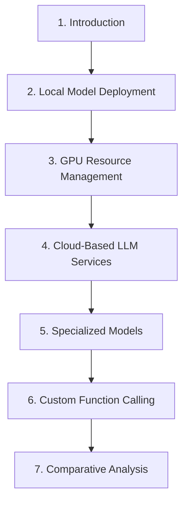

# Lesson 12: Advanced Model Inference and Function Calling



## 1. Introduction

In this lesson, we delve into advanced techniques for model inference and function calling, exploring the spectrum from local deployment to cloud-based services and specialized models. This knowledge is crucial for leveraging the full potential of Large Language Models (LLMs) in various applications.

## 2. Local Model Deployment with PyTorch and Hugging Face

### 2.1 Explanation

Local model deployment offers control and customization but requires careful resource management. PyTorch and Hugging Face's Transformers library provide powerful tools for working with LLMs locally.

### 2.2 Code Example: Advanced Local Model Usage

```python
import torch
from transformers import AutoModelForCausalLM, AutoTokenizer, TextDataset, DataCollatorForLanguageModeling
from transformers import Trainer, TrainingArguments

class AdvancedLocalModel:
    def __init__(self, model_name):
        self.tokenizer = AutoTokenizer.from_pretrained(model_name)
        self.model = AutoModelForCausalLM.from_pretrained(model_name)
        self.device = torch.device("cuda" if torch.cuda.is_available() else "cpu")
        self.model.to(self.device)

    def generate_text(self, prompt, max_length=100):
        inputs = self.tokenizer(prompt, return_tensors="pt").to(self.device)
        outputs = self.model.generate(**inputs, max_length=max_length)
        return self.tokenizer.decode(outputs[0], skip_special_tokens=True)

    def fine_tune(self, train_file, output_dir, num_train_epochs=3):
        dataset = TextDataset(tokenizer=self.tokenizer, file_path=train_file, block_size=128)
        data_collator = DataCollatorForLanguageModeling(tokenizer=self.tokenizer, mlm=False)
        
        training_args = TrainingArguments(
            output_dir=output_dir,
            overwrite_output_dir=True,
            num_train_epochs=num_train_epochs,
            per_device_train_batch_size=4,
            save_steps=10_000,
            save_total_limit=2,
        )
        
        trainer = Trainer(
            model=self.model,
            args=training_args,
            data_collator=data_collator,
            train_dataset=dataset,
        )
        
        trainer.train()
        self.model = trainer.model
        self.tokenizer.save_pretrained(output_dir)
        self.model.save_pretrained(output_dir)

    def estimate_model_size(self):
        return sum(p.numel() for p in self.model.parameters()) * 4 / (1024 ** 3)  # Size in GB

# Usage example
model = AdvancedLocalModel("gpt2")
print(f"Model size: {model.estimate_model_size():.2f} GB")
generated_text = model.generate_text("The future of AI is")
print(f"Generated text: {generated_text}")
```

This code demonstrates loading, using, and fine-tuning a local model, as well as estimating its size for resource management.

## 3. Advanced GPU Resource Management

### 3.1 Explanation

Efficient GPU resource management is crucial for optimal performance when working with large models locally. This involves techniques for memory optimization and dynamic resource allocation.

### 3.2 Code Example: GPU Resource Manager

```python
import torch
from transformers import AutoModelForCausalLM, AutoTokenizer
import nvidia_smi
import gc

class GPUResourceManager:
    def __init__(self):
        nvidia_smi.nvmlInit()
        self.handle = nvidia_smi.nvmlDeviceGetHandleByIndex(0)
        self.models = {}

    def load_model(self, model_name):
        if model_name not in self.models:
            tokenizer = AutoTokenizer.from_pretrained(model_name)
            model = AutoModelForCausalLM.from_pretrained(model_name)
            model.to('cuda')
            self.models[model_name] = (model, tokenizer)
        return self.models[model_name]

    def unload_model(self, model_name):
        if model_name in self.models:
            del self.models[model_name]
            gc.collect()
            torch.cuda.empty_cache()

    def get_gpu_utilization(self):
        res = nvidia_smi.nvmlDeviceGetUtilizationRates(self.handle)
        return res.gpu

    def get_gpu_memory_usage(self):
        info = nvidia_smi.nvmlDeviceGetMemoryInfo(self.handle)
        return info.used / info.total * 100

    def optimize_batch_size(self, model_name, input_text, target_utilization=90):
        model, tokenizer = self.load_model(model_name)
        batch_size = 1
        while True:
            try:
                inputs = tokenizer([input_text] * batch_size, return_tensors="pt", padding=True, truncation=True).to('cuda')
                _ = model.generate(**inputs)
                gpu_util = self.get_gpu_utilization()
                if gpu_util > target_utilization:
                    batch_size -= 1
                    break
                batch_size *= 2
            except RuntimeError:  # Out of memory
                batch_size = max(1, batch_size // 2)
                break
        return batch_size

# Usage example
manager = GPUResourceManager()
print(f"Initial GPU Memory Usage: {manager.get_gpu_memory_usage():.2f}%")
optimal_batch_size = manager.optimize_batch_size("gpt2", "The future of AI is")
print(f"Optimal batch size for gpt2: {optimal_batch_size}")
```

This class demonstrates advanced GPU resource management techniques, including model loading/unloading and batch size optimization.

## 4. Leveraging Cloud-Based LLM Services

### 4.1 Explanation

Cloud-based LLM services, like the OpenAI API, offer access to powerful models without the need for local resources. Effective use requires understanding API integration, prompt engineering, and resource management.

### 4.2 Code Example: Advanced OpenAI API Integration

```python
import openai
import asyncio
import aiohttp

class AdvancedOpenAIClient:
    def __init__(self, api_key):
        openai.api_key = api_key
        self.base_url = "https://api.openai.com/v1/engines/"
        self.session = None

    async def __aenter__(self):
        self.session = aiohttp.ClientSession()
        return self

    async def __aexit__(self, exc_type, exc, tb):
        await self.session.close()

    async def generate_text_async(self, prompt, model="text-davinci-002", max_tokens=100, temperature=0.7):
        url = f"{self.base_url}{model}/completions"
        headers = {
            "Authorization": f"Bearer {openai.api_key}",
            "Content-Type": "application/json"
        }
        data = {
            "prompt": prompt,
            "max_tokens": max_tokens,
            "temperature": temperature,
        }
        
        async with self.session.post(url, headers=headers, json=data) as response:
            if response.status == 200:
                result = await response.json()
                return result['choices'][0]['text'].strip()
            else:
                raise Exception(f"Error {response.status}: {await response.text()}")

    async def batch_generate(self, prompts, model="text-davinci-002", max_tokens=100, temperature=0.7):
        tasks = [self.generate_text_async(prompt, model, max_tokens, temperature) for prompt in prompts]
        return await asyncio.gather(*tasks)

# Usage example
async def main():
    api_key = "your-api-key-here"
    async with AdvancedOpenAIClient(api_key) as client:
        prompts = [
            "Write a tweet about the future of AI",
            "Create a short product description for a smart home device",
            "Compose a haiku about machine learning"
        ]
        results = await client.batch_generate(prompts)
        for i, result in enumerate(results):
            print(f"Result {i+1}: {result}")

if __name__ == "__main__":
    asyncio.run(main())
```

This example demonstrates advanced usage of the OpenAI API, including asynchronous requests and batch processing.

## 5. Exploring Specialized Models: JAIS

### 5.1 Explanation

Specialized models like JAIS (Juelich AI Supercomputer) focus on specific domains, offering advantages in tasks like scientific text analysis. Understanding their capabilities is crucial for domain-specific applications.

### 5.2 Code Example: JAIS Model Usage

```python
import torch
from transformers import AutoModelForCausalLM, AutoTokenizer
import nltk
from nltk.tokenize import sent_tokenize

class JAISModel:
    def __init__(self, model_name):
        self.tokenizer = AutoTokenizer.from_pretrained(model_name)
        self.model = AutoModelForCausalLM.from_pretrained(model_name)
        self.device = torch.device("cuda" if torch.cuda.is_available() else "cpu")
        self.model.to(self.device)
        nltk.download('punkt')

    def generate_text(self, prompt, max_length=200):
        inputs = self.tokenizer(prompt, return_tensors="pt").to(self.device)
        outputs = self.model.generate(**inputs, max_length=max_length)
        return self.tokenizer.decode(outputs[0], skip_special_tokens=True)

    def summarize_paper(self, abstract, max_length=150):
        prompt = f"Summarize the following scientific abstract:\n\n{abstract}\n\nSummary:"
        return self.generate_text(prompt, max_length)

    def extract_key_findings(self, paper_text, num_findings=3):
        prompt = f"Extract {num_findings} key findings from the following scientific text:\n\n{paper_text}\n\nKey Findings:"
        findings = self.generate_text(prompt, max_length=200)
        return sent_tokenize(findings)[:num_findings]

# Usage example
model = JAISModel("jais-model-name")  # Replace with actual JAIS model name
abstract = "Recent advancements in quantum computing have shown promising results in solving complex optimization problems..."
summary = model.summarize_paper(abstract)
print(f"Summary: {summary}")
```

This example demonstrates how to use a specialized model like JAIS for scientific text analysis tasks.

## 6. Implementing Custom Function Calling

### 6.1 Explanation

Custom function calling allows LLMs to interact with external systems, expanding their capabilities beyond text generation. This involves defining functions, parsing LLM outputs, and executing external actions.

### 6.2 Code Example: Custom Function Calling System

```python
import json
import re
import openai
import datetime

class AIAssistant:
    def __init__(self, api_key):
        openai.api_key = api_key
        self.functions = {
            "schedule_appointment": self.schedule_appointment,
            "check_weather": self.check_weather
        }

    def parse_function_call(self, text):
        match = re.search(r'FUNCTION_CALL\((.*?)\)', text)
        if match:
            try:
                return json.loads(match.group(1).replace("'", '"'))
            except json.JSONDecodeError:
                return None
        return None

    def execute_function(self, func_name, **kwargs):
        if func_name in self.functions:
            return self.functions[func_name](**kwargs)
        return f"Error: Function '{func_name}' not found."

    def generate_response(self, user_input):
        prompt = f"""
        You are an AI assistant that can perform various tasks. If you need to perform a specific action, 
        use the FUNCTION_CALL format like this: FUNCTION_CALL({{"name": "function_name", "args": {{"arg1": "value1", "arg2": "value2"}}}})
        
        Available functions:
        - schedule_appointment(date, time, description)
        - check_weather(city, date)

        User: {user_input}
        Assistant: """

        response = openai.Completion.create(
            engine="text-davinci-002",
            prompt=prompt,
            max_tokens=150
        )

        ai_response = response.choices[0].text.strip()
        function_call = self.parse_function_call(ai_response)

        if function_call:
            result = self.execute_function(function_call['name'], **function_call['args'])
            return f"{ai_response}\n\nFunction result: {result}"
        else:
            return ai_response

    def schedule_appointment(self, date, time, description):
        # This would interact with a calendar API in a real implementation
        appointment_datetime = datetime.datetime.strptime(f"{date} {time}", "%Y-%m-%d %H:%M")
        return f"Appointment scheduled for {appointment_datetime} - {description}"

    def check_weather(self, city, date):
        # This would use a weather API in a real implementation
        return f"Weather forecast for {city} on {date}: Sunny, 25°C"

# Usage example
assistant = AIAssistant("your-openai-api-key")
response = assistant.generate_response("Schedule a meeting with John for tomorrow at 2 PM to discuss the project proposal.")
print(f"Assistant: {response}")
```

This example demonstrates a custom function calling system that allows an AI assistant to perform tasks like scheduling appointments and checking weather.

## 7. Comparative Analysis

### 7.1 Explanation

Understanding the strengths and weaknesses of different inference approaches is crucial for choosing the right solution for a given application. This involves comparing local models, cloud-based services, and specialized models across various dimensions.

### 7.2 Code Example: Comparative Analysis Framework

```python
import time
import torch
from transformers import AutoModelForCausalLM, AutoTokenizer
import openai

class ModelComparisonFramework:
    def __init__(self, local_model_name, openai_api_key, specialized_model_name):
        self.local_model = self.load_local_model(local_model_name)
        self.openai_api_key = openai_api_key
        self.specialized_model = self.load_local_model(specialized_model_name)

    def load_local_model(self, model_name):
        tokenizer = AutoTokenizer.from_pretrained(model_name)
        model = AutoModelForCausalLM.from_pretrained(model_name)
        model.to(torch.device("cuda" if torch.cuda.is_available() else "cpu"))
        return (model, tokenizer)

    def cloud_inference(self, prompt, max_tokens=100):
        openai.api_key = self.openai_api_key
        start_time = time.time()
        response = openai.Completion.create(
            engine="text-davinci-002",
            prompt=prompt,
            max_tokens=max_tokens
        )
        inference_time = time.time() - start_time
        return response.choices[0].text.strip(), inference_time

    def specialized_inference(self, prompt, max_length=100):
        model, tokenizer = self.specialized_model
        inputs = tokenizer(prompt, return_tensors="pt").to(model.device)
        start_time = time.time()
        outputs = model.generate(**inputs, max_length=max_length)
        inference_time = time.time() - start_time
        return tokenizer.decode(outputs[0], skip_special_tokens=True), inference_time

    def run_comparison(self, prompts, task_types):
        results = []
        for prompt, task_type in zip(prompts, task_types):
            local_result, local_time = self.local_inference(prompt)
            cloud_result, cloud_time = self.cloud_inference(prompt)
            specialized_result, specialized_time = self.specialized_inference(prompt)

            results.append({
                "task_type": task_type,
                "prompt": prompt,
                "local": {"result": local_result, "time": local_time},
                "cloud": {"result": cloud_result, "time": cloud_time},
                "specialized": {"result": specialized_result, "time": specialized_time}
            })

        return results

    def analyze_results(self, results):
        analysis = {
            "average_times": {"local": 0, "cloud": 0, "specialized": 0},
            "task_type_performance": {}
        }

        for result in results:
            task_type = result["task_type"]
            if task_type not in analysis["task_type_performance"]:
                analysis["task_type_performance"][task_type] = {"local": 0, "cloud": 0, "specialized": 0}
            
            for model_type in ["local", "cloud", "specialized"]:
                analysis["average_times"][model_type] += result[model_type]["time"]
                analysis["task_type_performance"][task_type][model_type] += result[model_type]["time"]

        num_results = len(results)
        for model_type in ["local", "cloud", "specialized"]:
            analysis["average_times"][model_type] /= num_results

        for task_type in analysis["task_type_performance"]:
            for model_type in ["local", "cloud", "specialized"]:
                analysis["task_type_performance"][task_type][model_type] /= sum(1 for r in results if r["task_type"] == task_type)

        return analysis

# Usage example
framework = ModelComparisonFramework(
    local_model_name="gpt2",
    openai_api_key="your-openai-api-key",
    specialized_model_name="jais-model-name"  # Replace with actual JAIS model name
)

prompts = [
    "Summarize the key features of quantum computing.",
    "Write a short story about a robot learning to paint.",
    "Explain the process of photosynthesis in simple terms.",
    "Generate a hypothesis for the impact of climate change on coral reefs."
]

task_types = ["scientific_explanation", "creative_writing", "science_simplification", "scientific_hypothesis"]

comparison_results = framework.run_comparison(prompts, task_types)
analysis = framework.analyze_results(comparison_results)

print("Comparison Results:")
for result in comparison_results:
    print(f"\nTask Type: {result['task_type']}")
    print(f"Prompt: {result['prompt']}")
    for model_type in ["local", "cloud", "specialized"]:
        print(f"{model_type.capitalize()} Model:")
        print(f"  Result: {result[model_type]['result'][:100]}...")  # Truncated for brevity
        print(f"  Inference Time: {result[model_type]['time']:.4f} seconds")

print("\nAnalysis:")
print(f"Average Inference Times:")
for model_type, avg_time in analysis["average_times"].items():
    print(f"  {model_type.capitalize()} Model: {avg_time:.4f} seconds")

print("\nTask Type Performance (Average Inference Time):")
for task_type, performance in analysis["task_type_performance"].items():
    print(f"  {task_type}:")
    for model_type, avg_time in performance.items():
        print(f"    {model_type.capitalize()} Model: {avg_time:.4f} seconds")
```

This comprehensive framework allows for direct comparison of local, cloud-based, and specialized models across various task types, providing insights into their relative strengths and performance characteristics.

## 8. Conclusion

In this lesson, we've explored advanced techniques for model inference and function calling, covering a wide range of approaches from local deployment to cloud-based services and specialized models. Key takeaways include:

1. Local model deployment offers control and customization but requires careful resource management.
2. GPU resource management is crucial for optimal performance when working with large models locally.
3. Cloud-based LLM services provide access to powerful models without local resource constraints but require effective API integration and prompt engineering.
4. Specialized models like JAIS offer advantages in domain-specific tasks, particularly in scientific and technical fields.
5. Custom function calling expands LLM capabilities by enabling interaction with external systems and data sources.
6. Comparative analysis is essential for choosing the right approach for specific use cases, considering factors like performance, cost, and scalability.

As the field of AI continues to evolve, the ability to effectively implement and combine these various approaches will be crucial for developing sophisticated, efficient, and powerful AI applications.

## 9. Further Reading and Resources

To deepen your understanding of the topics covered in this lesson, consider exploring the following resources:

1. "Deep Learning" by Ian Goodfellow, Yoshua Bengio, and Aaron Courville
2. PyTorch documentation: <https://pytorch.org/docs/stable/index.html>
3. Hugging Face Transformers library documentation: <https://huggingface.co/transformers/>
4. OpenAI API documentation: <https://beta.openai.com/docs/>
5. "Designing Machine Learning Systems" by Chip Huyen

## 10. Homework Assignments

1. Implement a local model using PyTorch and Hugging Face for sentiment analysis. Optimize its performance and analyze its resource usage on different hardware configurations.

2. Develop a cloud-based application using the OpenAI API that acts as a creative writing assistant, capable of generating story outlines, character descriptions, and dialogue.

3. Research and write a report on the current state and future potential of specialized language models like JAIS, including potential applications in fields such as bioinformatics and climate modeling.

4. Design and implement a custom function calling system for an AI assistant that can perform at least five different real-world tasks (e.g., scheduling, data analysis, web scraping).

5. Conduct a comparative analysis of local, cloud-based, and specialized model approaches for a language translation application. Consider factors such as translation quality, speed, cost, and scalability in your analysis.

By completing these assignments, you'll gain practical experience in implementing and evaluating different approaches to model inference and function calling, preparing you for real-world AI development challenges.
