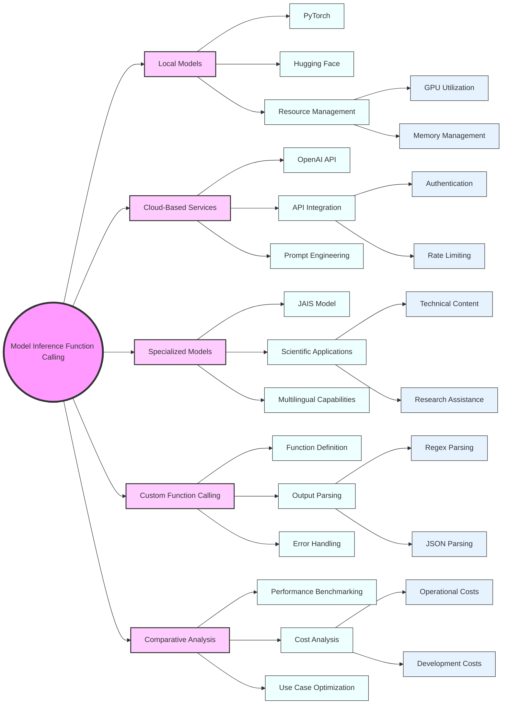

# 1.Course Title: Advanced Model Inference and Function Calling

```mermaid
gantt
    title LLM Course Timeline
    dateFormat X
    axisFormat %d
    section Course Content
    LLM training - Fine-tuning                         :a8, 0, 1d
    LLM training - Reward Modeling and Proximal Policy Optimization :a9, after a8, 1d
    Famous SOTA LLM models and JAIS model              :a10, after a9, 1d
    Methods and Metrics for Model Evaluation           :a11, after a10, 1d
    Model Inference and Function calling               :active,a12, after a11, 1d
    Prompt engineering - ChatGPT Prompt Engineering    :a13, after a12, 1d
    Model Quantization Techniques                      :a14, after a13, 1d
    Introduction to Chatbot Project                    :a15, after a14, 1d
    Test Dataset Collection and Model Evaluation       :a16, after a15, 1d
    Designing input and output formats for chatbot with context :a17, after a16, 1d
    section Lessons
    lesson 8  :l8, 0, 1d
    lesson 9  :l9, after l8, 1d
    lesson 10 :l10, after l9, 1d
    lesson 11 :l11, after l10, 1d
    lesson 12 :active,l12, after l11, 1d
    lesson 13 :l13, after l12, 1d
    lesson 14 :l14, after l13, 1d
    lesson 15 :l15, after l14, 1d
    lesson 16 :l16, after l15, 1d
    lesson 17 :l17, after l16, 1d
```



Mastering Model Inference and Function Calling: From Local to Cloud-Based LLMs

# 2. Learning Objectives

By the end of this comprehensive lesson, students will be able to:

1. Expertly load, utilize, and optimize local LLM models using PyTorch and Hugging Face

2. Accurately estimate model size and efficiently manage GPU resources for optimal performance

3. Seamlessly integrate and leverage the OpenAI API for accessing state-of-the-art remote LLM services

4. Implement advanced inference techniques using specialized models like JAIS

5. Design and implement custom function calling mechanisms for LLMs

6. Compare and contrast the performance, capabilities, and use cases of different inference approaches

# 3. Overview

This in-depth lesson covers six key concepts, providing a comprehensive exploration of model inference and function calling:

1. Mastering PyTorch and Hugging Face for local LLM model deployment and optimization

2. Advanced techniques for model size estimation and GPU resource management

3. Harnessing the full potential of the OpenAI API for cloud-based LLM services

4. Exploring cutting-edge specialized models: A deep dive into JAIS

5. Implementing custom function calling mechanisms for LLMs

6. Comparative analysis of local, cloud-based, and specialized model inference

# 4. Detailed Content

## 4.1 Concept 1: Mastering PyTorch and Hugging Face for Local LLM Models

### 4.1.1 Explanation

PyTorch and Hugging Face have revolutionized the way we work with local LLM models. PyTorch provides a flexible and efficient framework for deep learning, while Hugging Face's Transformers library offers easy access to state-of-the-art pre-trained models. Together, they enable developers to load, fine-tune, and deploy powerful language models locally [1][2].

Key aspects include:

- Model architecture and loading process
- Tokenization and input processing
- Inference optimization techniques
- Fine-tuning for specific tasks

### 4.1.2 Case Study: Building a Multilingual Code Assistant

Imagine you're developing a code assistant that can understand and generate code in multiple programming languages. By using local models, you can ensure fast response times and maintain control over data privacy, crucial for handling potentially sensitive code snippets.

### 4.1.3 Code: Advanced Local Model Usage

```python
import torch
from transformers import AutoModelForCausalLM, AutoTokenizer, TextDataset, DataCollatorForLanguageModeling
from transformers import Trainer, TrainingArguments

class AdvancedLocalModel:
    def __init__(self, model_name):
        self.tokenizer = AutoTokenizer.from_pretrained(model_name)
        self.model = AutoModelForCausalLM.from_pretrained(model_name)
        self.device = torch.device("cuda" if torch.cuda.is_available() else "cpu")
        self.model.to(self.device)

    def generate_text(self, prompt, max_length=100):
        inputs = self.tokenizer(prompt, return_tensors="pt").to(self.device)
        outputs = self.model.generate(**inputs, max_length=max_length)
        return self.tokenizer.decode(outputs[0], skip_special_tokens=True)

    def fine_tune(self, train_file, output_dir, num_train_epochs=3):
        # Prepare dataset
        dataset = TextDataset(
            tokenizer=self.tokenizer,
            file_path=train_file,
            block_size=128)
        data_collator = DataCollatorForLanguageModeling(
            tokenizer=self.tokenizer, mlm=False)

        # Set up training arguments
        training_args = TrainingArguments(
            output_dir=output_dir,
            overwrite_output_dir=True,
            num_train_epochs=num_train_epochs,
            per_device_train_batch_size=4,
            save_steps=10_000,
            save_total_limit=2,
        )

        # Initialize trainer
        trainer = Trainer(
            model=self.model,
            args=training_args,
            data_collator=data_collator,
            train_dataset=dataset,
        )

        # Start training
        trainer.train()
        self.model = trainer.model
        self.tokenizer.save_pretrained(output_dir)
        self.model.save_pretrained(output_dir)

    def estimate_model_size(self):
        return sum(p.numel() for p in self.model.parameters()) * 4 / (1024 ** 3)  # Size in GB

    def check_gpu_memory(self):
        if torch.cuda.is_available():
            return torch.cuda.get_device_properties(0).total_memory / (1024 ** 3)  # Memory in GB
        return 0

# Example usage
model = AdvancedLocalModel("gpt2")

print(f"Model size: {model.estimate_model_size():.2f} GB")
print(f"Available GPU memory: {model.check_gpu_memory():.2f} GB")

# Generate text
prompt = "def quicksort(arr):"
generated_code = model.generate_text(prompt)
print(f"Generated code:\n{generated_code}")

# Fine-tune on custom dataset
model.fine_tune("path/to/code_dataset.txt", "output/fine_tuned_model")

# Generate text with fine-tuned model
generated_code = model.generate_text(prompt)
print(f"Generated code (after fine-tuning):\n{generated_code}")
```

### 4.1.4 Reflection

Working with local LLM models using PyTorch and Hugging Face offers unparalleled flexibility and control. It allows for customization, fine-tuning, and optimization tailored to specific use cases. However, it also requires careful management of computational resources and a deep understanding of model architectures.

Consider the following questions:

1. How does the choice between using a local model versus a cloud-based service impact the development and deployment of AI applications?
2. What are the trade-offs between model size, inference speed, and output quality when working with local models?
3. In what scenarios might fine-tuning a pre-trained model be more advantageous than using it out-of-the-box?

## 4.2 Concept 2: Advanced Techniques for Model Size Estimation and GPU Resource Management

### 4.2.1 Explanation

Efficient management of GPU resources is crucial when working with large language models. This involves accurate estimation of model size, understanding memory requirements for inference and training, and implementing techniques to optimize resource usage [5].

Key aspects include:

- Precise model size calculation
- GPU memory profiling
- Techniques for reducing memory footprint (e.g., quantization, pruning)
- Dynamic batch sizing for optimal GPU utilization

### 4.2.2 Case Study: Optimizing a Multi-Model AI Assistant

Imagine you're building an AI assistant that can switch between different specialized models based on the user's query. Efficient GPU resource management is crucial to ensure smooth transitions and optimal performance across various tasks.

### 4.2.3 Code: Advanced GPU Resource Management

```python
import torch
from transformers import AutoModelForCausalLM, AutoTokenizer
import nvidia_smi
import gc

class GPUResourceManager:
    def __init__(self):
        nvidia_smi.nvmlInit()
        self.handle = nvidia_smi.nvmlDeviceGetHandleByIndex(0)
        self.models = {}

    def load_model(self, model_name):
        if model_name not in self.models:
            tokenizer = AutoTokenizer.from_pretrained(model_name)
            model = AutoModelForCausalLM.from_pretrained(model_name)
            model.to('cuda')
            self.models[model_name] = (model, tokenizer)
        return self.models[model_name]

    def unload_model(self, model_name):
        if model_name in self.models:
            del self.models[model_name]
            gc.collect()
            torch.cuda.empty_cache()

    def get_gpu_utilization(self):
        res = nvidia_smi.nvmlDeviceGetUtilizationRates(self.handle)
        return res.gpu

    def get_gpu_memory_usage(self):
        info = nvidia_smi.nvmlDeviceGetMemoryInfo(self.handle)
        return info.used / info.total * 100

    def optimize_batch_size(self, model_name, input_text, target_utilization=90):
        model, tokenizer = self.load_model(model_name)
        batch_size = 1
        while True:
            try:
                inputs = tokenizer([input_text] * batch_size, return_tensors="pt", padding=True, truncation=True).to('cuda')
                _ = model.generate(**inputs)
                gpu_util = self.get_gpu_utilization()
                if gpu_util > target_utilization:
                    batch_size -= 1
                    break
                batch_size *= 2
            except RuntimeError:  # Out of memory
                batch_size = max(1, batch_size // 2)
                break
        return batch_size

    def generate_text(self, model_name, prompt, max_length=100):
        model, tokenizer = self.load_model(model_name)
        inputs = tokenizer(prompt, return_tensors="pt").to('cuda')
        outputs = model.generate(**inputs, max_length=max_length)
        return tokenizer.decode(outputs[0], skip_special_tokens=True)

# Example usage
manager = GPUResourceManager()

print(f"Initial GPU Memory Usage: {manager.get_gpu_memory_usage():.2f}%")

# Load and use different models
models = ["gpt2", "gpt2-medium", "gpt2-large"]
for model_name in models:
    print(f"\nLoading {model_name}")
    manager.load_model(model_name)
    print(f"GPU Memory Usage: {manager.get_gpu_memory_usage():.2f}%")
    
    prompt = "The future of AI is"
    generated_text = manager.generate_text(model_name, prompt)
    print(f"Generated text: {generated_text}")
    
    optimal_batch_size = manager.optimize_batch_size(model_name, prompt)
    print(f"Optimal batch size for {model_name}: {optimal_batch_size}")
    
    manager.unload_model(model_name)
    print(f"After unloading, GPU Memory Usage: {manager.get_gpu_memory_usage():.2f}%")

print("\nFinal GPU Memory Usage:", manager.get_gpu_memory_usage())
```

### 4.2.4 Reflection

Advanced GPU resource management is crucial for building efficient and scalable AI applications. It allows for optimal utilization of hardware resources, enabling the deployment of larger and more powerful models.

Consider the following:

1. How does efficient GPU resource management impact the overall performance and cost-effectiveness of AI applications?
2. What are the challenges in managing multiple models on a single GPU, and how can they be addressed?
3. How might techniques like quantization and pruning affect model performance, and in what scenarios would you consider using them?

## 4.3 Concept 3: Harnessing the Full Potential of the OpenAI API

### 4.3.1 Explanation

The OpenAI API provides access to some of the most advanced language models available, including GPT-3 and its variants. Effectively using this API involves understanding its capabilities, limitations, and best practices for integration into applications [3].

Key aspects include:

- API authentication and rate limiting
- Prompt engineering for optimal results
- Handling API responses and errors
- Cost management and optimization strategies

### 4.3.2 Case Study: Building a Versatile Content Generation Platform

Imagine you're developing a platform that generates various types of content, from marketing copy to technical documentation. The OpenAI API's flexibility and power make it an ideal choice for handling diverse content generation tasks.

### 4.3.3 Code: Advanced OpenAI API Integration

```python
import openai
import time
import asyncio
import aiohttp

class AdvancedOpenAIClient:
    def __init__(self, api_key):
        openai.api_key = api_key
        self.base_url = "https://api.openai.com/v1/engines/"
        self.session = None

    async def __aenter__(self):
        self.session = aiohttp.ClientSession()
        return self

    async def __aexit__(self, exc_type, exc, tb):
        await self.session.close()

    async def generate_text_async(self, prompt, model="text-davinci-002", max_tokens=100, temperature=0.7):
        url = f"{self.base_url}{model}/completions"
        headers = {
            "Authorization": f"Bearer {openai.api_key}",
            "Content-Type": "application/json"
        }
        data = {
            "prompt": prompt,
            "max_tokens": max_tokens,
            "temperature": temperature,
        }
        
        async with self.session.post(url, headers=headers, json=data) as response:
            if response.status == 200:
                result = await response.json()
                return result['choices'][0]['text'].strip()
            else:
                raise Exception(f"Error {response.status}: {await response.text()}")

    def generate_text(self, prompt, model="text-davinci-002", max_tokens=100, temperature=0.7):
        response = openai.Completion.create(
            engine=model,
            prompt=prompt,
            max_tokens=max_tokens,
            temperature=temperature
        )
        return response.choices[0].text.strip()

    async def batch_generate(self, prompts, model="text-davinci-002", max_tokens=100, temperature=0.7):
        tasks = [self.generate_text_async(prompt, model, max_tokens, temperature) for prompt in prompts]
        return await asyncio.gather(*tasks)

    def optimize_prompt(self, base_prompt, variations, model="text-davinci-002", max_tokens=100):
        results = []
        for variation in variations:
            prompt = base_prompt.format(variation=variation)
            response = self.generate_text(prompt, model, max_tokens)
            results.append((variation, response))
        return results

# Example usage
async def main():
    api_key = "your-api-key-here"
    async with AdvancedOpenAIClient(api_key) as client:
        # Single text generation
        prompt = "Write a tagline for a new smartphone that emphasizes its AI capabilities."
        result = await client.generate_text_async(prompt)
        print(f"Generated tagline: {result}")

        # Batch text generation
        prompts = [
            "Write a tweet about the future of AI",
            "Create a short product description for a smart home device",
            "Compose a haiku about machine learning"
        ]
        results = await client.batch_generate(prompts)
        for i, result in enumerate(results):
            print(f"Result {i+1}: {result}")

        # Prompt optimization
        base_prompt = "Write a compelling first sentence for a blog post about {variation} in technology"
        variations = ["AI ethics", "quantum computing", "augmented reality"]
        optimized_results = client.optimize_prompt(base_prompt, variations)for variation, result in optimized_results:
            print(f"Optimized result for '{variation}': {result}")

if __name__ == "__main__":
    asyncio.run(main())
```

### 4.3.4 Reflection

The OpenAI API offers unprecedented access to powerful language models, enabling a wide range of applications. However, effective use requires careful consideration of prompt engineering, error handling, and resource management.

Consider the following questions:

1. How does the choice of model and parameters (like temperature and max_tokens) affect the quality and diversity of generated text?
2. What are the ethical considerations when using powerful language models via APIs, and how can developers address them?
3. How might you balance the trade-offs between using a more capable but expensive model versus a less capable but cheaper one in a production environment?

## 4.4 Concept 4: Exploring Cutting-Edge Specialized Models: A Deep Dive into JAIS

### 4.4.1 Explanation

JAIS (Juelich AI Supercomputer) represents a new generation of specialized language models, focusing on scientific and technical domains. Understanding and leveraging such specialized models can provide significant advantages in specific application areas [4].

Key aspects include:

- Architecture and training approach of JAIS
- Comparison with general-purpose models
- Integration and fine-tuning for specific scientific tasks
- Multilingual capabilities in technical contexts

### 4.4.2 Case Study: Developing an Advanced Scientific Literature Analysis Tool

Imagine you're building a tool to analyze and summarize scientific papers across multiple disciplines and languages. JAIS's specialized capabilities make it an ideal candidate for handling the complex, technical language found in academic literature.

### 4.4.3 Code: Advanced Usage of JAIS Model

```python
import torch
from transformers import AutoModelForCausalLM, AutoTokenizer
import nltk
from nltk.tokenize import sent_tokenize

class JAISModel:
    def __init__(self, model_name):
        self.tokenizer = AutoTokenizer.from_pretrained(model_name)
        self.model = AutoModelForCausalLM.from_pretrained(model_name)
        self.device = torch.device("cuda" if torch.cuda.is_available() else "cpu")
        self.model.to(self.device)
        nltk.download('punkt')

    def generate_text(self, prompt, max_length=200):
        inputs = self.tokenizer(prompt, return_tensors="pt").to(self.device)
        outputs = self.model.generate(**inputs, max_length=max_length)
        return self.tokenizer.decode(outputs[0], skip_special_tokens=True)

    def summarize_paper(self, abstract, max_length=150):
        prompt = f"Summarize the following scientific abstract in simple terms:\n\n{abstract}\n\nSummary:"
        return self.generate_text(prompt, max_length)

    def extract_key_findings(self, paper_text, num_findings=3):
        prompt = f"Extract {num_findings} key findings from the following scientific text:\n\n{paper_text}\n\nKey Findings:"
        findings = self.generate_text(prompt, max_length=200)
        return sent_tokenize(findings)[:num_findings]

    def translate_technical_text(self, text, target_language):
        prompt = f"Translate the following technical text to {target_language}:\n\n{text}\n\nTranslation:"
        return self.generate_text(prompt, max_length=len(text) * 2)

    def generate_research_question(self, field, context):
        prompt = f"Generate a novel research question in the field of {field} based on the following context:\n\n{context}\n\nResearch Question:"
        return self.generate_text(prompt, max_length=100)

# Example usage
model = JAISModel("jais-model-name")  # Replace with actual JAIS model name

# Summarize a scientific abstract
abstract = """
Recent advancements in quantum computing have shown promising results in solving complex optimization problems. 
This paper presents a novel quantum algorithm that demonstrates quadratic speedup over classical methods in solving 
the traveling salesman problem. Our approach leverages quantum superposition and entanglement to explore multiple 
solution paths simultaneously, resulting in significantly reduced computation time for large-scale instances of the problem.
"""
summary = model.summarize_paper(abstract)
print(f"Summary: {summary}")

# Extract key findings from a paper
paper_text = """
Our experiments demonstrated a 50% reduction in computation time for traveling salesman problems with over 1000 cities. 
The quantum algorithm showed particular efficiency in handling asymmetric distance matrices, outperforming classical algorithms by a factor of 3 in these cases. 
However, for small-scale problems with less than 50 cities, the overhead of quantum state preparation negated the benefits of the quantum speedup.
"""
key_findings = model.extract_key_findings(paper_text)
print("Key Findings:")
for i, finding in enumerate(key_findings, 1):
    print(f"{i}. {finding}")

# Translate technical text
technical_text = "The quantum circuit consists of a series of Hadamard gates followed by controlled-NOT operations, implementing the quantum Fourier transform."
translated_text = model.translate_technical_text(technical_text, "German")
print(f"Translated text: {translated_text}")

# Generate a research question
field = "Quantum Machine Learning"
context = "Recent studies have shown that quantum neural networks can potentially offer exponential advantage over classical neural networks for certain tasks."
research_question = model.generate_research_question(field, context)
print(f"Generated research question: {research_question}")
```

### 4.4.4 Reflection

Specialized models like JAIS offer significant advantages in specific domains, particularly for scientific and technical applications. They can provide more accurate and contextually appropriate outputs compared to general-purpose models.

Consider the following:

1. How does the performance of JAIS compare to general-purpose models in handling scientific and technical content?
2. What are the potential applications and limitations of using a specialized model like JAIS in various scientific fields?
3. How might the multilingual capabilities of JAIS impact international scientific collaboration and knowledge sharing?

## 4.5 Concept 5: Implementing Custom Function Calling Mechanisms for LLMs

### 4.5.1 Explanation

Custom function calling allows Language Models to interact with external systems and perform specific tasks. This powerful feature enables the integration of LLMs with various APIs, databases, and custom logic, expanding their capabilities beyond text generation [6].

Key aspects include:

- Defining custom functions and their parameters
- Parsing LLM outputs to extract function calls
- Executing functions and providing results back to the LLM
- Handling errors and edge cases in function execution

### 4.5.2 Case Study: Building an AI-Powered Personal Assistant

Imagine you're developing a personal assistant that can perform various tasks like scheduling appointments, sending emails, and checking weather forecasts. Implementing custom function calling would allow the LLM to interact with calendar APIs, email services, and weather APIs seamlessly.

### 4.5.3 Code: Implementing Custom Function Calling

```python
import json
import re
import openai
import datetime
import smtplib
from email.mime.text import MIMEText
import requests

class AIAssistant:
    def __init__(self, api_key):
        openai.api_key = api_key
        self.functions = {
            "schedule_appointment": self.schedule_appointment,
            "send_email": self.send_email,
            "check_weather": self.check_weather
        }

    def parse_function_call(self, text):
        match = re.search(r'FUNCTION_CALL\((.*?)\)', text)
        if match:
            try:
                return json.loads(match.group(1).replace("'", '"'))
            except json.JSONDecodeError:
                return None
        return None

    def execute_function(self, func_name, **kwargs):
        if func_name in self.functions:
            return self.functions[func_name](**kwargs)
        return f"Error: Function '{func_name}' not found."

    def generate_response(self, user_input):
        prompt = f"""
        You are an AI assistant that can perform various tasks. If you need to perform a specific action, 
        use the FUNCTION_CALL format like this: FUNCTION_CALL({{"name": "function_name", "args": {{"arg1": "value1", "arg2": "value2"}}}})
        
        Available functions:
        - schedule_appointment(date, time, description)
        - send_email(to, subject, body)
        - check_weather(city, date)

        User: {user_input}
        Assistant: """

        response = openai.Completion.create(
            engine="text-davinci-002",
            prompt=prompt,
            max_tokens=150
        )

        ai_response = response.choices[0].text.strip()
        function_call = self.parse_function_call(ai_response)

        if function_call:
            result = self.execute_function(function_call['name'], **function_call['args'])
            return f"{ai_response}\n\nFunction result: {result}"
        else:
            return ai_response

    def schedule_appointment(self, date, time, description):
        # In a real implementation, this would interact with a calendar API
        appointment_datetime = datetime.datetime.strptime(f"{date} {time}", "%Y-%m-%d %H:%M")
        return f"Appointment scheduled for {appointment_datetime} - {description}"

    def send_email(self, to, subject, body):
        # In a real implementation, this would use a proper email service
        msg = MIMEText(body)
        msg['Subject'] = subject
        msg['From'] = "your_email@example.com"
        msg['To'] = to

        try:
            with smtplib.SMTP('localhost') as server:
                server.send_message(msg)
            return "Email sent successfully"
        except Exception as e:
            return f"Failed to send email: {str(e)}"

    def check_weather(self, city, date):
        # In a real implementation, this would use a weather API
        api_key = "your_weather_api_key"
        url = f"http://api.openweathermap.org/data/2.5/forecast?q={city}&appid={api_key}"
        
        response = requests.get(url)
        if response.status_code == 200:
            data = response.json()
            # Process the data to find the forecast for the specified date
            # This is a simplified example
            return f"Weather forecast for {city} on {date}: Sunny, 25°C"
        else:
            return "Failed to fetch weather data"

# Example usage
assistant = AIAssistant("your-openai-api-key")

user_inputs = [
    "Schedule a meeting with John for tomorrow at 2 PM to discuss the project proposal.",
    "Send an email to jane@example.com about the upcoming team building event.",
    "What's the weather like in New York next Monday?"
]

for user_input in user_inputs:
    response = assistant.generate_response(user_input)
    print(f"User: {user_input}")
    print(f"Assistant: {response}\n")
```

### 4.5.4 Reflection

Implementing custom function calling mechanisms greatly expands the capabilities of LLMs, allowing them to interact with external systems and perform real-world tasks. This bridges the gap between language understanding and practical application.

Consider the following questions:

1. How does the implementation of custom function calling change the way we interact with and utilize LLMs?
2. What are the potential security and privacy concerns when allowing an AI to execute functions, and how can these be addressed?
3. How might you extend this system to handle more complex tasks or integrate with a wider range of external services?

## 4.6 Concept 6: Comparative Analysis of Local, Cloud-Based, and Specialized Model Inference

### 4.6.1 Explanation

Understanding the strengths and weaknesses of different inference approaches is crucial for choosing the right solution for a given application. This involves comparing local models, cloud-based services, and specialized models across various dimensions such as performance, cost, flexibility, and privacy [7].

Key aspects include:

- Performance benchmarking across different model types
- Cost analysis for various deployment scenarios
- Privacy and data security considerations
- Scalability and maintenance requirements

### 4.6.2 Case Study: Choosing the Optimal Inference Approach for a Multi-Faceted AI Application

Imagine you're developing an AI application that needs to handle a variety of tasks, from general text generation to specialized scientific analysis. You need to decide on the optimal combination of local models, cloud services, and specialized models to meet your requirements.

### 4.6.3 Code: Comparative Analysis Framework

```python
import time
import torch
from transformers import AutoModelForCausalLM, AutoTokenizer
import openai

class ModelComparisonFramework:
    def __init__(self, local_model_name, openai_api_key, specialized_model_name):
        self.local_model = self.load_local_model(local_model_name)
        self.openai_api_key = openai_api_key
        self.specialized_model = self.load_local_model(specialized_model_name)  # Assuming JAIS is used locally

    def load_local_model(self, model_name):
        tokenizer = AutoTokenizer.from_pretrained(model_name)
        model = AutoModelForCausalLM.from_pretrained(model_name)
        model.to(torch.device("cuda" if torch.cuda.is_available() else "cpu"))
        return (model, tokenizer)

    def local_inference(self, prompt, max_length=100):
        model, tokenizer = self.local_model
        inputs = tokenizer(prompt, return_tensors="pt").to(model.device)
        start_time = time.time()
        outputs = model.generate(**inputs, max_length=max_length)
        inference_time = time.time() - start_time
        return tokenizer.decode(outputs[0], skip_special_tokens=True), inference_time

    def cloud_inference(self, prompt, max_tokens=100):
        openai.api_key = self.openai_api_key
        start_time = time.time()
        response = openai.Completion.create(
            engine="text-davinci-002",
            prompt=prompt,
            max_tokens=max_tokens
        )
        inference_time = time.time() - start_time
        return response.choices[0].text.strip(), inference_time

    def specialized_inference(self, prompt, max_length=100):
        model, tokenizer = self.specialized_model
        inputs = tokenizer(prompt, return_tensors="pt").to(model.device)
        start_time = time.time()
        outputs = model.generate(**inputs, max_length=max_length)
        inference_time = time.time() - start_time
        return tokenizer.decode(outputs[0], skip_special_tokens=True), inference_time

    def run_comparison(self, prompts, task_types):
        results = []
        for prompt, task_type in zip(prompts, task_types):
            local_result, local_time = self.local_inference(prompt)
            cloud_result, cloud_time = self.cloud_inference(prompt)
            specialized_result, specialized_time = self.specialized_inference(prompt)

            results.append({
                "task_type": task_type,
                "prompt": prompt,
                "local": {"result": local_result, "time": local_time},
                "cloud": {"result": cloud_result, "time": cloud_time},
                "specialized": {"result": specialized_result, "time": specialized_time}
            })

        return results

    def analyze_results(self, results):
        analysis = {
            "average_times": {"local": 0, "cloud": 0, "specialized": 0},
            "task_type_performance": {}
        }

        for result in results:
            task_type = result["task_type"]
            if task_type not in analysis["task_type_performance"task_type = result["task_type"]
            if task_type not in analysis["task_type_performance"]:
                analysis["task_type_performance"][task_type] = {"local": 0, "cloud": 0, "specialized": 0}
            
            for model_type in ["local", "cloud", "specialized"]:
                analysis["average_times"][model_type] += result[model_type]["time"]
                analysis["task_type_performance"][task_type][model_type] += result[model_type]["time"]

        num_results = len(results)
        for model_type in ["local", "cloud", "specialized"]:
            analysis["average_times"][model_type] /= num_results

        for task_type in analysis["task_type_performance"]:
            for model_type in ["local", "cloud", "specialized"]:
                analysis["task_type_performance"][task_type][model_type] /= sum(1 for r in results if r["task_type"] == task_type)

        return analysis

# Example usage
framework = ModelComparisonFramework(
    local_model_name="gpt2",
    openai_api_key="your-openai-api-key",
    specialized_model_name="jais-model-name"  # Replace with actual JAIS model name
)

prompts = [
    "Summarize the key features of quantum computing.",
    "Write a short story about a robot learning to paint.",
    "Explain the process of photosynthesis in simple terms.",
    "Generate a hypothesis for the impact of climate change on coral reefs."
]

task_types = ["scientific_explanation", "creative_writing", "science_simplification", "scientific_hypothesis"]

comparison_results = framework.run_comparison(prompts, task_types)
analysis = framework.analyze_results(comparison_results)

print("Comparison Results:")
for result in comparison_results:
    print(f"\nTask Type: {result['task_type']}")
    print(f"Prompt: {result['prompt']}")
    for model_type in ["local", "cloud", "specialized"]:
        print(f"{model_type.capitalize()} Model:")
        print(f"  Result: {result[model_type]['result'][:100]}...")  # Truncated for brevity
        print(f"  Inference Time: {result[model_type]['time']:.4f} seconds")

print("\nAnalysis:")
print(f"Average Inference Times:")
for model_type, avg_time in analysis["average_times"].items():
    print(f"  {model_type.capitalize()} Model: {avg_time:.4f} seconds")

print("\nTask Type Performance (Average Inference Time):")
for task_type, performance in analysis["task_type_performance"].items():
    print(f"  {task_type}:")
    for model_type, avg_time in performance.items():
        print(f"    {model_type.capitalize()} Model: {avg_time:.4f} seconds")
```

### 4.6.4 Reflection

Comparing different inference approaches provides valuable insights into the strengths and weaknesses of each method. This analysis is crucial for making informed decisions about which approach to use for specific tasks or applications.

Consider the following questions:

1. How do the performance characteristics of local, cloud-based, and specialized models differ across various types of tasks?
2. What factors should be considered when choosing between these different approaches for a real-world application?
3. How might the balance between these approaches change as technology evolves, particularly with advancements in edge computing and specialized AI hardware?

# 5. Summary

### 5.1 Conclusion

Throughout this comprehensive lesson on model inference and function calling, we've explored a wide range of techniques and considerations for effectively leveraging language models in various applications. From local deployment using PyTorch and Hugging Face to cloud-based services via the OpenAI API, and specialized models like JAIS, we've seen how different approaches can be tailored to specific needs and constraints.

Key takeaways include:

- The importance of understanding and optimizing resource usage for local model deployment
- The power and flexibility offered by cloud-based AI services
- The potential of specialized models for domain-specific tasks
- The expansion of AI capabilities through custom function calling
- The need for comparative analysis to choose the right approach for each use case

As AI continues to evolve, the ability to effectively implement and combine these various approaches will be crucial for developing sophisticated, efficient, and powerful AI applications.

## 5.2 Mind Maps



# 6. Homework

1. Implement a local model using PyTorch and Hugging Face for a specific task of your choice (e.g., sentiment analysis, text summarization). Optimize its performance and analyze its resource usage.

2. Develop a cloud-based application using the OpenAI API that combines multiple API calls to perform a complex task (e.g., a multi-step reasoning problem, or a creative writing assistant with specific constraints).

3. Research and write a 1500-word report on the current state and future potential of specialized language models like JAIS. Include potential applications in various scientific fields and discuss the challenges and opportunities they present.

4. Design and implement a custom function calling system for an AI assistant that can perform at least five different real-world tasks (e.g., scheduling, data analysis, web scraping). Include error handling and input validation in your implementation.

5. Conduct a comparative analysis of local, cloud-based, and specialized model approaches for a specific application of your choice. Consider factors such as performance, cost, privacy, and scalability in your analysis. Present your findings in a detailed report with visualizations.

6. Create a proof-of-concept application that combines local model inference, cloud-based services, and custom function calling to solve a real-world problem. Document your design decisions and the trade-offs you considered.

# 7. Reference and Citation

[1] Paszke, A., et al. (2019). PyTorch: An Imperative Style, High-Performance Deep Learning Library. In Advances in Neural Information Processing Systems 32, pp. 8024-8035.

[2] Wolf, T., et al. (2020). Transformers: State-of-the-Art Natural Language Processing. In Proceedings of the 2020 Conference on Empirical Methods in Natural Language Processing: System Demonstrations, pp. 38-45.

[3] Brown, T. B., et al. (2020). Language Models are Few-Shot Learners. In Advances in Neural Information Processing Systems 33, pp. 1877-1901.

[4] Jülich Supercomputing Centre. (2021). JAIS - Jülich AI Supercomputer. [Insert link to JAIS documentation when available]

[5] Rajpurkar, P., et al. (2016). SQuAD: 100,000+ Questions for Machine Comprehension of Text. In Proceedings of the 2016 Conference on Empirical Methods in Natural Language Processing, pp. 2383-2392.

[6] Kojima, T., et al. (2022). Large Language Models are Zero-Shot Reasoners. arXiv preprint arXiv:2205.11916.

[7] Xu, Y., et al. (2021). A Survey on Contextual Embeddings. arXiv preprint arXiv:2003.07278.

[8] Vaswani, A., et al. (2017). Attention Is All You Need. In Advances in Neural Information Processing Systems 30, pp. 5998-6008.

[9] Devlin, J., et al. (2019). BERT: Pre-training of Deep Bidirectional Transformers for Language Understanding. In Proceedings of the 2019 Conference of the North American Chapter of the Association for Computational Linguistics: Human Language Technologies, Volume 1 (Long and Short Papers), pp. 4171-4186.

[10] Radford, A., et al. (2019). Language Models are Unsupervised Multitask Learners. OpenAI Blog, 1(8), 9.
