# Lesson 13 ChatGPT Prompt Engineering: A Comprehensive Guide

```mermaid
gantt
    title LLM Course Timeline
    dateFormat X
    axisFormat %d
    section Course Content
    LLM training - Reward Modeling and Proximal Policy Optimization :a9, 0, 1d
    Famous SOTA LLM models and JAIS model              :a10, after a9, 1d
    Methods and Metrics for Model Evaluation           :a11, after a10, 1d
    Model Inference and Function calling               :a12, after a11, 1d
    Prompt engineering - ChatGPT Prompt Engineering    :active,a13, after a12, 1d
    Model Quantization Techniques                      :a14, after a13, 1d
    Introduction to Chatbot Project                    :a15, after a14, 1d
    Test Dataset Collection and Model Evaluation       :a16, after a15, 1d
    Designing input and output formats for chatbot with context :a17, after a16, 1d
    Model Deployment and Backend Development           :a18, after a17, 1d
    section Lessons
    lesson 9  :l9, 0, 1d
    lesson 10 :l10, after l9, 1d
    lesson 11 :l11, after l10, 1d
    lesson 12 :l12, after l11, 1d
    lesson 13 :active,l13, after l12, 1d
    lesson 14 :l14, after l13, 1d
    lesson 15 :l15, after l14, 1d
    lesson 16 :l16, after l15, 1d
    lesson 17 :l17, after l16, 1d
    lesson 18 :l18, after l17, 1d
```



## Introduction

In the rapidly evolving landscape of artificial intelligence, mastering the art of prompt engineering has become a crucial skill for anyone working with large language models like ChatGPT. This comprehensive guide will dive deep into the intricacies of crafting effective prompts, exploring advanced techniques, and addressing critical considerations such as security and ethics.

Prompt engineering is the process of designing and refining inputs to AI language models to elicit desired outputs. It's a blend of art and science, requiring creativity, analytical thinking, and a deep understanding of how language models work. As AI continues to integrate into various aspects of business and daily life, the ability to effectively communicate with and guide these models becomes increasingly valuable.

## Learning Objectives

By the end of this lesson, you will be able to:

1. Understand the fundamental principles of prompt engineering and its importance in AI interactions
2. Craft effective prompts for a wide range of use cases and applications
3. Apply advanced prompt optimization techniques to enhance AI responses
4. Implement sophisticated prompting strategies, including Chain of Thought and Tree of Thought
5. Identify potential security risks and implement measures to prevent prompt injection attacks
6. Evaluate and refine prompts based on AI responses and desired outcomes
7. Appreciate the ethical considerations in prompt engineering and AI interactions

## The Foundation: Understanding Prompts

### What is a Prompt?

A prompt is the initial input provided to an AI model like ChatGPT to elicit a desired response. It serves as the foundation for AI-human interaction, setting the context, tone, and direction of the conversation. The quality and structure of the prompt significantly influence the relevance, accuracy, and usefulness of the AI's output.

Prompts can vary widely in complexity and purpose:

- Simple queries: "What's the capital of France?"
- Creative tasks: "Write a short story about a time traveler who accidentally changes history."
- Analytical requests: "Analyze the potential impact of artificial intelligence on the job market over the next decade."
- Multi-step problems: "Design a marketing strategy for a new eco-friendly product, including target audience analysis, messaging, and channel selection."

### Key Components of Effective Prompts

1. **Context Setting**: Provide necessary background information to frame the task or question.
2. **Task Specification**: Clearly define what you want the AI to do or answer.
3. **Output Format Guidance**: Specify the desired format or structure of the AI's response.
4. **Role Assignment**: When appropriate, assign a specific role or persona to the AI.
5. **Constraints and Parameters**: Set any limitations or specific conditions for the response.
6. **Examples or Demonstrations**: Provide samples of desired outputs when needed (few-shot learning).

### The Importance of Prompt Engineering

Effective prompt engineering is crucial for several reasons:

1. **Accuracy**: Well-crafted prompts lead to more accurate and relevant responses.
2. **Efficiency**: Good prompts can reduce the need for multiple interactions to get the desired information.
3. **Consistency**: Standardized prompts ensure consistent outputs across multiple queries.
4. **Creativity**: Thoughtful prompts can unlock the creative potential of AI models.
5. **Problem-solving**: Complex prompts enable AI to tackle multi-step problems effectively.
6. **Safety and Ethics**: Careful prompt design helps maintain ethical use and prevents misuse of AI.

### AI-Powered Customer Service Chatbot

Let's explore how these components come together in a real-world application: an AI-powered customer service chatbot for a large e-commerce platform.

```python
import random

class CustomerServiceBot:
    def __init__(self):
        self.company_name = "TechMart"
        self.product_categories = ["Electronics", "Home Appliances", "Computers", "Smartphones"]
        self.common_issues = ["Order Status", "Returns", "Product Information", "Payment Issues"]
        self.tone_options = ["Friendly", "Professional", "Empathetic", "Enthusiastic"]

    def generate_prompt(self, customer_query, customer_history=None):
        category = self._identify_category(customer_query)
        issue = self._identify_issue(customer_query)
        tone = random.choice(self.tone_options)

        prompt = f"""
        Role: You are an AI customer service representative for {self.company_name}, a leading e-commerce platform known for its wide range of tech products and excellent customer service.

        Context: A customer has contacted our support team with a query related to the {category} category, specifically about {issue}. 
        {self._get_customer_history(customer_history)}

        Task: Provide a helpful, {tone.lower()} response to the customer's query. 

        Customer Query: "{customer_query}"

        Instructions:
        1. Address the customer by saying "Dear valued customer" or by name if provided
        2. Show understanding of the issue and empathize if appropriate
        3. Provide a clear and concise solution or next steps
        4. If you can't fully resolve the issue, explain what you can do and what needs to be escalated
        5. Offer additional assistance or information related to their purchase or query
        6. End with a polite closing statement and invite them to reach out if they need further help

        Response Format:
        - Greeting
        - Acknowledgment of the issue
        - Solution or next steps (bullet points if multiple steps are needed)
        - Additional information or offer (if applicable)
        - Closing statement

        Constraints:
        - Keep the response under 150 words
        - Do not make up any information about specific orders or products
        - If asked about policies, refer only to general e-commerce standards unless specified otherwise
        - Maintain a {tone.lower()} tone throughout the response

        Remember to prioritize customer satisfaction while adhering to company policies. Your goal is to resolve the issue efficiently and leave the customer with a positive impression of {self.company_name}.
        """
        return prompt

    def _identify_category(self, query):
        # In a real implementation, this would use NLP techniques
        return random.choice(self.product_categories)

    def _identify_issue(self, query):
        # In a real implementation, this would use NLP techniques
        return random.choice(self.common_issues)

    def _get_customer_history(self, history):
        if history:
            return f"Customer History: The customer has made {history['purchase_count']} purchases in the last year and has contacted support {history['support_count']} times."
        return "Customer History: This appears to be the customer's first interaction with our support team."

# Example usage
bot = CustomerServiceBot()
customer_query = "I haven't received my order yet. It's been a week since I placed it."
customer_history = {"purchase_count": 3, "support_count": 1}
prompt = bot.generate_prompt(customer_query, customer_history)
print(prompt)
```

This example demonstrates how we can dynamically generate prompts that incorporate:

- Context (e-commerce platform, customer history)
- Task specification (respond to customer query)
- Output guidance (structure of the response)
- Role assignment (AI customer service representative)
- Tone setting (randomly selected for variety)
- Constraints (word limit, policy adherence)

By providing this level of detail and structure in the prompt, we guide the AI to generate responses that are more likely to be helpful, consistent, and aligned with the company's customer service standards.

## Crafting Effective Prompts: Principles and Techniques

### Clarity and Specificity

Be clear and specific about what you want the AI to do. Vague or ambiguous prompts often lead to irrelevant or unfocused responses.

Bad: "Tell me about smartphones."
Good: "Provide a brief overview of the top 3 smartphone features that consumers prioritize in 2024, based on recent market trends."

Example of improving clarity and specificity:

```python
def generate_specific_prompt(topic, subtopics, current_year):
    prompt = f"""
    Task: Provide a concise overview of {topic} focusing on the following aspects:

    1. {subtopics[0]}
    2. {subtopics[1]}
    3. {subtopics[2]}

    For each aspect:
    - Explain its importance in the current ({current_year}) market
    - Provide a brief description of the latest developments or trends
    - If applicable, mention 1-2 leading products or technologies in this area

    Format your response as a bulleted list for easy readability.
    Limit your response to approximately 200 words.

    Begin your response with: "As of {current_year}, the top 3 {topic} features that consumers prioritize are:"
    """
    return prompt

# Usage
topic = "smartphone"
subtopics = ["Camera capabilities", "Battery life", "5G connectivity"]
current_year = 2024
specific_prompt = generate_specific_prompt(topic, subtopics, current_year)
print(specific_prompt)
```

### Contextual Richness

Provide enough context to ensure the AI understands the background and can generate relevant responses.

Bad: "How do I fix it?"
Good: "I'm experiencing a blue screen error on my Windows 10 laptop. What are the most common causes and step-by-step troubleshooting methods to resolve this issue?"

Example of adding contextual richness:

```python
def generate_rich_context_prompt(issue, system_info, user_actions):
    prompt = f"""
    Context: A user is experiencing a {issue} on their computer with the following specifications:
    {system_info}

    The user has already attempted the following actions:
    {user_actions}

    Task: As an IT support specialist, provide a comprehensive troubleshooting guide for this issue.

    Your response should include:
    1. A brief explanation of what a {issue} is and its common causes
    2. A step-by-step troubleshooting process, taking into account the actions the user has already taken
    3. Potential solutions for each identified cause
    4. Preventive measures to avoid this issue in the future

    Format your response as a numbered list of steps, with sub-bullets for additional details or options within each step.
    
    Begin your response with: "I understand you're experiencing a {issue}. Let's work through this systematically:"
    """
    return prompt

# Usage
issue = "blue screen error"
system_info = """
- Operating System: Windows 10 Home, Version 20H2
- Processor: Intel Core i5-10210U
- RAM: 8GB
- Storage: 256GB SSD
- Graphics: Intel UHD Graphics
"""
user_actions = """
- Restarted the computer
- Ran Windows Update
- Performed a quick scan with Windows Defender
"""
rich_context_prompt = generate_rich_context_prompt(issue, system_info, user_actions)
print(rich_context_prompt)
```

### Structured Output Requests

When you need information in a specific format, explicitly state this in your prompt.

Example: "List the top 5 programming languages for web development in 2024. For each language, provide:

1. Name of the language
2. Brief description (1-2 sentences)
3. Key strengths
4. Potential drawbacks
Present this information in a markdown table format."

Here's how you might implement this in code:

```python
def generate_structured_output_prompt(topic, number_of_items, attributes, output_format):
    prompt = f"""
    Task: Create a list of the top {number_of_items} {topic} in {2024}.

    For each {topic}, provide the following information:
    {'. '.join(f"{i+1}. {attr}" for i, attr in enumerate(attributes))}

    Present this information in a {output_format} format.

    Additional Instructions:
    - Base your response on the latest trends and data available.
    - Ensure that your descriptions are concise and informative.
    - For strengths and drawbacks, aim to provide 2-3 points for each.

    Begin your response with a brief introduction explaining the criteria used for selecting these top {topic}.
    """
    return prompt

# Usage
topic = "programming languages for web development"
number_of_items = 5
attributes = ["Name of the language", "Brief description (1-2 sentences)", "Key strengths", "Potential drawbacks"]
output_format = "markdown table"
structured_prompt = generate_structured_output_prompt(topic, number_of_items, attributes, output_format)
print(structured_prompt)
```

### Role and Persona Assignment

Assigning a specific role or persona to the AI can help in getting more focused and appropriate responses.

Example: "As an experienced data scientist, explain the concept of overfitting in machine learning models. Include:

1. A clear definition
2. Common causes
3. Methods to detect overfitting
4. Techniques to prevent or mitigate it
Tailor your explanation for a junior data analyst with basic statistical knowledge."

Implementing this approach:

```python
def generate_role_based_prompt(role, topic, subtopics, audience):
    prompt = f"""
    Role: You are an experienced {role} with extensive knowledge in {topic}.

    Task: Explain the concept of {topic} to {audience}. Your explanation should be clear, informative, and tailored to their level of understanding.

    Include the following in your explanation:
    {'. '.join(f"{i+1}. {subtopic}" for i, subtopic in enumerate(subtopics))}

    Guidelines:
    - Use analogies or real-world examples to illustrate complex points
    - Define any technical terms that the audience might not be familiar with
    - Provide practical insights based on your experience as a {role}
    - If relevant, mention any recent developments or ongoing debates in this area

    Format:
    - Start with a brief introduction that hooks the audience
    - Use headings for each main point to structure your explanation
    - Conclude with a summary of key takeaways

    Remember, your audience is {audience}, so adjust your language and depth of explanation accordingly.
    """
    return prompt

# Usage
role = "data scientist"
topic = "overfitting in machine learning models"
subtopics = [
    "A clear definition",
    "Common causes",
    "Methods to detect overfitting",
    "Techniques to prevent or mitigate it"
]
audience = "a junior data analyst with basic statistical knowledge"
role_based_prompt = generate_role_based_prompt(role, topic, subtopics, audience)
print(role_based_prompt)
```

## Advanced Prompt Engineering Techniques

### Chain of Thought (CoT) Prompting

Chain of Thought prompting encourages the AI to break down complex problems into a series of intermediate steps, mimicking human-like reasoning. This technique is particularly effective for tasks that require multi-step reasoning, such as mathematical problem-solving or logical deductions.

Example CoT prompt for a financial analysis task:

```python
def generate_cot_prompt(company_name, financial_data, market_data):
    prompt = f"""
    As an AI financial analyst, evaluate {company_name} and provide an investment recommendation. 
    Use the following financial data and market information:

    Financial Data:
    {financial_data}

    Market Information:
    {market_data}

    Please provide your analysis using the following chain of thought process:

    1. Initial Data Review:
       - List the key financial metrics and market factors that stand out
       - Identify any unusual or concerning figures

    2. Financial Health Assessment:
       - Analyze profitability ratios (e.g., ROE, profit margin)
       - Evaluate liquidity ratios (e.g., current ratio)
       - Assess solvency ratios (e.g., debt-to-equity)
       - Compare these ratios to industry averages

    3. Growth and Efficiency Analysis:
       - Calculate and interpret year-over-year growth rates
       - Analyze efficiency ratios (e.g., asset turnover)
       - Consider the company's market share and competitive position

    4. Market and Industry Evaluation:
       - Discuss relevant market trends and their potential impact
       - Analyze the company's position relative to competitors
       - Consider macroeconomic factors that could affect the company

    5. Risk Assessment:
       - Identify potential risks (financial, operational, market-related)
       - Evaluate the company's risk management strategies

    6. Valuation:
       - Calculate and interpret key valuation metrics (e.g., P/E ratio, P/B ratio)
       - Compare these metrics to industry averages and historical values

    7. Synthesis and Investment Thesis:
       - Summarize the key strengths and weaknesses of the company
       - Develop an investment thesis based on your analysis

    8. Recommendation:
       - Provide a clear investment recommendation (Buy, Hold, or Sell)
       - Explain the rationale behind your recommendation
       - Suggest a target price range, if applicable

    9. Confidence and Limitations:
       - Discuss your level of confidence in the recommendation
       - Mention any limitations in your analysis or areas that require further investigation

    Ensure that each step in your chain of thought is clearly explained and logically connected to the next. Use specific figures from the provided data to support your reasoning.
    """
    return prompt

# Example usage
company_name = "TechInnovate Inc."
financial_data = """
- Revenue: $1.2 billion (up 15% YoY)
- Net Income: $180 million (up 22% YoY)
- Operating Margin: 18%
- Current Ratio: 2.5
- Debt-to-Equity Ratio: 0.4
- Return on Equity: 22%
- P/E Ratio: 25
"""
market_data = """
- Industry: Software as a Service (SaaS)
- Market Cap: $15 billion
- Industry Average P/E: 30
- Market Share: 15% (up from 12% last year)
- Key Competitors: SoftGiant (25% market share), DataPro (18% market share)
- Industry Growth Rate: 12% annually
- Recent Industry Trends: Increasing demand for AI and machine learning solutions
"""

cot_prompt = generate_cot_prompt(company_name, financial_data, market_data)
print(cot_prompt)
```

This Chain of Thought approach guides the AI through a comprehensive financial analysis, encouraging it to consider various aspects systematically before reaching a conclusion. This method is particularly useful for complex tasks that require multiple steps of reasoning.

### Few-Shot Learning

Few-shot learning involves providing the AI with a few examples of the desired input-output pattern before asking it to perform a similar task. This technique can significantly improve the AI's understanding of the task and the quality of its responses.

Example few-shot prompt for generating product descriptions:

```python
def generate_few_shot_prompt(product_name, product_features, num_examples=2):
    examples = [
        {
            "name": "Wireless Noise-Cancelling Headphones",
            "features": "30-hour battery life, Bluetooth 5.0, Active Noise Cancellation",
            "description": "Immerse yourself in pure audio bliss with our Wireless Noise-Cancelling Headphones. Featuring advanced Active Noise Cancellation technology, these headphones create a personal oasis of sound, blocking out the world around you. With an impressive 30-hour battery life and the latest Bluetooth 5.0 connectivity, you can enjoy uninterrupted, high-quality audio all day long. Whether you're commuting, working, or relaxing, these headphones deliver an exceptional listening experience that will transform the way you hear your favorite music and podcasts."
        },
        {
            "name": "Smart Home Security Camera",
            "features": "1080p HD video, Two-way audio, Night vision, Motion detection",
            "description": "Secure your home with confidence using our cutting-edge Smart Home Security Camera. This powerful device offers crystal-clear 1080p HD video, ensuring you never miss a detail. With two-way audio functionality, you can communicate with visitors or deter intruders from anywhere. The advanced night vision capability provides round-the-clock protection, while intelligent motion detection alerts you to any suspicious activity. Easy to install and control from your smartphone, this security camera offers peace of mind at your fingertips."
        },
        {
            "name": "Ultra-Slim Laptop",
            "features": "14-inch 4K display, 1TB SSD, 16GB RAM, 12-hour battery life",
            "description": "Experience unparalleled portability and performance with our Ultra-Slim Laptop. Boasting a stunning 14-inch 4K display, this sleek powerhouse brings your content to life with vivid colors and sharp details. The lightning-fast 1TB SSD and 16GB of RAM ensure smooth multitasking and quick access to your files. With an impressive 12-hour battery life, you can work or play all day without being tethered to an outlet. Whether you're a professional on the go or a student tackling assignments, this laptop combines style, power, and endurance to meet all your computing needs."
        }
    ]

    prompt = f"""
    Task: Generate a compelling product description for an e-commerce website.

    Here are {num_examples} examples of product descriptions:

    """

    for i in range(num_examples):
        prompt += f"""
    Example {i+1}:
    Product: {examples[i]['name']}
    Features: {examples[i]['features']}
    Description: {examples[i]['description']}

    """

    prompt += f"""
    Now, generate a product description for the following:
    Product: {product_name}
    Features: {product_features}

    Guidelines:
    1. Start with an attention-grabbing opening sentence
    2. Highlight the key features and their benefits
    3. Use vivid and descriptive language to create a compelling image
    4. Include a sentence about the ideal use case or target user
    5. End with a call-to-action or a statement that reinforces the product's value
    6. Keep the description between 100-150 words

    Description:
    """

    return prompt

# Example usage
product_name = "Smart Fitness Tracker"
product_features = "Heart rate monitoring, Sleep tracking, 7-day battery life, Water-resistant, Smartphone notifications"
few_shot_prompt = generate_few_shot_prompt(product_name, product_features, num_examples=2)
print(few_shot_prompt)
```

Few-shot learning is particularly effective when you want the AI to follow a specific style or format in its responses. By providing examples, you give the AI a clear template to follow, which can lead to more consistent and higher-quality outputs.

### Self-Consistency

Self-consistency is a technique that involves generating multiple independent reasoning paths for the same problem and then aggregating the results to arrive at a final answer. This approach can significantly improve the reliability and accuracy of AI outputs, especially for tasks that involve uncertainty or multiple possible solutions.

Example self-consistency prompt for a medical diagnosis task:

```python
def generate_self_consistency_prompt(patient_data, num_attempts=3):
    prompt = f"""
    Role: You are an AI medical diagnosis assistant with extensive knowledge in various medical fields.

    Task: Analyze the following patient data and provide a diagnosis with recommended next steps.

    Patient Data:
    {patient_data}

    To ensure a thorough and reliable diagnosis, please generate {num_attempts} independent analyses for this case. 
    For each attempt, approach the problem as if you're seeing it for the first time, potentially considering different aspects or alternative explanations.

    Structure your response as follows:

    Attempt 1:
    1. Initial Impression:
       - List the key symptoms and findings
       - Identify any red flags or unusual presentations
    2. Differential Diagnosis:
       - List at least 3 possible diagnoses
       - Briefly explain why each diagnosis is being considered
    3. Recommended Tests:
       - Suggest appropriate diagnostic tests or examinations
    4. Preliminary Diagnosis:
       - State your initial diagnosis based on the available information
       - Explain your reasoning
    5. Next Steps:
       - Recommend immediate actions or treatments
       - Outline a follow-up plan

    [Repeat the above structure for Attempt 2 and Attempt 3]

    Final Analysis:
    1. Compare and Contrast:
       - Discuss any differences in the diagnoses or reasoning between attempts
       - Explain why these differences might have occurred
    2. Consensus Findings:
       - Identify the most consistent elements across all attempts
    3. Final Diagnosis:
       - Provide your final diagnosis based on the consensus of your attempts
       - Explain why this diagnosis is most likely, addressing any conflicting evidence
    4. Confidence Level:
       - Rate your confidence in the final diagnosis (Low, Moderate, High)
       - Explain the factors influencing your confidence level
    5. Recommended Action Plan:
       - Outline the next steps for confirmation and treatment
       - Mention any precautions or immediate actions needed

    Remember to maintain medical accuracy and consider the ethical implications of your diagnosis and recommendations.
    """
    return prompt

# Example usage
patient_data = """
- Age: 45
- Sex: Female
- Chief Complaint: Severe headache and vision changes
- Duration: 3 days
- Additional Symptoms: Nausea, sensitivity to light
- Medical History: Hypertension (controlled with medication)
- Family History: Mother had brain aneurysm
- Recent Events: High-stress project at work, less sleep than usual
- Vital Signs: BP 150/95, HR 88, Temp 37.2°C
- Physical Exam: Alert, oriented, cranial nerves intact, no focal neurological deficits
"""

self_consistency_prompt = generate_self_consistency_prompt(patient_data, num_attempts=3)
print(self_consistency_prompt)
```

The self-consistency approach helps mitigate potential biases or oversights that might occur in a single analysis. By generating multiple independent assessments and then synthesizing them, the AI is more likely to provide a comprehensive and well-reasoned diagnosis.

### Tree of Thought (ToT) Prompting

Tree of Thought (ToT) is an advanced prompting technique that extends the idea of Chain of Thought by exploring multiple reasoning paths simultaneously. It creates a tree-like structure of thoughts, allowing the AI to consider various possibilities, backtrack when necessary, and choose the most promising path.

Example ToT prompt for a complex problem-solving task:

```python
def generate_tot_prompt(problem_statement, num_branches=3, depth=3):
    prompt = f"""
    Task: Solve the following complex problem using the Tree of Thought approach.

    Problem Statement:
    {problem_statement}

    Instructions:
    1. Start with the given problem as the root of your thought tree.
    2. For each level of the tree, generate {num_branches} distinct approaches or solutions.
    3. Explore each branch to a depth of {depth} levels.
    4. At each node, evaluate the promise of the approach and decide whether to continue exploring or backtrack.
    5. After generating the full tree, analyze the most promising paths and synthesize a final solution.

    Structure your response as follows:

    Root: [Restate the problem]

    Level 1:
    Branch 1:
        - Approach description
        - Initial evaluation
        - Decision (Continue/Backtrack)

    [Repeat for Branch 2 and Branch 3]

    Level 2:
    Branch 1.1:
        - Refined approach
        - Evaluation of progress
        - Decision (Continue/Backtrack)

    [Repeat for all level 2 branches]

    Level 3:
    Branch 1.1.1:
        - Further refinement
        - Final evaluation
        - Potential solution or outcome

    [Repeat for all level 3 branches]

    Analysis:
    1. Most Promising Paths:
       - Identify the most promising paths in your thought tree
       - Explain why these paths seem most effective
    2. Challenges and Insights:
       - Discuss any challenges encountered in different branches
       - Highlight unexpected insights gained from the exploration
    3. Synthesized Solution:
       - Present a final solution that combines the best elements from various branches
       - Explain how this solution addresses the original problem statement
    4. Alternative Approaches:
       - Briefly mention any alternative approaches that could be explored further
    5. Confidence and Limitations:
       - Assess your confidence in the proposed solution
       - Discuss any limitations or assumptions in your approach

    Remember to be creative in your problem-solving approach while maintaining logical consistency throughout the tree of thought.
    """
    return prompt

# Example usage
problem_statement = """
A rapidly growing city is facing severe traffic congestion and air pollution due to increasing private vehicle usage. The city government wants to develop a sustainable urban transportation plan that reduces traffic, improves air quality, and enhances overall quality of life for residents. The plan should be cost-effective, implementable within 5 years, and acceptable to the majority of citizens. Consider various modes of transportation, infrastructure changes, policy measures, and technological solutions in your approach.
"""

tot_prompt = generate_tot_prompt(problem_statement, num_branches=3, depth=3)
print(tot_prompt)
```

The Tree of Thought approach is particularly useful for complex, multi-faceted problems that require considering various alternatives and their potential outcomes. It allows the AI to explore different solution paths systematically, evaluate their effectiveness, and combine insights from multiple approaches to arrive at a comprehensive solution.

### Prompt Chaining

Prompt chaining involves breaking down a complex task into a series of smaller, manageable subtasks, each handled by a separate prompt. The output of one prompt becomes the input for the next, creating a chain of prompts that work together to solve the overall problem.

Here's an example of how you might implement prompt chaining for a content creation task:

```python
class ContentCreationChain:
    def __init__(self):
        self.steps = [
            self.generate_outline,
            self.expand_sections,
            self.add_examples,
            self.create_conclusion,
            self.generate_title
        ]

    def generate_outline(self, topic):
        prompt = f"""
        Create a detailed outline for an article about {topic}.
        The outline should include:
        1. An introduction
        2. At least 3 main sections
        3. Several subsections for each main section
        4. A conclusion

        Format the outline using markdown, with appropriate headings and bullet points.
        """
        return prompt

    def expand_sections(self, outline):
        prompt = f"""
        Given the following outline:

        {outline}

        Expand each section and subsection into full paragraphs. 
        Ensure that:
        - Each main section has at least 2-3 paragraphs
        - Each paragraph is 3-5 sentences long
        - The content flows logically from one section to the next
        - You include relevant facts, statistics, or expert opinions where appropriate

        Maintain the markdown format for headings.
        """
        return prompt

    def add_examples(self, expanded_content):
        prompt = f"""
        Enhance the following article by adding relevant examples, case studies, or anecdotes:

        {expanded_content}

        For each main section:
        1. Identify a key point that would benefit from an illustrative example
        2. Add a brief (2-3 sentences) example or case study that supports this point
        3. Ensure the example is clearly connected to the main idea of the section

        Integrate these examples seamlessly into the existing content.
        """
        return prompt

    def create_conclusion(self, article_with_examples):
        prompt = f"""
        Based on the following article:

        {article_with_examples}

        Write a strong conclusion that:
        1. Summarizes the main points of the article
        2. Reinforces the significance of the topic
        3. Provides a final thought or call to action for the reader

        The conclusion should be 2-3 paragraphs long and provide a satisfying end to the article.
        """
        return prompt

    def generate_title(self, full_article):
        prompt = f"""
        Create an engaging title for the following article:

        {full_article}

        The title should:
        1. Be attention-grabbing and intriguing
        2. Accurately reflect the content of the article
        3. Be concise (ideally 6-10 words)
        4. Include a powerful keyword related to the main topic

        Provide the title in quotation marks.
        """
        return prompt

    def run_chain(self, initial_topic):
        result = initial_topic
        for step in self.steps:
            prompt = step(result)
            # In a real implementation, you would send this prompt to the AI and get a response
            print(f"Prompt for {step.__name__}:")

###Prompt Chaining (Continued)

```python
    def run_chain(self, initial_topic):
        result = initial_topic
        for step in self.steps:
            prompt = step(result)
            # In a real implementation, you would send this prompt to the AI and get a response
            print(f"Prompt for {step.__name__}:")
            print(prompt)
            print("\n" + "="*50 + "\n")
            # Simulate AI response (in practice, this would be the actual AI output)
            result = f"[AI-generated content for {step.__name__}]"
        return result

# Example usage
content_chain = ContentCreationChain()
final_result = content_chain.run_chain("The Impact of Artificial Intelligence on Job Markets")
print("Final Result:", final_result)
```

This implementation demonstrates how a complex task like creating a full article can be broken down into smaller, manageable steps. Each step in the chain builds upon the output of the previous step, allowing for a more structured and controlled content creation process.

Benefits of Prompt Chaining:

1. **Complexity Management**: By breaking down complex tasks into smaller subtasks, prompt chaining makes it easier to handle intricate problems that might be challenging to address with a single prompt.

2. **Improved Control**: Each step in the chain can be fine-tuned independently, allowing for greater control over the final output.

3. **Better Error Handling**: If an error occurs at any step, it's easier to identify and correct without having to redo the entire process.

4. **Modular Design**: The chain can be easily modified by adding, removing, or reordering steps, making it flexible for different use cases.

5. **Specialized Prompts**: Each prompt in the chain can be optimized for its specific subtask, potentially leading to better overall results.

Considerations when using Prompt Chaining:

1. **Cumulative Errors**: Errors or inaccuracies in early steps of the chain can propagate and amplify through subsequent steps.

2. **Increased Complexity**: While it simplifies individual steps, the overall system becomes more complex to manage.

3. **Potential for Inconsistency**: If not carefully designed, different steps in the chain might produce inconsistent or conflicting outputs.

4. **Higher Resource Usage**: Running multiple prompts in sequence typically requires more computational resources and time than a single, comprehensive prompt.

5. **Context Preservation**: Care must be taken to ensure that important context isn't lost between steps in the chain.

### Iterative Refinement

Iterative refinement is a technique where the output of an AI model is repeatedly fed back into the model with additional instructions for improvement. This process continues until the desired quality or specific criteria are met.

Here's an example of how you might implement iterative refinement for improving a piece of writing:

```python
class WritingRefiner:
    def __init__(self, max_iterations=5):
        self.max_iterations = max_iterations

    def generate_initial_prompt(self, topic, style, length):
        return f"""
        Write a {style} piece about {topic}. 
        The piece should be approximately {length} words long.
        """

    def generate_refinement_prompt(self, current_text, iteration, feedback):
        return f"""
        Here is a piece of writing:

        {current_text}

        This is iteration {iteration}. Please improve this text based on the following feedback:

        {feedback}

        Make the necessary changes while preserving the overall structure and main points of the original text.
        """

    def evaluate_text(self, text):
        # In a real implementation, this could be another AI model or human feedback
        # For this example, we'll use a simple placeholder
        return "Improve the introduction, add more vivid descriptions, and strengthen the conclusion."

    def refine_writing(self, topic, style, length):
        current_text = "[Initial AI-generated text would be here]"
        
        for i in range(self.max_iterations):
            print(f"Iteration {i+1}")
            
            if i == 0:
                prompt = self.generate_initial_prompt(topic, style, length)
            else:
                feedback = self.evaluate_text(current_text)
                prompt = self.generate_refinement_prompt(current_text, i+1, feedback)
            
            print("Prompt:")
            print(prompt)
            
            # In a real implementation, you would send this prompt to the AI and get a response
            # For this example, we'll use a placeholder
            current_text = f"[Refined AI-generated text for iteration {i+1}]"
            
            print("Current Text:")
            print(current_text)
            print("\n" + "="*50 + "\n")
            
            # In a real implementation, you might have a more sophisticated stopping condition
            if i == self.max_iterations - 1:
                print("Max iterations reached. Refinement complete.")
                break
        
        return current_text

# Example usage
refiner = WritingRefiner(max_iterations=3)
final_text = refiner.refine_writing("The Future of Space Exploration", "informative article", 1000)
print("Final Refined Text:", final_text)
```

Benefits of Iterative Refinement:

1. **Progressive Improvement**: The output quality can be incrementally improved with each iteration.

2. **Targeted Enhancements**: Specific aspects of the output can be refined based on focused feedback.

3. **Flexibility**: The process can be tailored to different types of content and quality criteria.

4. **Quality Control**: It allows for multiple checkpoints to ensure the output meets desired standards.

5. **Learning Opportunity**: Analyzing the changes made in each iteration can provide insights into the AI's reasoning and areas for improvement in the initial prompt.

Considerations when using Iterative Refinement:

1. **Time and Resource Intensive**: Multiple iterations require more time and computational resources.

2. **Diminishing Returns**: After a certain number of iterations, improvements may become marginal.

3. **Potential for Over-editing**: Excessive refinement might lead to loss of original voice or key points.

4. **Consistency Challenges**: Ensuring consistency across iterations can be difficult, especially for longer pieces.

5. **Dependency on Evaluation Quality**: The effectiveness of this technique heavily relies on the quality of the evaluation or feedback provided at each step.

## Evaluating and Optimizing Prompts

As you develop and refine your prompts, it's crucial to have a systematic approach to evaluation and optimization. This process helps ensure that your prompts are effective, efficient, and produce the desired outcomes.

### Metrics for Prompt Evaluation

1. **Relevance**: How well does the AI's output address the intended task or question?

2. **Accuracy**: For tasks with factual answers, how correct is the AI's response?

3. **Coherence**: Is the AI's output logically structured and easy to follow?

4. **Completeness**: Does the response cover all aspects of the task or question?

5. **Consistency**: Does the AI provide similar responses to similar prompts?

6. **Creativity**: For open-ended tasks, how novel and interesting are the AI's outputs?

7. **Efficiency**: How many tokens (words/characters) are required in the prompt to achieve the desired output?

8. **Safety**: Does the prompt consistently produce outputs that adhere to ethical guidelines and avoid harmful content?

### A/B Testing for Prompts

A/B testing involves comparing two or more versions of a prompt to determine which one performs better. Here's a simple implementation of an A/B testing framework for prompts:

```python
import random

class PromptABTester:
    def __init__(self, prompts, evaluation_function):
        self.prompts = prompts
        self.evaluate = evaluation_function
        self.results = {prompt: [] for prompt in prompts}

    def run_test(self, num_trials):
        for _ in range(num_trials):
            prompt = random.choice(self.prompts)
            # In a real implementation, you would send the prompt to the AI and get a response
            response = f"[AI-generated response for: {prompt}]"
            score = self.evaluate(response)
            self.results[prompt].append(score)

    def get_results(self):
        avg_scores = {}
        for prompt, scores in self.results.items():
            avg_scores[prompt] = sum(scores) / len(scores) if scores else 0
        return avg_scores

# Example usage
def dummy_evaluation(response):
    # In a real scenario, this would be a more sophisticated evaluation
    return random.random()  # Returns a random score between 0 and 1

prompts = [
    "Explain the concept of artificial intelligence in simple terms.",
    "Provide a beginner-friendly introduction to AI.",
    "If you had to describe AI to a 10-year-old, what would you say?"
]

tester = PromptABTester(prompts, dummy_evaluation)
tester.run_test(100)  # Run 100 trials
results = tester.get_results()

print("A/B Test Results:")
for prompt, score in results.items():
    print(f"Prompt: {prompt}\nAverage Score: {score:.4f}\n")

best_prompt = max(results, key=results.get)
print(f"Best performing prompt: {best_prompt}")
```

### Prompt Optimization Techniques

1. **Iterative Refinement**: Continuously refine your prompt based on the AI's outputs and performance metrics.

2. **Prompt Templating**: Create reusable prompt templates with placeholders for variables, allowing for easy customization and testing.

3. **Context Tuning**: Experiment with different amounts and types of context provided in the prompt to find the optimal balance.

4. **Instruction Clarity**: Refine the instructions in your prompt to be as clear and unambiguous as possible.

5. **Example Selection**: For few-shot learning, carefully select and refine the examples provided to best guide the AI's responses.

### Prompt Optimization Techniques (Continued)

7. **Constraint Optimization**: Experiment with different constraints (e.g., word limits, formatting requirements) to guide the AI towards more focused and efficient responses.

8. **Role-Based Refinement**: Fine-tune the role or persona assigned to the AI in the prompt to better align with the task requirements.

9. **Error Analysis**: Systematically analyze cases where the prompt produces suboptimal results to identify patterns and areas for improvement.

10. **Cross-Validation**: Use techniques like k-fold cross-validation to ensure your prompt optimizations generalize well across different inputs.

Here's an example of how you might implement a prompt optimization process:

```python
import random

class PromptOptimizer:
    def __init__(self, base_prompt, variables, evaluation_function):
        self.base_prompt = base_prompt
        self.variables = variables
        self.evaluate = evaluation_function
        self.best_prompt = None
        self.best_score = float('-inf')

    def generate_prompt(self):
        prompt = self.base_prompt
        for var, options in self.variables.items():
            value = random.choice(options)
            prompt = prompt.replace(f"{{{var}}}", value)
        return prompt

    def optimize(self, num_iterations):
        for _ in range(num_iterations):
            prompt = self.generate_prompt()
            # In a real implementation, you would send the prompt to the AI and get a response
            response = f"[AI-generated response for: {prompt}]"
            score = self.evaluate(response)
            
            if score > self.best_score:
                self.best_prompt = prompt
                self.best_score = score
            
            print(f"Iteration {_+1}")
            print(f"Prompt: {prompt}")
            print(f"Score: {score}")
            print(f"Best Score: {self.best_score}")
            print("=" * 50)

        return self.best_prompt, self.best_score

# Example usage
def dummy_evaluation(response):
    # In a real scenario, this would be a more sophisticated evaluation
    return random.random()  # Returns a random score between 0 and 1

base_prompt = "You are a {role}. Explain {concept} in {style} style, using {num_words} words."

variables = {
    "role": ["teacher", "scientist", "writer"],
    "concept": ["artificial intelligence", "machine learning", "neural networks"],
    "style": ["simple", "technical", "metaphorical"],
    "num_words": ["100", "200", "300"]
}

optimizer = PromptOptimizer(base_prompt, variables, dummy_evaluation)
best_prompt, best_score = optimizer.optimize(20)  # Run 20 iterations

print("\nOptimization Complete")
print(f"Best Prompt: {best_prompt}")
print(f"Best Score: {best_score}")
```

This example demonstrates a simple prompt optimization process that explores different combinations of variables within a base prompt template. In a real-world scenario, you would use more sophisticated evaluation metrics and potentially incorporate other optimization techniques like gradient-based approaches or evolutionary algorithms.

## Ethical Considerations in Prompt Engineering

As prompt engineering becomes more sophisticated and AI models more powerful, it's crucial to consider the ethical implications of our work. Responsible prompt engineering involves being aware of potential risks and taking steps to mitigate them.

### Potential Ethical Concerns

1. **Bias and Fairness**: Prompts can inadvertently introduce or amplify biases present in the AI model or training data.

2. **Misinformation**: Poorly designed prompts might lead to the generation of false or misleading information.

3. **Privacy**: Prompts that encourage the AI to generate or reveal personal information can raise privacy concerns.

4. **Manipulation**: Sophisticated prompts could potentially be used to manipulate the AI into producing harmful or inappropriate content.

5. **Transparency**: The complexity of advanced prompting techniques might make it difficult for users to understand how responses are generated.

6. **Accountability**: As prompts become more complex, it may become harder to attribute responsibility for AI-generated content.

7. **Overreliance**: Users might place too much trust in AI-generated responses, especially for critical decisions.

### Ethical Guidelines for Prompt Engineering

1. **Bias Awareness and Mitigation**: Regularly test your prompts with diverse inputs to identify and address potential biases.

   ```python
   def test_for_bias(prompt, test_inputs):
       results = {}
       for category, inputs in test_inputs.items():
           category_results = []
           for input in inputs:
               # In a real scenario, you would send this to the AI and analyze the response
               response = f"[AI response to: {prompt.format(input=input)}]"
               category_results.append(analyze_response_for_bias(response))
           results[category] = sum(category_results) / len(category_results)
       return results

   prompt = "Describe a typical {input} professional."
   test_inputs = {
       "gender": ["male", "female", "non-binary"],
       "ethnicity": ["Asian", "Black", "Hispanic", "White"],
       "age": ["young", "middle-aged", "senior"]
   }

   bias_results = test_for_bias(prompt, test_inputs)
   print("Bias test results:", bias_results)
   ```

2. **Fact-Checking and Verification**: Implement processes to verify the accuracy of AI-generated information, especially for sensitive topics.

3. **Privacy Protection**: Design prompts that respect user privacy and avoid encouraging the generation of personal information.

4. **Content Moderation**: Implement safeguards to prevent the generation of harmful, offensive, or inappropriate content.

   ```python
   def moderate_content(prompt, response):
       # This is a simplified example. In practice, you'd use more sophisticated
       # content moderation techniques, possibly involving another AI model.
       inappropriate_keywords = ["offensive", "explicit", "violent"]
       return any(keyword in response.lower() for keyword in inappropriate_keywords)

   prompt = "Write a short story about conflict."
   response = "[AI-generated story]"

   if moderate_content(prompt, response):
       print("Warning: The generated content may be inappropriate.")
   else:
       print("Content passed moderation check.")
   ```

5. **Transparency**: Be clear about the use of AI and the limitations of AI-generated content.

6. **User Empowerment**: Provide users with options to control the AI's behavior through prompt parameters.

7. **Continuous Monitoring**: Regularly review and update your prompts to ensure they align with ethical guidelines and current best practices.

8. **Diverse Perspectives**: Involve individuals from diverse backgrounds in the prompt design and testing process.

9. **Ethical Review Process**: Establish a review process for prompts, especially those used in sensitive applications.

   ```python
   class EthicalReviewSystem:
       def __init__(self):
           self.reviewers = []

       def add_reviewer(self, reviewer):
           self.reviewers.append(reviewer)

       def review_prompt(self, prompt, context):
           concerns = []
           for reviewer in self.reviewers:
               result = reviewer.review(prompt, context)
               if result['has_concerns']:
                   concerns.append(result['concerns'])
           return concerns

   class EthicalReviewer:
       def review(self, prompt, context):
           # In a real scenario, this would involve more sophisticated analysis
           # or human review
           concerns = self.analyze_prompt(prompt, context)
           return {
               'has_concerns': len(concerns) > 0,
               'concerns': concerns
           }

       def analyze_prompt(self, prompt, context):
           # Placeholder for actual analysis logic
           return []

   # Usage
   review_system = EthicalReviewSystem()
   review_system.add_reviewer(EthicalReviewer())

   prompt = "Generate a persuasive argument for [TOPIC]"
   context = "Political campaign"

   concerns = review_system.review_prompt(prompt, context)
   if concerns:
       print("Ethical concerns identified:", concerns)
   else:
       print("No ethical concerns identified.")
   ```

### Balancing Innovation and Responsibility

As prompt engineers, we must strike a balance between pushing the boundaries of what's possible with AI and ensuring that our work is ethical and responsible. This involves:

1. **Staying Informed**: Keep up-to-date with the latest research on AI ethics and responsible AI development.

2. **Collaborative Approach**: Work closely with ethicists, domain experts, and diverse stakeholders when developing prompts for sensitive applications.

3. **Ethical Framework**: Develop and adhere to a clear ethical framework for prompt engineering in your organization.

4. **Impact Assessment**: Regularly assess the potential impacts of your prompt engineering work, both positive and negative.

5. **Open Dialogue**: Encourage open discussions about ethical concerns and potential misuse of advanced prompting techniques.

By prioritizing ethical considerations in our prompt engineering practices, we can harness the power of AI to create valuable and responsible applications that benefit society while minimizing potential harms.

## Future Trends in Prompt Engineering

As the field of AI continues to advance, prompt engineering is likely to evolve in several exciting directions:

1. **Automated Prompt Optimization**: Development of AI systems that can automatically generate and optimize prompts for specific tasks.

2. **Multi-Modal Prompting**: Integration of text, images, audio, and other data types into comprehensive multi-modal prompts.

3. **Personalized Prompting**: AI systems that adapt prompts based on individual user characteristics and preferences.

4. **Explainable Prompts**: Techniques to make the reasoning behind prompt design more transparent and interpretable.

5. **Collaborative Prompt Engineering**: Tools and platforms for teams to collaboratively develop and refine prompts.

6. **Prompt Security**: Advanced methods to protect against prompt injection attacks and other security vulnerabilities.

7. **Domain-Specific Prompt Libraries**: Curated collections of optimized prompts for specific industries or applications.

8. **Prompt-Based Fine-Tuning**: Using carefully crafted prompts as a more efficient alternative to traditional model fine-tuning.

As prompt engineers, staying abreast of these trends and continuously refining our skills will be key to leveraging the full potential of AI technologies in the years to come.
