# Lesson 14 Model Quantization Techniques: A Comprehensive Guide

```mermaid
gantt
    title LLM Course Timeline
    dateFormat X
    axisFormat %d
    section Course Content
    Famous SOTA LLM models and JAIS model              :a10, 0, 1d
    Methods and Metrics for Model Evaluation           :a11, after a10, 1d
    Model Inference and Function calling               :a12, after a11, 1d
    Prompt engineering - ChatGPT Prompt Engineering    :a13, after a12, 1d
    Model Quantization Techniques                      :active,a14, after a13, 1d
    Introduction to Chatbot Project                    :a15, after a14, 1d
    Test Dataset Collection and Model Evaluation       :a16, after a15, 1d
    Designing input and output formats for chatbot with context :a17, after a16, 1d
    Model Deployment and Backend Development           :a18, after a17, 1d
    Frontend web page debugging                        :a19, after a18, 1d
    section Lessons
    lesson 10 :l10, 0, 1d
    lesson 11 :l11, after l10, 1d
    lesson 12 :l12, after l11, 1d
    lesson 13 :l13, after l12, 1d
    lesson 14 :active,l14, after l13, 1d
    lesson 15 :l15, after l14, 1d
    lesson 16 :l16, after l15, 1d
    lesson 17 :l17, after l16, 1d
    lesson 18 :l18, after l17, 1d
    lesson 19 :l19, after l18, 1d
```



## Introduction

In the rapidly evolving landscape of artificial intelligence and deep learning, the deployment of large, complex models on resource-constrained devices has become a significant challenge. Model quantization emerges as a crucial technique to address this issue, enabling efficient inference without sacrificing too much accuracy. This comprehensive guide delves into the intricacies of model quantization, exploring its foundations, various techniques, and practical implementations across different deep learning frameworks and hardware platforms.

## Learning Objectives

By the end of this lesson, you will be able to:

1. Understand the fundamental principles and necessity of model quantization in modern AI deployment
2. Distinguish between various quantization methods and their specific applications
3. Implement different quantization techniques using popular deep learning frameworks
4. Evaluate the impact of quantization on model performance, resource utilization, and energy consumption
5. Apply appropriate quantization strategies to real-world deep learning models across various architectures
6. Analyze the trade-offs between model size, inference speed, and accuracy in quantized models
7. Comprehend the implications of hardware-aware quantization for different target devices

## Foundations of Model Quantization

### What is Model Quantization?

Model quantization is a technique used to reduce the precision of weights and activations in neural networks. It's a critical approach for deploying large models on resource-constrained devices, improving inference speed, and reducing memory footprint.

Key aspects of quantization include:

- Reduced precision representation (e.g., converting from 32-bit floating-point to 8-bit integer)
- Significant storage and computational benefits
- Potential impact on model accuracy, which needs to be carefully managed

### Why is Quantization Important?

The importance of quantization in modern AI deployment cannot be overstated:

1. **Resource Efficiency**: Quantized models require less memory and computational power, making them suitable for edge devices and mobile applications.

2. **Inference Speed**: Lower precision operations can be executed faster, especially on hardware optimized for integer arithmetic.

3. **Energy Efficiency**: Reduced computational requirements lead to lower power consumption, crucial for battery-powered devices.

4. **Bandwidth Reduction**: Smaller model sizes result in faster model loading and reduced bandwidth usage for over-the-air updates.

5. **Enabling AI on Edge**: Quantization makes it possible to run complex models on devices with limited resources, enabling on-device AI capabilities.

### MobileNetV2 Deployment on Smartphones

Let's examine how Google successfully deployed MobileNetV2 on various smartphone devices using quantization:

```python
import tensorflow as tf

# Load the pre-trained MobileNetV2 model
base_model = tf.keras.applications.MobileNetV2(weights='imagenet', include_top=True)

# Convert the model to TensorFlow Lite format with quantization
converter = tf.lite.TFLiteConverter.from_keras_model(base_model)
converter.optimizations = [tf.lite.Optimize.DEFAULT]
converter.target_spec.supported_types = [tf.float16]

tflite_model = converter.convert()

# Save the quantized model
with open('mobilenetv2_quantized.tflite', 'wb') as f:
    f.write(tflite_model)

# Load and run inference on the quantized model
interpreter = tf.lite.Interpreter(model_content=tflite_model)
interpreter.allocate_tensors()

input_details = interpreter.get_input_details()
output_details = interpreter.get_output_details()

# Prepare a sample input
input_shape = input_details[0]['shape']
input_data = np.array(np.random.random_sample(input_shape), dtype=np.float32)

# Set the input tensor
interpreter.set_tensor(input_details[0]['index'], input_data)

# Run inference
interpreter.invoke()

# Get the output tensor
output_data = interpreter.get_tensor(output_details[0]['index'])

print(f"Output shape: {output_data.shape}")
print(f"Top 5 predictions: {output_data[0].argsort()[-5:][::-1]}")
```

In this case study, Google achieved:

- A 4x reduction in model size
- 2-3x speedup in inference time
- Less than 1% drop in top-1 accuracy

These improvements made it possible to run real-time object detection and classification on a wide range of smartphone devices, from high-end to budget models.

Consider the following questions:

1. How does the reduction in precision affect different types of neural network architectures?
2. What are the implications for energy consumption in mobile and edge devices?
3. How might quantization affect the interpretability of model decisions?
4. In what scenarios might the trade-off between model size and accuracy not be worthwhile?

## Types of Quantization Techniques

There are several quantization techniques, each with its own strengths and use cases:

### Post-Training Quantization

Post-training quantization is applied after a model has been trained, without requiring any retraining or fine-tuning.

### Dynamic Range Quantization

- Quantizes weights to 8-bit precision
- Dynamically quantizes activations based on their range during inference
- Easiest to implement but may result in lower accuracy compared to other methods

### Static Quantization

- Quantizes both weights and activations to 8-bit precision
- Requires a calibration step using a representative dataset
- Generally provides better accuracy than dynamic range quantization

### Quantization-Aware Training

- Simulates quantization effects during training
- Allows the model to learn to compensate for quantization errors
- Often achieves higher accuracy than post-training quantization but requires full training or fine-tuning

### Mixed-Precision Quantization

- Uses different bit-widths for different layers or operations within the model
- Allows for fine-grained control over the trade-off between model size and accuracy
- Can be combined with other quantization techniques for optimal results

Here's a comparison of these techniques:

| Technique | Pros | Cons | Best For |
|-----------|------|------|----------|
| Dynamic Range Quantization | - Easy to implement<br>- No need for calibration data | - Lower accuracy than other methods<br>- Limited to weight quantization | - Quick deployment<br>- Models with dynamic activation ranges |
| Static Quantization | - Better accuracy than dynamic<br>- Quantizes weights and activations | - Requires calibration data<br>- More complex implementation | - Models with stable activation ranges<br>- When accuracy is crucial |
| Quantization-Aware Training | - Highest accuracy<br>- Can recover from quantization errors | - Requires full training or fine-tuning<br>- Most time-consuming | - Mission-critical applications<br>- When resources for retraining are available |
| Mixed-Precision Quantization | - Balances performance and accuracy<br>- Flexible for different layer requirements | - Complex to implement<br>- Requires careful tuning | - Large models with varying layer sensitivities<br>- When fine-grained control is needed |

### Implementing Quantization-Aware Training in TensorFlow

Let's implement quantization-aware training for a simple convolutional neural network:

```python
import tensorflow as tf

# Define a simple model
model = tf.keras.Sequential([
    tf.keras.layers.Conv2D(32, 3, activation='relu', input_shape=(28, 28, 1)),
    tf.keras.layers.MaxPooling2D(),
    tf.keras.layers.Flatten(),
    tf.keras.layers.Dense(10)
])

# Define quantization-aware training
quantize_model = tf.keras.models.clone_model(
    model,
    clone_function=lambda layer: tf.keras.layers.quantization.quantize_annotate_layer(layer)
)

# Apply quantization to the model
quantize_model = tf.keras.models.sequential.quantize_apply(quantize_model)

# Compile the quantized model
quantize_model.compile(optimizer='adam',
                       loss=tf.keras.losses.SparseCategoricalCrossentropy(from_logits=True),
                       metrics=['accuracy'])

# Train the quantized model (assuming you have train_images and train_labels)
quantize_model.fit(train_images, train_labels, epochs=5, validation_split=0.2)

# Convert to TFLite format
converter = tf.lite.TFLiteConverter.from_keras_model(quantize_model)
converter.optimizations = [tf.lite.Optimize.DEFAULT]
quantized_tflite_model = converter.convert()

# Save the quantized model
with open('quantized_model.tflite', 'wb') as f:
    f.write(quantized_tflite_model)

# Evaluate the quantized model
interpreter = tf.lite.Interpreter(model_content=quantized_tflite_model)
interpreter.allocate_tensors()

input_index = interpreter.get_input_details()[0]["index"]
output_index = interpreter.get_output_details()[0]["index"]

test_accuracy = 0

for i, (test_image, test_label) in enumerate(zip(test_images, test_labels)):
    interpreter.set_tensor(input_index, test_image)
    interpreter.invoke()
    output = interpreter.get_tensor(output_index)
    predicted_label = output.argmax()
    test_accuracy += 1 if predicted_label == test_label else 0

print(f"Quantized model accuracy: {test_accuracy / len(test_labels):.4f}")
```

This example demonstrates how to implement quantization-aware training, convert the model to TFLite format, and evaluate its performance.

Consider the following questions:

1. How does the choice of quantization method affect the development lifecycle?
2. What are the implications for model maintenance and updates?
3. How might different quantization techniques affect model robustness and generalization?
4. In what scenarios would you choose post-training quantization over quantization-aware training, or vice versa?

## Quantization for Different Model Architectures

Different neural network architectures may require specialized quantization approaches:

### Convolutional Neural Networks (CNNs)

- Focus on quantizing convolutional and fully connected layers
- Pay attention to activation functions, especially ReLU, which can be efficiently quantized

### Recurrent Neural Networks (RNNs)

- Consider the impact of quantization on the recurrent state
- Techniques like Recurrent Quantization (RecQuant) can be effective

### Transformer-based models

- Attention mechanisms require careful quantization
- Layer normalization and softmax operations present challenges for integer-only quantization

### Graph Neural Networks (GNNs)

- Quantize both node features and edge weights
- Consider the impact on message passing operations

### Quantizing BERT for Natural Language Processing

Let's examine how to quantize a pre-trained BERT model using the Hugging Face Transformers library:

```python
from transformers import BertForSequenceClassification, BertTokenizer
import torch

# Load pre-trained BERT model and tokenizer
model = BertForSequenceClassification.from_pretrained('bert-base-uncased')
tokenizer = BertTokenizer.from_pretrained('bert-base-uncased')

# Prepare the model for quantization
model.eval()

# Define quantization configuration
model.qconfig = torch.quantization.get_default_qconfig('fbgemm')

# Fuse modules
model = torch.quantization.fuse_modules(model, [['bert.encoder.layer.0.attention.self.query', 'bert.encoder.layer.0.attention.self.key', 'bert.encoder.layer.0.attention.self.value']])

# Prepare model for static quantization
model_prepared = torch.quantization.prepare(model)

# Calibrate the model (you would typically do this with a calibration dataset)
def calibrate(model, data_loader):
    model.eval()
    with torch.no_grad():
        for batch in data_loader:
            input_ids = batch['input_ids']
            attention_mask = batch['attention_mask']
            model(input_ids, attention_mask=attention_mask)

calibrate(model_prepared, calibration_data_loader)

# Convert to quantized model
quantized_model = torch.quantization.convert(model_prepared)

# Evaluate the quantized model
def evaluate(model, data_loader):
    model.eval()
    correct = 0
    total = 0
    with torch.no_grad():
        for batch in data_loader:
            input_ids = batch['input_ids']
            attention_mask = batch['attention_mask']
            labels = batch['labels']
            outputs = model(input_ids, attention_mask=attention_mask)
            _, predicted = torch.max(outputs.logits, 1)
            total += labels.size(0)
            correct += (predicted == labels).sum().item()
    return correct / total

original_accuracy = evaluate(model, test_data_loader)
quantized_accuracy = evaluate(quantized_model, test_data_loader)

print(f"Original accuracy: {original_accuracy:.4f}")
print(f"Quantized accuracy: {quantized_accuracy:.4f}")

# Save the quantized model
torch.save(quantized_model.state_dict(), 'quantized_bert.pth')
```

This example demonstrates how to quantize a BERT model, which is a complex transformer architecture widely used in NLP tasks.

Consider the following questions:

1. How do attention mechanisms in Transformers affect quantization strategies?
2. What are the specific considerations for quantizing recurrent layers in RNNs?
3. How might quantization impact the graph structure in GNNs?
4. What are the challenges in quantizing models with complex, non-linear operations?

## Hardware-Aware Quantization

Different hardware platforms have varying support for quantized operations. Hardware-aware quantization optimizes models for specific devices:

### CPUs (e.g., x86, ARM)

- Focus on integer arithmetic optimizations
- Consider SIMD (Single Instruction, Multiple Data) capabilities

### GPUs (e.g., NVIDIA, AMD)

- Leverage tensor core capabilities for mixed-precision operations
- Optimize for parallel processing of quantized operations

### Specialized AI accelerators (e.g., Google TPU, Apple Neural Engine)

- Take advantage of custom quantization schemes supported by the hardware
- Optimize for specific bit-widths and arithmetic operations

### TensorRT Optimization for NVIDIA GPUs

Let's examine how to use NVIDIA's TensorRT to optimize a quantized model for GPU inference:

```python
import tensorrt as trt
import pycuda.driver as cuda
import pycuda.autoinit
import numpy as np

# Load your trained model (assuming you have a trained PyTorch model)
model = torch.load('your_model.pth')

# Export the model to ONNX format
torch.onnx.export(model, dummy_input, "model.onnx", opset_version=11)

# Create a TensorRT builder and network
TRT_LOGGER = trt.Logger(trt.Logger.WARNING)
builder = trt.Builder(TRT_LOGGER)
network = builder.create_network(1 << int(trt.NetworkDefinitionCreationFlag.EXPLICIT_BATCH))

# Parse the ONNX file
parser = trt.OnnxParser(network, TRT_LOGGER)
with open("model.onnx", 'rb') as model:
    parser.parse(model.read())

# Create optimization profile
config = builder.create_builder_config()
config.max_workspace_size = 1 << 30  # 1GB
config.set_flag(trt.BuilderFlag.INT8)

# Set up INT8 calibrator
class EntropyCalibrator(trt.IInt8EntropyCalibrator2):
    def __init__(self, input_layers, stream, cache_file):
        super().__init__()
        self.input_layers = input_layers
        self.stream = stream
        self.d_input = cuda.mem_alloc(self.stream.nbytes)
        self.cache_file = cache_file
        self.count = 0

    def get_batch_size(self):
        return self.stream.shape[0]

    def get_batch(self, names):
        if self.count < self.stream.shape[0]:
            cuda.memcpy_htod(self.d_input, self.stream[self.count].ravel())
            self.count += 1
            return [int(self.d_input)]
        else:
            return None

    def read_calibration_cache(self):
        if os.path.exists(self.cache_file):
            with open(self.cache_file, "rb") as f:
                return f.read()

    def write_calibration_cache(self, cache):
        with open(self.cache_file, "wb") as f:
            f.write(cache)

# Prepare calibration data (assuming you have a calibration dataset)
calibration_data = np.random.randn(100, 3, 224, 224).astype(np.float32)  # Example for 100 images of size 224x224
calibration_data = np.ascontiguousarray(calibration_data)

# Create calibrator
calibrator = EntropyCalibrator(['input'], calibration_data, 'calibration.cache')
config.int8_calibrator = calibrator

# Build the engine
engine = builder.build_engine(network, config)

# Save the engine
with open("model_int8.engine", "wb") as f:
    f.write(engine.serialize())

print("INT8 TensorRT engine created and saved.")

# Function to run inference
def run_inference(engine, input_data):
    context = engine.create_execution_context()
    
    # Allocate device memory
    d_input = cuda.mem_alloc(input_data.nbytes)
    d_output = cuda.mem_alloc(1 * 1000 * 4)  # Assuming 1000 classes output
    
    # Create a stream in which to copy inputs/outputs and run inference
    stream = cuda.Stream()
    
    # Transfer input data to device
    cuda.memcpy_htod_async(d_input, input_data, stream)
    
    # Run inference
    context.execute_async(1, [int(d_input), int(d_output)], stream.handle)
    
    # Transfer predictions back
    output = np.empty((1, 1000), dtype=np.float32)
    cuda.memcpy_dtoh_async(output, d_output, stream)
    
    # Synchronize the stream
    stream.synchronize()
    
    return output

# Load the saved engine
with open("model_int8.engine", "rb") as f:
    engine = trt.Runtime(TRT_LOGGER).deserialize_cuda_engine(f.read())

# Prepare input data
input_data = np.random.randn(1, 3, 224, 224).astype(np.float32)  # Example for 1 image of size 224x224

# Run inference
output = run_inference(engine, input_data)
print("Inference output shape:", output.shape)
print("Top 5 predictions:", output.argsort()[0][-5:][::-1])
```

This example demonstrates how to use TensorRT to create an INT8 quantized engine from a pre-trained model, optimized for NVIDIA GPUs. The process involves:

1. Exporting the model to ONNX format
2. Creating a TensorRT builder and network
3. Setting up an INT8 calibrator for quantization
4. Building and saving the optimized engine
5. Running inference using the quantized engine

The resulting engine leverages NVIDIA GPU capabilities for efficient INT8 inference, potentially providing significant speedups compared to FP32 or even FP16 operations.

Consider the following questions:

1. How does the choice of target hardware affect the quantization process?
2. What are the trade-offs between model portability and optimized performance?
3. How might hardware-aware quantization influence model design decisions?
4. What are the challenges in maintaining a single model that performs well across different hardware platforms?

## Summary and Conclusion

### Key Takeaways

Throughout this comprehensive lesson on model quantization techniques, we've explored:

1. The foundations and importance of quantization in modern AI deployment
2. Various quantization techniques, including post-training quantization, quantization-aware training, and mixed-precision quantization
3. Practical implementation strategies using popular frameworks like PyTorch and TensorFlow
4. Considerations for quantizing different model architectures, from CNNs to Transformers
5. Hardware-aware quantization for optimizing models on specific devices

Key points to remember:

- Quantization is crucial for deploying large, complex models on resource-constrained devices
- Different quantization techniques offer varying trade-offs between accuracy, model size, and inference speed
- The choice of quantization method depends on factors like model architecture, target hardware, and performance requirements
- Hardware-aware quantization can significantly improve performance on specific devices
- Careful evaluation and testing are necessary to ensure quantized models meet accuracy and performance goals

### Future Trends

As the field of AI continues to evolve, we can expect several trends in quantization:

1. **Automated Quantization**: Development of tools that automatically select and apply the best quantization strategies for given models and hardware targets
2. **Extreme Quantization**: Research into sub-8-bit quantization, including binary and ternary networks
3. **Quantization-Friendly Architectures**: Design of neural network architectures that are inherently more amenable to quantization
4. **Adaptive Quantization**: Dynamic quantization schemes that adjust precision based on input data or computational resources
5. **Quantum-Inspired Quantization**: Exploration of quantization techniques inspired by quantum computing principles

### Practical Applications

Model quantization enables a wide range of applications, including:

- Real-time object detection and recognition on mobile devices
- Natural language processing tasks on edge devices
- Low-latency recommendation systems
- Energy-efficient AI in Internet of Things (IoT) devices
- On-device speech recognition and synthesis

By mastering quantization techniques, you'll be well-equipped to deploy sophisticated AI models in resource-constrained environments, opening up new possibilities for AI applications across various domains.

## Further Reading and Resources

To deepen your understanding of model quantization, consider exploring these resources:

1. Jacob, B., et al. (2018). "Quantization and Training of Neural Networks for Efficient Integer-Arithmetic-Only Inference." CVPR 2018.
2. Krishnamoorthi, R. (2018). "Quantizing deep convolutional networks for efficient inference: A whitepaper." arXiv:1806.08342.
3. Wu, H., et al. (2020). "Integer Quantization for Deep Learning Inference: Principles and Empirical Evaluation." arXiv:2004.09602.
4. Gholami, A., et al. (2021). "A Survey of Quantization Methods for Efficient Neural Network Inference." arXiv:2103.13630.
5. PyTorch Quantization Documentation: <https://pytorch.org/docs/stable/quantization.html>
6. TensorFlow Model Optimization Toolkit: <https://www.tensorflow.org/model_optimization>
7. NVIDIA TensorRT Documentation: <https://developer.nvidia.com/tensorrt>

By diving deeper into these resources, you'll gain a more comprehensive understanding of the theoretical foundations and cutting-edge developments in the field of model quantization.
