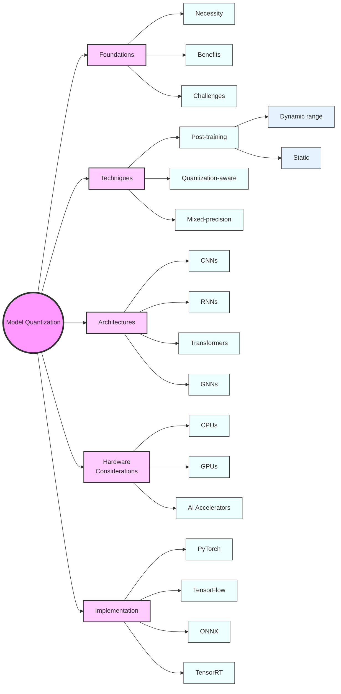

# 1.Course Title: Model Quantization Techniques: A Comprehensive Guide

```mermaid
gantt
    title LLM Course Timeline
    dateFormat X
    axisFormat %d
    section Course Content
    Famous SOTA LLM models and JAIS model              :a10, 0, 1d
    Methods and Metrics for Model Evaluation           :a11, after a10, 1d
    Model Inference and Function calling               :a12, after a11, 1d
    Prompt engineering - ChatGPT Prompt Engineering    :a13, after a12, 1d
    Model Quantization Techniques                      :active,a14, after a13, 1d
    Introduction to Chatbot Project                    :a15, after a14, 1d
    Test Dataset Collection and Model Evaluation       :a16, after a15, 1d
    Designing input and output formats for chatbot with context :a17, after a16, 1d
    Model Deployment and Backend Development           :a18, after a17, 1d
    Frontend web page debugging                        :a19, after a18, 1d
    section Lessons
    lesson 10 :l10, 0, 1d
    lesson 11 :l11, after l10, 1d
    lesson 12 :l12, after l11, 1d
    lesson 13 :l13, after l12, 1d
    lesson 14 :active,l14, after l13, 1d
    lesson 15 :l15, after l14, 1d
    lesson 16 :l16, after l15, 1d
    lesson 17 :l17, after l16, 1d
    lesson 18 :l18, after l17, 1d
    lesson 19 :l19, after l18, 1d
```



Advanced Model Quantization Techniques for Efficient Inference

# 2. Learning Objectives

This course combines theory with hands-on practice. Upon completion, students will be able to:

1. Comprehend the fundamental principles and necessity of model quantization

2. Distinguish between various quantization methods and their applications
3. Implement different quantization techniques using popular deep learning frameworks

4. Evaluate the impact of quantization on model performance and resource utilization

5. Apply quantization strategies to real-world deep learning models

   

# 3. Overview

This comprehensive lesson covers 5 key concepts, 4 case studies, and 3 hands-on experiments to achieve the learning objectives. We will explore:

1. Foundations of model quantization and its importance in modern AI deployment

2. Detailed examination of various quantization techniques

3. Practical implementation of quantization using PyTorch, TensorFlow, and ONNX

4. Performance analysis and trade-offs in quantized models

5. Advanced quantization strategies for different model architectures

   

# 4. Detailed Content

## 4.1 Concept 1: Foundations of Model Quantization

### 4.1.1 Explanation

Model quantization is a technique used to reduce the precision of weights and activations in neural networks. It's crucial for deploying large models on resource-constrained devices, improving inference speed, and reducing memory footprint.

Key aspects:

- Reduced precision representation (e.g., FP32 to INT8)
- Storage and computational benefits
- Potential impact on model accuracy

### 4.1.2 Case Study: MobileNetV2 Deployment on Smartphones

Examine how Google successfully deployed MobileNetV2 on various smartphone devices using quantization, achieving significant speedup with minimal accuracy loss.

### 4.1.3 Code: Basic Int8 Quantization in PyTorch

```python
import torch

# Load a pre-trained model
model = torch.load('pretrained_mobilenetv2.pth')

# Define quantization configuration
model.qconfig = torch.quantization.get_default_qconfig('fbgemm')

# Prepare model for quantization
model_prepared = torch.quantization.prepare(model)

# Calibrate the model (usually done with a representative dataset)
def calibrate(model, data_loader):
    model.eval()
    with torch.no_grad():
        for inputs, _ in data_loader:
            model(inputs)

calibrate(model_prepared, calibration_data_loader)

# Convert to quantized model
quantized_model = torch.quantization.convert(model_prepared)

# Compare model sizes
original_size = sum(p.numel() for p in model.parameters()) * 4  # Assuming FP32
quantized_size = sum(p.numel() for p in quantized_model.parameters())
print(f"Size reduction: {original_size / quantized_size:.2f}x")

# Evaluate and compare performance
def evaluate(model, data_loader):
    model.eval()
    correct = 0
    total = 0
    with torch.no_grad():
        for inputs, labels in data_loader:
            outputs = model(inputs)
            _, predicted = torch.max(outputs.data, 1)
            total += labels.size(0)
            correct += (predicted == labels).sum().item()
    return correct / total

original_accuracy = evaluate(model, test_data_loader)
quantized_accuracy = evaluate(quantized_model, test_data_loader)

print(f"Original accuracy: {original_accuracy:.4f}")
print(f"Quantized accuracy: {quantized_accuracy:.4f}")
```

### 4.1.4 Reflection

Discuss the trade-offs between model size, inference speed, and accuracy when applying quantization. Consider:

- How does the reduction in precision affect different types of neural network architectures?
- What are the implications for energy consumption in mobile and edge devices?
- How might quantization affect the interpretability of model decisions?

## 4.2 Concept 2: Types of Quantization Techniques

### 4.2.1 Explanation

We'll explore various quantization techniques, each with its own strengths and use cases:

1. Post-training quantization
   - Dynamic range quantization
   - Static quantization
2. Quantization-aware training
3. Mixed-precision quantization

figure-4.2.1.1 Quantization Techniques Comparison

[A detailed comparison chart showing different quantization techniques, their characteristics, and suitable use cases]

explanation of the figure: This comprehensive chart compares post-training quantization (both dynamic and static), quantization-aware training, and mixed-precision quantization. It highlights factors such as accuracy preservation, implementation complexity, training requirements, and suitable model types for each technique.

table-4.2.1.1 Quantization Techniques Pros and Cons

| Technique | Pros | Cons | Best For |
|-----------|------|------|----------|
| Dynamic Range Quantization | - Easy to implement<br>- No need for calibration data | - Lower accuracy compared to other methods<br>- Limited to activations | - Quick deployment<br>- Models with dynamic range of activations |
| Static Quantization | - Better accuracy than dynamic<br>- Weights and activations quantized | - Requires calibration data<br>- More complex implementation | - Models with stable activation ranges<br>- When accuracy is crucial |
| Quantization-Aware Training | - Highest accuracy<br>- Can recover from quantization errors | - Requires full training or fine-tuning<br>- Most time-consuming | - Mission-critical applications<br>- When resources for retraining are available |
| Mixed-Precision Quantization | - Balances performance and accuracy<br>- Flexible for different layer requirements | - Complex to implement<br>- Requires careful tuning | - Large models with varying layer sensitivities<br>- When fine-grained control is needed |

explanation of the table: This table provides a quick reference for the pros, cons, and ideal use cases of each quantization technique, helping developers choose the most appropriate method for their specific requirements.

### 4.2.2 Case Study: BERT Quantization for Natural Language Processing

Explore how Hugging Face implemented efficient quantization for BERT models, enabling faster inference in production NLP systems.

### 4.2.3 Code: Implementing Quantization-Aware Training in TensorFlow

```python
import tensorflow as tf

# Define a simple model
model = tf.keras.Sequential([
    tf.keras.layers.Conv2D(32, 3, activation='relu', input_shape=(28, 28, 1)),
    tf.keras.layers.MaxPooling2D(),
    tf.keras.layers.Flatten(),
    tf.keras.layers.Dense(10)
])

# Define quantization-aware training
quantize_model = tf.keras.models.clone_model(
    model,
    clone_function=lambda layer: tf.keras.layers.quantization.quantize_annotate_layer(layer)
)

# Apply quantization to the model
quantize_model = tf.keras.models.clone_model(
    quantize_model,
    clone_function=lambda layer: tf.keras.layers.quantization.quantize_apply(layer)
)

# Compile the quantized model
quantize_model.compile(optimizer='adam',
                       loss=tf.keras.losses.SparseCategoricalCrossentropy(from_logits=True),
                       metrics=['accuracy'])

# Train the quantized model
quantize_model.fit(train_images, train_labels, epochs=5, validation_split=0.2)

# Convert to TFLite format
converter = tf.lite.TFLiteConverter.from_keras_model(quantize_model)
converter.optimizations = [tf.lite.Optimize.DEFAULT]
quantized_tflite_model = converter.convert()

# Save the quantized model
with open('quantized_model.tflite', 'wb') as f:
    f.write(quantized_tflite_model)

# Evaluate the quantized model
interpreter = tf.lite.Interpreter(model_content=quantized_tflite_model)
interpreter.allocate_tensors()

input_index = interpreter.get_input_details()[0]["index"]
output_index = interpreter.get_output_details()[0]["index"]

test_accuracy = 0

for i, (test_image, test_label) in enumerate(zip(test_images, test_labels)):
    interpreter.set_tensor(input_index, test_image)
    interpreter.invoke()
    output = interpreter.get_tensor(output_index)
    predicted_label = output.argmax()
    test_accuracy += 1 if predicted_label == test_label else 0

print(f"Quantized model accuracy: {test_accuracy / len(test_labels):.4f}")
```

### 4.2.4 Reflection

Consider the challenges and benefits of implementing different quantization techniques in real-world scenarios:

- How does the choice of quantization method affect the development lifecycle?
- What are the implications for model maintenance and updates?
- How might different quantization techniques affect model robustness and generalization?

## 4.3 Concept 3: Quantization for Different Model Architectures

### 4.3.1 Explanation

Different neural network architectures may require specialized quantization approaches:

- Convolutional Neural Networks (CNNs)
- Recurrent Neural Networks (RNNs)
- Transformer-based models
- Graph Neural Networks (GNNs)

### 4.3.2 Case Study: Quantizing Transformer Models for Machine Translation

Analyze how Google achieved significant speedup in neural machine translation by quantizing Transformer models.

### 4.3.3 Code: Quantizing a Pre-trained BERT Model with Hugging Face Transformers

```python
from transformers import BertForSequenceClassification, BertTokenizer
import torch

# Load pre-trained BERT model and tokenizer
model = BertForSequenceClassification.from_pretrained('bert-base-uncased')
tokenizer = BertTokenizer.from_pretrained('bert-base-uncased')

# Prepare the model for quantization
model.eval()

# Define quantization configuration
model.qconfig = torch.quantization.get_default_qconfig('fbgemm')

# Fuse modules
model = torch.quantization.fuse_modules(model, [['bert.encoder.layer.0.attention.self.query', 'bert.encoder.layer.0.attention.self.key', 'bert.encoder.layer.0.attention.self.value']])

# Prepare model for static quantization
model_prepared = torch.quantization.prepare(model)

# Calibrate the model (you would typically do this with a calibration dataset)
def calibrate(model, data_loader):
    model.eval()
    with torch.no_grad():
        for batch in data_loader:
            input_ids = batch['input_ids']
            attention_mask = batch['attention_mask']
            model(input_ids, attention_mask=attention_mask)

calibrate(model_prepared, calibration_data_loader)

# Convert to quantized model
quantized_model = torch.quantization.convert(model_prepared)

# Evaluate the quantized model
def evaluate(model, data_loader):
    model.eval()
    correct = 0
    total = 0
    with torch.no_grad():
        for batch in data_loader:
            input_ids = batch['input_ids']
            attention_mask = batch['attention_mask']
            labels = batch['labels']
            outputs = model(input_ids, attention_mask=attention_mask)
            _, predicted = torch.max(outputs.logits, 1)
            total += labels.size(0)
            correct += (predicted == labels).sum().item()
    return correct / total

original_accuracy = evaluate(model, test_data_loader)
quantized_accuracy = evaluate(quantized_model, test_data_loader)

print(f"Original accuracy: {original_accuracy:.4f}")
print(f"Quantized accuracy: {quantized_accuracy:.4f}")

# Save the quantized model
torch.save(quantized_model.state_dict(), 'quantized_bert.pth')
```

### 4.3.4 Reflection

Discuss the challenges of quantizing complex model architectures:

- How do attention mechanisms in Transformers affect quantization strategies?
- What are the specific considerations for quantizing recurrent layers in RNNs?
- How might quantization impact the graph structure in GNNs?

## 4.4 Concept 4: Hardware-Aware Quantization

### 4.4.1 Explanation

Different hardware platforms have varying support for quantized operations. Hardware-aware quantization optimizes models for specific devices:

- CPUs (e.g., x86, ARM)
- GPUs (e.g., NVIDIA, AMD)
- Specialized AI accelerators (e.g., Google TPU, Apple Neural Engine)

### 4.4.2 Case Study: TensorRT Optimization for NVIDIA GPUs

Examine how NVIDIA's TensorRT uses quantization and other optimizations to accelerate inference on GPUs.

### 4.4.3 Code: Quantization for TensorFlow Lite on Mobile Devices

```python
import tensorflow as tf

# Load a pre-trained model
model = tf.keras.applications.MobileNetV2(weights='imagenet', input_shape=(224, 224, 3))

# Convert the model to TensorFlow Lite format
converter = tf.lite.TFLiteConverter.from_keras_model(model)

# Enable quantization
converter.optimizations = [tf.lite.Optimize.DEFAULT]

# Define a representative dataset for quantization
def representative_dataset_gen():
    for _ in range(100):
        yield [np.random.rand(1, 224, 224, 3).astype(np.float32)]

converter.representative_dataset = representative_dataset_gen

# Set the inference input and output types
converter.inference_input_type = tf.uint8
converter.inference_output_type = tf.uint8

# Convert the model
tflite_model = converter.convert()

# Save the model
with open('quantized_mobilenet.tflite', 'wb') as f:
    f.write(tflite_model)

# Load and run inference on the quantized model
interpreter = tf.lite.Interpreter(model_content=tflite_model)
interpreter.allocate_tensors()

input_details = interpreter.get_input_details()
output_details = interpreter.get_output_details()

# Prepare input data
input_data = np.array(np.random.random_sample((1, 224, 224, 3)), dtype=np.float32)
input_data = tf.keras.applications.mobilenet_v2.preprocess_input(input_data)

# Set input tensor
interpreter.set_tensor(input_details[0]['index'], input_data)

# Run inference
interpreter.invoke()

# Get output tensor
output_data = interpreter.get_tensor(output_details[0]['index'])

# Process the output
predicted_label = np.argmax(output_data)
print(f"Predicted class: {predicted_label}")
```

### 4.4.4 Reflection

Consider the implications of hardware-aware quantization:

- How does the choice of target hardware affect the quantization process?
- What are the trade-offs between model portability and optimized performance?
- How might hardware-aware quantization influence model design decisions?

# 5. Summary

## 5.1 Conclusion

In this comprehensive lesson, we've explored the fundamental concepts of model quantization, various quantization techniques, and their practical implementations across different deep learning frameworks. We've seen how quantization can significantly reduce model size and improve inference speed, making it crucial for deploying large language models and other neural networks on resource-constrained devices.

Key takeaKey takeaways include:

- The importance of quantization in modern AI deployment
- Various quantization techniques and their specific use cases
- Practical implementation strategies using popular frameworks
- Considerations for different model architectures and hardware platforms

## 5.2 Mind Maps



## 5.3 Preview

In our next lesson, we will delve into advanced quantization techniques for edge computing scenarios. We'll explore how to optimize quantized models for ultra-low-power devices and examine emerging research in this rapidly evolving field.

# 6. Homework

1. Implement post-training static quantization on a pre-trained ResNet50 model using PyTorch. Compare its performance (accuracy and inference speed) with the original model on both CPU and GPU.

2. Using TensorFlow Lite, quantize a pre-trained MobileNetV2 model to uint8 precision. Deploy this model on an Android device and measure the inference time improvement compared to the floating-point model.

3. Research and write a short report (1000 words) on the latest advancements in quantization techniques for transformer-based models, focusing on their application in natural language processing tasks.

4. Experiment with mixed-precision quantization on a custom neural network of your choice. Analyze how different bit-widths for weights and activations affect model performance and size.

5. Implement quantization-aware training for a simple convolutional neural network on the CIFAR-10 dataset. Compare the final accuracy of the quantized model with a non-quantized baseline trained for the same number of epochs.

# 7. Reference and Citation

1. Jacob, B., et al. (2018). "Quantization and Training of Neural Networks for Efficient Integer-Arithmetic-Only Inference." Proceedings of the IEEE Conference on Computer Vision and Pattern Recognition (CVPR).

2. Krishnamoorthi, R. (2018). "Quantizing deep convolutional networks for efficient inference: A whitepaper." arXiv preprint arXiv:1806.08342.

3. Gholami, A., et al. (2021). "A Survey of Quantization Methods for Efficient Neural Network Inference." arXiv preprint arXiv:2103.13630.

4. Wu, H., et al. (2020). "Integer Quantization for Deep Learning Inference: Principles and Empirical Evaluation." arXiv preprint arXiv:2004.09602.

5. Nagel, M., et al. (2021). "A White Paper on Neural Network Quantization." arXiv preprint arXiv:2106.08295.

6. PyTorch Quantization Documentation: <https://pytorch.org/docs/stable/quantization.html>

7. TensorFlow Model Optimization Toolkit: <https://www.tensorflow.org/model_optimization>

8. NVIDIA TensorRT Documentation: <https://developer.nvidia.com/tensorrt>

9. Hugging Face Transformers Quantization Guide: <https://huggingface.co/docs/transformers/performance>

10. Dettmers, T., et al. (2022). "LLM.int8(): 8-bit Matrix Multiplication for Transformers at Scale." arXiv preprint arXiv:2208.07339.

11. Han, S., Mao, H., & Dally, W. J. (2015). "Deep Compression: Compressing Deep Neural Networks with Pruning, Trained Quantization and Huffman Coding." arXiv preprint arXiv:1510.00149.

12. Zhu, M., & Gupta, S. (2017). "To Prune, or Not to Prune: Exploring the Efficacy of Pruning for Model Compression." arXiv preprint arXiv:1710.01878.
