# Lesson 18  LLM Model Deployment and Backend Development

```mermaid
gantt
    title LLM Course Timeline
    dateFormat X
    axisFormat %d
    section Course Content
    Model Quantization Techniques                      :a14, 0, 1d
    Introduction to Chatbot Project                    :a15, after a14, 1d
    Test Dataset Collection and Model Evaluation       :a16, after a15, 1d
    Designing input and output formats for chatbot with context :a17, after a16, 1d
    Model Deployment and Backend Development           :active,a18, after a17, 1d
    Frontend web page debugging                        :a19, after a18, 1d
    System Testing and Deployment                      :a20, after a19, 1d
    RAG Introduction                                   :a21, after a20, 1d
    RAG Frameworks - Introduction and use of Llamaindex and LangChain :a22, after a21, 1d
    RAG embedding model                                :a23, after a22, 1d
    section Lessons
    lesson 14 :l14, 0, 1d
    lesson 15 :l15, after l14, 1d
    lesson 16 :l16, after l15, 1d
    lesson 17 :l17, after l16, 1d
    lesson 18 :active,l18, after l17, 1d
    lesson 19 :l19, after l18, 1d
    lesson 20 :l20, after l19, 1d
    lesson 21 :l21, after l20, 1d
    lesson 22 :l22, after l21, 1d
    lesson 23 :l23, after l22, 1d
```



## Introduction

In the rapidly evolving landscape of artificial intelligence, Large Language Models (LLMs) have emerged as powerful tools capable of understanding and generating human-like text. However, the journey from a trained model to a production-ready application is fraught with challenges. This lesson delves into the critical processes of deploying LLMs and developing robust backend systems to support them, bridging the gap between experimental success and real-world application.

## Learning Objectives

By the end of this comprehensive lesson, you will be able to:

1. Convert and optimize LLMs for deployment using formats like ONNX and TensorRT
2. Implement effective model deployment strategies, including containerization and server-side deployment
3. Develop efficient model inference pipelines for real-time text generation
4. Design and implement scalable backend systems to support LLM-based applications
5. Apply best practices in security, performance optimization, and error handling in LLM deployments

## Model Conversion and Optimization

### The Necessity of Model Conversion

LLMs, often trained using frameworks like PyTorch or TensorFlow, may not be directly deployable in various production environments. Converting these models to standardized formats ensures compatibility and optimizes performance across different platforms.

### ONNX: Open Neural Network Exchange

ONNX has emerged as a popular choice for model interoperability. It allows models trained in one framework to be easily deployed in another, providing flexibility in deployment options.

Let's examine a practical example of converting a PyTorch-based GPT-2 model to ONNX:

```python
import torch
from transformers import AutoModelForCausalLM, AutoTokenizer

def convert_to_onnx(model_name, output_path):
    # Load the pre-trained model and tokenizer
    model = AutoModelForCausalLM.from_pretrained(model_name)
    tokenizer = AutoTokenizer.from_pretrained(model_name)

    # Prepare a sample input
    sample_text = "The future of AI is"
    input_ids = tokenizer.encode(sample_text, return_tensors="pt")

    # Export the model to ONNX
    torch.onnx.export(
        model,
        input_ids,
        output_path,
        input_names=['input_ids'],
        output_names=['output'],
        dynamic_axes={
            'input_ids': {0: 'batch_size', 1: 'sequence'},
            'output': {0: 'batch_size', 1: 'sequence'}
        },
        opset_version=11
    )
    print(f"Model successfully converted to ONNX and saved at {output_path}")

# Usage
convert_to_onnx("gpt2", "gpt2_model.onnx")
```

This script loads a pre-trained GPT-2 model, prepares a sample input, and exports the model to ONNX format. The `dynamic_axes` parameter allows for flexibility in input sizes, crucial for handling varying text lengths in production.

### TensorRT: High-Performance Inference

For deployments targeting NVIDIA GPUs, TensorRT offers significant performance improvements through optimizations like layer fusion and precision calibration.

Here's an example of how to optimize an ONNX model using TensorRT:

```python
import tensorrt as trt
import numpy as np

def build_tensorrt_engine(onnx_path, engine_path):
    logger = trt.Logger(trt.Logger.WARNING)
    builder = trt.Builder(logger)
    network = builder.create_network(1 << int(trt.NetworkDefinitionCreationFlag.EXPLICIT_BATCH))
    parser = trt.OnnxParser(network, logger)
    
    with open(onnx_path, 'rb') as model:
        if not parser.parse(model.read()):
            print('ERROR: Failed to parse the ONNX file.')
            for error in range(parser.num_errors):
                print(parser.get_error(error))
            return None
    
    config = builder.create_builder_config()
    config.max_workspace_size = 1 << 30  # 1GB
    profile = builder.create_optimization_profile()
    profile.set_shape("input_ids", (1, 1), (1, 128), (1, 256))
    config.add_optimization_profile(profile)
    
    engine = builder.build_engine(network, config)
    
    with open(engine_path, "wb") as f:
        f.write(engine.serialize())
    
    print(f"TensorRT engine built and saved at {engine_path}")

# Usage
build_tensorrt_engine("gpt2_model.onnx", "gpt2_model.trt")
```

This script takes an ONNX model, applies TensorRT optimizations, and produces a serialized engine file. The optimization profile allows for dynamic input shapes, essential for handling variable-length inputs in text generation tasks.

### Benchmarking and Validation

After conversion, it's crucial to benchmark the optimized models against the original to ensure performance gains and output consistency. Here's a simple benchmarking script:

```python
import time
import torch
import onnxruntime
import numpy as np

def benchmark_models(input_text, tokenizer, pytorch_model, onnx_path):
    input_ids = tokenizer.encode(input_text, return_tensors="pt")
    
    # PyTorch inference
    start_time = time.time()
    with torch.no_grad():
        pytorch_output = pytorch_model.generate(input_ids, max_length=50)
    pytorch_time = time.time() - start_time
    
    # ONNX inference
    ort_session = onnxruntime.InferenceSession(onnx_path)
    ort_inputs = {ort_session.get_inputs()[0].name: input_ids.numpy()}
    start_time = time.time()
    onnx_output = ort_session.run(None, ort_inputs)
    onnx_time = time.time() - start_time
    
    print(f"PyTorch inference time: {pytorch_time:.4f} seconds")
    print(f"ONNX inference time: {onnx_time:.4f} seconds")
    print(f"Speedup: {pytorch_time / onnx_time:.2f}x")
    
    # Validate outputs
    pytorch_text = tokenizer.decode(pytorch_output[0], skip_special_tokens=True)
    onnx_text = tokenizer.decode(onnx_output[0][0], skip_special_tokens=True)
    print(f"PyTorch output: {pytorch_text}")
    print(f"ONNX output: {onnx_text}")
    print(f"Outputs match: {pytorch_text == onnx_text}")

# Usage
from transformers import AutoModelForCausalLM, AutoTokenizer

model_name = "gpt2"
pytorch_model = AutoModelForCausalLM.from_pretrained(model_name)
tokenizer = AutoTokenizer.from_pretrained(model_name)
input_text = "The future of AI is"

benchmark_models(input_text, tokenizer, pytorch_model, "gpt2_model.onnx")
```

This benchmarking script compares inference time between PyTorch and ONNX models and validates output consistency, providing crucial insights into the effectiveness of the optimization process.

By mastering these conversion and optimization techniques, you lay the groundwork for efficient LLM deployment. In the next section, we'll explore strategies for deploying these optimized models in production environments.

## Model Deployment Strategies

After optimizing your LLM, the next crucial step is deploying it in a production environment. This section explores two primary deployment strategies: containerization with Docker and direct server deployment. Each approach has its merits, and the choice often depends on your specific infrastructure and scalability requirements.

### Containerized Deployment with Docker

Containerization has revolutionized application deployment by providing consistency across different environments. Docker, in particular, has become the de facto standard for containerization in the AI/ML world.

### Benefits of Docker for LLM Deployment

1. **Consistency**: Docker ensures that your model runs in the same environment, regardless of where it's deployed.
2. **Isolation**: Containers isolate the application and its dependencies, reducing conflicts with other system components.
3. **Scalability**: Docker containers can be easily scaled horizontally to handle increased load.
4. **Versioning**: Docker images can be versioned, allowing for easy rollbacks and A/B testing of different model versions.

### Implementing Docker Deployment

Let's walk through the process of containerizing our LLM inference server:

1. First, create a `Dockerfile`:

```dockerfile
# Use an official Python runtime as the base image
FROM python:3.8-slim-buster

# Set the working directory in the container
WORKDIR /app

# Copy the requirements file into the container
COPY requirements.txt .

# Install the required packages
RUN pip install --no-cache-dir -r requirements.txt

# Copy the model files and server code into the container
COPY model/ /app/model/
COPY server.py .

# Make port 8000 available to the world outside this container
EXPOSE 8000

# Run the server when the container launches
CMD ["uvicorn", "server:app", "--host", "0.0.0.0", "--port", "8000"]
```

2. Create a `requirements.txt` file listing all necessary Python packages:

```
fastapi==0.68.0
uvicorn==0.15.0
torch==1.9.0
transformers==4.9.2
onnxruntime==1.8.1
```

3. Implement the server code in `server.py`:

```python
from fastapi import FastAPI
import onnxruntime
from transformers import AutoTokenizer

app = FastAPI()

# Load the ONNX model
session = onnxruntime.InferenceSession("model/gpt2_model.onnx")
tokenizer = AutoTokenizer.from_pretrained("gpt2")

@app.post("/generate/")
async def generate_text(prompt: str):
    input_ids = tokenizer.encode(prompt, return_tensors="np")
    output = session.run(None, {"input_ids": input_ids})
    generated_text = tokenizer.decode(output[0][0], skip_special_tokens=True)
    return {"generated_text": generated_text}

@app.get("/health")
async def health_check():
    return {"status": "healthy"}
```

4. Build and run the Docker container:

```bash
docker build -t llm-server .
docker run -p 8000:8000 llm-server
```

This setup creates a lightweight, portable container that includes our LLM, the inference server, and all necessary dependencies.

### Direct Server Deployment

While containerization offers many advantages, there are scenarios where direct deployment on a server might be preferred, such as when you need fine-grained control over the hosting environment or when working with legacy systems.

### Implementing Direct Server Deployment

For direct deployment, we'll use FastAPI to create a robust, high-performance inference server. Here's an enhanced version of our server code that includes logging, error handling, and a simple caching mechanism:

```python
import logging
from fastapi import FastAPI, HTTPException
from pydantic import BaseModel
import onnxruntime
from transformers import AutoTokenizer
from functools import lru_cache

# Set up logging
logging.basicConfig(level=logging.INFO)
logger = logging.getLogger(__name__)

app = FastAPI()

# Load the ONNX model
session = onnxruntime.InferenceSession("model/gpt2_model.onnx")
tokenizer = AutoTokenizer.from_pretrained("gpt2")

class GenerationRequest(BaseModel):
    prompt: str
    max_length: int = 50

@lru_cache(maxsize=100)
def generate_cached(prompt: str, max_length: int):
    try:
        input_ids = tokenizer.encode(prompt, return_tensors="np")
        output = session.run(None, {"input_ids": input_ids})
        return tokenizer.decode(output[0][0][:max_length], skip_special_tokens=True)
    except Exception as e:
        logger.error(f"Error generating text: {str(e)}")
        raise HTTPException(status_code=500, detail="Internal server error")

@app.post("/generate/")
async def generate_text(request: GenerationRequest):
    logger.info(f"Received generation request: {request.prompt[:50]}...")
    generated_text = generate_cached(request.prompt, request.max_length)
    return {"generated_text": generated_text}

@app.get("/health")
async def health_check():
    return {"status": "healthy"}

if __name__ == "__main__":
    import uvicorn
    uvicorn.run(app, host="0.0.0.0", port=8000)
```

To deploy this server:

1. Install the required packages:

```
   pip install fastapi uvicorn onnxruntime transformers
   ```

2. Run the server:

   ```
   python server.py
   ```

This setup provides a robust inference server with error handling, logging, and basic caching to improve performance for repeated requests.

### Deployment Considerations

When deciding between containerized and direct deployment, consider the following factors:

1. **Scalability Requirements**: If you need to scale your application quickly and efficiently, containerization often provides an edge.

2. **Infrastructure**: Consider your existing infrastructure. If you're already using container orchestration platforms like Kubernetes, Docker deployment might be more suitable.

3. **Performance**: While containers add a slight overhead, the difference is usually negligible for LLM inference. However, if you need bare-metal performance, direct deployment might be preferable.

4. **Deployment Frequency**: If you update your model frequently, containers can simplify the deployment process.

5. **Team Expertise**: Consider your team's familiarity with containerization technologies.

### Monitoring and Maintenance

Regardless of the deployment method, implementing robust monitoring is crucial. Consider using tools like Prometheus for metrics collection and Grafana for visualization. Key metrics to monitor include:

- Inference latency
- Request throughput
- Error rates
- Resource utilization (CPU, GPU, memory)

Regular maintenance tasks should include:

- Updating the model with new versions
- Monitoring and optimizing resource usage
- Reviewing and analyzing logs for potential issues or areas of improvement

By carefully considering these deployment strategies and implementing proper monitoring and maintenance procedures, you can ensure that your LLM performs reliably and efficiently in a production environment.

In the next section, we'll delve into the intricacies of building a scalable backend to support your deployed LLM, focusing on handling high traffic loads and ensuring system reliability.

## Backend Development for LLM Applications

Developing a robust backend is crucial for supporting LLM-based applications in production environments. This section will explore key aspects of backend development, including scalability, performance optimization, and handling real-time requests.

### Designing a Scalable Architecture

When designing a backend for LLM applications, scalability is paramount. The architecture should be able to handle varying loads and scale horizontally to accommodate growing user bases.

### Microservices Architecture

A microservices architecture can provide the flexibility and scalability needed for LLM applications. Let's design a basic microservices setup:

```python
# api_gateway.py
from fastapi import FastAPI, HTTPException
import httpx

app = FastAPI()

MODEL_SERVICE_URL = "http://model-service:8000"
CACHE_SERVICE_URL = "http://cache-service:8001"

@app.post("/generate/")
async def generate_text(request: dict):
    async with httpx.AsyncClient() as client:
        # Check cache first
        cache_response = await client.get(f"{CACHE_SERVICE_URL}/get/{request['prompt']}")
        if cache_response.status_code == 200:
            return cache_response.json()
        
        # If not in cache, call model service
        model_response = await client.post(f"{MODEL_SERVICE_URL}/generate/", json=request)
        if model_response.status_code != 200:
            raise HTTPException(status_code=model_response.status_code, detail="Model service error")
        
        # Store result in cache
        await client.post(f"{CACHE_SERVICE_URL}/set/", json={
            "key": request['prompt'],
            "value": model_response.json()["generated_text"]
        })
        
        return model_response.json()

# model_service.py
# (Use the ONNX inference server from the previous section)

# cache_service.py
from fastapi import FastAPI
import redis

app = FastAPI()
redis_client = redis.Redis(host='redis', port=6379, db=0)

@app.get("/get/{key}")
async def get_cache(key: str):
    value = redis_client.get(key)
    if value:
        return {"value": value.decode()}
    return {"value": None}

@app.post("/set/")
async def set_cache(item: dict):
    redis_client.setex(item["key"], 3600, item["value"])  # Cache for 1 hour
    return {"status": "success"}
```

This setup separates concerns into three services:

1. API Gateway: Handles incoming requests and orchestrates between services.
2. Model Service: Manages LLM inference.
3. Cache Service: Provides caching to reduce load on the model service.

### Performance Optimization

Optimizing backend performance is crucial for providing a responsive user experience.

### Asynchronous Processing

For long-running tasks like text generation, consider implementing asynchronous processing:

```python
# api_gateway.py
from fastapi import FastAPI, BackgroundTasks
import httpx

app = FastAPI()

@app.post("/generate_async/")
async def generate_text_async(request: dict, background_tasks: BackgroundTasks):
    task_id = generate_unique_id()
    background_tasks.add_task(process_generation, task_id, request)
    return {"task_id": task_id}

@app.get("/result/{task_id}")
async def get_result(task_id: str):
    # Check result status and return if available
    pass

async def process_generation(task_id: str, request: dict):
    # Perform generation and store result
    pass
```

This approach allows the server to handle more concurrent requests by offloading the generation task to the background.

### Load Balancing

Implement load balancing to distribute requests across multiple instances of your model service:

```python
# nginx.conf
http {
    upstream model_servers {
        server model_service_1:8000;
        server model_service_2:8000;
        server model_service_3:8000;
    }

    server {
        listen 80;

        location /generate/ {
            proxy_pass http://model_servers;
        }
    }
}
```

This NGINX configuration distributes requests across three model service instances.

### Handling Real-time Requests

For applications requiring real-time interaction, consider implementing WebSocket support:

```python
# websocket_server.py
from fastapi import FastAPI, WebSocket
from fastapi.websockets import WebSocketDisconnect

app = FastAPI()

class ConnectionManager:
    def __init__(self):
        self.active_connections = []

    async def connect(self, websocket: WebSocket):
        await websocket.accept()
        self.active_connections.append(websocket)

    def disconnect(self, websocket: WebSocket):
        self.active_connections.remove(websocket)

    async def send_message(self, message: str, websocket: WebSocket):
        await websocket.send_text(message)

manager = ConnectionManager()

@app.websocket("/ws/{client_id}")
async def websocket_endpoint(websocket: WebSocket, client_id: int):
    await manager.connect(websocket)
    try:
        while True:
            data = await websocket.receive_text()
            # Process the received data (e.g., generate text)
            response = await generate_text(data)
            await manager.send_message(response, websocket)
    except WebSocketDisconnect:
        manager.disconnect(websocket)

async def generate_text(prompt: str):
    # Implement text generation logic here
    pass
```

This WebSocket server allows for real-time, bidirectional communication between the client and server, which can be particularly useful for interactive AI applications.

### Error Handling and Logging

Implementing comprehensive error handling and logging is crucial for maintaining and debugging your backend:

```python
import logging
from fastapi import FastAPI, HTTPException
from fastapi.exceptions import RequestValidationError
from fastapi.responses import JSONResponse

app = FastAPI()

# Configure logging
logging.basicConfig(level=logging.INFO)
logger = logging.getLogger(__name__)

@app.exception_handler(RequestValidationError)
async def validation_exception_handler(request, exc):
    logger.error(f"Validation error: {str(exc)}")
    return JSONResponse(
        status_code=400,
        content={"message": "Invalid request", "details": str(exc)}
    )

@app.exception_handler(HTTPException)
async def http_exception_handler(request, exc):
    logger.error(f"HTTP error {exc.status_code}: {exc.detail}")
    return JSONResponse(
        status_code=exc.status_code,
        content={"message": exc.detail}
    )

@app.exception_handler(Exception)
async def general_exception_handler(request, exc):
    logger.error(f"Unexpected error: {str(exc)}", exc_info=True)
    return JSONResponse(
        status_code=500,
        content={"message": "An unexpected error occurred"}
    )

# Your route handlers go here
```

This setup provides structured error responses and logs detailed error information, facilitating easier debugging and maintenance.

### Security Considerations

When developing backends for LLM applications, security should be a top priority:

1. **Input Validation**: Carefully validate and sanitize all user inputs to prevent injection attacks.
2. **Rate Limiting**: Implement rate limiting to prevent abuse and ensure fair usage.
3. **Authentication and Authorization**: Use robust authentication mechanisms and implement proper authorization checks.
4. **HTTPS**: Always use HTTPS in production to encrypt data in transit.
5. **API Keys**: For public APIs, implement API key authentication and management.

Here's a basic example of implementing rate limiting and API key authentication:

```python
from fastapi import FastAPI, Depends, HTTPException
from fastapi.security import APIKeyHeader
from slowapi import Limiter, _rate_limit_exceeded_handler
from slowapi.util import get_remote_address
from slowapi.errors import RateLimitExceeded

app = FastAPI()
limiter = Limiter(key_func=get_remote_address)
app.state.limiter = limiter
app.add_exception_handler(RateLimitExceeded, _rate_limit_exceeded_handler)

API_KEY_NAME = "X-API-Key"
API_KEY = "your-secret-api-key"
api_key_header = APIKeyHeader(name=API_KEY_NAME, auto_error=False)

async def get_api_key(api_key_header: str = Depends(api_key_header)):
    if api_key_header == API_KEY:
        return api_key_header
    raise HTTPException(status_code=403, detail="Invalid API Key")

@app.post("/generate/")
@limiter.limit("5/minute")
async def generate_text(request: dict, api_key: str = Depends(get_api_key)):
    # Your text generation logic here
    pass
```

This example implements a rate limit of 5 requests per minute and requires a valid API key for access.

By implementing these backend development strategies, you can create a robust, scalable, and secure infrastructure for your LLM-based application. Remember that backend development is an iterative process, and you should continuously monitor, test, and optimize your system based on real-world usage patterns and requirements.

## Summary and Key Takeaways

Throughout this comprehensive lesson on LLM Model Deployment and Backend Development, we've covered a wide range of crucial topics. Let's recap the key points:

1. **Model Conversion and Optimization**
   - Converting models to standardized formats like ONNX ensures compatibility across platforms.
   - Optimization techniques such as TensorRT can significantly improve inference performance.
   - Benchmarking is essential to validate the effectiveness of optimization efforts.

2. **Deployment Strategies**
   - Containerization with Docker offers consistency and scalability.
   - Direct server deployment provides fine-grained control over the hosting environment.
   - The choice between strategies depends on factors like scalability requirements and team expertise.

3. **Backend Development**
   - A microservices architecture can enhance flexibility and scalability.
   - Performance optimization techniques include asynchronous processing and load balancing.
   - Real-time interactions can be facilitated through WebSocket implementations.
   - Robust error handling and logging are crucial for maintaining and debugging the system.
   - Security considerations, including input validation, rate limiting, and authentication, are paramount.

The successful deployment and operation of LLM-based applications require a holistic approach that considers all these aspects. As the field of AI continues to evolve, staying updated with the latest best practices and technologies will be crucial for building efficient, scalable, and secure LLM applications.

## Hands-on Exercise: Building a Scalable LLM-powered Chat Application

To solidify your understanding of the concepts covered in this lesson, let's work through a practical exercise. You'll build a simple but scalable chat application powered by an LLM.

### Exercise Objectives

1. Deploy an optimized LLM using ONNX runtime
2. Implement a FastAPI backend with WebSocket support
3. Create a basic frontend for user interaction
4. Implement rate limiting and basic authentication

### Step 1: Optimize and Deploy the Model

First, optimize the model using ONNX (assuming you have a trained model):

```python
import torch
from transformers import AutoModelForCausalLM, AutoTokenizer

model_name = "gpt2"
model = AutoModelForCausalLM.from_pretrained(model_name)
tokenizer = AutoTokenizer.from_pretrained(model_name)

# Export the model to ONNX
dummy_input = tokenizer("Hello, world!", return_tensors="pt").input_ids
torch.onnx.export(model, dummy_input, "gpt2_model.onnx", 
                  input_names=['input_ids'], 
                  output_names=['output'], 
                  dynamic_axes={'input_ids': {0: 'batch_size', 1: 'sequence'}, 
                                'output': {0: 'batch_size', 1: 'sequence'}})
```

### Step 2: Implement the Backend

Create a FastAPI application with WebSocket support and ONNX runtime inference:

```python
import asyncio
import onnxruntime
from fastapi import FastAPI, WebSocket, Depends, HTTPException
from fastapi.security import APIKeyHeader
from slowapi import Limiter, _rate_limit_exceeded_handler
from slowapi.util import get_remote_address
from slowapi.errors import RateLimitExceeded
from transformers import AutoTokenizer

app = FastAPI()
limiter = Limiter(key_func=get_remote_address)
app.state.limiter = limiter
app.add_exception_handler(RateLimitExceeded, _rate_limit_exceeded_handler)

# Load the ONNX model
session = onnxruntime.InferenceSession("gpt2_model.onnx")
tokenizer = AutoTokenizer.from_pretrained("gpt2")

# Set up API key authentication
API_KEY = "your-secret-api-key"
api_key_header = APIKeyHeader(name="X-API-Key", auto_error=False)

async def get_api_key(api_key_header: str = Depends(api_key_header)):
    if api_key_header == API_KEY:
        return api_key_header
    raise HTTPException(status_code=403, detail="Invalid API Key")

@app.websocket("/chat")
async def websocket_endpoint(websocket: WebSocket):
    await websocket.accept()
    try:
        while True:
            data = await websocket.receive_text()
            response = generate_text(data)
            await websocket.send_text(response)
    except Exception as e:
        print(f"Error: {str(e)}")
        await websocket.close()

@limiter.limit("5/minute")
def generate_text(prompt: str):
    input_ids = tokenizer.encode(prompt, return_tensors="np")
    output = session.run(None, {"input_ids": input_ids})
    return tokenizer.decode(output[0][0], skip_special_tokens=True)

if __name__ == "__main__":
    import uvicorn
    uvicorn.run(app, host="0.0.0.0", port=8000)
```

### Step 3: Create a Simple Frontend

Create an `index.html` file with basic chat functionality:

```html
<!DOCTYPE html>
<html lang="en">
<head>
    <meta charset="UTF-8">
    <meta name="viewport" content="width=device-width, initial-scale=1.0">
    <title>LLM Chat</title>
    <script>
        let socket = new WebSocket("ws://localhost:8000/chat");
        
        socket.onmessage = function(event) {
            let chatBox = document.getElementById("chat-box");
            chatBox.innerHTML += `<p><strong>AI:</strong> ${event.data}</p>`;
        };

        function sendMessage() {
            let messageInput = document.getElementById("message-input");
            let message = messageInput.value;
            let chatBox = document.getElementById("chat-box");
            
            chatBox.innerHTML += `<p><strong>You:</strong> ${message}</p>`;
            socket.send(message);
            messageInput.value = "";
        }
    </script>
</head>
<body>
    <div id="chat-box" style="height: 300px; overflow-y: scroll; border: 1px solid #ccc; padding: 10px;"></div>
    <input type="text" id="message-input" placeholder="Type your message...">
    <button onclick="sendMessage()">Send</button>
</body>
</html>
```

### Step 4: Run and Test

1. Start the backend server:

   ```
   python backend.py
   ```

2. Open the `index.html` file in a web browser.

3. Start chatting with the LLM!

### Extension Ideas

- Implement proper error handling and logging in the backend.
- Add user authentication to the chat application.
- Implement a caching mechanism to store and retrieve common responses.
- Explore deploying the application using Docker for easier scaling.

By completing this exercise, you'll have hands-on experience with deploying an optimized LLM, creating a scalable backend, and building a basic frontend for user interaction. This practical application reinforces the concepts covered throughout the lesson and provides a foundation for more complex LLM-powered applications.

Remember, building production-ready AI applications requires continuous learning, testing, and refinement. Keep exploring new techniques and best practices to enhance your skills in LLM deployment and backend development.

## Advanced Topics and Future Trends in LLM Deployment and Backend Development

As the field of AI and specifically Large Language Models continues to evolve rapidly, it's crucial to stay informed about advanced topics and emerging trends. This section explores cutting-edge developments and future directions in LLM deployment and backend development.

### Federated Learning for LLMs

Federated Learning allows for training models across decentralized devices or servers holding local data samples, without exchanging them. This approach addresses privacy concerns and enables personalization.

```python
import tensorflow_federated as tff

# Define a simple model
def create_keras_model():
    return tf.keras.models.Sequential([
        tf.keras.layers.InputLayer(input_shape=(784,)),
        tf.keras.layers.Dense(10, activation=tf.nn.softmax)
    ])

# Wrap the model for federated learning
def model_fn():
    keras_model = create_keras_model()
    return tff.learning.from_keras_model(
        keras_model,
        input_spec=preprocessed_example_dataset.element_spec,
        loss=tf.keras.losses.SparseCategoricalCrossentropy(),
        metrics=[tf.keras.metrics.SparseCategoricalAccuracy()]
    )

# Create a federated learning process
iterative_process = tff.learning.build_federated_averaging_process(
    model_fn,
    client_optimizer_fn=lambda: tf.keras.optimizers.SGD(learning_rate=0.02),
    server_optimizer_fn=lambda: tf.keras.optimizers.SGD(learning_rate=1.0)
)

# Run federated learning (simplified)
state = iterative_process.initialize()
for round_num in range(5):
    state, metrics = iterative_process.next(state, federated_train_data)
    print('round {:2d}, metrics={}'.format(round_num, metrics))
```

This example demonstrates a basic setup for federated learning, which could be adapted for LLMs to enable privacy-preserving, distributed model improvements.

### Efficient Fine-tuning Techniques

As LLMs grow larger, efficient fine-tuning becomes crucial. Techniques like Parameter-Efficient Fine-Tuning (PEFT) are gaining traction.

```python
from transformers import AutoModelForCausalLM, AutoTokenizer
from peft import get_peft_model, LoraConfig, TaskType

model_name = "gpt2"
model = AutoModelForCausalLM.from_pretrained(model_name)
tokenizer = AutoTokenizer.from_pretrained(model_name)

peft_config = LoraConfig(
    task_type=TaskType.CAUSAL_LM,
    inference_mode=False,
    r=8,
    lora_alpha=32,
    lora_dropout=0.1
)

peft_model = get_peft_model(model, peft_config)
print(f"Trainable params: {peft_model.print_trainable_parameters()}")

# Fine-tuning code would follow...
```

This example sets up a model for fine-tuning using the LoRA (Low-Rank Adaptation) technique, which significantly reduces the number of trainable parameters.

### Multimodal LLMs

Future LLM applications will increasingly integrate multiple modalities, such as text, images, and audio. Backend systems will need to handle these diverse data types efficiently.

```python
from transformers import VisionEncoderDecoderModel, ViTImageProcessor, AutoTokenizer
import torch
from PIL import Image

model = VisionEncoderDecoderModel.from_pretrained("nlpconnect/vit-gpt2-image-captioning")
feature_extractor = ViTImageProcessor.from_pretrained("nlpconnect/vit-gpt2-image-captioning")
tokenizer = AutoTokenizer.from_pretrained("nlpconnect/vit-gpt2-image-captioning")

device = torch.device("cuda" if torch.cuda.is_available() else "cpu")
model.to(device)

max_length = 16
num_beams = 4
gen_kwargs = {"max_length": max_length, "num_beams": num_beams}

def predict_step(image_paths):
    images = []
    for image_path in image_paths:
        i_image = Image.open(image_path)
        if i_image.mode != "RGB":
            i_image = i_image.convert(mode="RGB")
        images.append(i_image)

    pixel_values = feature_extractor(images=images, return_tensors="pt").pixel_values
    pixel_values = pixel_values.to(device)

    output_ids = model.generate(pixel_values, **gen_kwargs)

    preds = tokenizer.batch_decode(output_ids, skip_special_tokens=True)
    preds = [pred.strip() for pred in preds]
    return preds

# Example usage
image_paths = ["path/to/image1.jpg", "path/to/image2.jpg"]
predictions = predict_step(image_paths)
for pred in predictions:
    print(pred)
```

This example demonstrates a multimodal model that generates text captions for images, showcasing how future backends might need to handle diverse input types.

### Continuous Learning and Model Updates

Future LLM systems will likely implement continuous learning capabilities, allowing models to update themselves based on new data and interactions.

```python
import ray
from ray import serve
from transformers import AutoModelForCausalLM, AutoTokenizer
import torch

@serve.deployment
class ContinuousLearningLLM:
    def __init__(self):
        self.model_name = "gpt2"
        self.model = AutoModelForCausalLM.from_pretrained(self.model_name)
        self.tokenizer = AutoTokenizer.from_pretrained(self.model_name)
        self.optimizer = torch.optim.Adam(self.model.parameters(), lr=1e-5)

    def generate(self, prompt):
        input_ids = self.tokenizer.encode(prompt, return_tensors="pt")
        output = self.model.generate(input_ids, max_length=50)
        return self.tokenizer.decode(output[0], skip_special_tokens=True)

    def learn(self, prompt, target):
        input_ids = self.tokenizer.encode(prompt, return_tensors="pt")
        target_ids = self.tokenizer.encode(target, return_tensors="pt")
        
        outputs = self.model(input_ids, labels=target_ids)
        loss = outputs.loss
        
        self.optimizer.zero_grad()
        loss.backward()
        self.optimizer.step()
        
        return loss.item()

    async def __call__(self, request):
        if request.method == "GET":
            prompt = request.query_params["prompt"]
            return self.generate(prompt)
        elif request.method == "POST":
            data = await request.json()
            loss = self.learn(data["prompt"], data["target"])
            return {"loss": loss}

deployment = ContinuousLearningLLM.bind()
```

This example outlines a basic structure for a continuously learning LLM using Ray Serve, allowing for both inference and on-the-fly learning through API calls.

### Ethical AI and Responsible Deployment

As LLMs become more prevalent, ethical considerations and responsible deployment practices will be increasingly important. Future backend systems will need to incorporate robust fairness, accountability, transparency, and ethics (FATE) measures.

```python
from transformers import pipeline
from nltk.sentiment import SentimentIntensityAnalyzer
import nltk
nltk.download('vader_lexicon')

def ethical_content_filter(text):
    # Toxicity check
    classifier = pipeline("text-classification", model="unitary/toxic-bert")
    result = classifier(text)[0]
    if result['label'] == 'toxic' and result['score'] > 0.7:
        return False, "Content flagged as potentially toxic."

    # Sentiment analysis
    sia = SentimentIntensityAnalyzer()
    sentiment = sia.polarity_scores(text)
    if sentiment['compound'] < -0.5:
        return False, "Content flagged for extremely negative sentiment."

    # Add more ethical checks as needed...

    return True, "Content passed ethical checks."

# Example usage in the backend
@app.post("/generate/")
async def generate_text(request: dict):
    generated_text = llm_generate(request['prompt'])  # Your LLM generation function
    is_ethical, message = ethical_content_filter(generated_text)
    if not is_ethical:
        return {"error": message}
    return {"generated_text": generated_text}
```

This example demonstrates a basic ethical filter that could be integrated into an LLM backend to ensure responsible content generation.

### Conclusion and Future Outlook

The field of LLM deployment and backend development is rapidly evolving. Key areas to watch include:

1. More efficient model architectures and training techniques
2. Advanced deployment strategies for edge and mobile devices
3. Improved integration of LLMs with other AI systems and traditional software
4. Enhanced privacy-preserving techniques for model training and inference
5. Development of industry-specific LLMs and deployment patterns
6. Standardization of ethical AI practices in LLM deployments

As an AI engineer or researcher, staying informed about these trends and continuously experimenting with new techniques will be crucial for building the next generation of AI-powered applications.

By exploring these advanced topics and future trends, you're better equipped to anticipate and prepare for the evolving landscape of LLM deployment and backend development. Remember, the field of AI is dynamic, and continuous learning is key to staying at the forefront of these exciting developments.
