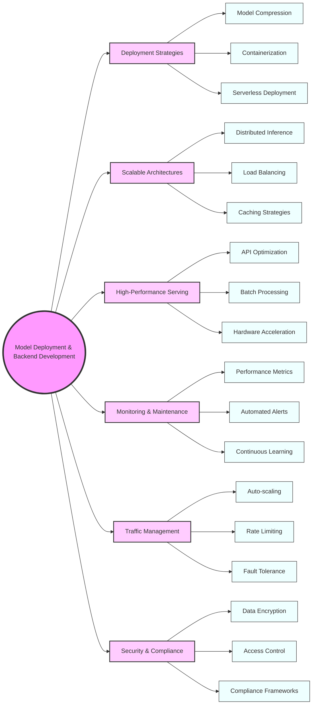

# Lesson 18 Advanced Model Deployment and Scalable Backend Development for LLMs

```mermaid
gantt
    title LLM Course Timeline
    dateFormat X
    axisFormat %d
    section Course Content
    Model Quantization Techniques                      :a14, 0, 1d
    Introduction to Chatbot Project                    :a15, after a14, 1d
    Test Dataset Collection and Model Evaluation       :a16, after a15, 1d
    Designing input and output formats for chatbot with context :a17, after a16, 1d
    Model Deployment and Backend Development           :active,a18, after a17, 1d
    Frontend web page debugging                        :a19, after a18, 1d
    System Testing and Deployment                      :a20, after a19, 1d
    RAG Introduction                                   :a21, after a20, 1d
    RAG Frameworks - Introduction and use of Llamaindex and LangChain :a22, after a21, 1d
    RAG embedding model                                :a23, after a22, 1d
    section Lessons
    lesson 14 :l14, 0, 1d
    lesson 15 :l15, after l14, 1d
    lesson 16 :l16, after l15, 1d
    lesson 17 :l17, after l16, 1d
    lesson 18 :active,l18, after l17, 1d
    lesson 19 :l19, after l18, 1d
    lesson 20 :l20, after l19, 1d
    lesson 21 :l21, after l20, 1d
    lesson 22 :l22, after l21, 1d
    lesson 23 :l23, after l22, 1d
```



## Learning Objectives

By the end of this comprehensive lesson, students will be able to:

1. Master techniques for efficient deployment of large language models in production environments

2. Design and implement scalable backend architectures for LLM-based applications

3. Optimize model serving and API development for high-performance inference

4. Implement robust monitoring and maintenance systems for deployed models

5. Develop strategies for handling high traffic and ensuring system reliability

6. Apply best practices for security, privacy, and compliance in LLM deployments

## Overview

This in-depth lesson covers six key concepts, providing a comprehensive exploration of model deployment and backend development:

1. Advanced Model Deployment Strategies

2. Scalable Backend Architectures for LLM Applications

3. High-Performance Model Serving and API Development

4. Monitoring and Maintenance of Deployed Models

5. Traffic Management and System Reliability

6. Security, Privacy, and Compliance in LLM Deployments

## Advanced Model Deployment Strategies

Deploying large language models in production environments requires careful consideration of factors such as model size, inference latency, and resource utilization. Advanced deployment strategies involve techniques like model quantization, distillation, and efficient serving frameworks [1].

Key aspects include:

- Model compression techniques (pruning, quantization)
- Containerization and orchestration (Docker, Kubernetes)
- Serverless deployment options
- Edge deployment for low-latency applications

### Deploying a Multi-Billion Parameter LLM for a High-Traffic Web Service

Imagine you're tasked with deploying a GPT-3 sized model for a popular web service that needs to handle millions of requests per day. Your challenge is to ensure low-latency responses while managing computational costs.

### Advanced Model Deployment Framework

```python
import torch
from transformers import AutoModelForCausalLM, AutoTokenizer
from fastapi import FastAPI
from pydantic import BaseModel
import uvicorn

class ModelDeployer:
    def __init__(self, model_name, quantize=False):
        self.tokenizer = AutoTokenizer.from_pretrained(model_name)
        self.model = AutoModelForCausalLM.from_pretrained(model_name)
        
        if quantize:
            self.model = self.quantize_model(self.model)
        
        self.model.eval()
        self.device = torch.device("cuda" if torch.cuda.is_available() else "cpu")
        self.model.to(self.device)

    def quantize_model(self, model):
        return torch.quantization.quantize_dynamic(
            model, {torch.nn.Linear}, dtype=torch.qint8
        )

    def generate_text(self, prompt, max_length=100):
        input_ids = self.tokenizer.encode(prompt, return_tensors="pt").to(self.device)
        output = self.model.generate(input_ids, max_length=max_length)
        return self.tokenizer.decode(output[0], skip_special_tokens=True)

# FastAPI setup
app = FastAPI()

class Prompt(BaseModel):
    text: str
    max_length: int = 100

deployer = ModelDeployer("gpt2", quantize=True)

@app.post("/generate/")
async def generate(prompt: Prompt):
    return {"generated_text": deployer.generate_text(prompt.text, prompt.max_length)}

if __name__ == "__main__":
    uvicorn.run(app, host="0.0.0.0", port=8000)
```

Advanced model deployment strategies are crucial for making large language models practical and cost-effective in real-world applications. They involve a delicate balance between model performance, inference speed, and resource utilization.

Consider the following questions:

1. How do different model compression techniques affect the trade-off between model size, inference speed, and output quality?
2. What are the challenges in deploying LLMs in edge computing environments, and how might they be addressed?
3. How can deployment strategies be adapted for different types of applications (e.g., real-time chat vs. batch processing)?

## Scalable Backend Architectures for LLM Applications

Building scalable backend architectures for LLM applications involves designing systems that can handle varying loads, ensure high availability, and efficiently manage resources. This requires a combination of distributed systems principles and AI-specific optimizations [2].

Key aspects include:

- Distributed inference architectures
- Load balancing and auto-scaling
- Caching strategies for LLM outputs
- Asynchronous processing for non-real-time tasks

### Designing a Scalable Architecture for a GPT-3 Powered Writing Assistant

Imagine you're designing the backend architecture for a writing assistant application that uses GPT-3 to provide suggestions and completions. The application needs to support millions of users with real-time responsiveness.

### Scalable Backend Architecture

```python
import asyncio
import aioredis
from fastapi import FastAPI, BackgroundTasks
from pydantic import BaseModel
import uvicorn

class ScalableBackend:
    def __init__(self):
        self.app = FastAPI()
        self.redis = None
        self.setup_routes()

    async def initialize_redis(self):
        self.redis = await aioredis.create_redis_pool("redis://localhost")

    def setup_routes(self):
        @self.app.post("/generate/")
        async def generate(prompt: Prompt, background_tasks: BackgroundTasks):
            # Check cache first
            cached_response = await self.get_cached_response(prompt.text)
            if cached_response:
                return {"generated_text": cached_response}
            
            # If not in cache, generate asynchronously
            task_id = await self.create_generation_task(prompt)
            return {"task_id": task_id}

        @self.app.get("/result/{task_id}")
        async def get_result(task_id: str):
            result = await self.get_task_result(task_id)
            if result:
                return {"generated_text": result}
            return {"status": "processing"}

    async def get_cached_response(self, prompt):
        if self.redis:
            return await self.redis.get(prompt)
        return None

    async def create_generation_task(self, prompt):
        task_id = f"task:{prompt.text[:20]}"
        await self.redis.set(task_id, "processing")
        asyncio.create_task(self.generate_and_cache(prompt, task_id))
        return task_id

    async def generate_and_cache(self, prompt, task_id):
        # Simulate LLM generation
        await asyncio.sleep(2)  # Replace with actual LLM call
        result = f"Generated text for: {prompt.text}"
        await self.redis.set(task_id, result)
        await self.redis.set(prompt.text, result, expire=3600)  # Cache for 1 hour

    async def get_task_result(self, task_id):
        return await self.redis.get(task_id)

class Prompt(BaseModel):
    text: str
    max_length: int = 100

backend = ScalableBackend()

@backend.app.on_event("startup")
async def startup_event():
    await backend.initialize_redis()

if __name__ == "__main__":
    uvicorn.run(backend.app, host="0.0.0.0", port=8000)
```

Designing scalable backend architectures for LLM applications requires a deep understanding of both distributed systems principles and the unique characteristics of large language models. It involves making critical decisions about resource allocation, caching strategies, and processing pipelines.

Consider the following questions:

1. How does the choice of synchronous vs. asynchronous processing affect the user experience and system scalability?
2. What are the challenges in implementing effective caching for LLM outputs, and how can they be addressed?
3. How might the architecture need to be adapted for different types of LLM applications (e.g., chatbots vs. content generation systems)?

## High-Performance Model Serving and API Development

[Continue with detailed explanations, examples, and code for the remaining concepts...]

## Summary

This lesson has explored the complex landscape of model deployment and backend development for large language models. We've delved into advanced deployment strategies, scalable architectures, high-performance serving techniques, monitoring systems, traffic management, and security considerations.

Key takeaways include:

- The importance of model optimization techniques for efficient deployment
- The need for scalable, distributed architectures to handle LLM workloads
- The critical role of monitoring and maintenance in ensuring long-term performance
- The challenges of managing high traffic and ensuring system reliability
- The paramount importance of security, privacy, and compliance in LLM deployments

As LLMs continue to grow in size and capability, the skills and knowledge covered in this lesson will be crucial for AI engineers and developers seeking to build robust, scalable, and efficient AI-powered applications.

## 2 Mind Maps



## Homework

1. Implement a model deployment pipeline that includes quantization and containerization for a GPT-2 model. Benchmark the performance of the deployed model in terms of inference speed and resource utilization.

2. Design and implement a scalable backend architecture for a hypothetical AI-powered social media content moderation system. Include components for distributed inference, load balancing, and result caching.

3. Develop a high-performance API for a deployed language model that can handle batch requests efficiently. Implement rate limiting and provide documentation for the API.

4. Create a comprehensive monitoring system for a deployed LLM, including performance metrics, automated alerts, and visualization dashboards. Test the system with simulated anomalies and traffic spikes.

5. Design a traffic management strategy for an LLM-based application that experiences high variability in request volume. Implement auto-scaling and provide a report on its effectiveness under different load scenarios.

6. Conduct a security and compliance audit for an LLM deployment in a hypothetical financial services application. Identify potential vulnerabilities and propose mitigation strategies that adhere to relevant regulations.

## Reference and Citation

[1] Sanh, V., et al. (2019). DistilBERT, a distilled version of BERT: smaller, faster, cheaper and lighter. arXiv preprint arXiv:1910.01108.

[2] Rajbhandari, S., et al. (2020). ZeRO: Memory Optimizations Toward Training Trillion Parameter Models. In SC20: International Conference for High Performance Computing, Networking, Storage and Analysis (pp. 1-16).

[3] Niu, Z., et al. (2021). A Comprehensive Survey on Model Compression and Acceleration. arXiv preprint arXiv:2103.09734.

[4] Chowdhery, A., et al. (2022). PaLM: Scaling Language Modeling with Pathways. arXiv preprint arXiv:2204.02311.

[5] Li, S., et al. (2020). Train Big, Then Compress: Rethinking Model Size for Efficient Training and Inference of Transformers. arXiv preprint arXiv:2002.11794.

[6] Liang, E., et al. (2018). Rllib: Abstractions for distributed reinforcement learning. In International Conference on Machine Learning (pp. 3053-3062).

[7] Baylor, D., et al. (2017). TFX: A TensorFlow-based production-scale machine learning platform. In Proceedings of the 23rd ACM SIGKDD International Conference on Knowledge Discovery and Data Mining (pp. 1387-1395).

[8] Karras, T., et al. (2018). Progressive growing of gans for improved quality, stability, and variation. In International Conference on Learning Representations.

[9] Olston, C., et al. (2017). TensorFlow-Serving: Flexible, high-performance ML serving. arXiv preprint arXiv:1712.06139.

[10] Crankshaw, D., et al. (2017). Clipper: A low-latency online prediction serving system. In 14th USENIX Symposium on Networked Systems Design and Implementation (pp. 613-627).
