# Lesson 19 Frontend Web Page Development and Debugging for AI Applications

```mermaid
gantt
    title LLM Course Timeline
    dateFormat X
    axisFormat %d
    section Course Content
    Introduction to Chatbot Project                    :a15, 0, 1d
    Test Dataset Collection and Model Evaluation       :a16, after a15, 1d
    Designing input and output formats for chatbot with context :a17, after a16, 1d
    Model Deployment and Backend Development           :a18, after a17, 1d
    Frontend web page debugging                        :active,a19, after a18, 1d
    System Testing and Deployment                      :a20, after a19, 1d
    RAG Introduction                                   :a21, after a20, 1d
    RAG Frameworks - Introduction and use of Llamaindex and LangChain :a22, after a21, 1d
    RAG embedding model                                :a23, after a22, 1d
    VectorDB - The use of the Milvus database          :a24, after a23, 1d
    section Lessons
    lesson 15 :l15, 0, 1d
    lesson 16 :l16, after l15, 1d
    lesson 17 :l17, after l16, 1d
    lesson 18 :l18, after l17, 1d
    lesson 19 :active,l19, after l18, 1d
    lesson 20 :l20, after l19, 1d
    lesson 21 :l21, after l20, 1d
    lesson 22 :l22, after l21, 1d
    lesson 23 :l23, after l22, 1d
    lesson 24 :l24, after l23, 1d
```



## Part 1: Fundamentals and Setup

## Introduction

In the rapidly evolving landscape of artificial intelligence, the integration of AI models into web applications has become increasingly prevalent. However, the true power of these sophisticated models can only be fully realized through intuitive, responsive, and robust user interfaces. This comprehensive course delves into the critical process of developing and debugging frontend components for AI-powered web applications, bridging the gap between complex machine learning models and user-friendly interfaces.

As we embark on this journey, we'll explore the unique challenges and opportunities presented by AI-driven web applications. From handling asynchronous AI model responses to providing meaningful feedback during computation-intensive tasks, we'll cover a wide range of topics essential for creating seamless AI-powered user experiences.

## Learning Objectives

By the end of this course, you will be able to:

1. Develop responsive and intuitive web interfaces tailored for AI-powered applications
2. Implement effective API integration to facilitate communication between frontend components and backend AI models
3. Apply advanced debugging techniques specific to AI-driven web applications
4. Optimize frontend performance for smooth user interactions with AI models
5. Implement robust error handling and user feedback mechanisms for AI-powered interfaces
6. Utilize modern frontend frameworks and libraries in the context of AI applications
7. Apply best practices for accessibility and internationalization in AI-driven web interfaces

## Setting Up the Development Environment

Before we dive into coding, it's crucial to set up a development environment that supports efficient frontend development for AI applications. Here's a step-by-step guide to get you started:

### Code Editor

Choose a code editor that supports web development. Some popular options include:

- Visual Studio Code
- Sublime Text
- WebStorm

Visual Studio Code is particularly recommended due to its extensive plugin ecosystem and integrated terminal.

### Version Control

Set up a Git repository for your project. If you're new to Git, follow these steps:

1. Install Git from [git-scm.com](https://git-scm.com/)
2. Configure Git with your name and email:

```
   git config --global user.name "Your Name"
   git config --global user.email "your.email@example.com"
   ```

3. Create a new repository on GitHub or your preferred Git hosting service
4. Clone the repository to your local machine:

   ```
   git clone https://github.com/yourusername/your-repo-name.git
   ```

### Node.js and npm

Install Node.js and npm (Node Package Manager) to manage dependencies and run build tools:

1. Download and install Node.js from [nodejs.org](https://nodejs.org/)
2. Verify the installation by running:

```
   node --version
   npm --version
```

### Project Initialization

Initialize your project and set up the basic file structure:

1. Navigate to your project directory in the terminal
2. Initialize a new npm project:

```
npm init -y
```

3. Create the basic file structure:

```
   mkdir src
   touch src/index.html src/styles.css src/app.js
   ```

### Development Server

Set up a local development server to test your application:

1. Install `live-server` globally:

   ```
   npm install -g live-server
   ```

2. Start the server:

```
   live-server src
   ```

This will open your `index.html` file in a browser and automatically reload it when you make changes.

## Basic HTML Structure

Now that our environment is set up, let's create the foundational HTML structure for our AI-powered application. Open `src/index.html` and add the following code:

```html
<!DOCTYPE html>
<html lang="en">
<head>
    <meta charset="UTF-8">
    <meta name="viewport" content="width=device-width, initial-scale=1.0">
    <title>AI-Powered Text Generator</title>
    <link rel="stylesheet" href="styles.css">
</head>
<body>
    <header>
        <h1>AI Text Generator</h1>
    </header>
    <main>
        <section id="input-section">
            <textarea id="promptInput" placeholder="Enter your prompt here..."></textarea>
            <button id="generateBtn">Generate Text</button>
        </section>
        <section id="output-section">
            <div id="result"></div>
            <div id="loading" class="hidden">Generating...</div>
        </section>
    </main>
    <footer>
        <p>&copy; 2024 AI Text Generator. All rights reserved.</p>
    </footer>
    <script src="app.js"></script>
</body>
</html>
```

This HTML structure provides a clean, semantic foundation for our application. Let's break down its key components:

- The `<header>` contains the main title of our application.
- The `<main>` section is divided into two parts:
  - An input section with a textarea for the user's prompt and a generate button.
  - An output section to display the generated text and a loading indicator.
- The `<footer>` includes a simple copyright notice.
- We've linked our CSS file and included our JavaScript file at the end of the body to ensure the DOM is fully loaded before our script runs.

In the next part, we'll style this structure using CSS to create an appealing and responsive design. We'll also start implementing the JavaScript functionality to handle user interactions and prepare for API integration with our AI backend.

## Part 2: CSS Styling and Basic JavaScript

## CSS Styling

Now that we have our HTML structure in place, let's style it to create an appealing and responsive design. We'll use modern CSS techniques to ensure our application looks great on various devices.

Open `src/styles.css` and add the following code:

```css
/* Base styles and typography */
:root {
    --primary-color: #3498db;
    --secondary-color: #2c3e50;
    --background-color: #ecf0f1;
    --text-color: #333;
    --border-radius: 5px;
}

body {
    font-family: 'Arial', sans-serif;
    line-height: 1.6;
    color: var(--text-color);
    background-color: var(--background-color);
    margin: 0;
    padding: 20px;
}

/* Layout */
.container {
    max-width: 800px;
    margin: 0 auto;
    background-color: #fff;
    padding: 20px;
    border-radius: var(--border-radius);
    box-shadow: 0 0 10px rgba(0,0,0,0.1);
}

header {
    text-align: center;
    margin-bottom: 20px;
}

h1 {
    color: var(--secondary-color);
}

/* Input section */
#input-section {
    margin-bottom: 20px;
}

textarea {
    width: 100%;
    height: 100px;
    padding: 10px;
    border: 1px solid #ddd;
    border-radius: var(--border-radius);
    resize: vertical;
}

button {
    display: block;
    width: 100%;
    padding: 10px;
    background-color: var(--primary-color);
    color: #fff;
    border: none;
    border-radius: var(--border-radius);
    cursor: pointer;
    transition: background-color 0.3s ease;
}

button:hover {
    background-color: #2980b9;
}

/* Output section */
#output-section {
    background-color: var(--background-color);
    padding: 15px;
    border-radius: var(--border-radius);
}

#result {
    white-space: pre-wrap;
    word-wrap: break-word;
}

#loading {
    text-align: center;
    font-style: italic;
    color: #7f8c8d;
}

.hidden {
    display: none;
}

/* Footer */
footer {
    text-align: center;
    margin-top: 20px;
    color: #7f8c8d;
}

/* Responsive design */
@media (max-width: 600px) {
    body {
        padding: 10px;
    }
    
    .container {
        padding: 10px;
    }
}
```

Let's break down the key aspects of our CSS:

1. We use CSS variables (custom properties) to define a consistent color scheme and easily update it if needed.
2. The layout is centered and responsive, with a maximum width to ensure readability on larger screens.
3. We've styled the input and button to be visually appealing and easy to use.
4. The output section has a distinct background to separate it from the input area.
5. We've included some basic responsive design to adjust padding on smaller screens.

## Basic JavaScript Functionality

Now that our application looks good, let's add some interactivity. We'll start with basic functionality to handle user input and prepare for API integration.

Open `src/app.js` and add the following code:

```javascript
document.addEventListener('DOMContentLoaded', () => {
    const promptInput = document.getElementById('promptInput');
    const generateBtn = document.getElementById('generateBtn');
    const resultDiv = document.getElementById('result');
    const loadingDiv = document.getElementById('loading');

    generateBtn.addEventListener('click', generateText);

    async function generateText() {
        const prompt = promptInput.value.trim();
        if (!prompt) {
            alert('Please enter a prompt');
            return;
        }

        showLoading(true);

        try {
            // Simulate API call (replace with actual API call later)
            const generatedText = await simulateApiCall(prompt);
            displayResult(generatedText);
        } catch (error) {
            console.error('Error:', error);
            displayResult('An error occurred while generating text. Please try again.');
        }

        showLoading(false);
    }

    function showLoading(isLoading) {
        loadingDiv.classList.toggle('hidden', !isLoading);
        generateBtn.disabled = isLoading;
    }

    function displayResult(text) {
        resultDiv.textContent = text;
    }

    // Simulated API call (replace with actual API call in production)
    async function simulateApiCall(prompt) {
        await new Promise(resolve => setTimeout(resolve, 1500)); // Simulate delay
        return `Generated text based on: "${prompt}"\n\nLorem ipsum dolor sit amet, consectetur adipiscing elit. Sed do eiusmod tempor incididunt ut labore et dolore magna aliqua.`;
    }
});
```

Let's examine the key components of this JavaScript code:

1. We use `DOMContentLoaded` to ensure our script runs only after the DOM is fully loaded.
2. We've implemented a `generateText` function that handles the text generation process:
   - It checks for empty input and shows an alert if necessary.
   - It displays a loading indicator during the generation process.
   - It calls a simulated API function (which we'll replace with a real API call later).
   - It handles errors and displays the result.
3. The `showLoading` function toggles the visibility of the loading indicator and disables the generate button during processing.
4. The `displayResult` function updates the result div with the generated text.
5. We've included a `simulateApiCall` function to mimic the behavior of an actual API call. This allows us to test our UI functionality before integrating with a real AI backend.

## Testing the Basic Functionality

With these components in place, you can now test the basic functionality of your application:

1. Open `index.html` in your browser (or use the live-server if you set it up earlier).
2. Enter a prompt in the textarea.
3. Click the "Generate Text" button.
4. You should see the loading indicator, followed by the simulated generated text.

This setup provides a solid foundation for our AI-powered text generator. In the next part, we'll focus on integrating with a real AI API, handling asynchronous operations more robustly, and implementing advanced error handling and debugging techniques.

## Next Steps

In the upcoming sections, we'll cover:

1. Integrating with a real AI API (e.g., OpenAI's GPT-3)
2. Implementing more robust error handling and user feedback
3. Adding advanced features like history tracking and result saving
4. Optimizing performance for faster response times
5. Implementing debugging tools specific to AI-powered applications

Stay tuned for Part 3, where we'll dive into these more advanced topics and continue building our AI-powered text generator!

## Part 3: API Integration and Advanced Features

## Integrating with a Real AI API

Now that we have our basic structure and functionality in place, it's time to integrate our application with a real AI API. For this example, we'll use OpenAI's GPT-3 API, but the principles can be applied to other AI services as well.

### Setting Up API Access

First, you'll need to sign up for an API key from OpenAI. Once you have your key, we'll use it to authenticate our requests.

Create a new file called `config.js` in your `src` directory to store your API key:

```javascript
// src/config.js
export const OPENAI_API_KEY = 'your-api-key-here';
```

Make sure to add `config.js` to your `.gitignore` file to avoid accidentally sharing your API key publicly.

### Updating the HTML

Update your `index.html` to include the new config file:

```html
<!-- Add this before the app.js script -->
<script type="module" src="config.js"></script>
<script type="module" src="app.js"></script>
```

### Implementing API Calls

Now, let's update our `app.js` to use the OpenAI API:

```javascript
import { OPENAI_API_KEY } from './config.js';

document.addEventListener('DOMContentLoaded', () => {
    const promptInput = document.getElementById('promptInput');
    const generateBtn = document.getElementById('generateBtn');
    const resultDiv = document.getElementById('result');
    const loadingDiv = document.getElementById('loading');

    generateBtn.addEventListener('click', generateText);

    async function generateText() {
        const prompt = promptInput.value.trim();
        if (!prompt) {
            alert('Please enter a prompt');
            return;
        }

        showLoading(true);

        try {
            const generatedText = await callOpenAIAPI(prompt);
            displayResult(generatedText);
        } catch (error) {
            console.error('Error:', error);
            displayResult('An error occurred while generating text. Please try again.');
        }

        showLoading(false);
    }

    async function callOpenAIAPI(prompt) {
        const response = await fetch('https://api.openai.com/v1/engines/davinci-codex/completions', {
            method: 'POST',
            headers: {
                'Content-Type': 'application/json',
                'Authorization': `Bearer ${OPENAI_API_KEY}`
            },
            body: JSON.stringify({
                prompt: prompt,
                max_tokens: 150,
                n: 1,
                stop: null,
                temperature: 0.7,
            })
        });

        if (!response.ok) {
            throw new Error(`API request failed: ${response.status}`);
        }

        const data = await response.json();
        return data.choices[0].text.trim();
    }

    function showLoading(isLoading) {
        loadingDiv.classList.toggle('hidden', !isLoading);
        generateBtn.disabled = isLoading;
    }

    function displayResult(text) {
        resultDiv.textContent = text;
    }
});
```

This updated code replaces our simulated API call with a real call to the OpenAI API. It sends the user's prompt to the API and receives the generated text in response.

## Advanced Error Handling and User Feedback

To improve the user experience, let's implement more sophisticated error handling and user feedback mechanisms.

### Creating a Notification System

Add the following HTML to your `index.html`:

```html
<div id="notification" class="notification hidden"></div>
```

Add these styles to your `styles.css`:

```css
.notification {
    position: fixed;
    top: 20px;
    right: 20px;
    padding: 10px 20px;
    border-radius: var(--border-radius);
    color: #fff;
    font-weight: bold;
    opacity: 0;
    transition: opacity 0.3s ease;
}

.notification.show {
    opacity: 1;
}

.notification.error {
    background-color: #e74c3c;
}

.notification.success {
    background-color: #2ecc71;
}
```

Now, update your `app.js` to include this notification system:

```javascript
// Add this to your existing code
const notificationDiv = document.getElementById('notification');

function showNotification(message, type = 'error') {
    notificationDiv.textContent = message;
    notificationDiv.className = `notification ${type} show`;
    setTimeout(() => {
        notificationDiv.className = 'notification hidden';
    }, 3000);
}

// Update the catch block in generateText function
catch (error) {
    console.error('Error:', error);
    showNotification(error.message);
    displayResult('An error occurred while generating text. Please try again.');
}

// Add a success notification after successful generation
displayResult(generatedText);
showNotification('Text generated successfully!', 'success');
```

This notification system provides clear feedback to users about the success or failure of their text generation requests.

## Implementing Advanced Features

Let's add some advanced features to enhance our application's functionality.

### History Tracking

We'll implement a feature to keep track of the user's generation history.

Add this HTML to your `index.html`:

```html
<section id="history-section">
    <h2>Generation History</h2>
    <ul id="historyList"></ul>
</section>
```

Add these styles to your `styles.css`:

```css
#history-section {
    margin-top: 20px;
    padding: 15px;
    background-color: #fff;
    border-radius: var(--border-radius);
    box-shadow: 0 0 10px rgba(0,0,0,0.1);
}

#historyList {
    list-style-type: none;
    padding: 0;
}

#historyList li {
    padding: 10px;
    border-bottom: 1px solid #eee;
    cursor: pointer;
}

#historyList li:hover {
    background-color: #f9f9f9;
}
```

Update your `app.js` to include history tracking:

```javascript
// Add this to your existing code
const historyList = document.getElementById('historyList');
let history = [];

function addToHistory(prompt, generatedText) {
    history.unshift({ prompt, generatedText });
    updateHistoryDisplay();
}

function updateHistoryDisplay() {
    historyList.innerHTML = '';
    history.forEach((item, index) => {
        const li = document.createElement('li');
        li.textContent = `${item.prompt.substring(0, 30)}...`;
        li.addEventListener('click', () => loadHistoryItem(index));
        historyList.appendChild(li);
    });
}

function loadHistoryItem(index) {
    const item = history[index];
    promptInput.value = item.prompt;
    displayResult(item.generatedText);
}

// Update the generateText function to add successful generations to history
displayResult(generatedText);
showNotification('Text generated successfully!', 'success');
addToHistory(prompt, generatedText);
```

This implementation allows users to see their generation history and quickly reload previous prompts and results.

## Performance Optimization

To improve the responsiveness of our application, let's implement some performance optimizations.

### Debouncing

We'll add a debounce function to prevent excessive API calls while the user is typing:

```javascript
function debounce(func, delay) {
    let debounceTimer;
    return function() {
        const context = this;
        const args = arguments;
        clearTimeout(debounceTimer);
        debounceTimer = setTimeout(() => func.apply(context, args), delay);
    }
}

const debouncedGenerate = debounce(generateText, 300);

generateBtn.addEventListener('click', debouncedGenerate);
```

### Caching

Implement a simple cache to store recent results:

```javascript
const cache = new Map();

async function generateTextWithCache() {
    const prompt = promptInput.value.trim();
    if (!prompt) {
        showNotification('Please enter a prompt', 'error');
        return;
    }

    if (cache.has(prompt)) {
        displayResult(cache.get(prompt));
        showNotification('Result loaded from cache', 'success');
        return;
    }

    showLoading(true);

    try {
        const generatedText = await callOpenAIAPI(prompt);
        displayResult(generatedText);
        showNotification('Text generated successfully!', 'success');
        addToHistory(prompt, generatedText);
        cache.set(prompt, generatedText);
    } catch (error) {
        console.error('Error:', error);
        showNotification(error.message, 'error');
        displayResult('An error occurred while generating text. Please try again.');
    }

    showLoading(false);
}

generateBtn.addEventListener('click', generateTextWithCache);
```

This caching mechanism helps reduce API calls for repeated prompts, improving response times and potentially reducing API usage costs.

## Debugging Tools for AI Applications

Debugging AI-powered applications can be challenging due to their often non-deterministic nature. Let's implement some debugging tools to help identify issues.

### Detailed Logging

Implement a logging system that captures important events and data:

```javascript
const debugMode = true; // Set to false in production

function log(message, data = null) {
    if (debugMode) {
        console.log(`[${new Date().toISOString()}] ${message}`);
        if (data) {
            console.log(data);
        }
    }
}

// Use this throughout your code, for example:
log('Generating text for prompt:', prompt);
log('API response:', data);
```

### API Response Analyzer

Create a tool to analyze API responses and identify potential issues:

```javascript
function analyzeAPIResponse(response) {
    log('Analyzing API response');
    
    if (response.choices && response.choices.length > 0) {
        const choice = response.choices[0];
        log('Generated text length:', choice.text.length);
        log('Finish reason:', choice.finish_reason);
        
        if (choice.finish_reason === 'length') {
            log('Warning: Text generation stopped due to length. Consider increasing max_tokens.');
        }
    } else {
        log('Error: No choices in API response');
    }

    if (response.usage) {
        log('Token usage:', response.usage);
    }
}

// Use this in your API call function
const data = await response.json();
analyzeAPIResponse(data);
return data.choices[0].text.trim();
```

This analyzer helps identify common issues like truncated responses or unexpected token usage.

## Summary and Next Steps

In this part, we've significantly enhanced our AI-powered text generator by integrating with a real AI API, implementing advanced error handling and user feedback mechanisms, adding features like history tracking, and optimizing performance. We've also introduced some debugging tools specific to AI applications.

To further improve your application, consider:

1. Implementing user authentication to personalize the experience and securely manage API keys
2. Adding more advanced text generation options (e.g., adjusting temperature, top_p, etc.)
3. Creating visualizations for token usage and other API metrics
4. Implementing A/B testing for different prompts or API parameters
5. Exploring more advanced caching strategies, possibly using service workers for offline functionality

Remember, working with AI-powered applications often involves ongoing refinement and optimization. Keep experimenting, gathering user feedback, and iterating on your design and functionality to create the best possible user experience.
