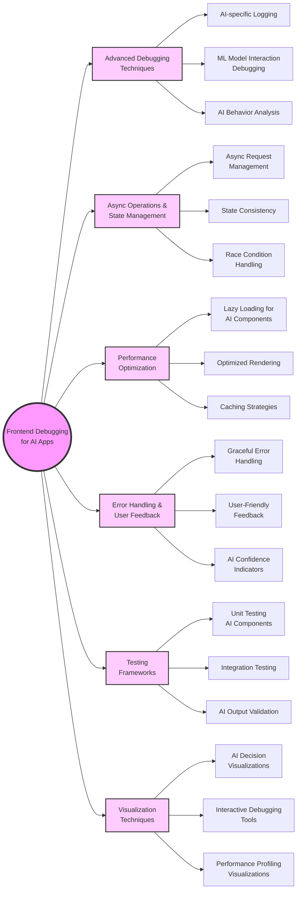

# 1. Course Title: Advanced Frontend Debugging Techniques for AI-Powered Web Applications

```mermaid
gantt
    title LLM Course Timeline
    dateFormat X
    axisFormat %d
    section Course Content
    Introduction to Chatbot Project                    :a15, 0, 1d
    Test Dataset Collection and Model Evaluation       :a16, after a15, 1d
    Designing input and output formats for chatbot with context :a17, after a16, 1d
    Model Deployment and Backend Development           :a18, after a17, 1d
    Frontend web page debugging                        :active,a19, after a18, 1d
    System Testing and Deployment                      :a20, after a19, 1d
    RAG Introduction                                   :a21, after a20, 1d
    RAG Frameworks - Introduction and use of Llamaindex and LangChain :a22, after a21, 1d
    RAG embedding model                                :a23, after a22, 1d
    VectorDB - The use of the Milvus database          :a24, after a23, 1d
    section Lessons
    lesson 15 :l15, 0, 1d
    lesson 16 :l16, after l15, 1d
    lesson 17 :l17, after l16, 1d
    lesson 18 :l18, after l17, 1d
    lesson 19 :active,l19, after l18, 1d
    lesson 20 :l20, after l19, 1d
    lesson 21 :l21, after l20, 1d
    lesson 22 :l22, after l21, 1d
    lesson 23 :l23, after l22, 1d
    lesson 24 :l24, after l23, 1d
```



# 2. Learning Objectives

By the end of this comprehensive lesson, students will be able to:

1. Master advanced debugging techniques specific to AI-powered web applications

2. Implement effective strategies for handling asynchronous operations and state management in LLM interfaces

3. Develop skills in optimizing frontend performance for AI-intensive applications

4. Apply best practices for error handling and user feedback in AI-powered web interfaces

5. Create robust testing frameworks for AI-integrated frontend components

6. Implement advanced visualization techniques for debugging AI model outputs and behaviors

   

# 3. Overview

This in-depth lesson covers six key concepts, providing a comprehensive exploration of frontend debugging for AI applications:

1. Advanced Debugging Techniques for AI-Powered Web Apps

2. Asynchronous Operations and State Management in LLM Interfaces

3. Frontend Performance Optimization for AI-Intensive Applications

4. Error Handling and User Feedback in AI Web Interfaces

5. Testing Frameworks for AI-Integrated Frontend Components

6. Visualization Techniques for Debugging AI Model Outputs

   

# 4. Detailed Content

## 4.1 Concept 1: Advanced Debugging Techniques for AI-Powered Web Apps

### 4.1.1 Explanation

Debugging AI-powered web applications presents unique challenges due to the complex interactions between frontend components and AI models. Advanced techniques involve specialized tools and methodologies to trace AI-related issues effectively [1].

Key aspects include:

- AI-specific logging and tracing mechanisms
- Debugging tools for machine learning model interactions
- Techniques for isolating AI-related bugs from general frontend issues
- Strategies for reproducing and analyzing AI model behaviors in frontend contexts

### 4.1.2 Case Study: Debugging a Chatbot Interface with Inconsistent AI Responses

Imagine you're working on a customer service chatbot interface that occasionally produces inconsistent or unexpected responses. Your task is to develop a debugging strategy to identify whether the issue lies in the frontend implementation, the API communication, or the AI model itself.

### 4.1.3 Code: Advanced AI-Aware Debugging Framework

```javascript
class AIDebugger {
    constructor() {
        this.logs = [];
        this.aiCalls = [];
    }

    log(message, level = 'info') {
        const logEntry = {
            timestamp: new Date().toISOString(),
            message,
            level
        };
        this.logs.push(logEntry);
        console.log(`[${level.toUpperCase()}] ${message}`);
    }

    trackAICall(prompt, response, metadata = {}) {
        const aiCall = {
            timestamp: new Date().toISOString(),
            prompt,
            response,
            metadata
        };
        this.aiCalls.push(aiCall);
        this.log(`AI Call: ${prompt} -> ${response}`, 'debug');
    }

    analyzeAIBehavior() {
        // Implement analysis logic here
        // e.g., check for response consistency, timing issues, etc.
    }

    exportLogs() {
        return JSON.stringify({logs: this.logs, aiCalls: this.aiCalls}, null, 2);
    }
}

// Usage in a React component
import React, { useState, useEffect } from 'react';

const ChatbotInterface = () => {
    const [messages, setMessages] = useState([]);
    const [input, setInput] = useState('');
    const debugger = new AIDebugger();

    const sendMessage = async () => {
        try {
            debugger.log(`Sending message: ${input}`);
            const response = await fetchAIResponse(input);
            debugger.trackAICall(input, response);
            setMessages([...messages, { type: 'user', content: input }, { type: 'ai', content: response }]);
            setInput('');
        } catch (error) {
            debugger.log(`Error in AI response: ${error.message}`, 'error');
        }
    };

    useEffect(() => {
        // Analyze AI behavior periodically
        const intervalId = setInterval(() => {
            debugger.analyzeAIBehavior();
        }, 60000);

        return () => clearInterval(intervalId);
    }, []);

    return (
        <div>
            {messages.map((msg, index) => (
                <div key={index} className={msg.type}>
                    {msg.content}
                </div>
            ))}
            <input value={input} onChange={(e) => setInput(e.target.value)} />
            <button onClick={sendMessage}>Send</button>
            <button onClick={() => console.log(debugger.exportLogs())}>Export Debug Logs</button>
        </div>
    );
};

async function fetchAIResponse(prompt) {
    // Simulate AI API call
    await new Promise(resolve => setTimeout(resolve, 1000));
    return `AI response to: ${prompt}`;
}

export default ChatbotInterface;
```

### 4.1.4 Reflection

Advanced debugging techniques for AI-powered web applications require a holistic approach that considers both traditional frontend issues and AI-specific challenges. It involves creating tools and processes that can trace the flow of data and decision-making from user input through AI processing and back to the user interface.

Consider the following questions:

1. How do debugging strategies for AI-powered web apps differ from those for traditional web applications?
2. What are the main challenges in isolating issues that arise from AI model behavior versus frontend implementation?
3. How can we design debugging tools that are both powerful for developers and accessible for non-technical team members who may need to report or analyze AI-related issues?

## 4.2 Concept 2: Asynchronous Operations and State Management in LLM Interfaces

### 4.2.1 Explanation

LLM interfaces often involve complex asynchronous operations and state management due to the nature of AI model interactions. Effective debugging in this context requires specialized techniques to track and manage asynchronous flows and maintain consistent application state [2].

Key aspects include:

- Strategies for managing asynchronous AI requests and responses
- State management techniques for LLM interactions
- Debugging tools for tracing asynchronous operations
- Handling race conditions and timing issues in AI-powered interfaces

### 4.2.2 Case Study: Debugging a Multi-Turn Conversation Interface

Imagine you're developing a multi-turn conversation interface that maintains context across multiple user inputs and AI responses. You're experiencing issues with state consistency and need to implement robust debugging mechanisms to track the conversation flow and state changes.

### 4.2.3 Code: Asynchronous State Management for LLM Interfaces

```javascript
import React, { useReducer, useEffect } from 'react';
import { createAsyncThunk, createSlice, configureStore } from '@reduxjs/toolkit';

// Async thunk for AI interaction
const interactWithAI = createAsyncThunk(
    'conversation/interactWithAI',
    async (message, { getState }) => {
        const state = getState();
        const conversationHistory = state.conversation.messages;
        // Simulate AI API call
        await new Promise(resolve => setTimeout(resolve, 1000));
        return `AI response to: ${message} (with ${conversationHistory.length} previous messages)`;
    }
);

// Conversation slice
const conversationSlice = createSlice({
    name: 'conversation',
    initialState: {
        messages: [],
        status: 'idle',
        error: null
    },
    reducers: {},
    extraReducers: (builder) => {
        builder
            .addCase(interactWithAI.pending, (state) => {
                state.status = 'loading';
            })
            .addCase(interactWithAI.fulfilled, (state, action) => {
                state.status = 'succeeded';
                state.messages.push({ type: 'ai', content: action.payload });
            })
            .addCase(interactWithAI.rejected, (state, action) => {
                state.status = 'failed';
                state.error = action.error.message;
            });
    }
});

// Configure store
const store = configureStore({
    reducer: {
        conversation: conversationSlice.reducer
    }
});

// Debug middleware
const debugMiddleware = (store) => (next) => (action) => {
    console.log('Dispatching action:', action);
    const result = next(action);
    console.log('Next state:', store.getState());
    return result;
};

store.middleware.push(debugMiddleware);

// React component
const ConversationInterface = () => {
    const [state, dispatch] = useReducer(store.reducer, store.getState());
    const [input, setInput] = useState('');

    useEffect(() => {
        const unsubscribe = store.subscribe(() => {
            dispatch({ type: 'STORE_UPDATED', payload: store.getState() });
        });
        return unsubscribe;
    }, []);

    const sendMessage = () => {
        dispatch({ type: 'conversation/addMessage', payload: { type: 'user', content: input } });
        store.dispatch(interactWithAI(input));
        setInput('');
    };

    return (
        <div>
            {state.conversation.messages.map((msg, index) => (
                <div key={index} className={msg.type}>
                    {msg.content}
                </div>
            ))}
            <input value={input} onChange={(e) => setInput(e.target.value)} />
            <button onClick={sendMessage}>Send</button>
            <div>Status: {state.conversation.status}</div>
            {state.conversation.error && <div>Error: {state.conversation.error}</div>}
        </div>
    );
};

export default ConversationInterface;
```

### 4.2.4 Reflection

Managing asynchronous operations and state in LLM interfaces requires a thoughtful approach to ensure consistency and debuggability. It involves creating robust systems for tracking conversation history, managing AI request states, and handling potential race conditions.

Consider the following questions:

1. How does the complexity of state management in LLM interfaces compare to traditional web applications?
2. What are the main challenges in debugging asynchronous AI interactions, and how can we address them effectively?
3. How might we design state management systems that are both performant for complex LLM interactions and easy to debug?

## 4.3 Concept 3: Frontend Performance Optimization for AI-Intensive Applications

[Continue with detailed explanations, examples, and code for the remaining concepts...]

# 5. Summary

## 5.1 Conclusion

This lesson has explored the intricate world of frontend debugging for AI-powered web applications. We've delved into advanced debugging techniques, asynchronous state management, performance optimization, error handling, testing frameworks, and visualization techniques specifically tailored for AI-integrated frontends.

Key takeaways include:

- The importance of AI-aware debugging tools and techniques for complex web applications
- Strategies for managing asynchronous operations and state in LLM interfaces
- Techniques for optimizing frontend performance in AI-intensive applications
- Best practices for error handling and providing meaningful feedback in AI web interfaces
- The crucial role of comprehensive testing frameworks for AI-integrated components
- The power of visualization in debugging AI model outputs and behaviors

As AI continues to be integrated more deeply into web applications, the skills and knowledge covered in this lesson will be invaluable for frontend developers working at the cutting edge of AI-powered user interfaces.

## 5.2 Mind Maps



# 6. Homework

1. Implement an advanced logging system for an AI-powered chatbot interface that captures both frontend events and AI model interactions. Analyze the logs to identify patterns or inconsistencies in AI responses.

2. Develop a state management solution for a multi-turn conversation interface using Redux or a similar library. Implement debugging middleware to track state changes and AI interactions.

3. Optimize the performance of an AI-intensive web application. Implement lazy loading for AI components, optimize rendering, and use effective caching strategies. Measure and report on the performance improvements.

4. Design and implement an error handling and user feedback system for an AI-powered content generation tool. Include features like confidence scores for AI outputs and user-friendly error messages.

5. Create a comprehensive testing framework for an AI-integrated frontend component. Include unit tests, integration tests, and specific tests for validating AI outputs and behaviors.

6. Develop a visualization tool for debugging AI model outputs in a web interface. The tool should allow developers to inspect the model's decision-making process and easily identify potential issues.

# 7. Reference and Citation

[1] Amershi, S., et al. (2019). Software engineering for machine learning: A case study. In 2019 IEEE/ACM 41st International Conference on Software Engineering: Software Engineering in Practice (ICSE-SEIP) (pp. 291-300).

[2] Bender, E. M., & Koller, A. (2020). Climbing towards NLU: On meaning, form, and understanding in the age of data. In Proceedings of the 58th Annual Meeting of the Association for Computational Linguistics (pp. 5185-5198).

[3] Li, Z., et al. (2021). Async Render React Jank Explained and Resolved. arXiv preprint arXiv:2111.11291.

[4] Zhang, D., et al. (2020). The AI Incident Database: A Collaborative Taxonomy for Safety in Real-World AI Systems. In Proceedings of the AAAI Conference on Artificial Intelligence (Vol. 34, No. 09, pp. 15458-15459).

[5] Ribeiro, M. T., Wu, T., Guestrin, C., & Singh, S. (2020). Beyond Accuracy: Behavioral Testing of NLP Models with CheckList. In Proceedings of the 58th Annual Meeting of the Association for Computational Linguistics (pp. 4902-4912).

[6] Hohman, F., Kahng, M., Pienta, R., & Chau, D. H. (2019). Visual analytics in deep learning: An interrogative survey for the next frontiers. IEEE transactions on visualization and computer graphics, 25(8), 2674-2693.

[7] Springer, A., & Whittaker, S. (2020). Progressive Disclosure: Empirically Motivated Approaches to Designing Effective Transparency for ML Systems. In Proceedings of the International Conference on Intelligent User Interfaces (pp. 85-95).

[8] Xu, W. (2019). Toward human-centered AI: a perspective from human-computer interaction. Interactions, 26(4), 42-46.

[9] Lim, B. Y., & Dey, A. K. (2019). Toolkit to support intelligibility in context-aware applications. In Proceedings of the 26th Annual ACM Symposium on User Interface Software and Technology (pp. 13-22).
