# Lesson 20: System Testing and Deployment for AI-Powered Chatbot

```mermaid
gantt
    title LLM Course Timeline
    dateFormat X
    axisFormat %d
    section Course Content
    Test Dataset Collection and Model Evaluation       :a16, 0, 1d
    Designing input and output formats for chatbot with context :a17, after a16, 1d
    Model Deployment and Backend Development           :a18, after a17, 1d
    Frontend web page debugging                        :a19, after a18, 1d
    System Testing and Deployment                      :active,a20, after a19, 1d
    RAG Introduction                                   :a21, after a20, 1d
    RAG Frameworks - Introduction and use of Llamaindex and LangChain :a22, after a21, 1d
    RAG embedding model                                :a23, after a22, 1d
    VectorDB - The use of the Milvus database          :a24, after a23, 1d
    Keyword search and Vector Retrieval                :a25, after a24, 1d
    section Lessons
    lesson 16 :l16, 0, 1d
    lesson 17 :l17, after l16, 1d
    lesson 18 :l18, after l17, 1d
    lesson 19 :l19, after l18, 1d
    lesson 20 :active,l20, after l19, 1d
    lesson 21 :l21, after l20, 1d
    lesson 22 :l22, after l21, 1d
    lesson 23 :l23, after l22, 1d
    lesson 24 :l24, after l23, 1d
    lesson 25 :l25, after l24, 1d
```



## 1. Introduction

After completing the frontend development and debugging of our AI-powered chatbot, it's crucial to thoroughly test the entire system and deploy it to a production environment. This lesson will guide you through the process of system testing, identifying and fixing potential issues, and deploying your chatbot to ensure it's ready for real-world use.

## 2. System Testing

System testing involves evaluating the complete, integrated chatbot system to ensure it meets specified requirements and functions correctly as a whole.

### 2.1 Test Plan Development

Create a comprehensive test plan that covers:

1. Functionality testing
2. Performance testing
3. User interface testing
4. Integration testing
5. Security testing

Example test plan structure:

```markdown
1. Functionality Testing
   1.1 Verify chatbot responds to user inputs
   1.2 Test different types of queries (e.g., greetings, specific questions, edge cases)
   1.3 Ensure proper handling of invalid inputs

2. Performance Testing
   2.1 Measure response times under various loads
   2.2 Test system stability during extended use
   2.3 Evaluate resource usage (CPU, memory, network)

3. User Interface Testing
   3.1 Verify responsiveness across devices
   3.2 Test accessibility features
   3.3 Ensure proper display of chatbot responses

4. Integration Testing
   4.1 Test API connections between frontend and backend
   4.2 Verify data flow between components
   4.3 Ensure proper error handling in integrated system

5. Security Testing
   5.1 Test input validation and sanitization
   5.2 Verify proper authentication and authorization
   5.3 Check for potential vulnerabilities (e.g., XSS, CSRF)
```

### 2.2 Automated Testing

Implement automated tests to streamline the testing process:

```javascript
// Example using Jest for frontend testing
describe('Chatbot UI', () => {
  test('displays user input', () => {
    render(<ChatbotUI />);
    const input = screen.getByPlaceholderText('Type your message...');
    fireEvent.change(input, { target: { value: 'Hello' } });
    expect(input.value).toBe('Hello');
  });

  test('sends message on button click', () => {
    const mockSendMessage = jest.fn();
    render(<ChatbotUI sendMessage={mockSendMessage} />);
    const input = screen.getByPlaceholderText('Type your message...');
    const button = screen.getByText('Send');
    fireEvent.change(input, { target: { value: 'Hello' } });
    fireEvent.click(button);
    expect(mockSendMessage).toHaveBeenCalledWith('Hello');
  });
});
```

### 2.3 Manual Testing

Conduct thorough manual testing to catch issues that automated tests might miss:

1. Simulate various user scenarios
2. Test edge cases and unexpected inputs
3. Verify the chatbot's responses for accuracy and relevance

## 3. Identifying and Fixing Issues

During testing, you'll likely encounter issues that need to be addressed before deployment.

### 3.1 Issue Tracking

Use an issue tracking system (e.g., JIRA, GitHub Issues) to log and manage identified problems:

```markdown
Issue #1: Slow response time for complex queries
Priority: High
Description: Chatbot takes >5 seconds to respond to multi-part questions
Steps to Reproduce:
1. Enter: "What's the weather like today, and should I bring an umbrella?"
2. Observe response time
Expected: Response within 2 seconds
Actual: Response takes 5-7 seconds
```

### 3.2 Debugging and Fixing

Address identified issues systematically:

1. Reproduce the issue in a controlled environment
2. Use debugging tools to identify the root cause
3. Implement a fix and verify it resolves the issue
4. Update test cases to prevent regression

Example fix for slow response time:

```javascript
// Optimize API call by implementing caching
const cache = new Map();

async function getChatbotResponse(query) {
  if (cache.has(query)) {
    return cache.get(query);
  }

  const response = await api.getResponse(query);
  cache.set(query, response);
  return response;
}
```

## 4. Deployment

Once testing is complete and issues are resolved, it's time to deploy the chatbot to a production environment.

### 4.1 Deployment Checklist

Create a deployment checklist to ensure all necessary steps are completed:

```markdown
1. [ ] Finalize and test all code changes
2. [ ] Update configuration files for production environment
3. [ ] Optimize assets (minify JS/CSS, compress images)
4. [ ] Set up production database and migrate data if necessary
5. [ ] Configure production API endpoints
6. [ ] Set up monitoring and logging tools
7. [ ] Perform final security audit
8. [ ] Update documentation
9. [ ] Prepare rollback plan
```

### 4.2 Deployment Process

Follow these steps to deploy your chatbot:

1. Prepare the production environment (e.g., cloud server, containerization)
2. Set up CI/CD pipeline for automated deployment
3. Deploy backend services
4. Deploy frontend application
5. Conduct post-deployment tests

Example deployment script (using Docker and Docker Compose):

```yaml
# docker-compose.yml
version: '3'
services:
  frontend:
    build: ./frontend
    ports:
      - "80:80"
    depends_on:
      - backend
  backend:
    build: ./backend
    ports:
      - "5000:5000"
    environment:
      - DATABASE_URL=postgres://user:password@db:5432/chatbot
  db:
    image: postgres:13
    environment:
      - POSTGRES_USER=user
      - POSTGRES_PASSWORD=password
      - POSTGRES_DB=chatbot
```

### 4.3 Monitoring and Maintenance

Set up monitoring tools to track the chatbot's performance and usage in production:

1. Implement logging for error tracking and debugging
2. Set up performance monitoring (e.g., response times, resource usage)
3. Configure alerts for critical issues

Example monitoring setup (using Prometheus and Grafana):

```yaml
# docker-compose.yml (additional services)
services:
  # ... other services ...
  prometheus:
    image: prom/prometheus
    ports:
      - "9090:9090"
    volumes:
      - ./prometheus.yml:/etc/prometheus/prometheus.yml
  grafana:
    image: grafana/grafana
    ports:
      - "3000:3000"
    depends_on:
      - prometheus
```

## 5. Conclusion

System testing and deployment are critical steps in bringing your AI-powered chatbot to life. By following a structured approach to testing, issue resolution, and deployment, you can ensure your chatbot performs reliably and efficiently in a production environment.

Remember to continuously monitor and maintain your deployed chatbot, gathering user feedback and performance metrics to inform future improvements and updates.

# Advanced System Testing and Deployment Strategies for AI-Powered Chatbot

## 6. Advanced Testing Techniques

### 6.1 Load Testing

Load testing is crucial to ensure your chatbot can handle high volumes of concurrent users without performance degradation.

#### Tool Recommendation: Apache JMeter

Apache JMeter is an open-source tool that can simulate heavy loads on your server and analyze its performance under different load types.

Example JMeter test plan for a chatbot API:

```xml
<?xml version="1.0" encoding="UTF-8"?>
<jmeterTestPlan version="1.2" properties="5.0" jmeter="5.4.1">
  <hashTree>
    <TestPlan guiclass="TestPlanGui" testclass="TestPlan" testname="Chatbot API Load Test" enabled="true">
      <stringProp name="TestPlan.comments"></stringProp>
      <boolProp name="TestPlan.functional_mode">false</boolProp>
      <boolProp name="TestPlan.tearDown_on_shutdown">true</boolProp>
      <boolProp name="TestPlan.serialize_threadgroups">false</boolProp>
      <elementProp name="TestPlan.user_defined_variables" elementType="Arguments" guiclass="ArgumentsPanel" testclass="Arguments" testname="User Defined Variables" enabled="true">
        <collectionProp name="Arguments.arguments"/>
      </elementProp>
      <stringProp name="TestPlan.user_define_classpath"></stringProp>
    </TestPlan>
    <hashTree>
      <ThreadGroup guiclass="ThreadGroupGui" testclass="ThreadGroup" testname="Thread Group" enabled="true">
        <stringProp name="ThreadGroup.on_sample_error">continue</stringProp>
        <elementProp name="ThreadGroup.main_controller" elementType="LoopController" guiclass="LoopControlPanel" testclass="LoopController" testname="Loop Controller" enabled="true">
          <boolProp name="LoopController.continue_forever">false</boolProp>
          <stringProp name="LoopController.loops">10</stringProp>
        </elementProp>
        <stringProp name="ThreadGroup.num_threads">100</stringProp>
        <stringProp name="ThreadGroup.ramp_time">10</stringProp>
        <boolProp name="ThreadGroup.scheduler">false</boolProp>
        <stringProp name="ThreadGroup.duration"></stringProp>
        <stringProp name="ThreadGroup.delay"></stringProp>
        <boolProp name="ThreadGroup.same_user_on_next_iteration">true</boolProp>
      </ThreadGroup>
      <hashTree>
        <HTTPSamplerProxy guiclass="HttpTestSampleGui" testclass="HTTPSamplerProxy" testname="HTTP Request" enabled="true">
          <elementProp name="HTTPsampler.Arguments" elementType="Arguments" guiclass="HTTPArgumentsPanel" testclass="Arguments" testname="User Defined Variables" enabled="true">
            <collectionProp name="Arguments.arguments">
              <elementProp name="message" elementType="HTTPArgument">
                <boolProp name="HTTPArgument.always_encode">false</boolProp>
                <stringProp name="Argument.value">Hello, chatbot!</stringProp>
                <stringProp name="Argument.metadata">=</stringProp>
                <boolProp name="HTTPArgument.use_equals">true</boolProp>
                <stringProp name="Argument.name">message</stringProp>
              </elementProp>
            </collectionProp>
          </elementProp>
          <stringProp name="HTTPSampler.domain">your-chatbot-api.com</stringProp>
          <stringProp name="HTTPSampler.port"></stringProp>
          <stringProp name="HTTPSampler.protocol">https</stringProp>
          <stringProp name="HTTPSampler.contentEncoding"></stringProp>
          <stringProp name="HTTPSampler.path">/api/chat</stringProp>
          <stringProp name="HTTPSampler.method">POST</stringProp>
          <boolProp name="HTTPSampler.follow_redirects">true</boolProp>
          <boolProp name="HTTPSampler.auto_redirects">false</boolProp>
          <boolProp name="HTTPSampler.use_keepalive">true</boolProp>
          <boolProp name="HTTPSampler.DO_MULTIPART_POST">false</boolProp>
          <stringProp name="HTTPSampler.embedded_url_re"></stringProp>
          <stringProp name="HTTPSampler.connect_timeout"></stringProp>
          <stringProp name="HTTPSampler.response_timeout"></stringProp>
        </HTTPSamplerProxy>
        <hashTree/>
      </hashTree>
    </hashTree>
  </hashTree>
</jmeterTestPlan>
```

This test plan simulates 100 concurrent users making 10 requests each to your chatbot API.

### 6.2 A/B Testing

A/B testing allows you to compare different versions of your chatbot to determine which performs better.

Example A/B testing setup using Flask and Python:

```python
from flask import Flask, request, jsonify
import random

app = Flask(__name__)

# Two versions of the chatbot
def chatbot_a(message):
    return f"Chatbot A: You said '{message}'"

def chatbot_b(message):
    return f"Chatbot B: Your message was '{message}'"

@app.route('/chat', methods=['POST'])
def chat():
    message = request.json['message']
    # Randomly choose between chatbot A and B
    if random.random() < 0.5:
        response = chatbot_a(message)
        version = 'A'
    else:
        response = chatbot_b(message)
        version = 'B'
    
    # Log the interaction for analysis
    log_interaction(message, response, version)
    
    return jsonify({'response': response, 'version': version})

def log_interaction(message, response, version):
    # Implement logging logic here
    pass

if __name__ == '__main__':
    app.run(debug=True)
```

This setup randomly serves two different versions of the chatbot and logs interactions for later analysis.

## 7. Advanced Deployment Strategies

### 7.1 Blue-Green Deployment

Blue-green deployment involves maintaining two identical production environments, allowing you to switch between them for zero-downtime updates.

Example using Docker Swarm:

```yaml
version: '3'
services:
  blue:
    image: your-chatbot:v1
    deploy:
      replicas: 2
  green:
    image: your-chatbot:v2
    deploy:
      replicas: 2
  nginx:
    image: nginx:latest
    ports:
      - "80:80"
    configs:
      - source: nginx_config
      - target: /etc/nginx/nginx.conf

configs:
  nginx_config:
    file: ./nginx.conf
```

Nginx configuration for blue-green switching:

```nginx
http {
    upstream backend {
        server blue:8080;
        # Uncomment the line below and comment the line above to switch to green
        # server green:8080;
    }

    server {
        listen 80;
        location / {
            proxy_pass http://backend;
        }
    }
}
```

### 7.2 Canary Releases

Canary releases involve gradually rolling out changes to a small subset of users before deploying to the entire user base.

Example using Kubernetes and Istio:

```yaml
apiVersion: networking.istio.io/v1alpha3
kind: VirtualService
metadata:
  name: chatbot-vsvc
spec:
  hosts:
  - chatbot.example.com
  http:
  - route:
    - destination:
        host: chatbot-v1
        subset: v1
      weight: 90
    - destination:
        host: chatbot-v2
        subset: v2
      weight: 10
```

This configuration routes 90% of traffic to version 1 and 10% to version 2 of your chatbot.

## 8. Continuous Monitoring and Improvement

### 8.1 Implementing Logging and Tracing

Use a centralized logging system to track events and errors across your chatbot system.

Example using ELK Stack (Elasticsearch, Logstash, Kibana):

```yaml
version: '3'
services:
  elasticsearch:
    image: docker.elastic.co/elasticsearch/elasticsearch:7.12.0
    environment:
      - discovery.type=single-node
  logstash:
    image: docker.elastic.co/logstash/logstash:7.12.0
    volumes:
      - ./logstash.conf:/usr/share/logstash/pipeline/logstash.conf
  kibana:
    image: docker.elastic.co/kibana/kibana:7.12.0
    ports:
      - "5601:5601"
```

Logstash configuration for parsing chatbot logs:

```
input {
  file {
    path => "/var/log/chatbot.log"
    start_position => "beginning"
  }
}

filter {
  grok {
    match => { "message" => "%{TIMESTAMP_ISO8601:timestamp} %{LOGLEVEL:log_level} %{GREEDYDATA:log_message}" }
  }
}

output {
  elasticsearch {
    hosts => ["elasticsearch:9200"]
    index => "chatbot-logs-%{+YYYY.MM.dd}"
  }
}
```

### 8.2 Performance Optimization

Continuously monitor and optimize your chatbot's performance based on usage patterns and user feedback.

Example performance optimization for a Node.js chatbot server:

```javascript
const cluster = require('cluster');
const numCPUs = require('os').cpus().length;

if (cluster.isMaster) {
  console.log(`Master ${process.pid} is running`);

  // Fork workers.
  for (let i = 0; i < numCPUs; i++) {
    cluster.fork();
  }

  cluster.on('exit', (worker, code, signal) => {
    console.log(`worker ${worker.process.pid} died`);
    cluster.fork(); // Replace the dead worker
  });
} else {
  // Workers can share any TCP connection
  // In this case, it is an HTTP server
  require('./chatbot-server.js');

  console.log(`Worker ${process.pid} started`);
}
```

This setup uses Node.js clustering to take advantage of multi-core systems, improving the chatbot's ability to handle concurrent requests.

## 9. Conclusion

Advanced testing and deployment strategies are crucial for ensuring the reliability, performance, and continuous improvement of your AI-powered chatbot. By implementing techniques such as load testing, A/B testing, and sophisticated deployment methods like blue-green and canary releases, you can minimize risks and optimize your chatbot's performance in real-world conditions.

Remember that the development and optimization of an AI chatbot is an ongoing process. Continuously monitor your system's performance, gather user feedback, and iterate on your design and functionality to provide the best possible user experience.

As you implement these advanced strategies, always keep in mind the specific requirements and constraints of your project, and be prepared to adapt these techniques to best suit your chatbot's unique needs.
