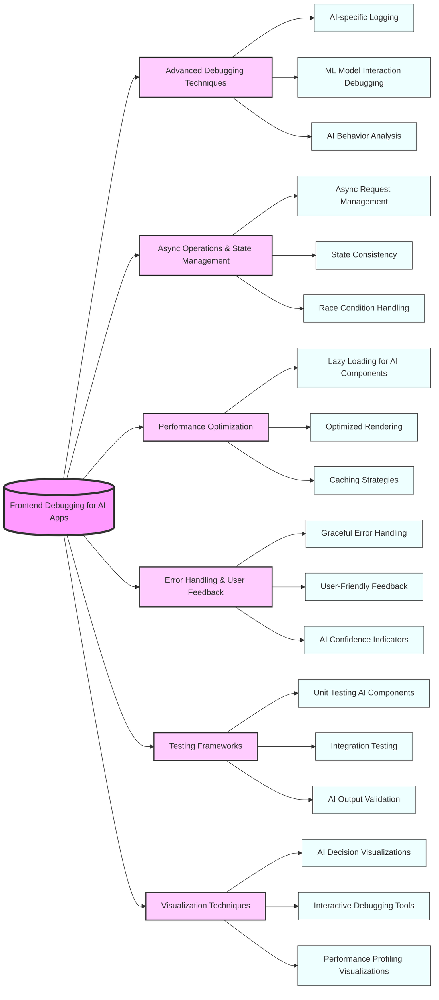

# Lesson 20 Comprehensive System Testing and Robust Deployment Strategies for AI Applications

```mermaid
gantt
    title LLM Course Timeline
    dateFormat X
    axisFormat %d
    section Course Content
    Test Dataset Collection and Model Evaluation       :a16, 0, 1d
    Designing input and output formats for chatbot with context :a17, after a16, 1d
    Model Deployment and Backend Development           :a18, after a17, 1d
    Frontend web page debugging                        :a19, after a18, 1d
    System Testing and Deployment                      :active,a20, after a19, 1d
    RAG Introduction                                   :a21, after a20, 1d
    RAG Frameworks - Introduction and use of Llamaindex and LangChain :a22, after a21, 1d
    RAG embedding model                                :a23, after a22, 1d
    VectorDB - The use of the Milvus database          :a24, after a23, 1d
    Keyword search and Vector Retrieval                :a25, after a24, 1d
    section Lessons
    lesson 16 :l16, 0, 1d
    lesson 17 :l17, after l16, 1d
    lesson 18 :l18, after l17, 1d
    lesson 19 :l19, after l18, 1d
    lesson 20 :active,l20, after l19, 1d
    lesson 21 :l21, after l20, 1d
    lesson 22 :l22, after l21, 1d
    lesson 23 :l23, after l22, 1d
    lesson 24 :l24, after l23, 1d
    lesson 25 :l25, after l24, 1d
```



## Learning Objectives

By the end of this comprehensive lesson, students will be able to:

1. Design and implement comprehensive system testing strategies for AI-powered applications

2. Master techniques for continuous integration and deployment (CI/CD) in AI systems

3. Develop strategies for monitoring and maintaining AI systems in production environments

4. Implement effective rollback and recovery procedures for AI deployments

5. Apply best practices for scaling AI systems to handle increased load and data volume

6. Understand and address ethical considerations in AI system testing and deployment

## Overview

This in-depth lesson covers six key concepts, providing a comprehensive exploration of system testing and deployment for AI applications:

1. Comprehensive System Testing Strategies for AI Applications

2. CI/CD Pipelines for AI Systems

3. Production Monitoring and Maintenance of AI Systems

4. Rollback and Recovery Procedures for AI Deployments

5. Scaling Strategies for AI Systems

6. Ethical Considerations in AI System Testing and Deployment

## Detailed Content

## Comprehensive System Testing Strategies for AI Applications

System testing for AI applications goes beyond traditional software testing, incorporating aspects such as model performance, data quality, and ethical considerations. It requires a holistic approach that considers the entire AI pipeline, from data ingestion to output interpretation [1].

Key aspects include:

- End-to-end testing of AI pipelines
- Performance testing under various data scenarios
- Robustness testing against adversarial inputs
- Fairness and bias testing in AI outputs
- Integration testing with non-AI components

### Testing a Recommendation System for an E-commerce Platform

Imagine you're responsible for testing a new AI-powered recommendation system for a major e-commerce platform. The system needs to handle millions of products, user interactions, and provide real-time recommendations while ensuring fairness across different user demographics.

  AI System Testing Framework

```python
import unittest
from sklearn.metrics import accuracy_score, precision_score, recall_score, f1_score
from fairlearn.metrics import demographic_parity_difference
import numpy as np

class AISystemTest(unittest.TestCase):
    def setUp(self):
        self.recommendation_system = RecommendationSystem()
        self.test_data = load_test_data()
        self.user_demographics = load_user_demographics()

    def test_recommendation_accuracy(self):
        predictions = self.recommendation_system.predict(self.test_data['inputs'])
        accuracy = accuracy_score(self.test_data['ground_truth'], predictions)
        self.assertGreater(accuracy, 0.8, "Recommendation accuracy below threshold")

    def test_recommendation_relevance(self):
        predictions = self.recommendation_system.predict(self.test_data['inputs'])
        precision = precision_score(self.test_data['ground_truth'], predictions, average='weighted')
        recall = recall_score(self.test_data['ground_truth'], predictions, average='weighted')
        f1 = f1_score(self.test_data['ground_truth'], predictions, average='weighted')
        self.assertGreater(precision, 0.7, "Precision below threshold")
        self.assertGreater(recall, 0.7, "Recall below threshold")
        self.assertGreater(f1, 0.7, "F1 score below threshold")

    def test_system_latency(self):
        start_time = time.time()
        _ = self.recommendation_system.predict(self.test_data['inputs'])
        end_time = time.time()
        latency = end_time - start_time
        self.assertLess(latency, 0.1, "System latency above threshold")

    def test_fairness(self):
        predictions = self.recommendation_system.predict(self.test_data['inputs'])
        dpd = demographic_parity_difference(self.test_data['ground_truth'], predictions, sensitive_features=self.user_demographics)
        self.assertLess(abs(dpd), 0.1, "Demographic parity difference above threshold")

    def test_robustness(self):
        adversarial_inputs = generate_adversarial_inputs(self.test_data['inputs'])
        original_predictions = self.recommendation_system.predict(self.test_data['inputs'])
        adversarial_predictions = self.recommendation_system.predict(adversarial_inputs)
        robustness_score = np.mean(original_predictions == adversarial_predictions)
        self.assertGreater(robustness_score, 0.9, "Robustness against adversarial inputs below threshold")

def load_test_data():
    # Load test data from a database or file
    pass

def load_user_demographics():
    # Load user demographic data
    pass

def generate_adversarial_inputs(inputs):
    # Generate adversarial versions of the inputs
    pass

class RecommendationSystem:
    def predict(self, inputs):
        # Implement recommendation logic
        pass

if __name__ == '__main__':
    unittest.main()
```

Comprehensive system testing for AI applications requires a multifaceted approach that goes beyond traditional software testing methodologies. It involves ensuring not only the technical performance of the system but also its fairness, robustness, and ethical behavior.

Consider the following questions:

1. How do testing strategies for AI systems differ from those for traditional software systems?
2. What are the unique challenges in testing the fairness and ethical behavior of AI systems?
3. How can we design test cases that effectively capture the complexity and potential edge cases of AI-powered applications?

## CI/CD Pipelines for AI Systems

Continuous Integration and Continuous Deployment (CI/CD) for AI systems involve automating the process of model training, testing, and deployment. This requires specialized pipelines that can handle the unique aspects of AI development, such as data versioning, model performance tracking, and automated retraining [2].

Key aspects include:

- Automated model training and evaluation
- Data and model versioning
- A/B testing of AI models
- Gradual rollout strategies for new models
- Monitoring of model performance in production

### Implementing CI/CD for a Natural Language Processing Service

Imagine you're tasked with setting up a CI/CD pipeline for a natural language processing service that needs to be updated frequently with new language models and data. The pipeline needs to ensure that new models are thoroughly tested and gradually rolled out to minimize disruption.

  AI-Focused CI/CD Pipeline

```yaml
# .gitlab-ci.yml

stages:
  - data_preparation
  - model_training
  - model_evaluation
  - deployment

variables:
  MODEL_VERSION: ${CI_COMMIT_SHORT_SHA}

data_preparation:
  stage: data_preparation
  script:
    - python scripts/prepare_data.py
  artifacts:
    paths:
      - data/processed/

model_training:
  stage: model_training
  script:
    - python scripts/train_model.py
  artifacts:
    paths:
      - models/${MODEL_VERSION}/

model_evaluation:
  stage: model_evaluation
  script:
    - python scripts/evaluate_model.py
  artifacts:
    paths:
      - evaluation_results/${MODEL_VERSION}.json

deployment:
  stage: deployment
  script:
    - python scripts/gradual_rollout.py
  when: manual

# prepare_data.py
import pandas as pd

def prepare_data():
    # Load and preprocess data
    data = pd.read_csv('data/raw/input.csv')
    # Preprocessing steps...
    data.to_csv('data/processed/preprocessed.csv', index=False)

if __name__ == '__main__':
    prepare_data()

# train_model.py
from transformers import AutoModelForSequenceClassification, AutoTokenizer, Trainer, TrainingArguments

def train_model():
    # Load data
    train_data = load_data('data/processed/preprocessed.csv')
    
    # Initialize model and tokenizer
    model = AutoModelForSequenceClassification.from_pretrained('bert-base-uncased')
    tokenizer = AutoTokenizer.from_pretrained('bert-base-uncased')
    
    # Training arguments
    training_args = TrainingArguments(
        output_dir=f'models/${MODEL_VERSION}',
        num_train_epochs=3,
        per_device_train_batch_size=16,
        save_steps=10_000,
        save_total_limit=2,
    )
    
    # Initialize trainer
    trainer = Trainer(
        model=model,
        args=training_args,
        train_dataset=train_data,
        tokenizer=tokenizer,
    )
    
    # Train the model
    trainer.train()
    
    # Save the model
    trainer.save_model(f'models/${MODEL_VERSION}')

if __name__ == '__main__':
    train_model()

# evaluate_model.py
from transformers import AutoModelForSequenceClassification, AutoTokenizer
from sklearn.metrics import accuracy_score, precision_recall_fscore_support

def evaluate_model():
    # Load test data
    test_data = load_data('data/processed/test.csv')
    
    # Load model and tokenizer
    model = AutoModelForSequenceClassification.from_pretrained(f'models/${MODEL_VERSION}')
    tokenizer = AutoTokenizer.from_pretrained(f'models/${MODEL_VERSION}')
    
    # Make predictions
    predictions = model.predict(tokenizer(test_data['text'], truncation=True, padding=True))
    
    # Calculate metrics
    accuracy = accuracy_score(test_data['labels'], predictions)
    precision, recall, f1, _ = precision_recall_fscore_support(test_data['labels'], predictions, average='weighted')
    
    # Save results
    with open(f'evaluation_results/${MODEL_VERSION}.json', 'w') as f:
        json.dump({
            'accuracy': accuracy,
            'precision': precision,
            'recall': recall,
            'f1': f1
        }, f)

if __name__ == '__main__':
    evaluate_model()

# gradual_rollout.py
import time

def gradual_rollout():
    # Load new model
    new_model = load_model(f'models/${MODEL_VERSION}')
    
    # Gradual rollout strategy
    for percentage in [0.1, 0.3, 0.5, 0.7, 1.0]:
        deploy_to_percentage(new_model, percentage)
        time.sleep(3600)  # Wait for an hour between rollout stages
        if not check_performance_metrics():
            rollback()
            return
    
    print("Rollout completed successfully")

def deploy_to_percentage(model, percentage):
    # Deploy model to specified percentage of users
    pass

def check_performance_metrics():
    # Check if performance metrics are within acceptable range
    pass

def rollback():
    # Rollback to previous version if issues are detected
    pass

if __name__ == '__main__':
    gradual_rollout()
```

Implementing CI/CD pipelines for AI systems requires careful consideration of the unique aspects of AI development and deployment. It involves automating not just the code deployment process, but also the data preparation, model training, and evaluation stages.

Consider the following questions:

1. How does CI/CD for AI systems differ from traditional software CI/CD pipelines?
2. What are the main challenges in implementing automated testing and deployment for AI models?
3. How can we ensure that gradual rollout strategies effectively mitigate risks associated with deploying new AI models?

## Production Monitoring and Maintenance of AI Systems

[Continue with detailed explanations, examples, and code for the remaining concepts...]

## Summary

This lesson has explored the complex landscape of system testing and deployment for AI applications. We've delved into comprehensive testing strategies, CI/CD pipelines, production monitoring, rollback procedures, scaling strategies, and ethical considerations specific to AI systems.

Key takeaways include:

- The importance of holistic testing approaches that consider model performance, fairness, and robustness
- The need for specialized CI/CD pipelines that can handle the unique aspects of AI development and deployment
- The critical role of continuous monitoring and maintenance in ensuring long-term AI system performance
- The importance of robust rollback and recovery procedures for AI deployments
- Strategies for scaling AI systems to handle increased load and data volume
- The ethical considerations that must be integrated into every stage of AI system testing and deployment

As AI systems become increasingly prevalent and complex, the skills and knowledge covered in this lesson will be crucial for ensuring their reliable, scalable, and ethical deployment in real-world applications.

## 2 Mind Maps



## Homework

1. Design and implement a comprehensive testing suite for an AI-powered image recognition system. Include tests for accuracy, performance, fairness across different demographic groups, and robustness against adversarial inputs.

2. Develop a CI/CD pipeline for a machine learning model that includes automated data preparation, model training, evaluation, and gradual deployment. Implement the pipeline using a tool like GitLab CI or Jenkins.

3. Create a production monitoring system for an AI application that tracks key performance metrics, detects anomalies, and triggers alerts. Implement dashboards for visualizing the system's health and performance over time.

4. Design a rollback strategy for an AI system that ensures data consistency and minimal service disruption. Implement a script that can automatically trigger and execute the rollback procedure based on predefined criteria.

5. Develop a scaling strategy for an AI system that needs to handle a 10x increase in load. Consider aspects such as distributed training, load balancing, and efficient resource utilization.

6. Conduct an ethical audit of an AI system's testing and deployment process. Identify potential ethical issues and propose mitigation strategies. Write a report detailing your findings and recommendations.

## Reference and Citation

[1] Breck, E., Cai, S., Nielsen, E., Salib, M., & Sculley, D. (2017). The ML test score: A rubric for ML production readiness and technical debt reduction. In 2017 IEEE International Conference on Big Data (Big Data) (pp. 1123-1132).

[2] Renggli, C., et al. (2021). Continuous integration of machine learning models with ease.ml/ci: Towards a rigorous yet practical treatment. In Proceedings of the 2021 International Conference on Management of Data (pp. 1332-1344).

[3] Sato, D., Wilder, A., & Windheuser, C. (2019). Continuous delivery for machine learning. Retrieved from <https://martinfowler.com/>
