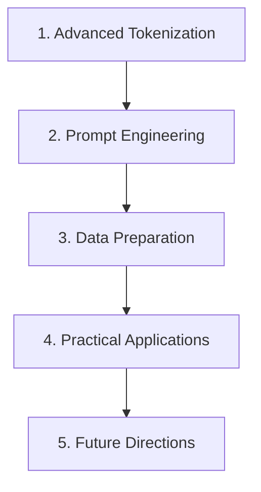
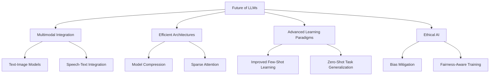

# Lesson 4: Unveiling the Art of Large Language Model Development



Welcome, future AI innovators! Today, we're diving deep into the fascinating world of Large Language Model (LLM) development. We'll explore the critical components that breathe life into these linguistic marvels, from tokenization to data preparation. Buckle up for an exciting journey through the landscape of LLM creation!

## 1. The Alchemist's Secret: Advanced Tokenization

Tokenization is the fundamental process of transforming raw text into the bite-sized pieces that feed our language models. It's like breaking down complex compounds into their elemental forms - a crucial first step in the alchemy of language understanding.

In modern LLM development, we've moved beyond simple word-splitting to more sophisticated subword tokenization techniques. These methods allow our models to understand the very building blocks of language, enabling them to decipher unfamiliar words with remarkable accuracy.

Let's examine three key subword tokenization methods:

1. Byte Pair Encoding (BPE): The pioneer of subword tokenization. It starts with individual characters and iteratively merges the most frequent pairs.

2. WordPiece: Google's variant, using a likelihood criterion for merging to capture more meaningful subword units.

3. SentencePiece: A language-agnostic approach that treats the input as a raw stream of Unicode characters, making it particularly adept at handling multiple languages.

Let's see these tokenizers in action:

```python
from transformers import AutoTokenizer

def tokenization_showcase(text):
    tokenizers = {
        'BPE (GPT-2)': AutoTokenizer.from_pretrained("gpt2"),
        'WordPiece (BERT)': AutoTokenizer.from_pretrained("bert-base-uncased"),
        'SentencePiece (XLM-R)': AutoTokenizer.from_pretrained("xlm-roberta-base")
    }

    for name, tokenizer in tokenizers.items():
        tokens = tokenizer.tokenize(text)
        print(f"{name} tokenization:")
        print(tokens)
        print(f"Token count: {len(tokens)}\n")

multilingual_text = "The quick brown fox jumps over the lazy dog. 敏捷的棕色狐狸跳过懒狗。 الثعلب البني السريع يقفز فوق الكلب الكسول."
tokenization_showcase(multilingual_text)
```

This code demonstrates how these tokenizers handle a multilingual sentence, showcasing their ability to process diverse scripts and languages effectively.

## 2. The Art of Whispered Instructions: Prompt Engineering

With our text broken down into tokens, we now turn to the subtle art of prompt engineering. This is where we guide our models to perform specific tasks with carefully crafted instructions.

Modern LLMs possess an impressive ability to perform tasks with little to no specific training. Let's explore two revolutionary techniques:

1. Zero-shot Learning: The model performs a task without any specific examples, relying solely on its pre-trained knowledge.

2. Few-shot Learning: The model is given a small number of examples before tackling the main task.

Let's see these techniques in action:

```python
from transformers import pipeline

def zero_shot_magic(text, labels):
    classifier = pipeline("zero-shot-classification")
    result = classifier(text, candidate_labels=labels)
    return result

def few_shot_wizardry(examples, new_input):
    generator = pipeline("text-generation", model="gpt2")
    prompt = "Translate English to French:\n\n"
    for en, fr in examples:
        prompt += f"English: {en}\nFrench: {fr}\n\n"
    prompt += f"English: {new_input}\nFrench:"
    result = generator(prompt, max_length=len(prompt) + 50, num_return_sequences=1)
    return result[0]['generated_text'].split("French:")[-1].strip()

# Zero-shot example
text = "The new quantum computer can perform calculations in seconds that would take traditional supercomputers millennia."
labels = ["technology", "history", "cuisine"]
print("Zero-shot classification result:")
print(zero_shot_magic(text, labels))

# Few-shot example
examples = [
    ("Hello, world!", "Bonjour, le monde!"),
    ("How are you?", "Comment allez-vous?")
]
new_input = "Welcome to the future of AI."
print("\nFew-shot learning result:")
print(few_shot_wizardry(examples, new_input))
```

This example showcases how LLMs can classify complex topics without prior training and attempt translations with just a couple of examples.

## 3. Data Alchemy: Preparing the Raw Material

Even the most advanced AI is only as good as the data it's trained on. In this section, we'll explore the art of data preparation - the process of refining our textual data into high-quality training material.

Let's examine a sophisticated text cleaning process:

```python
import re
from bs4 import BeautifulSoup
import nltk
from nltk.corpus import stopwords

nltk.download('stopwords', quiet=True)

class TextCleaner:
    def __init__(self):
        self.stop_words = set(stopwords.words('english'))
    
    def clean_text(self, text):
        # Remove HTML tags
        text = BeautifulSoup(text, "html.parser").get_text()
        
        # Remove URLs
        text = re.sub(r'http\S+', '', text)
        
        # Remove special characters and numbers
        text = re.sub(r'[^a-zA-Z\s]', '', text)

        # Convert to lowercase
        text = text.lower()

        # Remove stopwords
        text = ' '.join([word for word in text.split() if word not in self.stop_words])

        # Remove excess whitespace
        text = re.sub(r'\s+', ' ', text).strip()

        return text

# Demonstrate the cleaning process
cleaner = TextCleaner()
raw_text = """
<p>Check out this AMAZING offer at https://example.com!
You won't believe your eyes!!!
#awesome #buy #now</p>
"""
cleaned_text = cleaner.clean_text(raw_text)
print(f"Before cleaning:\n{raw_text}\n")
print(f"After cleaning:\n{cleaned_text}")
```

This TextCleaner transforms messy web content into clean, structured text suitable for training language models.

## 4. Practical Applications

Now that we've covered the fundamental techniques, let's consider some practical applications of LLM development:

1. Chatbots and virtual assistants
2. Content generation for marketing or creative writing
3. Automated translation services
4. Sentiment analysis for social media monitoring
5. Code generation and documentation

Each of these applications leverages the power of LLMs in unique ways, showcasing the versatility of these models.

## 5. Future Directions in LLM Development

As we look to the future, several exciting trends are emerging in LLM development:

1. Multimodal Models: Integrating text with images, audio, and video
2. More Efficient Architectures: Reducing computational requirements while maintaining performance
3. Improved Few-Shot and Zero-Shot Learning: Enhancing models' ability to generalize from minimal examples
4. Ethical AI Development: Focusing on reducing bias and improving fairness in language models



In conclusion, mastering the arts of advanced tokenization, prompt engineering, and data preparation is crucial for anyone aspiring to develop state-of-the-art language models. These techniques form the foundation upon which the towering achievements of modern AI are built.

As you continue your journey into LLM development, remember that it requires both technical precision and creative intuition. Experiment with these techniques, push the boundaries of what's possible, and you might just create the next breakthrough in AI language understanding!

The future of AI is limited only by our imagination and our ability to harness the power of language. So go forth, intrepid AI developers, and shape the linguistic future of tomorrow!


## Conclusion: Forging the Future of Language AI

As we wrap up our journey through the fundamentals of Large Language Model development, let's take a moment to reflect on the incredible potential these technologies hold. We've explored the alchemy of tokenization, the art of prompt engineering, and the crucial process of data preparation. Each of these elements plays a vital role in creating AI systems that can understand and generate human-like text with unprecedented accuracy and fluency.

### Key Takeaways

1. **Advanced Tokenization**: Subword tokenization methods like BPE, WordPiece, and SentencePiece allow LLMs to handle diverse languages and understand the building blocks of words.

2. **Prompt Engineering**: Zero-shot and few-shot learning techniques enable LLMs to perform tasks with minimal or no specific training, showcasing their flexibility and generalization capabilities.

3. **Data Preparation**: Cleaning and preprocessing text data is crucial for training high-quality language models. It's the foundation upon which all other techniques build.

4. **Practical Applications**: LLMs have a wide range of applications, from chatbots and content generation to translation services and code generation.

5. **Future Directions**: The field is rapidly evolving towards multimodal integration, more efficient architectures, and enhanced learning paradigms, all while striving for ethical AI development.

### Practical Next Steps

To continue your journey in LLM development, consider the following steps:

1. **Experiment with Tokenizers**: Try implementing different tokenization methods and observe how they handle various languages and text styles.

```python
from transformers import AutoTokenizer

def compare_tokenizers(text):
    tokenizers = {
        "GPT-2 (BPE)": AutoTokenizer.from_pretrained("gpt2"),
        "BERT (WordPiece)": AutoTokenizer.from_pretrained("bert-base-uncased"),
        "XLM-R (SentencePiece)": AutoTokenizer.from_pretrained("xlm-roberta-base")
    }
    
    for name, tokenizer in tokenizers.items():
        tokens = tokenizer.tokenize(text)
        print(f"{name}: {tokens}")
        print(f"Token count: {len(tokens)}\n")

# Try with different texts and languages
compare_tokenizers("The quick brown fox jumps over the lazy dog.")
compare_tokenizers("人工智能正在改变世界。")
```

2. **Practice Prompt Engineering**: Experiment with crafting prompts for various tasks and observe how different phrasings affect the model's output.

3. **Build a Data Pipeline**: Create a comprehensive data cleaning and preparation pipeline for a specific domain or task.

4. **Explore Hugging Face Transformers**: Familiarize yourself with the Hugging Face Transformers library, a powerful tool for working with pre-trained models and fine-tuning them for specific tasks.

```python
from transformers import pipeline

def sentiment_analysis(text):
    classifier = pipeline("sentiment-analysis")
    result = classifier(text)[0]
    print(f"Text: {text}")
    print(f"Sentiment: {result['label']}, Score: {result['score']:.4f}")

# Try with different texts
sentiment_analysis("I love learning about AI!")
sentiment_analysis("This course is challenging but rewarding.")
```

5. **Stay Updated**: Follow AI research papers, blogs, and conferences to keep up with the latest developments in LLM technology.

Remember, the field of LLM development is rapidly evolving, and what seems cutting-edge today may be standard practice tomorrow. Your creativity and problem-solving skills will be just as important as your technical knowledge in pushing the boundaries of what's possible with AI.

As you continue your AI journey, always keep in mind the ethical implications of the technology you're developing. Strive to create AI systems that are fair, unbiased, and beneficial to society as a whole.

The future of language AI is bright, and with the foundations you've learned in this lesson, you're well-equipped to be a part of shaping that future. Whether you're interested in developing more efficient language models, creating innovative applications, or tackling the ethical challenges of AI, there's no shortage of exciting opportunities ahead.

So, go forth and experiment! Try implementing these techniques in your own projects. Collaborate with others, share your findings, and don't be afraid to push the boundaries. The next breakthrough in language AI could come from you!

Thank you for joining us on this exciting exploration of LLM development fundamentals. May your tokens be meaningful, your prompts be clever, and your models be ever-learning. The future of AI is in your hands – make it an amazing one!
