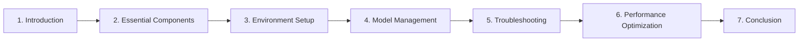

# Lesson 5 Setting Up Your LLM Experimental Environment

```mermaid
gantt
    title LLM Course Timeline
    dateFormat X
    axisFormat %d
    section Course Content
    Course Overview                                    :a1, 0, 1d
    NLP Fundamentals                                   :a2, after a1, 1d
    Basic knowledge and architectural characteristics of LLM :a3, after a2, 1d
    LLM Development Fundamentals                       :a4, after a3, 1d
    Introduction and Setup of the Experimental Environment :active,a5, after a4, 1d
    The concept of the tokenizer and common types      :a6, after a5, 1d
    Text data preprocessing and preparation            :a7, after a6, 1d
    LLM training - Fine-tuning                         :a8, after a7, 1d
    LLM training - Reward Modeling and Proximal Policy Optimization :a9, after a8, 1d
    Famous SOTA LLM models and JAIS model              :a10, after a9, 1d
    section Lessons
    lesson 1  :l1, 0, 1d
    lesson 2  :l2, after l1, 1d
    lesson 3  :l3, after l2, 1d
    lesson 4  :l4, after l3, 1d
    lesson 5  :active,l5, after l4, 1d
    lesson 6  :l6, after l5, 1d
    lesson 7  :l7, after l6, 1d
    lesson 8  :l8, after l7, 1d
    lesson 9  :l9, after l8, 1d
    lesson 10 :l10, after l9, 1d
```



## Introduction: The Foundation of LLM Development

Large Language Models (LLMs) have revolutionized natural language processing, but their development requires a carefully crafted environment. This lesson will guide you through setting up a robust LLM experimental environment, which is crucial for efficient development, training, and evaluation of these powerful models.



## Essential Components of an LLM Environment

Before we begin the setup process, it's important to understand the key components that make up an effective LLM development environment. Each component plays a specific role in supporting the development process:

1. **Operating System**: Ubuntu 20.04 LTS
2. **Programming Language**: Python 3.8+
3. **GPU Support**: CUDA 11.2
4. **Deep Learning Framework**: PyTorch 1.9+
5. **NLP Library**: Hugging Face Transformers 4.10+
6. **Development Environment**: Jupyter Lab
7. **Version Control**: Git
8. **Containerization**: Docker

These components work together to create a cohesive environment. The operating system provides the foundation, upon which we install Python and CUDA for GPU support. PyTorch and Transformers form the core of our deep learning toolkit, while Jupyter Lab offers an interactive development interface. Git and Docker ensure version control and environment reproducibility, respectively.

## Environment Setup: Step-by-Step Guide

Now that we understand the components, let's set up our environment. We'll go through this process step-by-step, explaining the purpose of each command:

### Operating System Installation

Start by installing Ubuntu 20.04 LTS. This provides a stable and widely supported base for our development environment.

### System Updates and Essential Packages

Update the system and install necessary packages:

```bash
sudo apt update && sudo apt upgrade -y
sudo apt install -y build-essential cmake unzip pkg-config
sudo apt install -y python3-dev python3-pip
```

These commands ensure your system is up-to-date and has the essential build tools and Python development packages.

### CUDA Installation

Install CUDA to enable GPU acceleration:

```bash
wget https://developer.download.nvidia.com/compute/cuda/11.2.0/local_installers/cuda_11.2.0_460.27.04_linux.run
sudo sh cuda_11.2.0_460.27.04_linux.run --silent --toolkit
```

This step is crucial for leveraging GPU power in training large language models.

### Python Environment Setup

Create a Python virtual environment for LLM development:

```bash
python3 -m venv llm_env
source llm_env/bin/activate
pip install --upgrade pip
```

Virtual environments help manage dependencies for different projects, preventing conflicts.

### Installing PyTorch and Transformers

With the Python environment ready, install PyTorch and the Transformers library:

```bash
pip install torch torchvision torchaudio
pip install transformers datasets
```

These libraries form the core of our LLM development toolkit.

### Jupyter Lab Setup

Install and configure Jupyter Lab for interactive development:

```bash
pip install jupyterlab
jupyter lab --generate-config
echo "c.NotebookApp.ip = '0.0.0.0'" >> ~/.jupyter/jupyter_notebook_config.py
echo "c.NotebookApp.open_browser = False" >> ~/.jupyter/jupyter_notebook_config.py
echo "c.NotebookApp.port = 8888" >> ~/.jupyter/jupyter_notebook_config.py
```

Jupyter Lab provides an interactive interface for experimenting with models and visualizing results.

### Git and Docker Installation

Finally, install Git for version control and Docker for containerization:

```bash
sudo apt install git docker.io -y
sudo systemctl start docker
sudo systemctl enable docker
sudo usermod -aG docker $USER
```

These tools support collaborative development and ensure environment reproducibility.

## Model Management: Efficient Storage and Retrieval

With our environment set up, we need an efficient way to manage our models. Let's create a Python class for this purpose:

```python
import os
import torch
from transformers import AutoModel, AutoTokenizer

class ModelManager:
    def __init__(self, models_dir: str = "/models"):
        self.models_dir = models_dir
        os.makedirs(self.models_dir, exist_ok=True)

    def save_model(self, model: AutoModel, tokenizer: AutoTokenizer, model_name: str):
        model_path = os.path.join(self.models_dir, model_name)
        model.save_pretrained(model_path)
        tokenizer.save_pretrained(model_path)
        print(f"Model {model_name} saved successfully.")

    def load_model(self, model_name: str):
        model_path = os.path.join(self.models_dir, model_name)
        model = AutoModel.from_pretrained(model_path)
        tokenizer = AutoTokenizer.from_pretrained(model_path)
        print(f"Model {model_name} loaded successfully.")
        return model, tokenizer

# Usage example
manager = ModelManager()
model = AutoModel.from_pretrained("bert-base-uncased")
tokenizer = AutoTokenizer.from_pretrained("bert-base-uncased")

manager.save_model(model, tokenizer, "my_bert_model")
loaded_model, loaded_tokenizer = manager.load_model("my_bert_model")
```

This `ModelManager` class provides methods for saving and loading models, ensuring consistent storage and easy retrieval.

## Troubleshooting: Common Issues and Solutions

Even with a careful setup, issues can arise. Here are some common problems and their solutions:

### CUDA Issues

If you encounter CUDA-related errors, verify CUDA installation:

```python
import torch

def check_cuda():
    if torch.cuda.is_available():
        print(f"CUDA is available. Using GPU: {torch.cuda.get_device_name(0)}")
    else:
        print("CUDA is not available. Using CPU.")

check_cuda()
```

### Memory Management

For out-of-memory errors, use gradient accumulation:

```python
def train_with_gradient_accumulation(model, dataloader, optimizer, accumulation_steps=4):
    model.train()
    for i, batch in enumerate(dataloader):
        outputs = model(**batch)
        loss = outputs.loss / accumulation_steps
        loss.backward()

        if (i + 1) % accumulation_steps == 0:
            optimizer.step()
            optimizer.zero_grad()
```

This technique allows training with larger batch sizes by accumulating gradients over multiple forward passes.

## Performance Optimization: Maximizing Efficiency

To get the most out of our setup, we can implement several optimization techniques:

### Mixed Precision Training

Use mixed precision to speed up training and reduce memory usage:

```python
from torch.cuda.amp import autocast, GradScaler

scaler = GradScaler()

def train_step(model, batch, optimizer):
    with autocast():
        outputs = model(**batch)
        loss = outputs.loss

    scaler.scale(loss).backward()
    scaler.step(optimizer)
    scaler.update()
    optimizer.zero_grad()
```

### Efficient Data Loading

Optimize data loading to reduce I/O bottlenecks:

```python
from torch.utils.data import DataLoader

def create_efficient_dataloader(dataset, batch_size=32):
    return DataLoader(dataset, batch_size=batch_size, num_workers=4, pin_memory=True)
```

These optimizations can significantly reduce training time and resource usage.

## Summary: Leveraging Your LLM Environment

Congratulations! You've now set up a comprehensive environment for LLM development. This setup provides you with the tools to:

1. Efficiently develop and train large language models
2. Manage and version your models effectively
3. Troubleshoot common issues
4. Optimize performance for faster training and inference

Remember, this environment is your foundation for exploring the cutting edge of NLP. As you proceed, continue to refine your setup, stay updated with the latest tools and techniques, and don't hesitate to experiment with new approaches.

Your next steps should include:

1. Practicing with small-scale LLM projects to familiarize yourself with the workflow
2. Experimenting with different model architectures and training techniques
3. Staying informed about the latest developments in the field of NLP

With this robust environment and your growing expertise, you're well-equipped to contribute to the exciting world of large language models. Happy coding, and may your models learn deeply and generalize well!

## Practical Applications of Your LLM Environment

Now that you have a fully functional LLM experimental environment, let's explore some practical applications and projects you can undertake. These will help you gain hands-on experience and deepen your understanding of LLM development.

### Fine-tuning Pre-trained Models

One of the most common tasks in LLM development is fine-tuning pre-trained models for specific tasks. Let's walk through an example of fine-tuning BERT for sentiment analysis:

```python
from transformers import BertForSequenceClassification, BertTokenizer, Trainer, TrainingArguments
from datasets import load_dataset

# Load pre-trained model and tokenizer
model = BertForSequenceClassification.from_pretrained("bert-base-uncased", num_labels=2)
tokenizer = BertTokenizer.from_pretrained("bert-base-uncased")

# Load and preprocess dataset
dataset = load_dataset("imdb")

def tokenize_function(examples):
    return tokenizer(examples["text"], padding="max_length", truncation=True)

tokenized_datasets = dataset.map(tokenize_function, batched=True)

# Define training arguments
training_args = TrainingArguments(
    output_dir="./results",
    num_train_epochs=3,
    per_device_train_batch_size=16,
    per_device_eval_batch_size=64,
    warmup_steps=500,
    weight_decay=0.01,
    logging_dir="./logs",
)

# Create Trainer instance
trainer = Trainer(
    model=model,
    args=training_args,
    train_dataset=tokenized_datasets["train"],
    eval_dataset=tokenized_datasets["test"],
)

# Start training
trainer.train()
```

This example demonstrates how to use your environment to fine-tune BERT for sentiment analysis on the IMDB dataset. You can adapt this code for other tasks and models.

### Creating a Question-Answering System

Another exciting application is building a question-answering system. Here's how you can use a pre-trained model for this task:

```python
from transformers import pipeline

# Load a pre-trained question-answering model
qa_pipeline = pipeline("question-answering", model="distilbert-base-cased-distilled-squad")

# Define context and question
context = """
Artificial intelligence (AI) is intelligence demonstrated by machines, unlike the natural intelligence displayed by humans and animals, which involves consciousness and emotionality. The distinction between the former and the latter categories is often revealed by the acronym chosen. 'Strong' AI is usually labelled as AGI (Artificial General Intelligence) while attempts to emulate 'natural' intelligence have been called ABI (Artificial Biological Intelligence).
"""

question = "What does AGI stand for?"

# Get the answer
answer = qa_pipeline(question=question, context=context)

print(f"Question: {question}")
print(f"Answer: {answer['answer']}")
print(f"Confidence: {answer['score']:.4f}")
```

This script uses a pre-trained model to answer questions based on a given context, showcasing how your LLM environment can be used for practical NLP tasks.

## Advanced Techniques and Future Directions

As you become more comfortable with your LLM environment, you can start exploring more advanced techniques and cutting-edge developments in the field.

### Few-Shot Learning

Few-shot learning is an exciting area where LLMs excel. Here's an example of how you might implement few-shot learning using GPT-3:

```python
import openai

openai.api_key = "your-api-key-here"

def few_shot_learning(prompt, examples, query):
    few_shot_prompt = prompt + "\n\n"
    for example in examples:
        few_shot_prompt += f"Input: {example['input']}\nOutput: {example['output']}\n\n"
    few_shot_prompt += f"Input: {query}\nOutput:"

    response = openai.Completion.create(
        engine="text-davinci-002",
        prompt=few_shot_prompt,
        max_tokens=50
    )

    return response.choices[0].text.strip()

# Example usage
prompt = "Translate English to French:"
examples = [
    {"input": "Hello", "output": "Bonjour"},
    {"input": "How are you?", "output": "Comment allez-vous?"}
]
query = "Good morning"

result = few_shot_learning(prompt, examples, query)
print(f"Translation: {result}")
```

This example demonstrates how to use few-shot learning for a translation task, but the technique can be applied to various NLP problems.

### Exploring Model Interpretability

As LLMs become more complex, understanding their decision-making process becomes crucial. Here's an example of using the LIME (Local Interpretable Model-agnostic Explanations) library to interpret model predictions:

```python
from transformers import pipeline
from lime.lime_text import LimeTextExplainer

# Load a pre-trained sentiment analysis model
classifier = pipeline("sentiment-analysis")

# Create a LIME explainer
explainer = LimeTextExplainer(class_names=["NEGATIVE", "POSITIVE"])

# Function to get model predictions
def predict_proba(texts):
    results = classifier(texts)
    return [[1 - r["score"], r["score"]] for r in results]

# Text to explain
text = "This movie was fantastic! The acting was superb and the plot was engaging."

# Generate explanation
exp = explainer.explain_instance(text, predict_proba, num_features=6)

# Print explanation
print("Explanation for prediction:")
for feature, importance in exp.as_list():
    print(f"{feature}: {importance}")
```

This script demonstrates how to use LIME to interpret the predictions of a sentiment analysis model, providing insights into which words or phrases most influenced the model's decision.

## Staying Current in the Field

The field of LLM development is rapidly evolving. To stay current:

1. Regularly check for updates to your tools and libraries.
2. Follow key researchers and organizations on social media and academic platforms.
3. Participate in NLP conferences and workshops, even virtually.
4. Contribute to open-source projects to gain experience and stay abreast of new techniques.

## Summary

Your LLM experimental environment is now not just set up, but ready for advanced applications and cutting-edge research. From fine-tuning pre-trained models to exploring few-shot learning and model interpretability, you have the tools to push the boundaries of what's possible with language models.

Remember, the key to success in this field is continuous learning and experimentation. Use your environment as a launchpad for your ideas, and don't hesitate to modify and expand it as your needs evolve. The future of NLP is bright, and with your well-equipped LLM playground, you're ready to be a part of shaping that future.

Happy coding, and may your models continue to learn and improve!
